# ScottPlot 4.0 Cookbook

> **⚠️ WARNING: This cookbook is obsolete.** 
> This documentation page was generated specifically for ScottPlot 4.0.47 on Dec 12, 2020.
> Visit the [ScottPlot Cookbook Page](../)
> for links to the latest versions of the cookbook.

## Table of Contents


## Quickstart


### Quickstart: Quickstart - Scatter Plot Quickstart


Scatter plots are best for small numbers of paired X/Y data points. For evenly-spaced data points Signal is much faster.


```cs
// Code from /src/ScottPlot.Demo/Quickstart/Quickstart.cs
var plt = new ScottPlot.Plot(600, 400);

int pointCount = 51;
double[] xs = DataGen.Consecutive(pointCount);
double[] sin = DataGen.Sin(pointCount);
double[] cos = DataGen.Cos(pointCount);

plt.PlotScatter(xs, sin, label: "sin");
plt.PlotScatter(xs, cos, label: "cos");
plt.Legend();

plt.Title("Scatter Plot Quickstart");
plt.YLabel("Vertical Units");
plt.XLabel("Horizontal Units");

plt.SaveFig("Quickstart_Quickstart_Scatter.png");
```


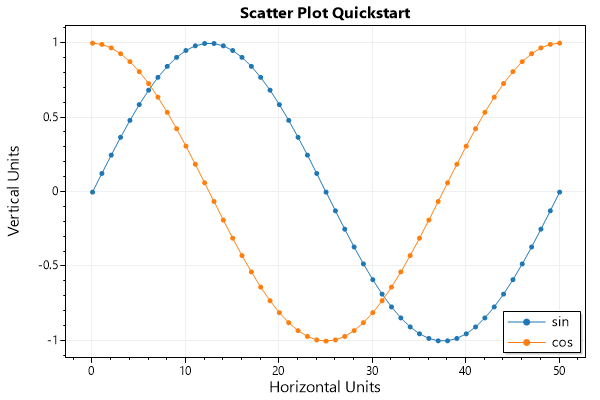


### Quickstart: Quickstart - 5 Million Points


The Signal plot type is ideal for displaying evenly-spaced data. Plots with millions of data points can be interacted with in real time. If the underlying data does not change, SignalConst() may be an even more performant way to display it.


```cs
// Code from /src/ScottPlot.Demo/Quickstart/Quickstart.cs
var plt = new ScottPlot.Plot(600, 400);

Random rand = new Random(0);
int pointCount = (int)1e6;
int lineCount = 5;

for (int i = 0; i < lineCount; i++)
    plt.PlotSignal(DataGen.RandomWalk(rand, pointCount));

plt.Title("Signal Plot Quickstart (5 million points)");
plt.YLabel("Vertical Units");
plt.XLabel("Horizontal Units");

plt.SaveFig("Quickstart_Quickstart_Signal_5MillionPoints.png");
```


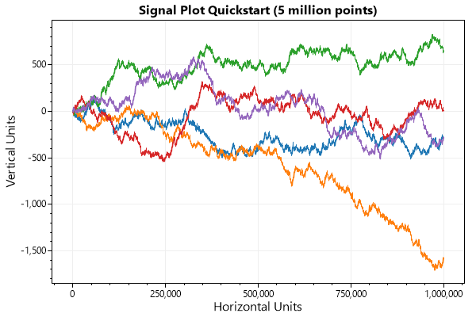


## PlotTypes


### PlotTypes: Annotation - Annotation Quickstart


Annotations are labels fixed to the figure (not the data area), so they don't move around as the axes are adjusted.


```cs
// Code from /src/ScottPlot.Demo/PlotTypes/Annotation.cs
var plt = new ScottPlot.Plot(600, 400);

double[] xs = DataGen.Range(0, 5, .1);
plt.PlotScatter(xs, DataGen.Sin(xs));
plt.PlotScatter(xs, DataGen.Cos(xs));

// negative coordinates snap text to the lower or right edges
plt.PlotAnnotation("Top Left", 10, 10);
plt.PlotAnnotation("Lower Left", 10, -10);
plt.PlotAnnotation("Top Right", -10, 10);
plt.PlotAnnotation("Lower Right", -10, -10);

// arguments allow customization of style
plt.PlotAnnotation("Fancy Annotation", 10, 40,
    fontSize: 24, fontName: "Impact", fontColor: Color.Red, shadow: true,
    fill: true, fillColor: Color.White, fillAlpha: 1, lineWidth: 2);

plt.SaveFig("PlotTypes_Annotation_AnnotationQuickstart.png");
```


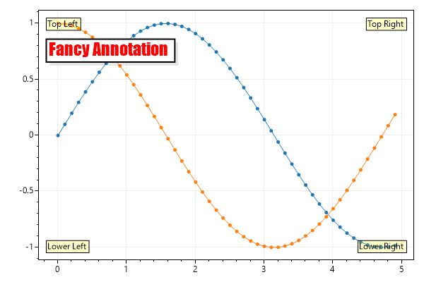


### PlotTypes: Arrow - Plot arrows


arrows can be added which point at specific points on the plot


```cs
// Code from /src/ScottPlot.Demo/PlotTypes/Arrow.cs
var plt = new ScottPlot.Plot(600, 400);

int pointCount = 51;
double[] x = DataGen.Consecutive(pointCount);
double[] sin = DataGen.Sin(pointCount);
double[] cos = DataGen.Cos(pointCount);

plt.PlotScatter(x, sin);
plt.PlotScatter(x, cos);

plt.PlotArrow(25, 0, 27, .2, label: "default");
plt.PlotArrow(27, -.25, 23, -.5, label: "big", lineWidth: 10);
plt.PlotArrow(12, 1, 12, 0, label: "skinny", arrowheadLength: 10);
plt.PlotArrow(20, .6, 20, 1, label: "fat", arrowheadWidth: 10);
plt.Legend(fixedLineWidth: false);

plt.SaveFig("PlotTypes_Arrow_Quickstart.png");
```


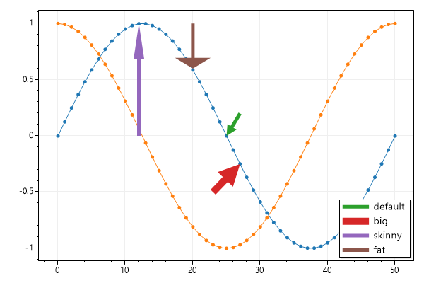


### PlotTypes: AxisLine - Axis Line Quickstart


Horizontal and vertical lines can be placed using HLine() and VLine(). Styling can be customized using arguments.


```cs
// Code from /src/ScottPlot.Demo/PlotTypes/AxisLine.cs
var plt = new ScottPlot.Plot(600, 400);

int pointCount = 51;
double[] x = DataGen.Consecutive(pointCount);
double[] sin = DataGen.Sin(pointCount);
double[] cos = DataGen.Cos(pointCount);

plt.PlotScatter(x, sin);
plt.PlotScatter(x, cos);

plt.PlotHLine(y: .85, label: "HLine");
plt.PlotVLine(x: 23, label: "VLine");
plt.PlotVLine(x: 33, label: "VLine too", color: Color.Magenta, lineWidth: 3, lineStyle: LineStyle.Dot);

plt.Grid(lineStyle: LineStyle.Dot);
plt.Legend();

plt.SaveFig("PlotTypes_AxisLine_Quickstart.png");
```


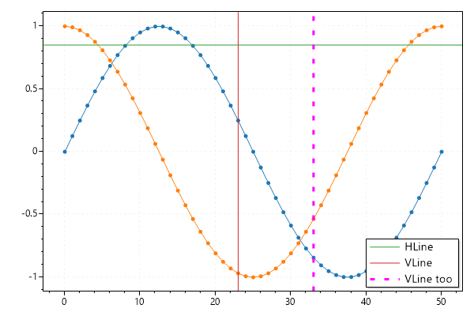


### PlotTypes: AxisLine - Draggable Axis Lines


Use arguments to enable draggable lines (with optional limits).


```cs
// Code from /src/ScottPlot.Demo/PlotTypes/AxisLine.cs
var plt = new ScottPlot.Plot(600, 400);

int pointCount = 51;
double[] x = DataGen.Consecutive(pointCount);
double[] sin = DataGen.Sin(pointCount);
double[] cos = DataGen.Cos(pointCount);

plt.PlotScatter(x, sin);
plt.PlotScatter(x, cos);

plt.PlotHLine(y: .85, draggable: true, dragLimitLower: -1, dragLimitUpper: +1);
plt.PlotVLine(x: 23, draggable: true, dragLimitLower: 0, dragLimitUpper: 50);

plt.Grid(lineStyle: LineStyle.Dot);

plt.SaveFig("PlotTypes_AxisLine_Draggable.png");
```


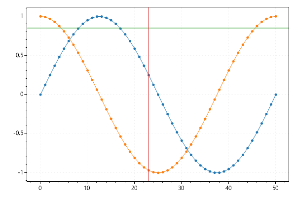


### PlotTypes: AxisSpan - Axis Span Quickstart


Horizontal and vertical spans can be placed using VSpan() and HSpan(). Styling can be customized using arguments.


```cs
// Code from /src/ScottPlot.Demo/PlotTypes/AxisSpan.cs
var plt = new ScottPlot.Plot(600, 400);

int pointCount = 51;
double[] x = DataGen.Consecutive(pointCount);
double[] sin = DataGen.Sin(pointCount);
double[] cos = DataGen.Cos(pointCount);

plt.PlotScatter(x, sin);
plt.PlotScatter(x, cos);

plt.PlotVSpan(y1: .15, y2: .85, label: "VSpan");
plt.PlotHSpan(x1: 10, x2: 25, label: "HSpan");

plt.Grid(lineStyle: LineStyle.Dot);
plt.Legend();

plt.SaveFig("PlotTypes_AxisSpan_Quickstart.png");
```


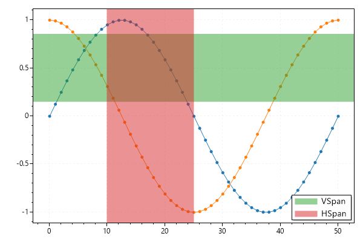


### PlotTypes: AxisSpan - Draggable Axis Spans


Horizontal and vertical spans can be made draggable (with optional limits) using arguments. Hold SHIFT while dragging an adjustable span's edge to shift it rather than resizing it.


```cs
// Code from /src/ScottPlot.Demo/PlotTypes/AxisSpan.cs
var plt = new ScottPlot.Plot(600, 400);

int pointCount = 51;
double[] x = DataGen.Consecutive(pointCount);
double[] sin = DataGen.Sin(pointCount);
double[] cos = DataGen.Cos(pointCount);

plt.PlotScatter(x, sin);
plt.PlotScatter(x, cos);

plt.PlotVSpan(y1: .15, y2: .85, label: "Adjustable VSpan",
    draggable: true, dragLimitLower: -1, dragLimitUpper: 1);

plt.PlotHSpan(x1: 10, x2: 25, label: "Adjustable HSpan",
    draggable: true, dragLimitLower: 0, dragLimitUpper: 50);

plt.PlotVSpan(y1: -.25, y2: -.05, label: "Fixed Size VSpan",
    draggable: true, dragLimitLower: -1, dragLimitUpper: 1,
    dragFixedSize: true);

plt.PlotHSpan(x1: 5, x2: 7, label: "Fixed Size HSpan",
    draggable: true, dragLimitLower: 0, dragLimitUpper: 50,
    dragFixedSize: true);

plt.Grid(lineStyle: LineStyle.Dot);
plt.Legend();

plt.SaveFig("PlotTypes_AxisSpan_Draggable.png");
```


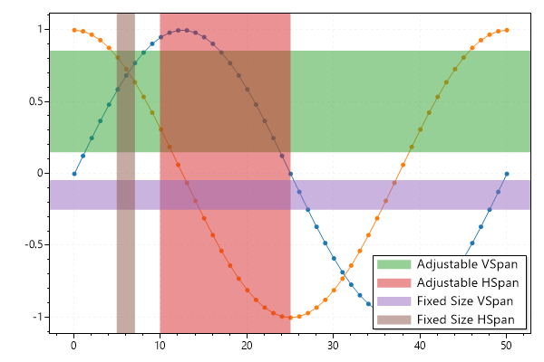


### PlotTypes: Bar - Bar Plot Quickstart


Bar graph series can be created by supply Xs and Ys. Optionally apply errorbars as a third array using an argument.


```cs
// Code from /src/ScottPlot.Demo/PlotTypes/Bar.cs
var plt = new ScottPlot.Plot(600, 400);

// generate random data to plot
string[] labels = { "one", "two", "three", "four", "five" };
int barCount = labels.Length;
Random rand = new Random(0);
double[] xs = DataGen.Consecutive(barCount);
double[] ys = DataGen.RandomNormal(rand, barCount, 20, 5);
double[] yError = DataGen.RandomNormal(rand, barCount, 5, 2);

// make the bar plot
plt.PlotBar(xs, ys, yError);

// customize the plot to make it look nicer
plt.Grid(enableVertical: false, lineStyle: LineStyle.Dot);

// apply custom axis tick labels
plt.XTicks(xs, labels);

plt.SaveFig("PlotTypes_Bar_Quickstart.png");
```


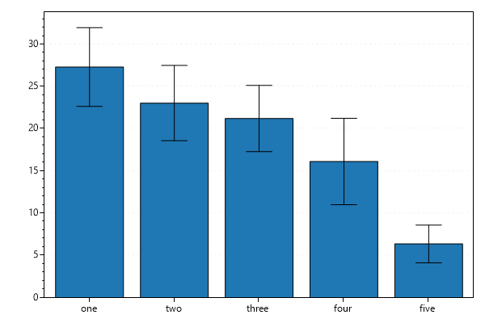


### PlotTypes: Bar - Grouped Bar Graphs


This example demonstrates how to display grouped bar plots. Data group labels are displayed as labels on the horizontal axis, while series labels are displayed in the legend.


```cs
// Code from /src/ScottPlot.Demo/PlotTypes/Bar.cs
var plt = new ScottPlot.Plot(600, 400);

// generate random data to plot
string[] groupNames = { "one", "two", "three", "four", "five" };
string[] seriesNames = { "alpha", "bravo", "charley" };
int groupCount = groupNames.Length;
Random rand = new Random(0);
double[] ys1 = DataGen.RandomNormal(rand, groupCount, 20, 5);
double[] ys2 = DataGen.RandomNormal(rand, groupCount, 20, 5);
double[] ys3 = DataGen.RandomNormal(rand, groupCount, 20, 5);
double[] err1 = DataGen.RandomNormal(rand, groupCount, 5, 2);
double[] err2 = DataGen.RandomNormal(rand, groupCount, 5, 2);
double[] err3 = DataGen.RandomNormal(rand, groupCount, 5, 2);

plt.PlotBarGroups(
    groupLabels: groupNames,
    seriesLabels: seriesNames,
    ys: new double[][] { ys1, ys2, ys3 },
    yErr: new double[][] { err1, err2, err3 });

// customize the plot to make it look nicer
plt.Grid(enableVertical: false, lineStyle: LineStyle.Dot);
plt.Legend(location: legendLocation.upperRight);

plt.SaveFig("PlotTypes_Bar_NewMultipleBars.png");
```


### PlotTypes: Bar - Patterned Bar Graphs


This example demonstrates how to display patterned bar plots.


```cs
// Code from /src/ScottPlot.Demo/PlotTypes/Bar.cs
var plt = new ScottPlot.Plot(600, 400);

// generate random data to plot
string[] groupNames = { "one", "two", "three", "four", "five" };
string[] seriesNames = { "alpha", "bravo", "charley" };
int groupCount = groupNames.Length;
Random rand = new Random(0);
double[] ys1 = DataGen.RandomNormal(rand, groupCount, 20, 5);
double[] ys2 = DataGen.RandomNormal(rand, groupCount, 20, 5);
double[] ys3 = DataGen.RandomNormal(rand, groupCount, 20, 5);
double[] err1 = DataGen.RandomNormal(rand, groupCount, 5, 2);
double[] err2 = DataGen.RandomNormal(rand, groupCount, 5, 2);
double[] err3 = DataGen.RandomNormal(rand, groupCount, 5, 2);

PlottableBar[] barCharts = plt.PlotBarGroups(
    groupLabels: groupNames,
    seriesLabels: seriesNames,
    ys: new double[][] { ys1, ys2, ys3 },
    yErr: new double[][] { err1, err2, err3 });

barCharts[0].hatchStyle = Drawing.HatchStyle.StripedWideUpwardDiagonal;
barCharts[0].fillColor = System.Drawing.Color.Gray;
barCharts[0].hatchColor = System.Drawing.Color.Black;

barCharts[1].hatchStyle = Drawing.HatchStyle.StripedWideDownwardDiagonal;
barCharts[1].fillColor = System.Drawing.Color.DodgerBlue;
barCharts[1].hatchColor = System.Drawing.Color.DeepSkyBlue;

barCharts[2].hatchStyle = Drawing.HatchStyle.LargeCheckerBoard;
barCharts[2].fillColor = System.Drawing.Color.SeaGreen;
barCharts[2].hatchColor = System.Drawing.Color.DarkSeaGreen;

// customize the plot to make it look nicer
plt.Grid(enableVertical: false, lineStyle: LineStyle.Dot);
plt.Legend(location: legendLocation.upperRight);

plt.SaveFig("PlotTypes_Bar_PatternedMultipleBars.png");
```


### PlotTypes: Bar - Horizontal Bar Graph


Bar graphs can be displayed horizontally.


```cs
// Code from /src/ScottPlot.Demo/PlotTypes/Bar.cs
var plt = new ScottPlot.Plot(600, 400);

// generate random data to plot
Random rand = new Random(0);
int pointCount = 5;
double[] xs = DataGen.Consecutive(pointCount);
double[] ys = DataGen.RandomNormal(rand, pointCount, 20, 5);
double[] yError = DataGen.RandomNormal(rand, pointCount, 3, 2);

// make the bar plot
plt.PlotBar(xs, ys, yError, horizontal: true);

// customize the plot to make it look nicer
plt.Grid(enableHorizontal: false, lineStyle: LineStyle.Dot);

// apply custom axis tick labels
string[] labels = { "one", "two", "three", "four", "five" };
plt.YTicks(xs, labels);

plt.SaveFig("PlotTypes_Bar_Horizontal.png");
```


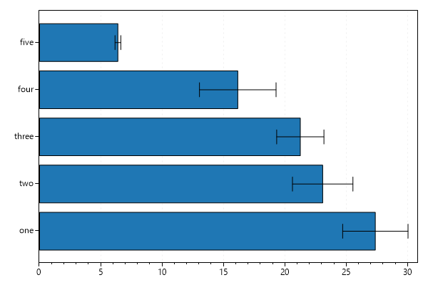


### PlotTypes: Bar - Stacked Bar Graphs


Stacked bar charts can be created like this.


```cs
// Code from /src/ScottPlot.Demo/PlotTypes/Bar.cs
var plt = new ScottPlot.Plot(600, 400);

// create some sample data
double[] xs = { 1, 2, 3, 4, 5, 6, 7 };
double[] valuesA = { 1, 2, 3, 2, 1, 2, 1 };
double[] valuesB = { 3, 3, 2, 1, 3, 2, 1 };

// to simulate stacking B on A, shift B up by A
double[] valuesB2 = new double[valuesB.Length];
for (int i = 0; i < valuesB.Length; i++)
    valuesB2[i] = valuesA[i] + valuesB[i];

// plot the bar charts in reverse order (highest first)
plt.PlotBar(xs, valuesB2, label: "Series B");
plt.PlotBar(xs, valuesA, label: "Series A");

// improve the styling
plt.Legend(location: legendLocation.upperRight);
plt.Title("Stacked Bar Charts");

plt.SaveFig("PlotTypes_Bar_Stacked.png");
```


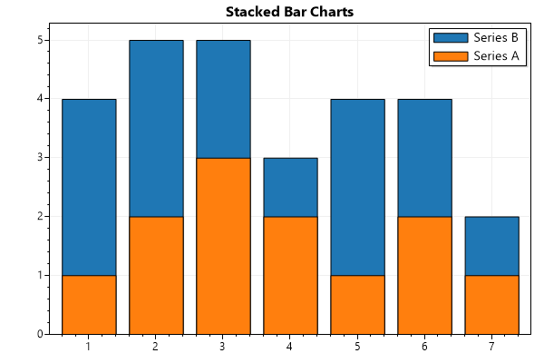


### PlotTypes: Bar - Show values above bars


Values for each bar can be shown on the graph by setting the 'showValues' argument.


```cs
// Code from /src/ScottPlot.Demo/PlotTypes/Bar.cs
var plt = new ScottPlot.Plot(600, 400);

// generate random data to plot
Random rand = new Random(0);
int pointCount = 10;
double[] xs = DataGen.Consecutive(pointCount);
double[] ys = DataGen.RandomNormal(rand, pointCount, 20, 5);

// let's round the values to simplify display
ys = Tools.Round(ys, 1);

// add both bar plot
plt.PlotBar(xs, ys, showValues: true);

// customize the plot to make it look nicer
plt.Grid(enableVertical: false, lineStyle: LineStyle.Dot);
plt.Legend();

plt.SaveFig("PlotTypes_Bar_Labels.png");
```


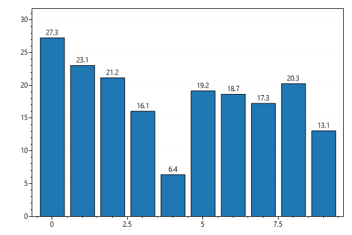


### PlotTypes: Bar - Waterfall Plot


Waterfall plots are a type of box plot where each box starts where the previous box ended.


```cs
// Code from /src/ScottPlot.Demo/PlotTypes/Bar.cs
var plt = new ScottPlot.Plot(600, 400);

// generate random monthly data
Random rand = new Random(0);
double[] monthProfits = DataGen.RandomNormal(rand, 12, 5, 10);
double[] monthNumbers = DataGen.Consecutive(12);
string[] monthNames = { "Jan", "Feb", "Mar", "Apr", "May", "Jun",
                        "Jul", "Aug", "Sep", "Oct", "Nov", "Dec" };

plt.PlotWaterfall(monthNumbers, monthProfits,
    fillColor: Color.Green, negativeColor: Color.Red);

plt.XTicks(monthNames);
plt.YLabel("Valuation (million USD)");
plt.Title("Company Value in 2020");

plt.SaveFig("PlotTypes_Bar_Waterfall.png");
```


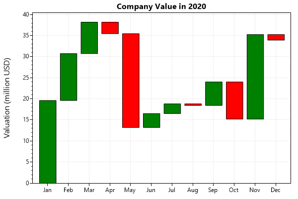


### PlotTypes: Colormap - Colormap Quickstart


Colormaps make it easy to translate a fractional value (from 0 to 1) into a color.


```cs
// Code from /src/ScottPlot.Demo/PlotTypes/Colormap.cs
var plt = new ScottPlot.Plot(600, 400);

int lineCount = 10;
for (int i = 0; i < lineCount; i++)
{
    double[] ys = DataGen.Sin(51, phase: i * .03);
    double fraction = (double)i / lineCount;
    Color c = Drawing.Colormap.Jet.GetColor(fraction);
    plt.PlotSignal(ys, color: c, lineWidth: 2, markerSize: 0);
}

plt.AxisAuto(0);

plt.SaveFig("PlotTypes_Colormap_Quickstart.png");
```


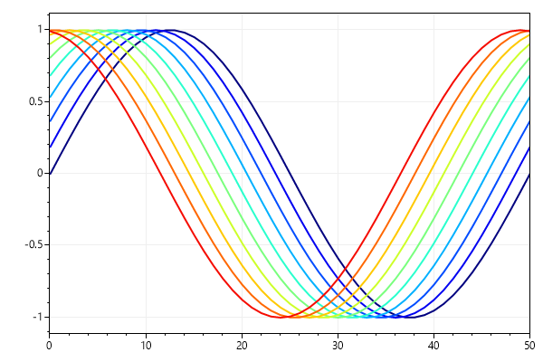


### PlotTypes: ErrorBar - Scatter Plot with Asymmetric Errorbars


Asymmetric X and Y error ranges can be supplied as optional double arrays for positive and/or negative error bars


```cs
// Code from /src/ScottPlot.Demo/PlotTypes/ErrorBar.cs
var plt = new ScottPlot.Plot(600, 400);

Random rand = new Random(0);
int pointCount = 20;

// random data points
double[] dataX = DataGen.Consecutive(pointCount);
double[] dataY1 = DataGen.RandomNormal(rand, pointCount, mean: 20, stdDev: 2);
double[] dataY2 = DataGen.RandomNormal(rand, pointCount, mean: 10, stdDev: 2);
double[] dataY3 = DataGen.RandomNormal(rand, pointCount, mean: 0, stdDev: 2);

// random errorbar sizes
double[] errorYPositive = DataGen.RandomNormal(rand, pointCount);
double[] errorXPositive = DataGen.RandomNormal(rand, pointCount);
double[] errorYNegative = DataGen.RandomNormal(rand, pointCount);
double[] errorXNegative = DataGen.RandomNormal(rand, pointCount);

// plot different combinations of errorbars
var err1 = plt.PlotErrorBars(dataX, dataY1, errorXPositive, errorXNegative, errorYPositive, errorYNegative);
var err2 = plt.PlotErrorBars(dataX, dataY2, errorXPositive, null, errorYPositive, null);
var err3 = plt.PlotErrorBars(dataX, dataY3, null, errorXNegative, null, errorYNegative);

// draw scatter plots on top of the errorbars
plt.PlotScatter(dataX, dataY1, color: err1.Color, label: "Both");
plt.PlotScatter(dataX, dataY2, color: err2.Color, label: "Positive");
plt.PlotScatter(dataX, dataY3, color: err3.Color, label: $"Negative");

plt.Title("Error Bars with Asymmetric X and Y Values");
plt.Grid(false);
plt.Legend();

plt.SaveFig("PlotTypes_ErrorBar_ErrorBarsAsymmetric.png");
```


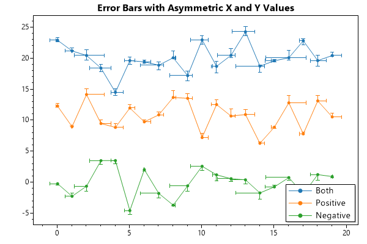


### PlotTypes: Fill - Filled Curve


You can create a filled scatter plot where the area between the curve and baseline is shaded with a color. The baseline defaults to 0, but can be set with an optional argument.


```cs
// Code from /src/ScottPlot.Demo/PlotTypes/Fill.cs
var plt = new ScottPlot.Plot(600, 400);

double[] xs = DataGen.Range(0, 10, .1, true);
double[] sin = DataGen.Sin(xs);
double[] cos = DataGen.Cos(xs);

plt.PlotFill(xs, sin, "sin", lineWidth: 2, fillAlpha: .5);
plt.PlotFill(xs, cos, "cos", lineWidth: 2, fillAlpha: .5);
plt.PlotHLine(0, color: Color.Black);
plt.AxisAuto(0);
plt.Legend(location: legendLocation.lowerLeft);

plt.SaveFig("PlotTypes_Fill_FillBeneathCurve.png");
```


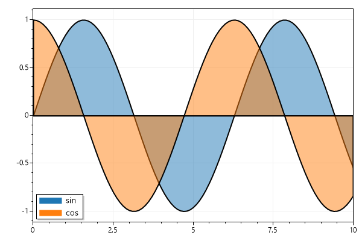


### PlotTypes: Fill - Fill Between Curves


You can fill the area between curves by supplying two pairs of X/Y coordinates


```cs
// Code from /src/ScottPlot.Demo/PlotTypes/Fill.cs
var plt = new ScottPlot.Plot(600, 400);

double[] xs = DataGen.Range(0, 10, .1, true);
double[] sin = DataGen.Sin(xs);
double[] cos = DataGen.Cos(xs);

plt.PlotFill(xs, sin, xs, cos, fillAlpha: .5);
plt.PlotScatter(xs, sin, Color.Black);
plt.PlotScatter(xs, cos, Color.Black);

plt.AxisAuto(0);

plt.SaveFig("PlotTypes_Fill_FillBetweenCurves.png");
```


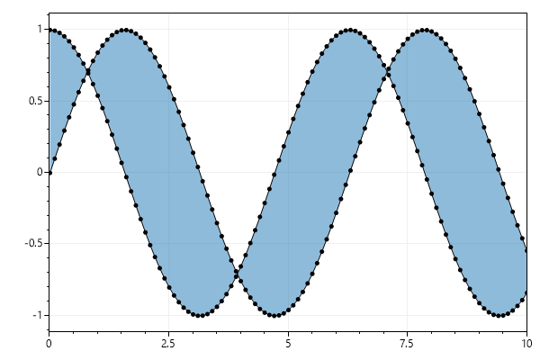


### PlotTypes: Fill - Fill Above and Below


A special method lets you create a filled line plot with different colors above/below the baseline.


```cs
// Code from /src/ScottPlot.Demo/PlotTypes/Fill.cs
var plt = new ScottPlot.Plot(600, 400);

Random rand = new Random(0);
var ys = ScottPlot.DataGen.RandomWalk(rand, 1000, offset: -10);
var xs = ScottPlot.DataGen.Consecutive(ys.Length, spacing: 0.025);

plt.PlotFillAboveBelow(xs, ys, fillAlpha: .5, labelAbove: "above", labelBelow: "below");
plt.Legend(location: ScottPlot.legendLocation.lowerLeft);
plt.AxisAuto(0);

plt.SaveFig("PlotTypes_Fill_FillAboveBelow.png");
```


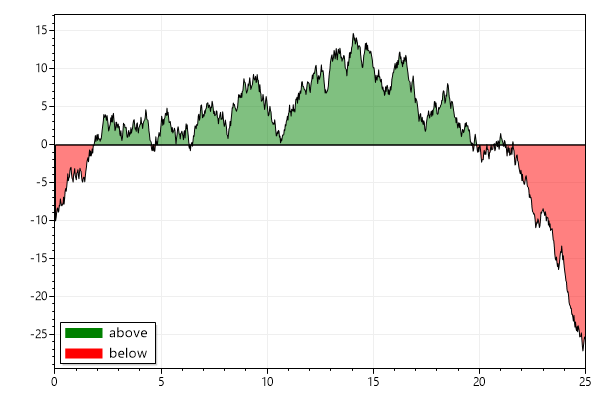


### PlotTypes: Fill - Fill Above and Below with Baseline


A custom baseline can be provided.


```cs
// Code from /src/ScottPlot.Demo/PlotTypes/Fill.cs
var plt = new ScottPlot.Plot(600, 400);

Random rand = new Random(0);
var ys = ScottPlot.DataGen.RandomWalk(rand, 1000, offset: -10);
var xs = ScottPlot.DataGen.Consecutive(ys.Length, spacing: 0.025);

plt.PlotFillAboveBelow(xs, ys, fillAlpha: .5, baseline: 3.21);
plt.AxisAuto(0);

plt.SaveFig("PlotTypes_Fill_FillAboveBelowWithBaseline.png");
```


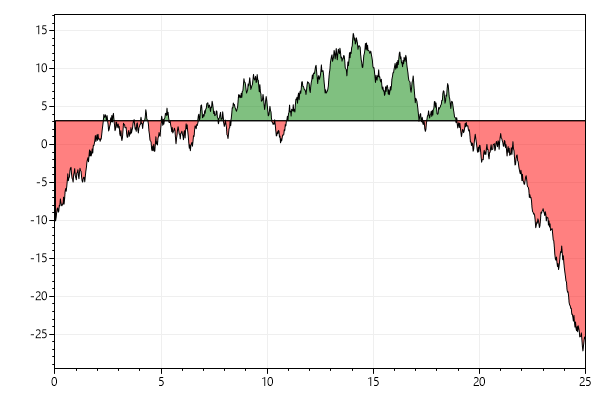


### PlotTypes: Finance - Financial OHLC Chart


Display OHLC (open, high, low, close) data by plotting an array of OHLC objects.


```cs
// Code from /src/ScottPlot.Demo/PlotTypes/Finance.cs
var plt = new ScottPlot.Plot(600, 400);

ScottPlot.OHLC[] ohlcs = DataGen.RandomStockPrices(rand: null, pointCount: 60, deltaMinutes: 10);
plt.Title("Open/High/Low/Close (OHLC) Chart");
plt.YLabel("Stock Price (USD)");
plt.PlotOHLC(ohlcs);
plt.Ticks(dateTimeX: true);

plt.SaveFig("PlotTypes_Finance_OHLC.png");
```


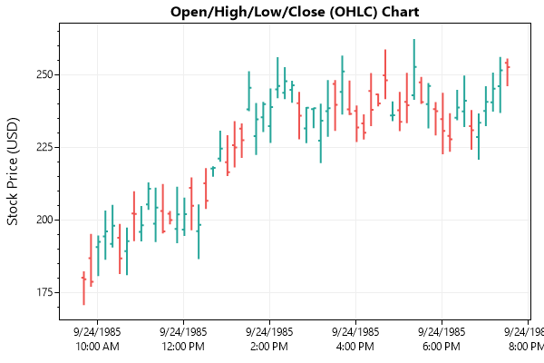


### PlotTypes: Finance - Financial Candlestick Chart


Display candlestick data by plotting an array of OHLC objects.


```cs
// Code from /src/ScottPlot.Demo/PlotTypes/Finance.cs
var plt = new ScottPlot.Plot(600, 400);

ScottPlot.OHLC[] ohlcs = DataGen.RandomStockPrices(rand: null, pointCount: 60, deltaMinutes: 10);
plt.Title("Ten Minute Candlestick Chart");
plt.YLabel("Stock Price (USD)");
plt.PlotCandlestick(ohlcs);
plt.Ticks(dateTimeX: true);

plt.SaveFig("PlotTypes_Finance_Candle.png");
```


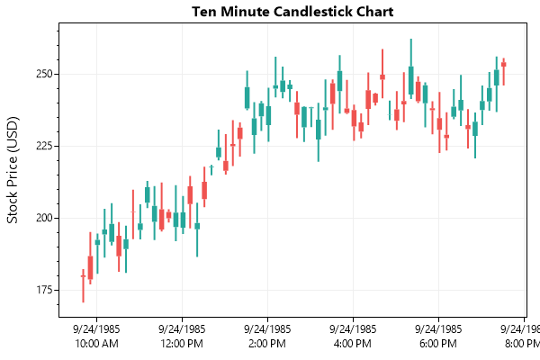


### PlotTypes: Finance - OHLC with gaps


This example demonstrates that by default the horizontal axis is strictly linear. Missing OHLC data produces gaps in the plot.


```cs
// Code from /src/ScottPlot.Demo/PlotTypes/Finance.cs
var plt = new ScottPlot.Plot(600, 400);

ScottPlot.OHLC[] ohlcs = ScottPlot.DataGen.RandomStockPrices(rand: null, pointCount: 30, deltaDays: 1);

plt.Title("Daily Candlestick Chart (weekends skipped)");
plt.YLabel("Stock Price (USD)");
plt.PlotCandlestick(ohlcs);
plt.Ticks(dateTimeX: true);

plt.SaveFig("PlotTypes_Finance_CandleSkipWeekends.png");
```


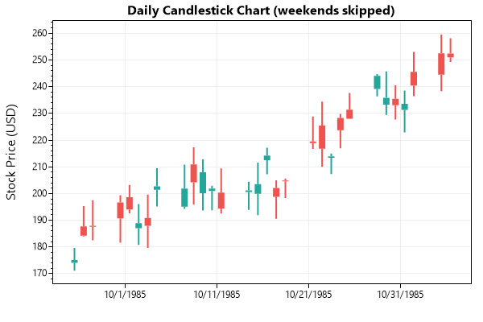


### PlotTypes: Finance - OHLC without gaps


This example demonstrates how to plot OHLC data continuously even though there are gaps on the horizontal axis (for days the market is closed). The strategy is to plot it on a linear horizontal axis (not a DateTime axis) and then to come back later and define custom tick labels.


```cs
// Code from /src/ScottPlot.Demo/PlotTypes/Finance.cs
var plt = new ScottPlot.Plot(600, 400);

// start with stock prices which have unevenly spaced time points (weekends are skipped)
ScottPlot.OHLC[] ohlcs = DataGen.RandomStockPrices(rand: null, pointCount: 30);

// replace timestamps with a series of numbers starting at 0
for (int i = 0; i < ohlcs.Length; i++)
    ohlcs[i].time = i;

// plot the candlesticks (the horizontal axis will start at 0)
plt.Title("Daily Candlestick Chart (evenly spaced)");
plt.YLabel("Stock Price (USD)");
plt.PlotCandlestick(ohlcs);

// create ticks manually
double[] tickPositions = { 0, 6, 13, 20, 27 };
string[] tickLabels = { "Sep 23", "Sep 30", "Oct 7", "Oct 14", "Oct 21" };
plt.XTicks(tickPositions, tickLabels);

plt.SaveFig("PlotTypes_Finance_CandleNoSkippedDays.png");
```


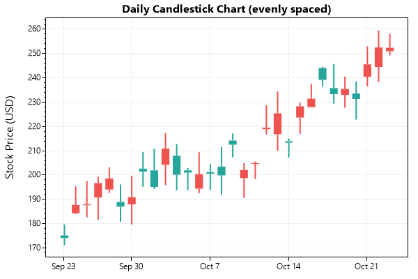


### PlotTypes: Finance - Simple Moving Average (SMA)


This example demonstrates how to plot OHLC data and display Simple Moving Average (SMA) lines on top.


```cs
// Code from /src/ScottPlot.Demo/PlotTypes/Finance.cs
var plt = new ScottPlot.Plot(600, 400);

// start with random stock data
Random rand = new Random(0);
ScottPlot.OHLC[] ohlcs = DataGen.RandomStockPrices(rand, 75, sequential: true);
plt.PlotCandlestick(ohlcs);

// calculate SMAs of different durations using helper methods
double[] xs = DataGen.Consecutive(ohlcs.Length);
double[] sma8xs = xs.Skip(8).ToArray();
double[] sma8ys = Statistics.Finance.SMA(ohlcs, 8).Skip(8).ToArray();
double[] sma20xs = xs.Skip(20).ToArray();
double[] sma20ys = Statistics.Finance.SMA(ohlcs, 20).Skip(20).ToArray();

plt.PlotScatter(sma8xs, sma8ys, label: "8 day SMA", color: Color.Blue, markerSize: 0, lineWidth: 2);
plt.PlotScatter(sma20xs, sma20ys, label: "20 day SMA", color: Color.Navy, markerSize: 0, lineWidth: 2);

// decorate the plot
plt.Title("Simple Moving Averages (SMA)");
plt.YLabel("Stock Price (USD)");
plt.XLabel("Day");
plt.Legend();

plt.SaveFig("PlotTypes_Finance_SimpleMovingAverage.png");
```


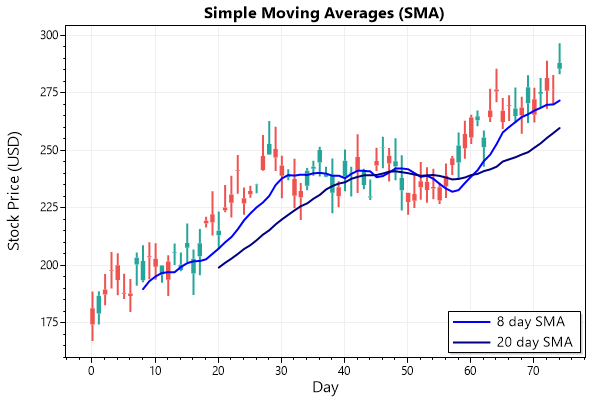


### PlotTypes: Finance - Bollinger Bands


This example demonstrates how to plot OHLC data and display Bollinger Bands on top.


```cs
// Code from /src/ScottPlot.Demo/PlotTypes/Finance.cs
var plt = new ScottPlot.Plot(600, 400);

// start with random stock data
Random rand = new Random(0);
ScottPlot.OHLC[] ohlcs = DataGen.RandomStockPrices(rand, 100, sequential: true);
plt.PlotCandlestick(ohlcs);

// calculate Bollinger bands
double[] xs = DataGen.Consecutive(ohlcs.Length);
(var sma, var bolL, var bolU) = ScottPlot.Statistics.Finance.Bollinger(ohlcs, 20);
double[] xs2 = xs.Skip(20).ToArray();
sma = sma.Skip(20).ToArray();
bolL = bolL.Skip(20).ToArray();
bolU = bolU.Skip(20).ToArray();

plt.PlotScatter(xs2, bolL, color: Color.Blue, markerSize: 0);
plt.PlotScatter(xs2, bolU, color: Color.Blue, markerSize: 0);
plt.PlotScatter(xs2, sma, color: Color.Blue, markerSize: 0, lineStyle: LineStyle.Dash);

// decorate the plot
plt.Title("Bollinger Bands");
plt.YLabel("Stock Price (USD)");
plt.XLabel("Day");
plt.Legend();

plt.SaveFig("PlotTypes_Finance_Bollinger.png");
```


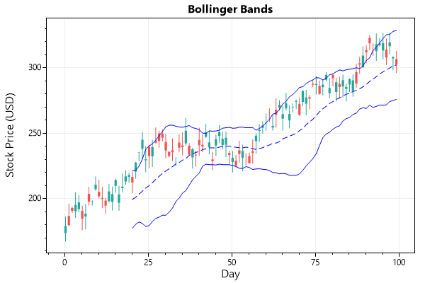


### PlotTypes: Function - Function Plot


A function (not data points) is provided to create this plot. Axes can be zoomed infinitely.


```cs
// Code from /src/ScottPlot.Demo/PlotTypes/Function.cs
var plt = new ScottPlot.Plot(600, 400);

var func1 = new Func<double, double?>((x) => Math.Sin(x) * Math.Sin(x / 2));
plt.PlotFunction(func1, lineWidth: 2, label: "sin(x) * sin(x/2)");

var func2 = new Func<double, double?>((x) => Math.Sin(x) * Math.Sin(x / 3));
plt.PlotFunction(func2, lineWidth: 2, label: "sin(x) * sin(x/3)", lineStyle: LineStyle.Dot);

var func3 = new Func<double, double?>((x) => Math.Cos(x) * Math.Sin(x / 5));
plt.PlotFunction(func3, lineWidth: 2, label: "cos(x) * cos(x/5)", lineStyle: LineStyle.Dash);

plt.Title("Plot Mathematical Functions");
plt.Legend();

plt.SaveFig("PlotTypes_Function_Quickstart.png");
```


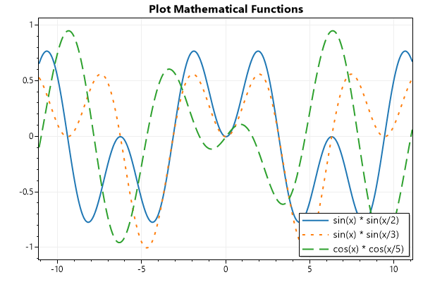


### PlotTypes: Image - Image Quickstart


Images can be placed at any X/Y location and styled using arguments.


```cs
// Code from /src/ScottPlot.Demo/PlotTypes/Image.cs
var plt = new ScottPlot.Plot(600, 400);

int pointCount = 51;
double[] x = DataGen.Consecutive(pointCount);
double[] sin = DataGen.Sin(pointCount);
double[] cos = DataGen.Cos(pointCount);

plt.PlotScatter(x, sin);
plt.PlotScatter(x, cos);

Bitmap image = DataGen.SampleImage();
plt.PlotBitmap(image, 0, 0);

plt.SaveFig("PlotTypes_Image_Quickstart.png");
```


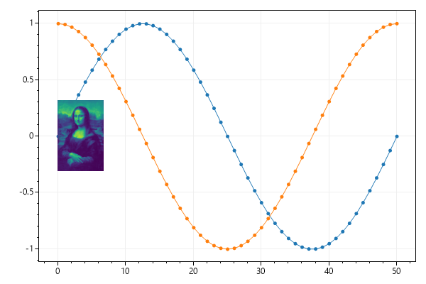


### PlotTypes: Image - Image Alignment


Image alignment and rotation can be customized using arguments.


```cs
// Code from /src/ScottPlot.Demo/PlotTypes/Image.cs
var plt = new ScottPlot.Plot(600, 400);

int pointCount = 51;
double[] x = DataGen.Consecutive(pointCount);
double[] sin = DataGen.Sin(pointCount);
double[] cos = DataGen.Cos(pointCount);

plt.PlotScatter(x, sin);
plt.PlotScatter(x, cos);

Bitmap image = DataGen.SampleImage();

plt.PlotBitmap(image, 5, 0.8);
plt.PlotPoint(5, 0.8, color: Color.Green);

plt.PlotBitmap(image, 20, 0.3);
plt.PlotPoint(20, 0.3, color: Color.Black, markerSize: 15);

plt.PlotBitmap(image, 30, 0, alignment: ImageAlignment.middleCenter);
plt.PlotPoint(30, 0, color: Color.Black, markerSize: 15);

plt.PlotBitmap(image, 30, -0.3, alignment: ImageAlignment.upperLeft);
plt.PlotPoint(30, -0.3, color: Color.Black, markerSize: 15);

plt.PlotBitmap(image, 5, -.5, rotation: -30);
plt.PlotPoint(5, -.5, color: Color.Blue, markerSize: 15);

plt.PlotBitmap(image, 15, -.6, frameSize: 3, frameColor: Color.Magenta);

plt.SaveFig("PlotTypes_Image_Alignment.png");
```


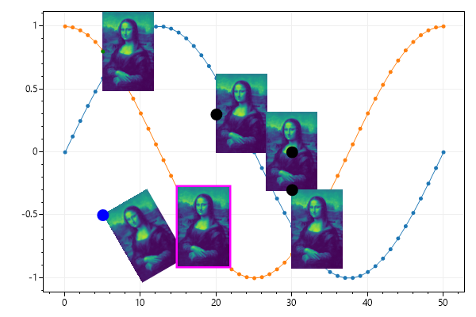


### PlotTypes: Pie - Quickstart


A pie chart (or a circle chart) illustrates numerical proportions as slices of a circle.


```cs
// Code from /src/ScottPlot.Demo/PlotTypes/Pie.cs
var plt = new ScottPlot.Plot(600, 400);

double[] values = { 778, 283, 184, 76, 43 };

plt.PlotPie(values);

plt.Grid(false);
plt.Frame(false);
plt.Ticks(false, false);

plt.SaveFig("PlotTypes_Pie_PieQuickstart.png");
```


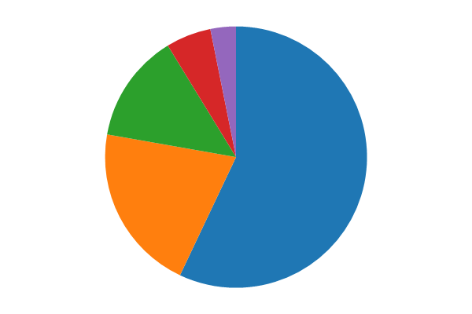


### PlotTypes: Pie - Exploding Pie


There is an option to have an "exploding" pie chart.


```cs
// Code from /src/ScottPlot.Demo/PlotTypes/Pie.cs
var plt = new ScottPlot.Plot(600, 400);

double[] values = { 778, 283, 184, 76, 43 };

plt.PlotPie(values, explodedChart: true);

plt.Grid(false);
plt.Frame(false);
plt.Ticks(false, false);

plt.SaveFig("PlotTypes_Pie_ExplodingPie.png");
```


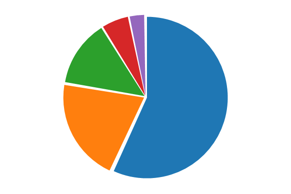


### PlotTypes: Pie - Donut Plot


Donut plots are circle plots with a hollow center.


```cs
// Code from /src/ScottPlot.Demo/PlotTypes/Pie.cs
var plt = new ScottPlot.Plot(600, 400);

double[] values = { 778, 283, 184, 76, 43 };

var pie = plt.PlotPie(values);
pie.donutSize = .6;
pie.explodedChart = true;

plt.Grid(false);
plt.Frame(false);
plt.Ticks(false, false);

plt.SaveFig("PlotTypes_Pie_DonutPie.png");
```


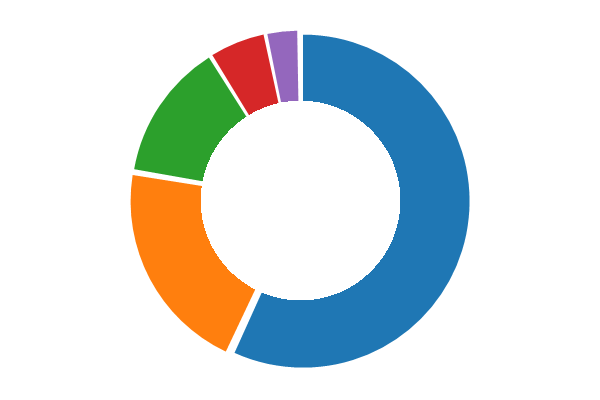


### PlotTypes: Pie - Donut Plot With Text


Custom text can be displayed inside the donut.


```cs
// Code from /src/ScottPlot.Demo/PlotTypes/Pie.cs
var plt = new ScottPlot.Plot(600, 400);

double[] values = { 779, 586 };
string centerText = $"{values[0] / values.Sum() * 100:00.0}%";

Color color1 = Color.FromArgb(255, 0, 150, 200);
Color color2 = Color.FromArgb(100, 0, 150, 200);

var pie = plt.PlotPie(values);
pie.donutSize = .6;
pie.centerText = centerText;
pie.centerTextColor = color1;
pie.outlineSize = 2;
pie.colors = new Color[] { color1, color2 };

plt.Grid(false);
plt.Frame(false);
plt.Ticks(false, false);

plt.SaveFig("PlotTypes_Pie_DonutPieWithPercentageInDonut.png");
```


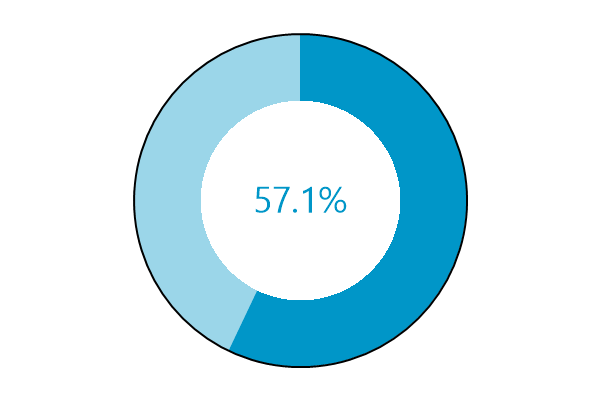


### PlotTypes: Pie - Show Values


There is an option to show slice values on the chart.


```cs
// Code from /src/ScottPlot.Demo/PlotTypes/Pie.cs
var plt = new ScottPlot.Plot(600, 400);

double[] values = { 778, 43, 283, 76, 184 };

plt.PlotPie(values, showValues: true);

plt.Grid(false);
plt.Frame(false);
plt.Ticks(false, false);

plt.SaveFig("PlotTypes_Pie_PieShowValues.png");
```


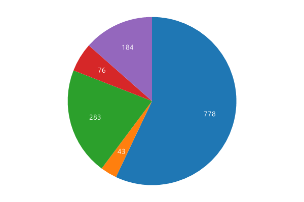


### PlotTypes: Pie - Show Percentages


There is an option to show slice percentages on the chart.


```cs
// Code from /src/ScottPlot.Demo/PlotTypes/Pie.cs
var plt = new ScottPlot.Plot(600, 400);

double[] values = { 778, 43, 283, 76, 184 };

plt.PlotPie(values, showPercentages: true);

plt.Grid(false);
plt.Frame(false);
plt.Ticks(false, false);

plt.SaveFig("PlotTypes_Pie_PieShowPercentages.png");
```


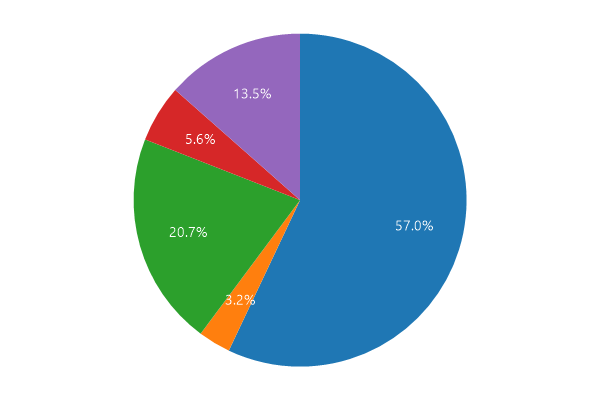


### PlotTypes: Pie - Show Labels in Slices


Labels can also be shown on slices.


```cs
// Code from /src/ScottPlot.Demo/PlotTypes/Pie.cs
var plt = new ScottPlot.Plot(600, 400);

double[] values = { 778, 43, 283, 76, 184 };
string[] labels = { "C#", "JAVA", "Python", "F#", "PHP" };

plt.PlotPie(values, labels, showLabels: true);

plt.Grid(false);
plt.Frame(false);
plt.Ticks(false, false);

plt.SaveFig("PlotTypes_Pie_PieLabelSlices.png");
```


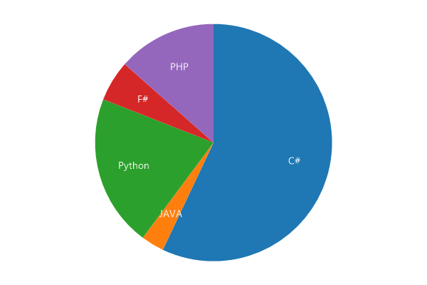


### PlotTypes: Pie - Labels in Legend


You can label slices and show them in the legend.


```cs
// Code from /src/ScottPlot.Demo/PlotTypes/Pie.cs
var plt = new ScottPlot.Plot(600, 400);

double[] values = { 778, 43, 283, 76, 184 };
string[] labels = { "C#", "JAVA", "Python", "F#", "PHP" };

plt.PlotPie(values, labels, showLabels: false);
plt.Legend();

plt.Grid(false);
plt.Frame(false);
plt.Ticks(false, false);

plt.SaveFig("PlotTypes_Pie_PieLegend.png");
```


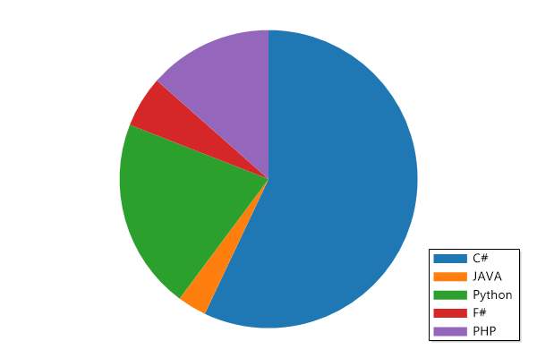


### PlotTypes: Pie - Show Everything


Values, percentages, labels, and legend


```cs
// Code from /src/ScottPlot.Demo/PlotTypes/Pie.cs
var plt = new ScottPlot.Plot(600, 400);

double[] values = { 778, 43, 283, 76, 184 };
string[] labels = { "C#", "JAVA", "Python", "F#", "PHP" };

plt.PlotPie(values, labels, showPercentages: true, showValues: true, showLabels: true);
plt.Legend();

plt.Grid(false);
plt.Frame(false);
plt.Ticks(false, false);

plt.SaveFig("PlotTypes_Pie_PieShowEverything.png");
```


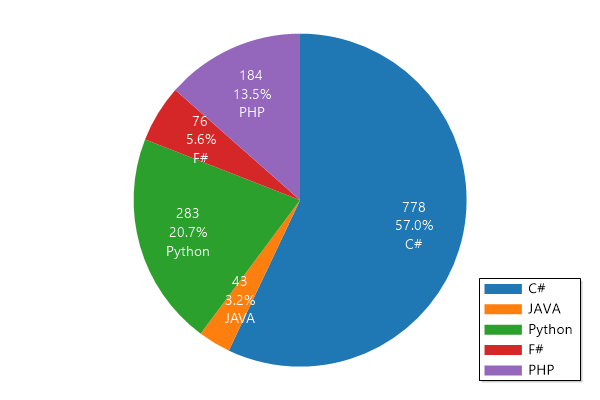


### PlotTypes: Pie - Custom Slice Labels


The best way to show labels and data is to make the string labels yourself


```cs
// Code from /src/ScottPlot.Demo/PlotTypes/Pie.cs
var plt = new ScottPlot.Plot(600, 400);

double[] values = { 778, 43, 283, 76, 184 };
string[] labels = { "C#", "JAVA", "Python", "F#", "PHP" };

labels = Enumerable
    .Range(0, values.Length)
    .Select(i => $"{labels[i]}\n({values[i]})")
    .ToArray();

plt.PlotPie(values, labels);

plt.Grid(false);
plt.Frame(false);
plt.Ticks(false, false);

plt.SaveFig("PlotTypes_Pie_PieCustomSliceLabels.png");
```


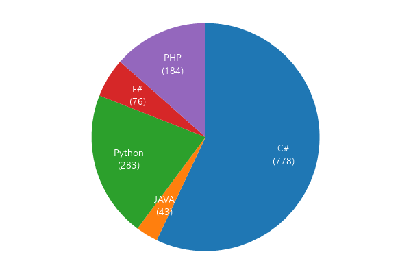


### PlotTypes: Point - Plot points


Points are essentially scatter plots with a single point.


```cs
// Code from /src/ScottPlot.Demo/PlotTypes/Point.cs
var plt = new ScottPlot.Plot(600, 400);

int pointCount = 51;
double[] x = DataGen.Consecutive(pointCount);
double[] sin = DataGen.Sin(pointCount);
double[] cos = DataGen.Cos(pointCount);

// draw something to make the plot interesting
plt.PlotScatter(x, sin);
plt.PlotScatter(x, cos);

// add a few points
plt.PlotPoint(25, 0.8);
plt.PlotPoint(30, 0.3, color: Color.Magenta, markerSize: 15);

plt.SaveFig("PlotTypes_Point_Quickstart.png");
```


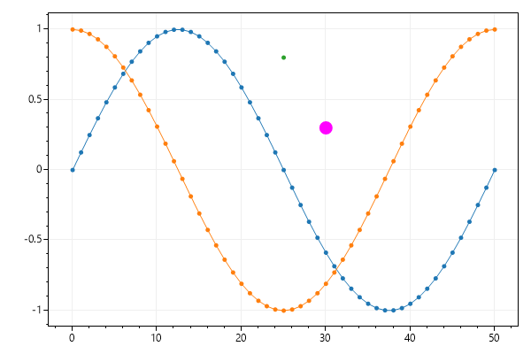


### PlotTypes: Polygon - Polygon Quickstart


Pairs of X/Y points can be used to display polygons.


```cs
// Code from /src/ScottPlot.Demo/PlotTypes/Polygon.cs
var plt = new ScottPlot.Plot(600, 400);

plt.PlotPolygon(
    xs: new double[] { 2, 8, 6, 4 },
    ys: new double[] { 3, 4, 0.5, 1 },
    label: "polygon A", lineWidth: 2, fillAlpha: .8,
    lineColor: System.Drawing.Color.Black);

plt.PlotPolygon(
    xs: new double[] { 3, 2.5, 5 },
    ys: new double[] { 4.5, 1.5, 2.5 },
    label: "polygon B", lineWidth: 2, fillAlpha: .8,
    lineColor: System.Drawing.Color.Black);

plt.Title($"Polygon Demonstration");
plt.Legend();

plt.SaveFig("PlotTypes_Polygon_Quickstart.png");
```


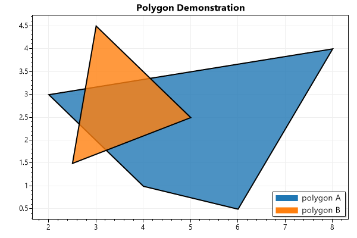


### PlotTypes: Polygon - Filled Line Plots


Polygons shaped to appear like filled line plots.


```cs
// Code from /src/ScottPlot.Demo/PlotTypes/Polygon.cs
var plt = new ScottPlot.Plot(600, 400);

double[] xs = { 1, 2, 3, 4 };
double[] ys1 = { 1, 3, 1, 2 };
double[] ys2 = { 3, 7, 3, 1 };
double[] ys3 = { 5, 2, 5, 6 };

// plot line data as polygon corners
double[] paddedXs = Tools.Pad(xs, cloneEdges: true);
plt.PlotPolygon(paddedXs, Tools.Pad(ys3), lineWidth: 2, lineColor: Color.Black, fillAlpha: .7);
plt.PlotPolygon(paddedXs, Tools.Pad(ys2), lineWidth: 2, lineColor: Color.Black, fillAlpha: .7);
plt.PlotPolygon(paddedXs, Tools.Pad(ys1), lineWidth: 2, lineColor: Color.Black, fillAlpha: .7);

plt.AxisAuto(0, 0);
plt.Title("Filled Line Plots");

plt.SaveFig("PlotTypes_Polygon_FilledLinePlots.png");
```


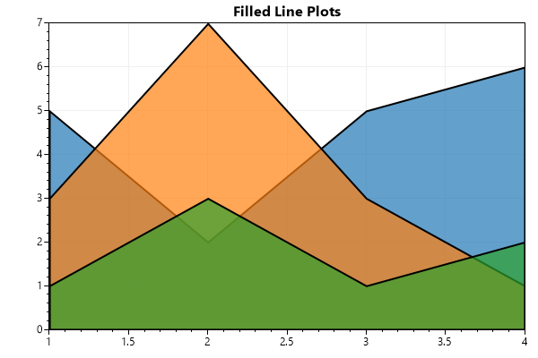


### PlotTypes: Polygon - Filled Line Plots Stacked


Polygons shaped to appear like stacked filled line plots.


```cs
// Code from /src/ScottPlot.Demo/PlotTypes/Polygon.cs
var plt = new ScottPlot.Plot(600, 400);

double[] xs = { 1, 2, 3, 4 };
double[] ys1 = { 1, 3, 1, 2 };
double[] ys2 = { 3, 7, 3, 1 };
double[] ys3 = { 5, 2, 5, 6 };

// manually stack plots
ys2 = Enumerable.Range(0, ys2.Length).Select(x => ys2[x] + ys1[x]).ToArray();
ys3 = Enumerable.Range(0, ys2.Length).Select(x => ys3[x] + ys2[x]).ToArray();

double[] paddedXs = Tools.Pad(xs, cloneEdges: true);
plt.PlotPolygon(paddedXs, Tools.Pad(ys3), lineWidth: 2, lineColor: Color.Black);
plt.PlotPolygon(paddedXs, Tools.Pad(ys2), lineWidth: 2, lineColor: Color.Black);
plt.PlotPolygon(paddedXs, Tools.Pad(ys1), lineWidth: 2, lineColor: Color.Black);

plt.AxisAuto(0, 0);
plt.Title("Stacked Filled Line Plots");

plt.SaveFig("PlotTypes_Polygon_FilledLinePlotsStacked.png");
```


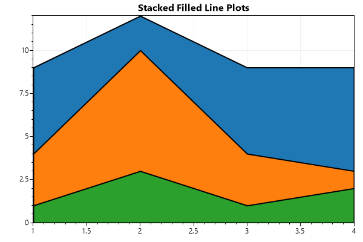


### PlotTypes: Polygons - PlotPolygon with many polygons


PlotPolygon can display thousands of polygons, but this is SLOW! Use PlotPolygons for this purpose instead.


```cs
// Code from /src/ScottPlot.Demo/PlotTypes/Polygons.cs
var plt = new ScottPlot.Plot(600, 400);

int polygonCount = 5_000;
int pointsPerPolygon = 100;
Random rand = new Random(0);

// create polygons and plot them one at a time
for (int i = 0; i < polygonCount; i++)
{
    double polyX = rand.NextDouble() * 100;
    double polyY = rand.NextDouble() * 100;
    double polyR = rand.NextDouble();
    double[] xs = Enumerable.Range(0, pointsPerPolygon).Select(x => polyR * Math.Cos(2.0 * Math.PI * x / pointsPerPolygon) + polyX).ToArray();
    double[] ys = Enumerable.Range(0, pointsPerPolygon).Select(x => polyR * Math.Sin(2.0 * Math.PI * x / pointsPerPolygon) + polyY).ToArray();
    plt.PlotPolygon(xs, ys, fillColor: Color.Green);
}

// customize the plot
plt.EqualAxis = true;
plt.Title($"PlotPolygon with {polygonCount:N0} {pointsPerPolygon}-sided polygons");

plt.SaveFig("PlotTypes_Polygons_BenchmarkPolygon.png");
```


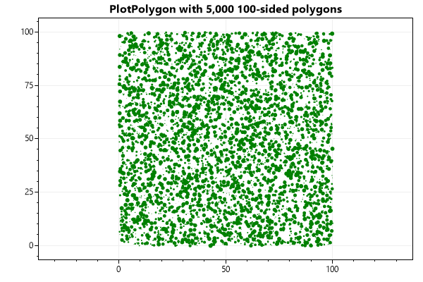


### PlotTypes: Polygons - PlotPolygons with many polygons


PlottablePolygons is a speed-optimized method of displaying large numbers of polygons.


```cs
// Code from /src/ScottPlot.Demo/PlotTypes/Polygons.cs
var plt = new ScottPlot.Plot(600, 400);

int polygonCount = 5_000;
int pointsPerPolygon = 100;
Random rand = new Random(0);

List<List<(double x, double y)>> polys = new List<List<(double x, double y)>>();

// create a List of polygons
for (int i = 0; i < polygonCount; i++)
{
    double polyX = rand.NextDouble() * 100;
    double polyY = rand.NextDouble() * 100;
    double polyR = rand.NextDouble();
    double[] xs = Enumerable.Range(0, pointsPerPolygon).Select(x => polyR * Math.Cos(2.0 * Math.PI * x / pointsPerPolygon) + polyX).ToArray();
    double[] ys = Enumerable.Range(0, pointsPerPolygon).Select(x => polyR * Math.Sin(2.0 * Math.PI * x / pointsPerPolygon) + polyY).ToArray();
    polys.Add(xs.Zip(ys, (xp, yp) => (xp, yp)).ToList());
}

// then plot all the polygons with one command
plt.PlotPolygons(polys, fillColor: Color.Green);

// customize the plot
plt.EqualAxis = true;
plt.Title($"PlotPolygons with {polys.Count:N0} {pointsPerPolygon}-sided polygons");

plt.SaveFig("PlotTypes_Polygons_BenchmarkPolygons.png");
```


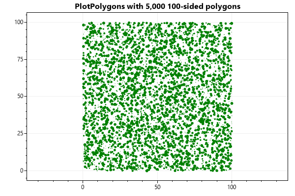


### PlotTypes: Populations - Plot a Population


Population objects can be plotted with Plot.Populations(). The default display format is to show a box-and-whisker plot (showing outliers, quartiles, and median) next to a scatter plot of the original data values and the distribution curve.


```cs
// Code from /src/ScottPlot.Demo/PlotTypes/Populations.cs
var plt = new ScottPlot.Plot(600, 400);

// create some sample data to represent test scores
Random rand = new Random(0);
double[] scores = DataGen.RandomNormal(rand, 35, 85, 5);

// create a Population object and plot it
var pop = new ScottPlot.Statistics.Population(scores);
plt.PlotPopulations(pop, "scores");

// improve the style of the plot
plt.Title($"Test Scores (mean: {pop.mean:0.00} +/- {pop.stDev:0.00}, n={pop.n})");
plt.YLabel("Score");
plt.Ticks(displayTicksX: false);
plt.Legend();
plt.Grid(lineStyle: LineStyle.Dot, enableVertical: false);

plt.SaveFig("PlotTypes_Populations_PlotPopulation.png");
```


### PlotTypes: Populations - Uniform Population Series


A series of populations can be plotted as a single object. Every population in a series has the same style, and a series will appear only once in the legend.


```cs
// Code from /src/ScottPlot.Demo/PlotTypes/Populations.cs
var plt = new ScottPlot.Plot(600, 400);

// create some sample data to represent test scores
Random rand = new Random(0);
double[] scoresA = DataGen.RandomNormal(rand, 35, 85, 5);
double[] scoresB = DataGen.RandomNormal(rand, 42, 87, 3);
double[] scoresC = DataGen.RandomNormal(rand, 23, 92, 3);

// collect multiple populations into a PopulationSeries
var poulations = new Statistics.Population[] {
    new Statistics.Population(scoresA),
    new Statistics.Population(scoresB),
    new Statistics.Population(scoresC)
};

// Plot these as a single series (all styled the same, appearing once in legend)
var popSeries = new Statistics.PopulationSeries(poulations);
plt.PlotPopulations(popSeries, "scores");

// improve the style of the plot
plt.Title($"Test Scores by Class");
plt.YLabel("Score");
plt.XTicks(new string[] { "Class A", "Class B", "Class C" });
plt.Legend();
plt.Grid(lineStyle: LineStyle.Dot, enableVertical: false);

plt.SaveFig("PlotTypes_Populations_PlotPopulationSeriesUniform.png");
```


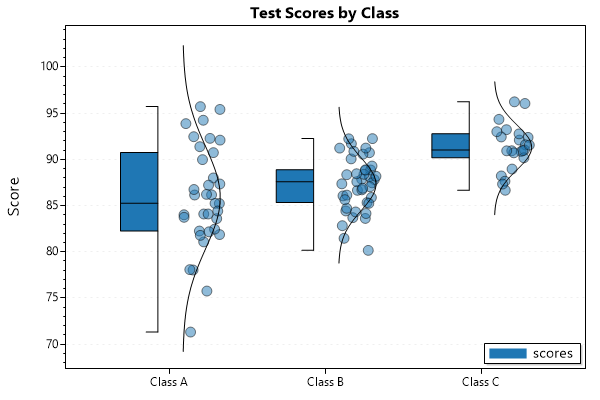


### PlotTypes: Populations - Unique Population Series


To give every population in a series a different style, plot it as a MultiSeries where each group only contains 1 series. This way every population will have a unique style, and each population will be listed in the legend.


```cs
// Code from /src/ScottPlot.Demo/PlotTypes/Populations.cs
var plt = new ScottPlot.Plot(600, 400);

// create some sample data to represent test scores
Random rand = new Random(0);
double[] scoresA = DataGen.RandomNormal(rand, 35, 85, 5);
double[] scoresB = DataGen.RandomNormal(rand, 42, 87, 3);
double[] scoresC = DataGen.RandomNormal(rand, 23, 92, 3);

// create a unique PopulationSeries for each set of scores
var seriesA = new Statistics.PopulationSeries(new Statistics.Population[] { new Statistics.Population(scoresA) }, "Class A");
var seriesB = new Statistics.PopulationSeries(new Statistics.Population[] { new Statistics.Population(scoresB) }, "Class B");
var seriesC = new Statistics.PopulationSeries(new Statistics.Population[] { new Statistics.Population(scoresC) }, "Class C");

// create a MultiSeries from all the individual series
var multiSeries = new Statistics.PopulationMultiSeries(new Statistics.PopulationSeries[] { seriesA, seriesB, seriesC });
plt.PlotPopulations(multiSeries);

// improve the style of the plot
plt.Title($"Test Scores by Class");
plt.YLabel("Score");
plt.Ticks(displayTicksX: false);
plt.Legend();
plt.Grid(lineStyle: LineStyle.Dot, enableVertical: false);

plt.SaveFig("PlotTypes_Populations_PlotPopulationSeriesUnique.png");
```


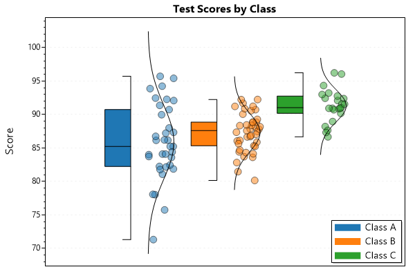


### PlotTypes: Populations - Plot a Population Multi-Series


To compare groups of population series, construct a PopulationMultiSeries object and pot it. Each series within the MultiSeries will appear once in the legend.


```cs
// Code from /src/ScottPlot.Demo/PlotTypes/Populations.cs
var plt = new ScottPlot.Plot(600, 400);

// create some sample data to represent test scores.
Random rand = new Random(0);

// Each class (A, B, C) is a series.
// Each semester (fall, spring, summer A, summer B) is a group.

double[] scoresAfall = DataGen.RandomNormal(rand, 35, 85, 5);
double[] scoresBfall = DataGen.RandomNormal(rand, 42, 87, 5);
double[] scoresCfall = DataGen.RandomNormal(rand, 23, 82, 5);

double[] scoresAspring = DataGen.RandomNormal(rand, 35, 84, 3);
double[] scoresBspring = DataGen.RandomNormal(rand, 42, 88, 3);
double[] scoresCspring = DataGen.RandomNormal(rand, 23, 84, 3);

double[] scoresAsumA = DataGen.RandomNormal(rand, 35, 80, 5);
double[] scoresBsumA = DataGen.RandomNormal(rand, 42, 90, 5);
double[] scoresCsumA = DataGen.RandomNormal(rand, 23, 85, 5);

double[] scoresAsumB = DataGen.RandomNormal(rand, 35, 91, 2);
double[] scoresBsumB = DataGen.RandomNormal(rand, 42, 93, 2);
double[] scoresCsumB = DataGen.RandomNormal(rand, 23, 90, 2);

// Collect multiple populations into a PopulationSeries.
// All populations in a series will be styled the same and appear once in the legend.

var popsA = new Statistics.Population[] {
    new Statistics.Population(scoresAfall),
    new Statistics.Population(scoresAspring),
    new Statistics.Population(scoresAsumA),
    new Statistics.Population(scoresAsumB)
};

var popsB = new Statistics.Population[] {
    new Statistics.Population(scoresBfall),
    new Statistics.Population(scoresBspring),
    new Statistics.Population(scoresBsumA),
    new Statistics.Population(scoresBsumB)
};

var popsC = new Statistics.Population[] {
    new Statistics.Population(scoresCfall),
    new Statistics.Population(scoresCspring),
    new Statistics.Population(scoresCsumA),
    new Statistics.Population(scoresCsumB)
};

var seriesA = new Statistics.PopulationSeries(popsA, "Class A");
var seriesB = new Statistics.PopulationSeries(popsB, "Class B");
var seriesC = new Statistics.PopulationSeries(popsC, "Class C");
var allSeries = new Statistics.PopulationSeries[] { seriesA, seriesB, seriesC };

// create a MultiSeries from multiple population series and plot it
var multiSeries = new Statistics.PopulationMultiSeries(allSeries);
plt.PlotPopulations(multiSeries);

// improve the style of the plot
plt.Title($"Test Scores by Class");
plt.YLabel("Score");
plt.XTicks(new string[] { "Fall", "Spring", "Summer A", "Summer B" });
plt.Legend();
plt.Grid(lineStyle: LineStyle.Dot, enableVertical: false);

plt.SaveFig("PlotTypes_Populations_PlotPopulationMultiSeries.png");
```


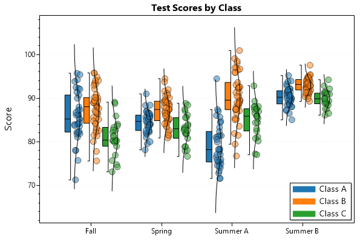


### PlotTypes: Populations - Advanced Styling


Store the object returned by Plot.Populations() and modify its properties to further customize how group plots are displayed.


```cs
// Code from /src/ScottPlot.Demo/PlotTypes/Populations.cs
var plt = new ScottPlot.Plot(600, 400);

// create some sample data to represent test scores
Random rand = new Random(0);
double[] scoresA = DataGen.RandomNormal(rand, 35, 72, 7);
double[] scoresB = DataGen.RandomNormal(rand, 42, 57, 10);
double[] scoresC = DataGen.RandomNormal(rand, 23, 79, 5);

// create a unique PopulationSeries for each set of scores
var seriesA = new Statistics.PopulationSeries(new Statistics.Population[] { new Statistics.Population(scoresA) }, "Class A");
var seriesB = new Statistics.PopulationSeries(new Statistics.Population[] { new Statistics.Population(scoresB) }, "Class B");
var seriesC = new Statistics.PopulationSeries(new Statistics.Population[] { new Statistics.Population(scoresC) }, "Class C");

// create a MultiSeries from all the individual series
var multiSeries = new Statistics.PopulationMultiSeries(new Statistics.PopulationSeries[] { seriesA, seriesB, seriesC });

// save the plottable and modify its properties to customize display style
var popPlot = plt.PlotPopulations(multiSeries);
popPlot.displayDistributionCurve = true;
popPlot.distributionCurveLineStyle = LineStyle.Dash;
popPlot.scatterOutlineColor = System.Drawing.Color.Transparent;
popPlot.displayItems = PlottablePopulations.DisplayItems.ScatterAndBox;
popPlot.boxStyle = PlottablePopulations.BoxStyle.BarMeanStDev;
plt.Axis(y1: 0);

// colors are managed at the population series level:
foreach (var popSeries in popPlot.popMultiSeries.multiSeries)
    popSeries.color = Tools.GetRandomColor(rand);

// improve the style of the plot
plt.Title($"Test Scores by Class");
plt.YLabel("Score");
plt.Legend(location: legendLocation.lowerLeft);
plt.Ticks(displayTicksX: false);
plt.Grid(lineStyle: LineStyle.Dot, enableVertical: false);

plt.SaveFig("PlotTypes_Populations_AdvancedStyling.png");
```


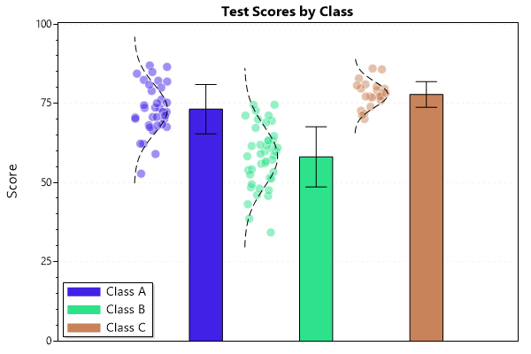


### PlotTypes: Radar - Quickstart


A radar chart concisely displays multiple values. Radar plots are also called a spider charts or star charts.


```cs
// Code from /src/ScottPlot.Demo/PlotTypes/Radar.cs
var plt = new ScottPlot.Plot(600, 400);

double[,] values = {
    { 78, 83, 84, 76, 43 },
    { 100, 50, 70, 60, 90 }
};

plt.PlotRadar(values);

// customize the plot
plt.Grid(false);
plt.Frame(false);
plt.Ticks(false, false);

plt.SaveFig("PlotTypes_Radar_RadarQuickstart.png");
```


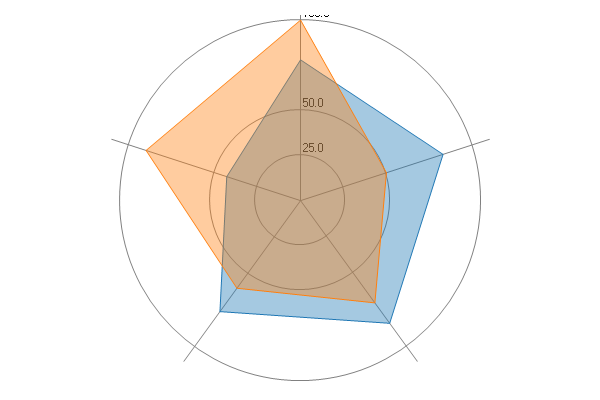


### PlotTypes: Radar - Radar With Labels


Labels can be displayed on the arms of the radar chart.


```cs
// Code from /src/ScottPlot.Demo/PlotTypes/Radar.cs
var plt = new ScottPlot.Plot(600, 400);

double[,] values = { { 5, 3, 10, 15, 3, 2 }, { 5, 2, 10, 10, 1, 4 }, };
string[] categories = { "Wins", "Poles", "Podiums", "Points Finishes", "DNFs", "Fastest Laps" };
string[] groups = { "Sebastian Vettel", "Fernando Alonso" };

plt.PlotRadar(values, categories, groups);
plt.Legend();

// customize the plot
plt.Grid(false);
plt.Frame(false);
plt.Ticks(false, false);
plt.Title("2010 Formula One World Championship");

/* Data represents the 2010 Formula One World Championship
 * https://en.wikipedia.org/wiki/2010_Formula_One_World_Championship
 * Note: Alonso did not finish (DNF) in the Malaysian GP, but was included 
 * here because he completed >90% of the race distance.
 */

plt.SaveFig("PlotTypes_Radar_RadarWithLabels.png");
```


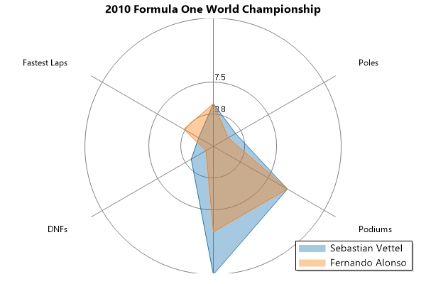


### PlotTypes: ScaleBar - Scale Bar


An L-shaped scalebar can be added in the corner of any plot


```cs
// Code from /src/ScottPlot.Demo/PlotTypes/ScaleBar.cs
var plt = new ScottPlot.Plot(600, 400);

// plot some data
plt.PlotSignal(DataGen.Sin(51));
plt.PlotSignal(DataGen.Cos(51, mult: 1.5));

// add the scalebar
plt.PlotScaleBar(5, .25, "5 ms", "250 pA");

// remove axis and grid lines
plt.Grid(false);
plt.Frame(false);
plt.Ticks(false, false);
plt.AxisAuto(0);
plt.TightenLayout(0);

plt.SaveFig("PlotTypes_ScaleBar_ScaleBarQuickstart.png");
```


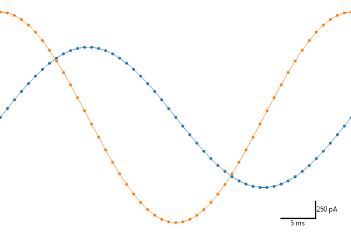


### PlotTypes: Scatter - Scatter Plot Quickstart


Scatter plots are best for small numbers of paired X/Y data points. For evenly-spaced data points Signal is much faster.


```cs
// Code from /src/ScottPlot.Demo/PlotTypes/Scatter.cs
var plt = new ScottPlot.Plot(600, 400);

int pointCount = 51;
double[] x = DataGen.Consecutive(pointCount);
double[] sin = DataGen.Sin(pointCount);
double[] cos = DataGen.Cos(pointCount);

plt.PlotScatter(x, sin);
plt.PlotScatter(x, cos);

plt.SaveFig("PlotTypes_Scatter_Quickstart.png");
```


### PlotTypes: Scatter - Custom markers


Arguments allow markers to be customized


```cs
// Code from /src/ScottPlot.Demo/PlotTypes/Scatter.cs
var plt = new ScottPlot.Plot(600, 400);

int pointCount = 51;
double[] x = DataGen.Consecutive(pointCount);
double[] sin = DataGen.Sin(pointCount);
double[] cos = DataGen.Cos(pointCount);

plt.PlotScatter(x, sin, markerSize: 15, markerShape: MarkerShape.openCircle);
plt.PlotScatter(x, cos, markerSize: 7, markerShape: MarkerShape.filledSquare);

plt.SaveFig("PlotTypes_Scatter_CustomizeMarkers.png");
```


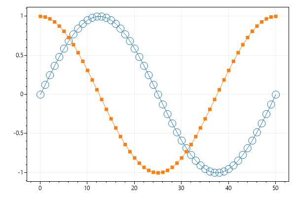


### PlotTypes: Scatter - All marker shapes


This plot demonstrates all available markers


```cs
// Code from /src/ScottPlot.Demo/PlotTypes/Scatter.cs
var plt = new ScottPlot.Plot(600, 400);

int pointCount = 51;
double[] x = DataGen.Consecutive(pointCount);

string[] markerShapeNames = Enum.GetNames(typeof(MarkerShape));
for (int i = 0; i < markerShapeNames.Length; i++)
{
    string markerShapeName = markerShapeNames[i];
    MarkerShape markerShape = (MarkerShape)Enum.Parse(typeof(MarkerShape), markerShapeName);
    double[] sin = DataGen.Sin(pointCount, 2, -i);
    plt.PlotScatter(x, sin, label: markerShapeName, markerShape: markerShape, markerSize: 7);
}

plt.Grid(false);
plt.Legend(fontSize: 10);

plt.SaveFig("PlotTypes_Scatter_AllMarkers.png");
```


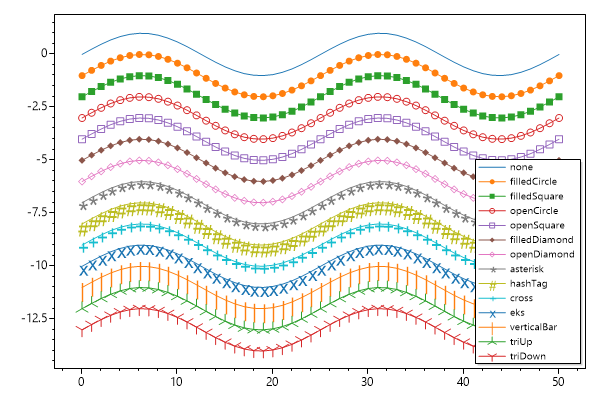


### PlotTypes: Scatter - Custom lines


Arguments allow line color, size, and pattern to be customized. Setting markerSize to 0 prevents markers from being rendered.


```cs
// Code from /src/ScottPlot.Demo/PlotTypes/Scatter.cs
var plt = new ScottPlot.Plot(600, 400);

int pointCount = 51;
double[] x = DataGen.Consecutive(pointCount);
double[] sin = DataGen.Sin(pointCount);
double[] cos = DataGen.Cos(pointCount);
double[] cos2 = DataGen.Cos(pointCount, mult: -1);

plt.PlotScatter(x, sin, color: Color.Magenta, label: "sin", lineWidth: 0, markerSize: 10);
plt.PlotScatter(x, cos, color: Color.Green, label: "cos", lineWidth: 5, markerSize: 0);
plt.PlotScatter(x, cos2, color: Color.Blue, label: "-cos", lineWidth: 3, markerSize: 0, lineStyle: LineStyle.DashDot);

plt.Legend(fixedLineWidth: false);

plt.SaveFig("PlotTypes_Scatter_CustomizeLines.png");
```


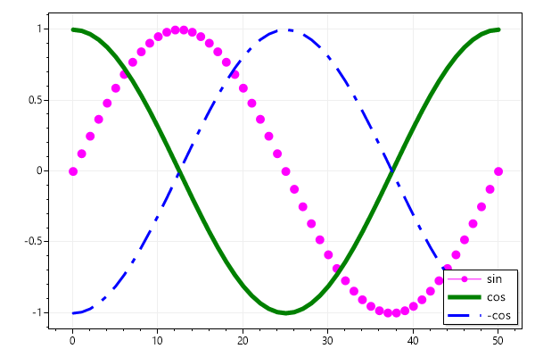


### PlotTypes: Scatter - Random X/Y Points


X data for scatter plots does not have to be evenly spaced, making scatter plots are ideal for displaying random data like this.


```cs
// Code from /src/ScottPlot.Demo/PlotTypes/Scatter.cs
var plt = new ScottPlot.Plot(600, 400);

Random rand = new Random(0);
int pointCount = 51;
double[] xs1 = DataGen.RandomNormal(rand, pointCount, 1);
double[] xs2 = DataGen.RandomNormal(rand, pointCount, 3);
double[] ys1 = DataGen.RandomNormal(rand, pointCount, 5);
double[] ys2 = DataGen.RandomNormal(rand, pointCount, 7);

plt.PlotScatter(xs1, ys1, markerSize: 0, label: "lines only");
plt.PlotScatter(xs2, ys2, lineWidth: 0, label: "markers only");
plt.Legend();

plt.SaveFig("PlotTypes_Scatter_RandomXY.png");
```


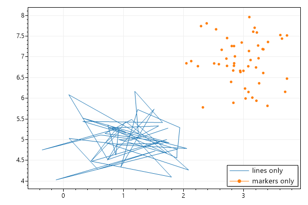


### PlotTypes: Scatter - Scatter Plot with Errorbars


X and Y error ranges can be supplied as optional double arrays


```cs
// Code from /src/ScottPlot.Demo/PlotTypes/Scatter.cs
var plt = new ScottPlot.Plot(600, 400);

Random rand = new Random(0);
int pointCount = 20;

for (int plotNumber = 0; plotNumber < 3; plotNumber++)
{
    // create random data to plot
    double[] dataX = new double[pointCount];
    double[] dataY = new double[pointCount];
    double[] errorY = new double[pointCount];
    double[] errorX = new double[pointCount];
    for (int i = 0; i < pointCount; i++)
    {
        dataX[i] = i + rand.NextDouble();
        dataY[i] = rand.NextDouble() * 100 + 100 * plotNumber;
        errorX[i] = rand.NextDouble();
        errorY[i] = rand.NextDouble() * 10;
    }

    // demonstrate different ways to plot errorbars
    if (plotNumber == 0)
        plt.PlotScatter(dataX, dataY, lineWidth: 0, errorY: errorY, errorX: errorX, label: $"X and Y errors");
    else if (plotNumber == 1)
        plt.PlotScatter(dataX, dataY, lineWidth: 0, errorY: errorY, label: $"Y errors only");
    else
        plt.PlotScatter(dataX, dataY, errorY: errorY, errorX: errorX, label: $"Connected Errors");
}

plt.SaveFig("PlotTypes_Scatter_ErrorBars.png");
```


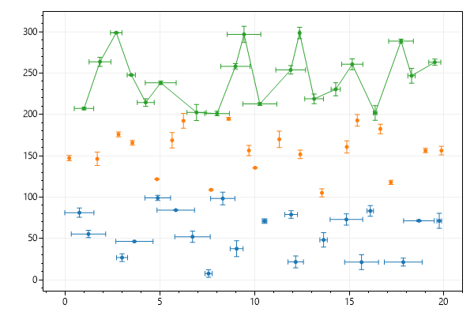


### PlotTypes: Scatter - Save scatter plot data


Many plot types have a .SaveCSV() method


```cs
// Code from /src/ScottPlot.Demo/PlotTypes/Scatter.cs
var plt = new ScottPlot.Plot(600, 400);

int pointCount = 51;
double[] dataXs = DataGen.Consecutive(pointCount);
double[] dataSin = DataGen.Sin(pointCount);

var scatter = plt.PlotScatter(dataXs, dataSin);
scatter.SaveCSV("scatter.csv");

plt.SaveFig("PlotTypes_Scatter_SaveData.png");
```


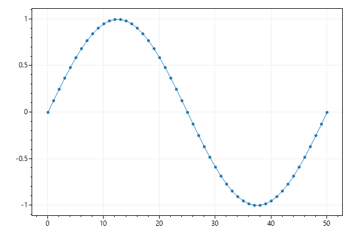


### PlotTypes: ScatterHighlight - Highlight Scatter Plot Quickstart


Allows higlighting points on a scatter plot


```cs
// Code from /src/ScottPlot.Demo/PlotTypes/ScatterHighlight.cs
var plt = new ScottPlot.Plot(600, 400);

int pointCount = 100;
Random rand = new Random(0);
double[] xs = DataGen.Consecutive(pointCount, 0.1);
double[] ys = DataGen.NoisySin(rand, pointCount);

// optional arguments customize highlighted point color, shape, and size
var sph = plt.PlotScatterHighlight(xs, ys);

// you can clear previously-highlighted points
sph.HighlightPoint(4);
sph.HighlightClear();

// highlight the point nearest an X (or Y) position
plt.PlotVLine(8.123, lineStyle: LineStyle.Dash);
sph.HighlightPointNearestX(8.123);

// or highlight the point nearest another point in 2D space
plt.PlotPoint(4.43, 1.48);
sph.HighlightPointNearest(4.43, 1.48);

plt.SaveFig("PlotTypes_ScatterHighlight_Quickstart.png");
```


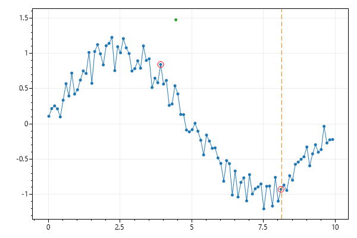


### PlotTypes: Signal - Signal Plot Quickstart


Signal plots are ideal for evenly-spaced data with thousands or millions of points.


```cs
// Code from /src/ScottPlot.Demo/PlotTypes/Signal.cs
var plt = new ScottPlot.Plot(600, 400);

double[] signalData = DataGen.RandomWalk(null, 100_000);
double sampleRateHz = 20000;

plt.Title($"Signal Plot ({signalData.Length.ToString("N0")} points)");
plt.PlotSignal(signalData, sampleRateHz);

plt.SaveFig("PlotTypes_Signal_Quickstart.png");
```


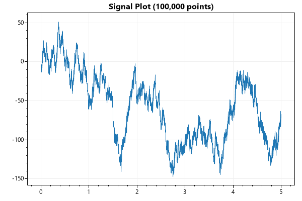


### PlotTypes: Signal - Styled Signal Plot


Signal plot with styled lines and markers


```cs
// Code from /src/ScottPlot.Demo/PlotTypes/Signal.cs
var plt = new ScottPlot.Plot(600, 400);

Random rand = new Random(0);
double[] ys = DataGen.RandomWalk(rand, 500);

plt.Title($"Styled Signal Plot");
plt.PlotSignal(ys, yOffset: 40, label: "default");
plt.PlotSignal(ys, yOffset: 20, label: "pink dashed",
    color: Color.Magenta, lineStyle: LineStyle.Dash);
plt.PlotSignal(ys, yOffset: 00, lineWidth: 3, label: "thick solid");
plt.Legend();

plt.SaveFig("PlotTypes_Signal_CustomLineAndMarkers.png");
```


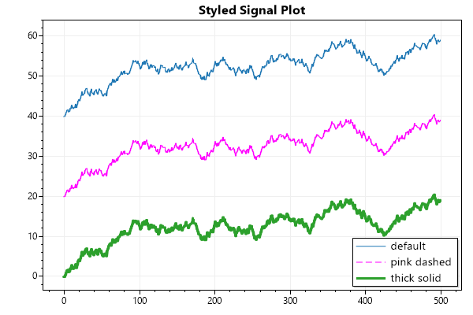


### PlotTypes: Signal - 5 Million Points


Signal plots with millions of points can be interacted with in real time.


```cs
// Code from /src/ScottPlot.Demo/PlotTypes/Signal.cs
var plt = new ScottPlot.Plot(600, 400);

Random rand = new Random(0);
int pointCount = 1_000_000;
int lineCount = 5;

for (int i = 0; i < lineCount; i++)
    plt.PlotSignal(DataGen.RandomWalk(rand, pointCount));

plt.SaveFig("PlotTypes_Signal_RandomWalk_5millionPoints_Signal.png");
```


### PlotTypes: Signal - Save signal plot data


Many plot types have a .SaveCSV() method


```cs
// Code from /src/ScottPlot.Demo/PlotTypes/Signal.cs
var plt = new ScottPlot.Plot(600, 400);

int pointCount = 51;
double[] dataSin = DataGen.Sin(pointCount);

var scatter = plt.PlotSignal(dataSin);
scatter.SaveCSV("signal.csv");

plt.SaveFig("PlotTypes_Signal_SaveData.png");
```


### PlotTypes: Signal - Display data density


When plotting extremely high density data, you can't always see the trends underneath all those overlapping data points. If you send an array of colors to PlotSignal(), it will use those colors to display density.


```cs
// Code from /src/ScottPlot.Demo/PlotTypes/Signal.cs
var plt = new ScottPlot.Plot(600, 400);

// create an extremely noisy signal with a subtle sine wave beneath it
Random rand = new Random(0);
int pointCount = 100_000;
double[] signal1 = ScottPlot.DataGen.Sin(pointCount, 3);
double[] noise = ScottPlot.DataGen.RandomNormal(rand, pointCount, 0, 5);
double[] data = new double[pointCount];
for (int i = 0; i < data.Length; i++)
    data[i] = signal1[i] + noise[i];

// plot the noisy signal using the traditional method
plt.PlotSignal(data, yOffset: -40, color: Color.Red);

// use a color array for displaying data from low to high density
Color[] colors = new Color[]
{
    ColorTranslator.FromHtml("#440154"),
    ColorTranslator.FromHtml("#39568C"),
    ColorTranslator.FromHtml("#1F968B"),
    ColorTranslator.FromHtml("#73D055"),
};

plt.PlotSignal(data, colorByDensity: colors);

plt.Title("Color by Density vs. Solid Color");
plt.AxisAuto(0, .1);

plt.SaveFig("PlotTypes_Signal_Density.png");
```


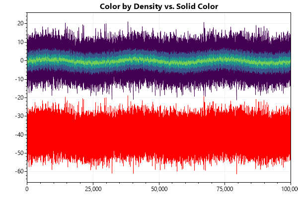


### PlotTypes: Signal - Display first N points


When plotting live data it is useful to allocate a large array in memory then fill it with values as they come in. By setting the maxRenderIndex property of a scatter plot to can prevent rendering the end of the array (which is probably filled with zeros).


```cs
// Code from /src/ScottPlot.Demo/PlotTypes/Signal.cs
var plt = new ScottPlot.Plot(600, 400);

// Allocate memory for a large number of data points
double[] data = new double[1_000_000]; // start with all zeros

// Only populate the first few points with real data
Random rand = new Random(0);
int lastValueIndex = 1234;
for (int i = 1; i <= lastValueIndex; i++)
    data[i] = data[i - 1] + rand.NextDouble() - .5;

// A regular Signal plot would display a little data at the start but mostly zeros.
// Using the maxRenderIndex argument allows one to just plot the first N data points.
var sig = plt.PlotSignal(data, maxRenderIndex: 500);
plt.Title("Partial Display of a 1,000,000 Element Array");
plt.YLabel("Value");
plt.XLabel("Array Index");

// you can change the points to plot later (useful for live plots of incoming data)
sig.maxRenderIndex = 1234;
plt.AxisAuto();

plt.SaveFig("PlotTypes_Signal_FirstNPoints.png");
```


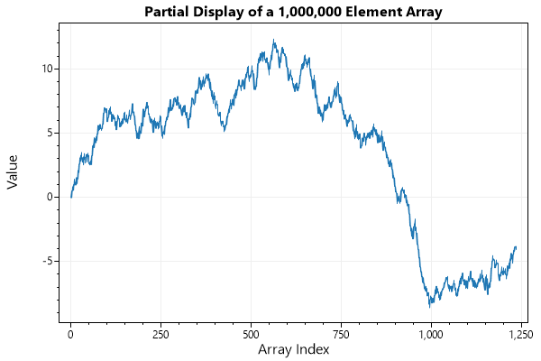


### PlotTypes: Signal - Plot a Range of Points


It is sometimes useful to only display values within a range of the source data array.


```cs
// Code from /src/ScottPlot.Demo/PlotTypes/Signal.cs
var plt = new ScottPlot.Plot(600, 400);

Random rand = new Random(0);
double[] data = DataGen.RandomWalk(rand, 100_000);

plt.PlotSignal(data, minRenderIndex: 4000, maxRenderIndex: 5000);

plt.Title($"Partial Display of a {data.Length} values");
plt.YLabel("Value");
plt.XLabel("Array Index");
plt.AxisAutoX(margin: 0);

plt.SaveFig("PlotTypes_Signal_PlotRange.png");
```


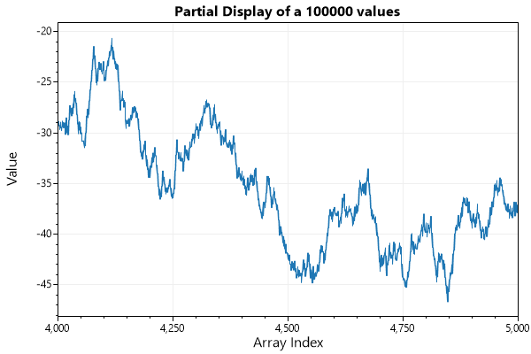


### PlotTypes: Signal - Fill Below


It is also possible to display values within a range and using the fill attribute.


```cs
// Code from /src/ScottPlot.Demo/PlotTypes/Signal.cs
var plt = new ScottPlot.Plot(600, 400);

Random rand = new Random(0);
double[] data = DataGen.RandomWalk(rand, 10_000);

var sig = plt.PlotSignal(data);
sig.minRenderIndex = 4000;
sig.maxRenderIndex = 5000;
sig.fillType = FillType.FillBelow;
sig.fillColor1 = Color.Blue;

plt.Title($"Partial Display of a {data.Length} values using fill");
plt.YLabel("Value");
plt.XLabel("Array Index");
plt.AxisAutoX(margin: 0);

plt.SaveFig("PlotTypes_Signal_PlotFillRange.png");
```


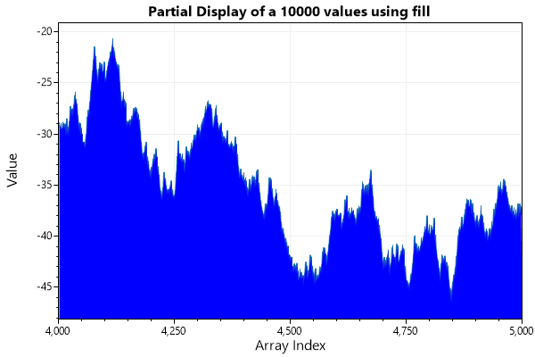


### PlotTypes: Signal - Gradient Fill Below


Plotting a range of values using gradient fill below graph.


```cs
// Code from /src/ScottPlot.Demo/PlotTypes/Signal.cs
var plt = new ScottPlot.Plot(600, 400);

Random rand = new Random(0);
double[] data = DataGen.RandomWalk(rand, 100_000);

var sig = plt.PlotSignal(data);
sig.minRenderIndex = 4000;
sig.maxRenderIndex = 5000;
sig.fillType = FillType.FillBelow;
sig.fillColor1 = Color.Blue;
sig.gradientFillColor1 = Color.Transparent;

plt.Title($"Partial Display of a {data.Length} values using gradient fill below");
plt.YLabel("Value");
plt.XLabel("Array Index");
plt.AxisAutoX(margin: 0);

plt.SaveFig("PlotTypes_Signal_PlotGradientFillRange.png");
```


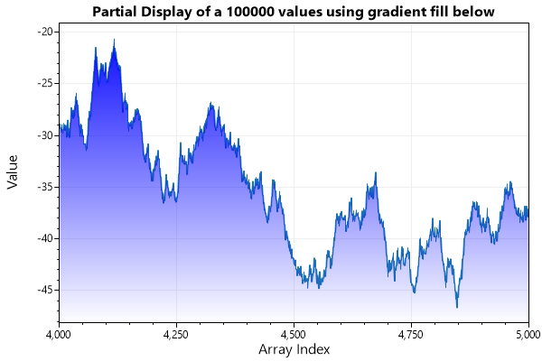


### PlotTypes: Signal - Gradient Fill Above


Plotting a range of values using gradient fill above graph.


```cs
// Code from /src/ScottPlot.Demo/PlotTypes/Signal.cs
var plt = new ScottPlot.Plot(600, 400);

Random rand = new Random(0);
double[] data = DataGen.RandomWalk(rand, 100_000);
var sig = plt.PlotSignal(data);
sig.minRenderIndex = 4000;
sig.maxRenderIndex = 5000;
sig.fillType = FillType.FillAbove;
sig.fillColor1 = Color.Blue;
sig.gradientFillColor1 = Color.Transparent;
plt.Title($"Partial Display of a {data.Length} values using gradient fill above");
plt.YLabel("Value");
plt.XLabel("Array Index");
plt.AxisAutoX(margin: 0);

plt.SaveFig("PlotTypes_Signal_PlotGradientFillAboveRange.png");
```


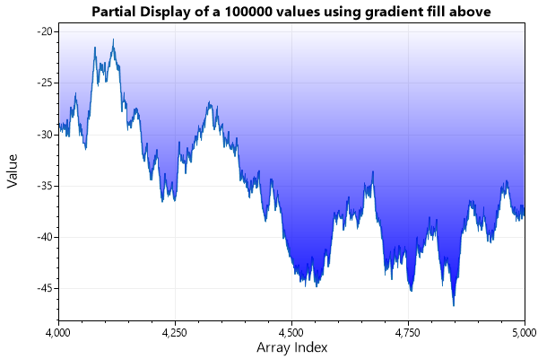


### PlotTypes: Signal - Fill Above and Below


Plotting a range of values using fill above and below.


```cs
// Code from /src/ScottPlot.Demo/PlotTypes/Signal.cs
var plt = new ScottPlot.Plot(600, 400);

Random rand = new Random(0);
double[] data = DataGen.RandomWalk(rand, 100_000);

var sig = plt.PlotSignal(data);
sig.minRenderIndex = 4000;
sig.maxRenderIndex = 5000;
sig.fillType = FillType.FillAboveAndBelow;
sig.fillColor1 = Color.Green;
sig.gradientFillColor1 = Color.Green;
sig.fillColor2 = Color.Red;
sig.gradientFillColor2 = Color.Red;
sig.baseline = -35;

plt.Title($"Partial Display of a {data.Length} values using fill above and below");
plt.YLabel("Value");
plt.XLabel("Array Index");
plt.AxisAutoX(margin: 0);

plt.SaveFig("PlotTypes_Signal_PlotFillAboveAndBelowRange.png");
```


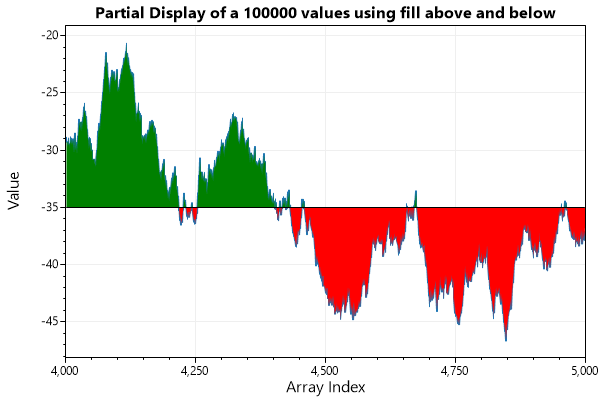


### PlotTypes: Signal - Gradient Fill Above and Below


Plotting a range of values using gradient fill above and below.


```cs
// Code from /src/ScottPlot.Demo/PlotTypes/Signal.cs
var plt = new ScottPlot.Plot(600, 400);

Random rand = new Random(0);
double[] data = DataGen.RandomWalk(rand, 100_000);

plt.Style(Style.Gray1);
plt.Colorset(Colorset.OneHalfDark);

var sig = plt.PlotSignal(data);
sig.minRenderIndex = 4000;
sig.maxRenderIndex = 5000;
sig.markerSize = 0;
sig.color = Color.Black;
sig.fillType = FillType.FillAboveAndBelow;
sig.fillColor1 = Color.FromArgb(255, 44, 160, 44); // Green
sig.gradientFillColor1 = Color.Transparent;
sig.fillColor2 = Color.FromArgb(255, 214, 39, 40); // Red
sig.gradientFillColor2 = Color.Transparent;
sig.baseline = -35;

plt.Title($"Partial Display of a {data.Length} values using gradient fill above and below");
plt.YLabel("Value");
plt.XLabel("Array Index");
plt.AxisAutoX(margin: 0);

plt.SaveFig("PlotTypes_Signal_PlotGradientFillAboveAndBelowRange.png");
```


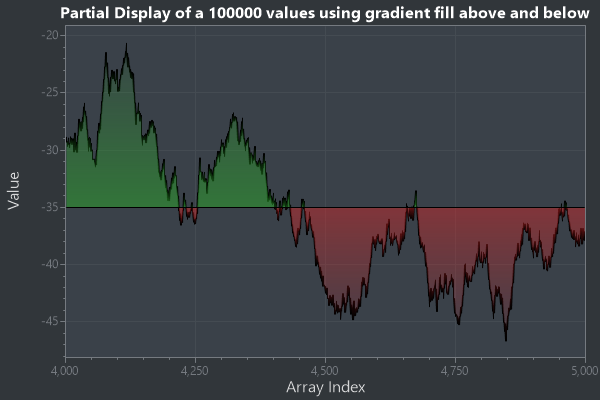


### PlotTypes: SignalConst - 5 Million Points


SignalConst plots pre-processes data to render much faster than Signal plots. Pre-processing takes a little time up-front and requires 4x the memory of Signal.


```cs
// Code from /src/ScottPlot.Demo/PlotTypes/SignalConst.cs
var plt = new ScottPlot.Plot(600, 400);

Random rand = new Random(0);
int pointCount = 1_000_000;
int lineCount = 5;

for (int i = 0; i < lineCount; i++)
    plt.PlotSignalConst(DataGen.RandomWalk(rand, pointCount));

plt.SaveFig("PlotTypes_SignalConst_RandomWalk_5millionPoints_SignalConst.png");
```


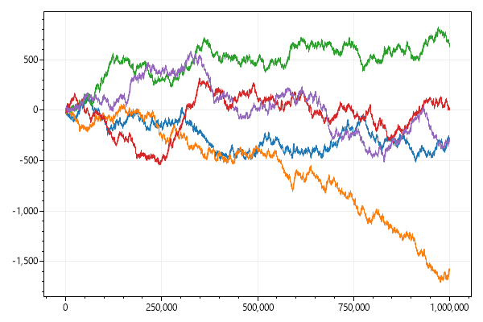


### PlotTypes: SignalConst - Gradient Fill Above and Below


Plot a range of values using gradient fill above and below.


```cs
// Code from /src/ScottPlot.Demo/PlotTypes/SignalConst.cs
var plt = new ScottPlot.Plot(600, 400);

Random rand = new Random(0);
double[] data = DataGen.RandomWalk(rand, 100_000);

plt.Style(Style.Gray1);
plt.Colorset(Colorset.OneHalfDark);

var sig = plt.PlotSignalConst(data);
sig.minRenderIndex = 4000;
sig.maxRenderIndex = 5000;
sig.markerSize = 0;
sig.color = Color.Black;
sig.fillType = FillType.FillAboveAndBelow;
sig.fillColor1 = Color.FromArgb(255, 44, 160, 44); // Green
sig.gradientFillColor1 = Color.Transparent;
sig.fillColor2 = Color.FromArgb(255, 214, 39, 40); // Red
sig.gradientFillColor2 = Color.Transparent;
sig.baseline = -35;

plt.Title($"SignalConst displaying {data.Length} values");
plt.YLabel("Value");
plt.XLabel("Array Index");
plt.AxisAutoX(margin: 0);

plt.SaveFig("PlotTypes_SignalConst_PlotGradientFillAboveAndBelowRange.png");
```


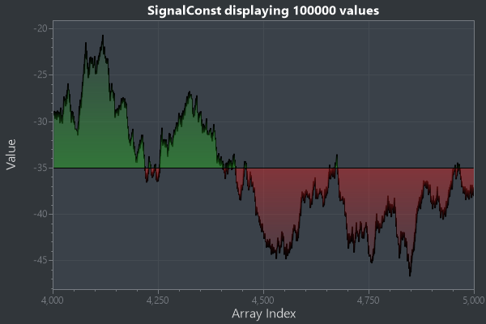


### PlotTypes: SignalXY - Signal with X and Y data


SignalXY is a speed-optimized plot for displaying vaues (Ys) with unevenly-spaced positions (Xs) that are in ascending order. If your data is evenly-spaced, Signal and SignalConst is faster.


```cs
// Code from /src/ScottPlot.Demo/PlotTypes/SignalXY.cs
var plt = new ScottPlot.Plot(600, 400);

// generate random, unevenly-spaced data
Random rand = new Random(0);
int pointCount = 100_000;
double[] ys = new double[pointCount];
double[] xs = new double[pointCount];
for (int i = 1; i < ys.Length; i++)
{
    ys[i] = ys[i - 1] + rand.NextDouble() - .5;
    xs[i] = xs[i - 1] + rand.NextDouble();
}

plt.Title($"SignalXY Plot ({pointCount:N0} points)");
plt.PlotSignalXY(xs, ys);

plt.SaveFig("PlotTypes_SignalXY_Quickstart.png");
```


### PlotTypes: SignalXY - Big Gaps


Signal with defined Xs that contain gaps


```cs
// Code from /src/ScottPlot.Demo/PlotTypes/SignalXY.cs
var plt = new ScottPlot.Plot(600, 400);

Random rand = new Random(0);
int pointCount = 1_000_000;

double[] sine = ScottPlot.DataGen.Sin(pointCount, 3);
double[] noise = ScottPlot.DataGen.RandomNormal(rand, pointCount, 0, 0.5);

double[] ys = sine.Zip(noise, (s, n) => s + n).ToArray();

double[] xs = Enumerable.Range(0, pointCount)
    .Select(x => (double)x)
    .Select(x => x > 500_000 ? x + 1_000_000 : x)
    .Select(x => x > 200_000 ? x + 100_000 : x)
    .ToArray();

plt.PlotSignalXY(xs, ys);

plt.SaveFig("PlotTypes_SignalXY_HasXGaps.png");
```


### PlotTypes: SignalXY - Different Densities


Signal with mised low and high density data


```cs
// Code from /src/ScottPlot.Demo/PlotTypes/SignalXY.cs
var plt = new ScottPlot.Plot(600, 400);

Random rand = new Random(0);
int pointCount = 1_000_000;

double[] sine = ScottPlot.DataGen.Sin(pointCount, 3);
double[] noise = ScottPlot.DataGen.RandomNormal(rand, pointCount, 0, 0.5);

double[] ys = sine.Zip(noise, (s, n) => s + n).ToArray();

double[] xs = new double[pointCount];
double currentX = 0;
for (int i = 0; i < pointCount; i++)
{
    if ((i % 100000) < 10)
        currentX += 10;
    else
        currentX += 0.0001;
    xs[i] = currentX;
}
plt.PlotSignalXY(xs, ys);

plt.SaveFig("PlotTypes_SignalXY_SignalWithDifferentDensity.png");
```


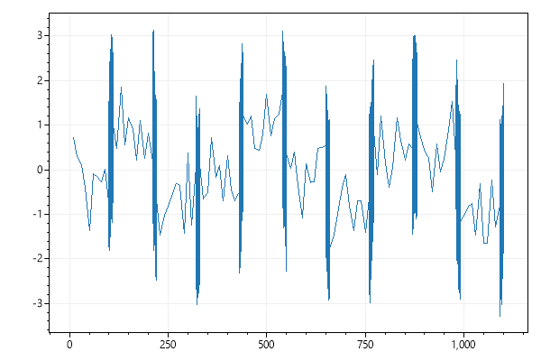


### PlotTypes: SignalXYConst - SignalConst with X and Y data


SignalXYConst is a speed-optimized plot for displaying vaues (Ys) with unevenly-spaced positions (Xs) that are in ascending order. If your data is evenly-spaced, Signal and SignalConst is faster.


```cs
// Code from /src/ScottPlot.Demo/PlotTypes/SignalXYConst.cs
var plt = new ScottPlot.Plot(600, 400);

// generate random, unevenly-spaced data
Random rand = new Random(0);
int pointCount = 100_000;
double[] ys = new double[pointCount];
double[] xs = new double[pointCount];
for (int i = 1; i < ys.Length; i++)
{
    ys[i] = ys[i - 1] + rand.NextDouble() - .5;
    xs[i] = xs[i - 1] + rand.NextDouble();
}

plt.Title($"SignalXY Plot ({pointCount:N0} points)");
plt.PlotSignalXYConst(xs, ys);

plt.SaveFig("PlotTypes_SignalXYConst_Quickstart.png");
```


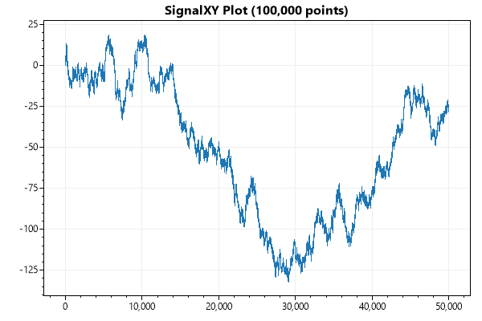


### PlotTypes: SignalXYConst - Different data types for xs and ys


SignalXYConst with (int)Xs and (float)Ys arrays


```cs
// Code from /src/ScottPlot.Demo/PlotTypes/SignalXYConst.cs
var plt = new ScottPlot.Plot(600, 400);

Random rand = new Random(0);
int pointCount = 1_000_000;

double[] sine = ScottPlot.DataGen.Sin(pointCount, 3);
double[] noise = ScottPlot.DataGen.RandomNormal(rand, pointCount, 0, 0.5);

float[] ys = sine.Zip(noise, (s, n) => s + n).Select(x => (float)x).ToArray();

int[] xs = Enumerable.Range(0, pointCount)
    .Select(x => (int)x)
    .Select(x => x > 500_000 ? x + 1_000_000 : x)
    .Select(x => x > 200_000 ? x + 100_000 : x)
    .ToArray();

plt.PlotSignalXYConst(xs, ys);

plt.SaveFig("PlotTypes_SignalXYConst_MixedDataTypes.png");
```


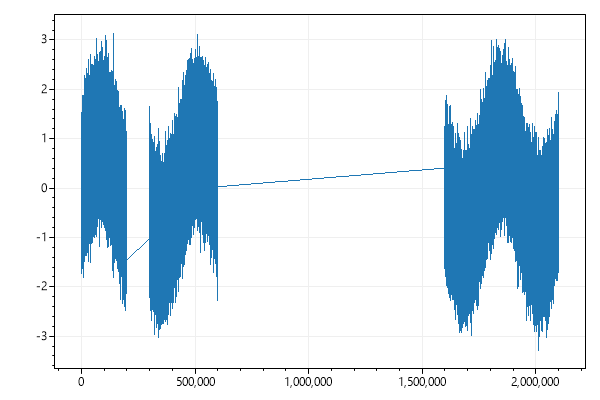


### PlotTypes: Step - Step Plot Quickstart


Step plots are really just scatter plots whose points are connected by elbows rather than straight lines.


```cs
// Code from /src/ScottPlot.Demo/PlotTypes/Step.cs
var plt = new ScottPlot.Plot(600, 400);

int pointCount = 51;
double[] x = DataGen.Consecutive(pointCount);
double[] sin = DataGen.Sin(pointCount);
double[] cos = DataGen.Cos(pointCount);

plt.PlotStep(x, sin);
plt.PlotStep(x, cos);

plt.SaveFig("PlotTypes_Step_Quickstart.png");
```


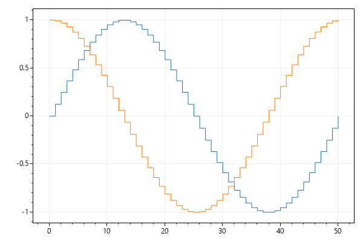


### PlotTypes: Text - Text Quickstart


Text can be placed at any X/Y location and styled using arguments.


```cs
// Code from /src/ScottPlot.Demo/PlotTypes/Text.cs
var plt = new ScottPlot.Plot(600, 400);

int pointCount = 51;
double[] x = DataGen.Consecutive(pointCount);
double[] sin = DataGen.Sin(pointCount);
double[] cos = DataGen.Cos(pointCount);

plt.PlotScatter(x, sin);
plt.PlotScatter(x, cos);

plt.PlotText("demo text", 10, .5, fontName: "comic sans ms", fontSize: 42, color: Color.Magenta, bold: true);

plt.SaveFig("PlotTypes_Text_Quickstart.png");
```


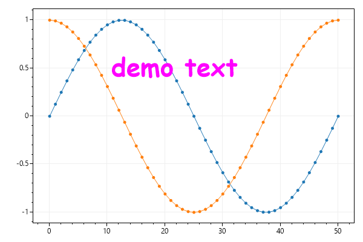


### PlotTypes: Text - Text Alignment


Text alignment and rotation can be customized using arguments.


```cs
// Code from /src/ScottPlot.Demo/PlotTypes/Text.cs
var plt = new ScottPlot.Plot(600, 400);

int pointCount = 51;
double[] x = DataGen.Consecutive(pointCount);
double[] sin = DataGen.Sin(pointCount);
double[] cos = DataGen.Cos(pointCount);

plt.PlotScatter(x, sin);
plt.PlotScatter(x, cos);

plt.PlotPoint(25, 0.8, color: Color.Green);
plt.PlotText(" important point", 25, 0.8, color: Color.Green);

plt.PlotPoint(30, 0.3, color: Color.Black, markerSize: 15);
plt.PlotText(" default alignment", 30, 0.3, fontSize: 16, bold: true, color: Color.Magenta);

plt.PlotPoint(30, 0, color: Color.Black, markerSize: 15);
plt.PlotText("middle center", 30, 0, fontSize: 16, bold: true, color: Color.Magenta, alignment: TextAlignment.middleCenter);

plt.PlotPoint(30, -0.3, color: Color.Black, markerSize: 15);
plt.PlotText("upper left", 30, -0.3, fontSize: 16, bold: true, color: Color.Magenta, alignment: TextAlignment.upperLeft);

plt.PlotPoint(5, -.5, color: Color.Blue, markerSize: 15);
plt.PlotText(" Rotated Text", 5, -.5, fontSize: 16, color: Color.Blue, bold: true, rotation: -30);

plt.PlotText("Framed Text", 15, -.6, fontSize: 16, color: Color.White, bold: true, frame: true, frameColor: Color.DarkRed);

plt.SaveFig("PlotTypes_Text_Alignment.png");
```


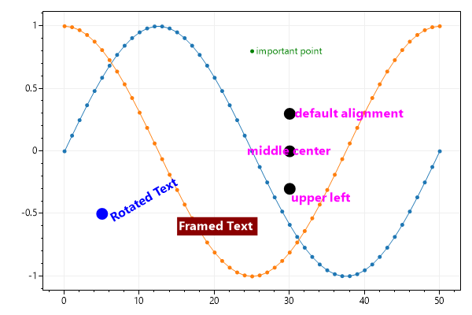


### PlotTypes: VectorField - Quickstart


A vector field can be useful to show data explained by differential equations


```cs
// Code from /src/ScottPlot.Demo/PlotTypes/VectorField.cs
var plt = new ScottPlot.Plot(600, 400);

double[] xPositions = DataGen.Range(0, 10);
double[] yPositions = DataGen.Range(0, 10);
Vector2[,] vectors = new Vector2[xPositions.Length, yPositions.Length];

for (int x = 0; x < xPositions.Length; x++)
    for (int y = 0; y < yPositions.Length; y++)
        vectors[x, y] = new Vector2(
            x: Math.Sin(xPositions[x]),
            y: Math.Sin(yPositions[y]));

plt.PlotVectorField(vectors, xPositions, yPositions);

plt.SaveFig("PlotTypes_VectorField_Quickstart.png");
```


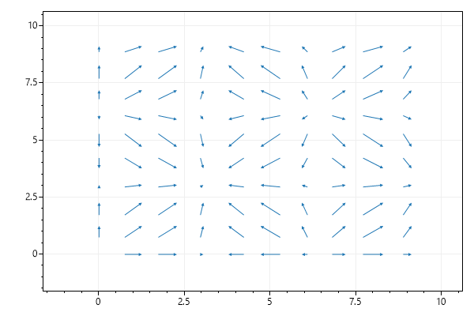


### PlotTypes: VectorField - Angle and Magnitude


This example demonstrates how to define vectors according to a given angle and magnitude.


```cs
// Code from /src/ScottPlot.Demo/PlotTypes/VectorField.cs
var plt = new ScottPlot.Plot(600, 400);

double[] xs = DataGen.Range(-5, 6);
double[] ys = DataGen.Range(-5, 6);
Vector2[,] vectors = new Vector2[xs.Length, ys.Length];

for (int i = 0; i < xs.Length; i++)
{
    for (int j = 0; j < ys.Length; j++)
    {
        double slope = -xs[i];
        double magnitude = Math.Abs(xs[i]);
        double angle = Math.Atan(slope);

        vectors[i, j] = new Vector2(Math.Cos(angle) * magnitude, Math.Sin(angle) * magnitude);
    }
}

plt.PlotVectorField(vectors, xs, ys);

plt.SaveFig("PlotTypes_VectorField_WithChangeingMagnitude.png");
```


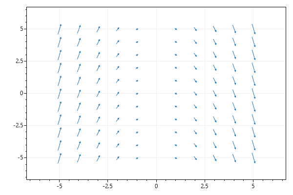


### PlotTypes: VectorField - Custom Colormap


A colormap can be supplied to color arrows according to their magnitude


```cs
// Code from /src/ScottPlot.Demo/PlotTypes/VectorField.cs
var plt = new ScottPlot.Plot(600, 400);

double[] xs = DataGen.Range(-5, 5, .5);
double[] ys = DataGen.Range(-5, 5, .5);
Vector2[,] vectors = new Vector2[xs.Length, ys.Length];
double r = 0.5;

for (int i = 0; i < xs.Length; i++)
{
    for (int j = 0; j < ys.Length; j++)
    {
        double x = ys[j];
        double y = -9.81 / r * Math.Sin(xs[i]);

        vectors[i, j] = new Vector2(x, y);
    }
}

plt.PlotVectorField(vectors, xs, ys, colormap: Drawing.Colormap.Turbo);
plt.XLabel("θ");
plt.YLabel("dθ/dt");

plt.SaveFig("PlotTypes_VectorField_Pendulum.png");
```


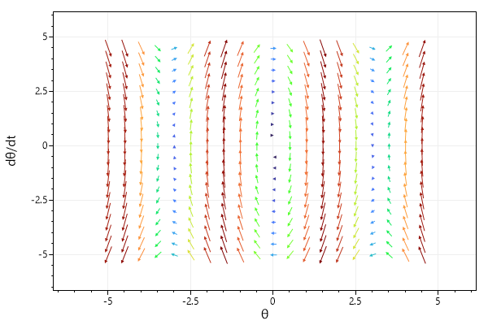


### PlotTypes: VectorField - Custom Scale Factor


A custom scale factor can adjust the length of the arrows.


```cs
// Code from /src/ScottPlot.Demo/PlotTypes/VectorField.cs
var plt = new ScottPlot.Plot(600, 400);

double[] xs = DataGen.Range(-1.5, 1.5, .25);
double[] ys = DataGen.Range(-1.5, 1.5, .25);
Vector2[,] vectors = new Vector2[xs.Length, ys.Length];

for (int i = 0; i < xs.Length; i++)
{
    for (int j = 0; j < ys.Length; j++)
    {
        double x = xs[i];
        double y = ys[j];
        var e = Math.Exp(-x * x - y * y);
        var dx = (1 - 2 * x * x) * e;
        var dy = -2 * x * y * e;

        vectors[i, j] = new Vector2(dx, dy);
    }
}

plt.PlotVectorField(vectors, xs, ys, scaleFactor: 0.3);

plt.SaveFig("PlotTypes_VectorField_CustomScaleFactor.png");
```


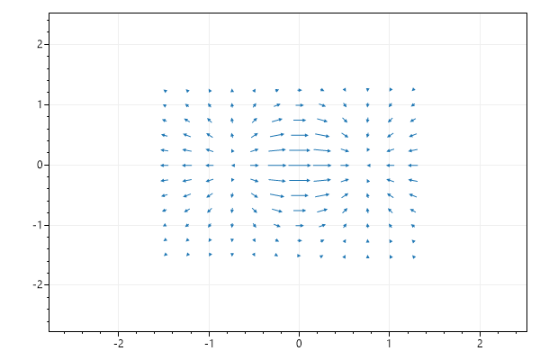


## Customize


### Customize: Axis - Title and Axis Labels


Title and axis labels can be defined and custoized using arguments.


```cs
// Code from /src/ScottPlot.Demo/Customize/Axis.cs
var plt = new ScottPlot.Plot(600, 400);

int pointCount = 51;
double[] x = DataGen.Consecutive(pointCount);
double[] sin = DataGen.Sin(pointCount);
double[] cos = DataGen.Cos(pointCount);

plt.PlotScatter(x, sin);
plt.PlotScatter(x, cos);

plt.Title("Plot Title");
plt.XLabel("Horizontal Axis");
plt.YLabel("Vertical Axis");

plt.SaveFig("Customize_Axis_AxisLabels.png");
```


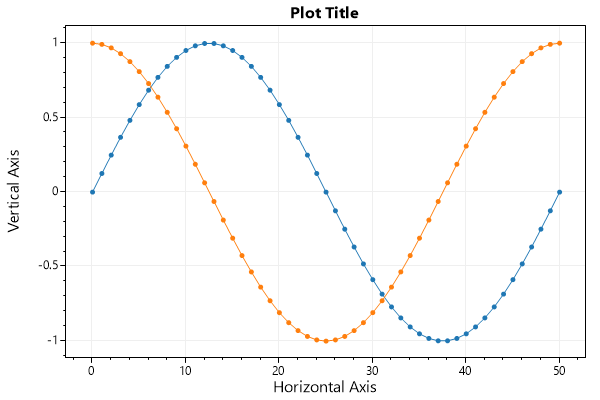


### Customize: Axis - Ruler Mode


Ruler mode is an alternative way to display axis tick labels


```cs
// Code from /src/ScottPlot.Demo/Customize/Axis.cs
var plt = new ScottPlot.Plot(600, 400);

int pointCount = 51;
double[] x = DataGen.Consecutive(pointCount);
double[] sin = DataGen.Sin(pointCount);
double[] cos = DataGen.Cos(pointCount);

plt.PlotScatter(x, sin);
plt.PlotScatter(x, cos);

plt.Ticks(rulerModeX: true, rulerModeY: true);

plt.SaveFig("Customize_Axis_RulerMode.png");
```


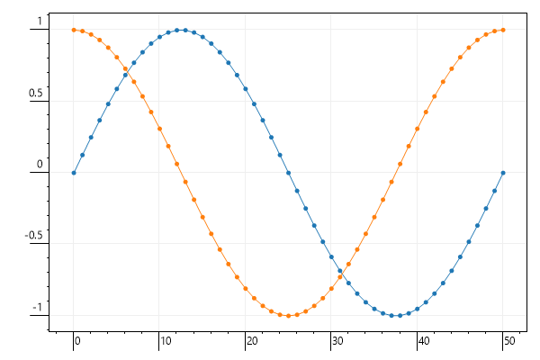


### Customize: Axis - Ruler Mode (X only)


Display a ruler on just one axis


```cs
// Code from /src/ScottPlot.Demo/Customize/Axis.cs
var plt = new ScottPlot.Plot(600, 400);

int pointCount = 51;
double[] x = DataGen.Consecutive(pointCount);
double[] sin = DataGen.Sin(pointCount);
double[] cos = DataGen.Cos(pointCount);

plt.PlotScatter(x, sin);
plt.PlotScatter(x, cos);

plt.Ticks(rulerModeX: true, displayTicksY: false);
plt.Frame(left: false, right: false, top: false);
plt.TightenLayout(padding: 0, render: true);

plt.SaveFig("Customize_Axis_RulerModeXOnly.png");
```


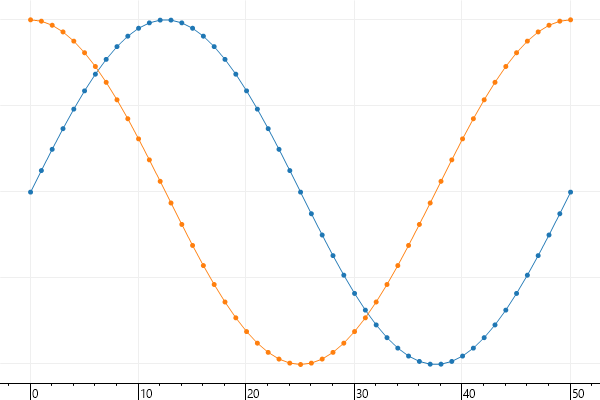


### Customize: Axis - Log Axis


ScottPlot can only display data on a linear 2D plane, however you can log-transform your data before plotting it to give the appearance of log scales. Customizing tick options for log-spaced minor ticks further improves appearance of these graphs.


```cs
// Code from /src/ScottPlot.Demo/Customize/Axis.cs
var plt = new ScottPlot.Plot(600, 400);

// generate some interesting log-distributed data
int pointCount = 200;
double[] dataXs = new double[pointCount];
double[] dataYs = new double[pointCount];
Random rand = new Random(0);
for (int i = 0; i < pointCount; i++)
{
    double x = 10.0 * i / pointCount;
    dataXs[i] = x;
    dataYs[i] = Math.Pow(2, x) + rand.NextDouble() * i;
}

// this tool can convert linear data to log data
double[] dataYsLog = ScottPlot.Tools.Log10(dataYs);
plt.PlotScatter(dataXs, dataYsLog, lineWidth: 0);

// call this to move minor ticks to simulate a log scale
plt.Ticks(logScaleY: true);

plt.Title("Data (Log Scale)");
plt.YLabel("Vertical Units (10^x)");
plt.XLabel("Horizontal Units");

plt.SaveFig("Customize_Axis_LogAxis.png");
```


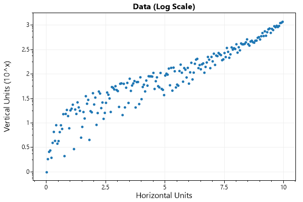


### Customize: Axis - Polar Axis


A helper function converts radius and theta arrays into Cartesian coordinates suitable for plotting with traditioanl plot types.


```cs
// Code from /src/ScottPlot.Demo/Customize/Axis.cs
var plt = new ScottPlot.Plot(600, 400);

// create some data with polar coordinates
int count = 400;
double step = 0.01;

double[] rs = new double[count];
double[] thetas = new double[count];

for (int i = 0; i < rs.Length; i++)
{
    rs[i] = 1 + i * step;
    thetas[i] = i * 2 * Math.PI * step;
}

// convert polar data to Cartesian data
(double[] xs, double[] ys) = ScottPlot.Tools.ConvertPolarCoordinates(rs, thetas);

// plot the Cartesian data
plt.PlotScatter(xs, ys);
plt.Title("Scatter Plot of Polar Data");
plt.EqualAxis = true;

plt.SaveFig("Customize_Axis_PolarAxis.png");
```


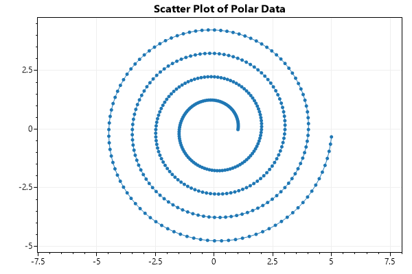


### Customize: Axis - DateTime Axis


Axis tick labels can show DateTime format if DateTime.ToOADate() was used to plot the data


```cs
// Code from /src/ScottPlot.Demo/Customize/Axis.cs
var plt = new ScottPlot.Plot(600, 400);

Random rand = new Random(0);
double[] ys = DataGen.RandomWalk(rand, 100);
double[] xs = new double[ys.Length];

DateTime dtStart = new DateTime(1985, 9, 24);
for (int i = 0; i < ys.Length; i++)
{
    DateTime dtNow = dtStart.AddSeconds(i);
    xs[i] = dtNow.ToOADate();
}

plt.PlotScatter(xs, ys);
plt.Ticks(dateTimeX: true);
plt.Title("DateTime Axis Labels");

plt.SaveFig("Customize_Axis_DateTimeAxis.png");
```


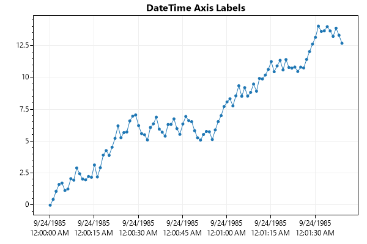


### Customize: Axis - Time Only


Typically DateTime tick labels show date and time, but by defining the format yourself you can customize this behavior.


```cs
// Code from /src/ScottPlot.Demo/Customize/Axis.cs
var plt = new ScottPlot.Plot(600, 400);

Random rand = new Random(0);
double[] ys = DataGen.RandomWalk(rand, 50);
double[] xs = new double[ys.Length];

DateTime start = new DateTime(1985, 9, 24);
for (int i = 0; i < ys.Length; i++)
{
    DateTime dtNow = start.AddMinutes(i * 15);
    xs[i] = dtNow.ToOADate();
}

plt.PlotScatter(xs, ys);
plt.Ticks(dateTimeX: true, dateTimeFormatStringX: "HH:mm:ss");
plt.Title("Time Axis Labels");

plt.SaveFig("Customize_Axis_TimeOnly.png");
```


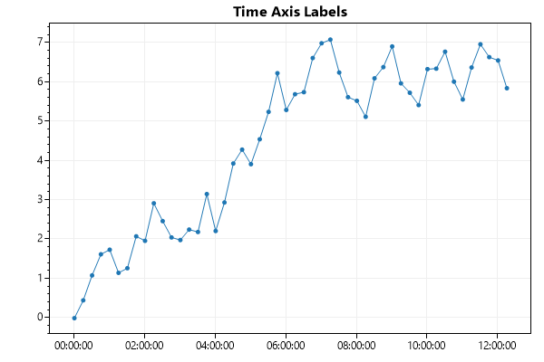


### Customize: Axis - Time Code Axis


Axis tick labels show HH:MM:SS.SSS timecodes (useful for audio and video editing)


```cs
// Code from /src/ScottPlot.Demo/Customize/Axis.cs
var plt = new ScottPlot.Plot(600, 400);

// simulate 10 seconds of audio data
int pointsPerSecond = 44100;
Random rand = new Random(0);
double[] ys = DataGen.RandomWalk(rand, pointsPerSecond * 10);

// For DateTime compatibility, sample rate must be points/day.
// Also, avoid negative dates by offsetting the plot by today's date.
double secondsPerDay = 24 * 60 * 60;
double pointsPerDay = secondsPerDay * pointsPerSecond;
double today = DateTime.Today.ToOADate();

plt.PlotSignal(ys, sampleRate: pointsPerDay, xOffset: today);
plt.Ticks(dateTimeX: true, dateTimeFormatStringX: "HH:mm:ss.fff");

plt.SaveFig("Customize_Axis_TimeCodeAxis.png");
```


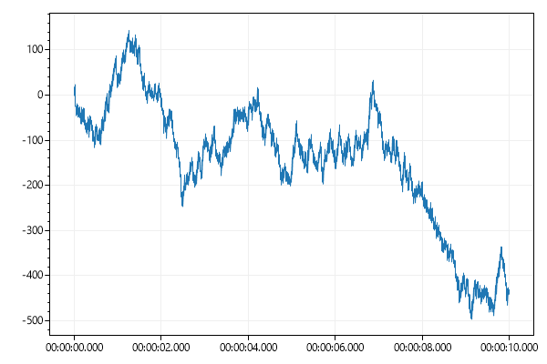


### Customize: Axis - Hexadecimal Axis


Axis tick labels can be in any base, not just base 10


```cs
// Code from /src/ScottPlot.Demo/Customize/Axis.cs
var plt = new ScottPlot.Plot(600, 400);

// create some sample data
double[] xs = { 0 };
double[] valuesA = { 0x40000000 };
double[] valuesB = { 0x40100000 };
double[] valuesC = { 0xA0000000 };

// to simulate stacking B on A, shift B up by A
double[] valuesB2 = new double[valuesB.Length];
double[] valuesC2 = new double[valuesC.Length];
for (int i = 0; i < valuesB.Length; i++)
{
    valuesB2[i] = valuesA[i] + valuesB[i];
    valuesC2[i] = valuesC[i] + valuesB2[i];
}

// plot the bar charts in reverse order (highest first)
plt.PlotBar(xs, valuesC2, label: "Process C");
plt.PlotBar(xs, valuesB2, label: "Process B");
plt.PlotBar(xs, valuesA, label: "Process A");

// configure ticks for base 16 Y-axis
plt.Ticks(baseY: 16, prefixY: "0x");
plt.Axis(-1, 1, 0, 0x1A0000000);

// further customize the plot
plt.Ticks(displayTicksX: false, displayTicksY: true);
plt.Title("Memory Consumption");
plt.YLabel("Memory (Bytes)");
plt.Legend();

plt.SaveFig("Customize_Axis_HexadecimalAxis.png");
```


### Customize: AxisLimits - Automatically fit to data


Automatically adjust axis limits to fit data. By default the data is slightly padded with extra space.


```cs
// Code from /src/ScottPlot.Demo/Customize/AxisLimits.cs
var plt = new ScottPlot.Plot(600, 400);

int pointCount = 51;
double[] x = DataGen.Consecutive(pointCount);
double[] sin = DataGen.Sin(pointCount);
double[] cos = DataGen.Cos(pointCount);

plt.PlotScatter(x, sin);
plt.PlotScatter(x, cos);

plt.AxisAuto();

plt.SaveFig("Customize_AxisLimits_Auto.png");
```


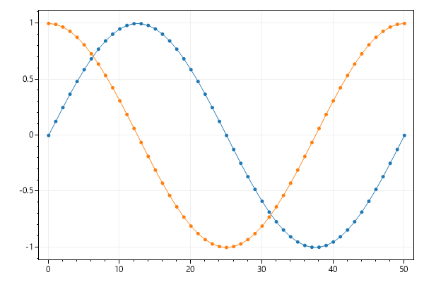


### Customize: AxisLimits - Automatic fit with specified margin


AxisAuto() arguments allow the user to define the amount of padding (margin) for each axis. Setting the margin to 0 will adjust the plot axis limits to tightly fit the data.


```cs
// Code from /src/ScottPlot.Demo/Customize/AxisLimits.cs
var plt = new ScottPlot.Plot(600, 400);

int pointCount = 51;
double[] x = DataGen.Consecutive(pointCount);
double[] sin = DataGen.Sin(pointCount);
double[] cos = DataGen.Cos(pointCount);

plt.PlotScatter(x, sin);
plt.PlotScatter(x, cos);

plt.AxisAuto(horizontalMargin: 0, verticalMargin: 0.5);

plt.SaveFig("Customize_AxisLimits_AutoMargin.png");
```


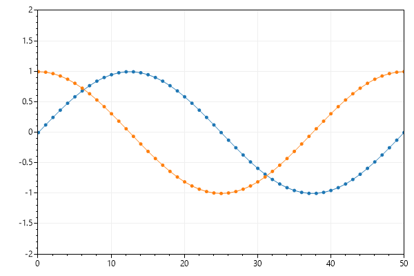


### Customize: AxisLimits - Manually define axis limits


The user can manually define axis limits. If a null is passed in, that axis limit is not adjusted.


```cs
// Code from /src/ScottPlot.Demo/Customize/AxisLimits.cs
var plt = new ScottPlot.Plot(600, 400);

int pointCount = 51;
double[] x = DataGen.Consecutive(pointCount);
double[] sin = DataGen.Sin(pointCount);
double[] cos = DataGen.Cos(pointCount);

plt.PlotScatter(x, sin);
plt.PlotScatter(x, cos);

plt.Axis(-10, 60, -3, 3);

plt.SaveFig("Customize_AxisLimits_Manual.png");
```


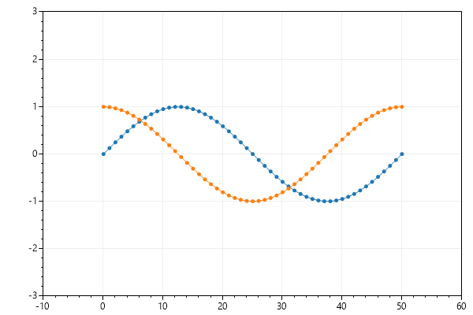


### Customize: AxisLimits - Zoom


The user can easily zoom and zoom by providing a fractional zoom amount. Numbers >1 zoom in while numbers <1 zoom out.


```cs
// Code from /src/ScottPlot.Demo/Customize/AxisLimits.cs
var plt = new ScottPlot.Plot(600, 400);

int pointCount = 51;
double[] x = DataGen.Consecutive(pointCount);
double[] sin = DataGen.Sin(pointCount);
double[] cos = DataGen.Cos(pointCount);

plt.PlotScatter(x, sin);
plt.PlotScatter(x, cos);

plt.AxisZoom(1.5, 1.5);

plt.SaveFig("Customize_AxisLimits_Zoom.png");
```


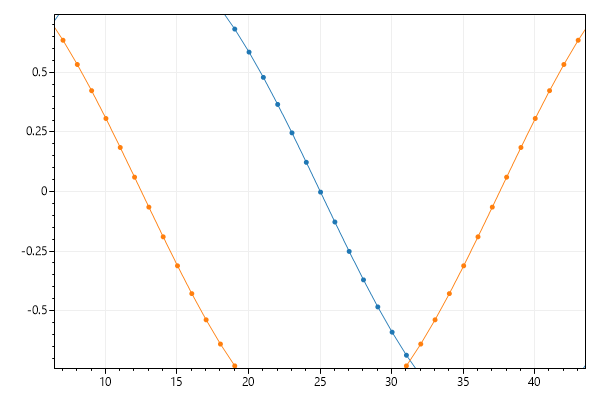


### Customize: AxisLimits - Pan


The user can easily pan by a defined amount on each axis.


```cs
// Code from /src/ScottPlot.Demo/Customize/AxisLimits.cs
var plt = new ScottPlot.Plot(600, 400);

int pointCount = 51;
double[] x = DataGen.Consecutive(pointCount);
double[] sin = DataGen.Sin(pointCount);
double[] cos = DataGen.Cos(pointCount);

plt.PlotScatter(x, sin);
plt.PlotScatter(x, cos);

plt.AxisPan(-10, .5);

plt.SaveFig("Customize_AxisLimits_Pan.png");
```


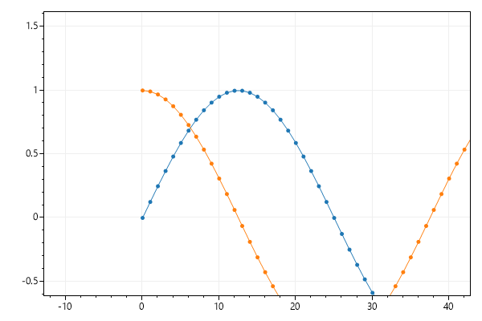


### Customize: Colors - Default Colorset


Default colorset is the same one used by matplotlib.


```cs
// Code from /src/ScottPlot.Demo/Customize/Colors.cs
var plt = new ScottPlot.Plot(600, 400);

plt.Title($"{plt.Colorset().Name} Colorset (Default)");

Random rand = new Random(0);
plt.PlotSignal(DataGen.RandomWalk(rand, 1000), lineWidth: 2);
plt.PlotSignal(DataGen.RandomWalk(rand, 1000), lineWidth: 2);
plt.PlotSignal(DataGen.RandomWalk(rand, 1000), lineWidth: 2);
plt.PlotSignal(DataGen.RandomWalk(rand, 1000), lineWidth: 2);
plt.PlotSignal(DataGen.RandomWalk(rand, 1000), lineWidth: 2);
plt.AxisAuto(horizontalMargin: 0);

plt.SaveFig("Customize_Colors_DefaultColorset.png");
```


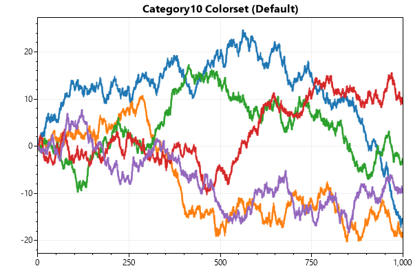


### Customize: Colors - Nord Colorset


Example colorset using Nord colors.


```cs
// Code from /src/ScottPlot.Demo/Customize/Colors.cs
var plt = new ScottPlot.Plot(600, 400);

plt.Colorset(Colorset.Nord);
plt.Title($"{plt.Colorset().Name} Colorset");

Random rand = new Random(0);
plt.PlotSignal(DataGen.RandomWalk(rand, 1000), lineWidth: 2);
plt.PlotSignal(DataGen.RandomWalk(rand, 1000), lineWidth: 2);
plt.PlotSignal(DataGen.RandomWalk(rand, 1000), lineWidth: 2);
plt.PlotSignal(DataGen.RandomWalk(rand, 1000), lineWidth: 2);
plt.PlotSignal(DataGen.RandomWalk(rand, 1000), lineWidth: 2);
plt.AxisAuto(horizontalMargin: 0);

plt.SaveFig("Customize_Colors_NordColorset.png");
```


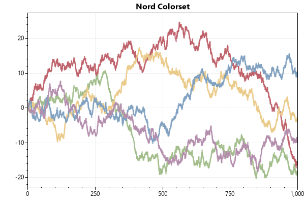


### Customize: Colors - Dark Colorset


Example colorset designed for use on a dark background.


```cs
// Code from /src/ScottPlot.Demo/Customize/Colors.cs
var plt = new ScottPlot.Plot(600, 400);

plt.Style(Style.Gray1);
plt.Colorset(Colorset.OneHalfDark);
plt.Title($"{plt.Colorset().Name} Colorset");

Random rand = new Random(0);
plt.PlotSignal(DataGen.RandomWalk(rand, 1000), lineWidth: 2);
plt.PlotSignal(DataGen.RandomWalk(rand, 1000), lineWidth: 2);
plt.PlotSignal(DataGen.RandomWalk(rand, 1000), lineWidth: 2);
plt.PlotSignal(DataGen.RandomWalk(rand, 1000), lineWidth: 2);
plt.PlotSignal(DataGen.RandomWalk(rand, 1000), lineWidth: 2);
plt.AxisAuto(horizontalMargin: 0);

plt.SaveFig("Customize_Colors_DarkColorset.png");
```


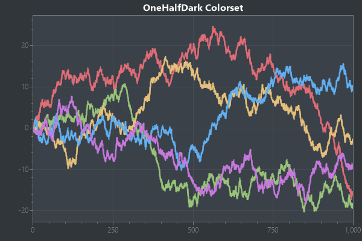


### Customize: Figure - Background Colors


Figure and data area background colors can be set individually.


```cs
// Code from /src/ScottPlot.Demo/Customize/Figure.cs
var plt = new ScottPlot.Plot(600, 400);

int pointCount = 51;
double[] x = DataGen.Consecutive(pointCount);
double[] sin = DataGen.Sin(pointCount);
double[] cos = DataGen.Cos(pointCount);

plt.PlotScatter(x, sin);
plt.PlotScatter(x, cos);

plt.Style(figBg: Color.LightBlue);
plt.Style(dataBg: Color.LightYellow);

plt.SaveFig("Customize_Figure_Background.png");
```


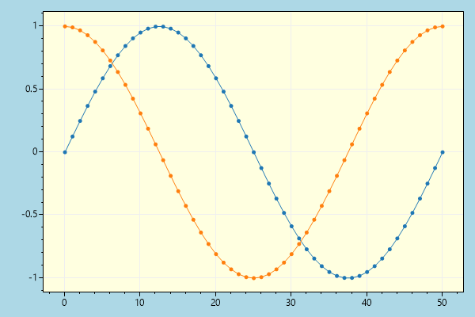


### Customize: Figure - Corner Frame


The data are is typically surrounded by a frame (a 1px line). This frame can be customized using arguments.


```cs
// Code from /src/ScottPlot.Demo/Customize/Figure.cs
var plt = new ScottPlot.Plot(600, 400);

int pointCount = 51;
double[] x = DataGen.Consecutive(pointCount);
double[] sin = DataGen.Sin(pointCount);
double[] cos = DataGen.Cos(pointCount);

plt.PlotScatter(x, sin);
plt.PlotScatter(x, cos);

plt.Frame(left: true, bottom: true, top: false, right: false);

plt.SaveFig("Customize_Figure_Frame.png");
```


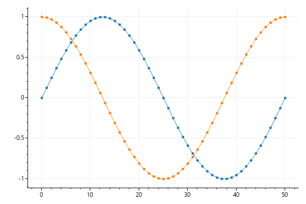


### Customize: Figure - Figure Padding


Extra padding can be added around the data area if desired.


```cs
// Code from /src/ScottPlot.Demo/Customize/Figure.cs
var plt = new ScottPlot.Plot(600, 400);

int pointCount = 51;
double[] x = DataGen.Consecutive(pointCount);
double[] sin = DataGen.Sin(pointCount);
double[] cos = DataGen.Cos(pointCount);

plt.PlotScatter(x, sin);
plt.PlotScatter(x, cos);

// custom colors are used to make it easier to see the data and figure areas
plt.Style(figBg: Color.LightBlue);
plt.Style(dataBg: Color.LightYellow);

plt.Layout(yScaleWidth: 80, titleHeight: 50, xLabelHeight: 20, y2LabelWidth: 20);

plt.SaveFig("Customize_Figure_FigurePadding.png");
```


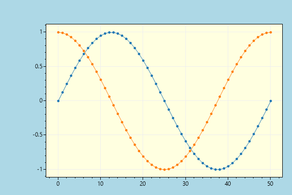


### Customize: Figure - No Padding


This example shows how to only plot the data area (no axis labels, ticks, or tick labels)


```cs
// Code from /src/ScottPlot.Demo/Customize/Figure.cs
var plt = new ScottPlot.Plot(600, 400);

int pointCount = 51;
double[] x = DataGen.Consecutive(pointCount);
double[] sin = DataGen.Sin(pointCount);
double[] cos = DataGen.Cos(pointCount);

plt.PlotScatter(x, sin);
plt.PlotScatter(x, cos);

// custom colors are used to make it easier to see the data and figure areas
plt.Style(figBg: Color.LightBlue);
plt.Style(dataBg: Color.LightYellow);

plt.Ticks(false, false);
plt.Frame(false);

// Eliminate space between the data area and frame edge by setting padding to 0.
// This must be repeated if the layout resets (such as when new items are added to the plot).
plt.TightenLayout(padding: 0);

plt.SaveFig("Customize_Figure_NoPad.png");
```


### Customize: Figure - Anti-Aliasing


Anti-aliasing makes plots look nicer but slightly reduces performance. Antialiasing of the Figure (containing the title, axis labels, and axis ticks) can be controlled independently from the data area and/or legend.


```cs
// Code from /src/ScottPlot.Demo/Customize/Figure.cs
var plt = new ScottPlot.Plot(600, 400);

int pointCount = 51;
double[] x = DataGen.Consecutive(pointCount);
double[] sin = DataGen.Sin(pointCount);
double[] cos = DataGen.Cos(pointCount);

plt.PlotScatter(x, sin, label: "Sin");
plt.PlotScatter(x, cos, label: "Cos");

plt.Title("Plot Title");
plt.XLabel("Horizontal Axis");
plt.YLabel("Vertical Axis");
plt.Legend();

plt.AntiAlias(figure: false, data: false, legend: false);

// NOTE: anti-aliasing is automatically in the user control
// while the mouse button is held down to improve performance
// while panning and zooming. You can disable this feature by:
// formsPlot1.Configure(lowQualityWhileDragging = false);

plt.SaveFig("Customize_Figure_AntiAliasing.png");
```


### Customize: Grid - Hide the grid


Grid visibility (and numerous other options) are available as arguments in the Grid() method.


```cs
// Code from /src/ScottPlot.Demo/Customize/Grid.cs
var plt = new ScottPlot.Plot(600, 400);

int pointCount = 51;
double[] x = DataGen.Consecutive(pointCount);
double[] sin = DataGen.Sin(pointCount);
double[] cos = DataGen.Cos(pointCount);

plt.PlotScatter(x, sin);
plt.PlotScatter(x, cos);

plt.Grid(enable: false);

plt.SaveFig("Customize_Grid_Hide.png");
```


### Customize: Grid - Grid Line Width


Grid line width can be customized. Floating point values are acceptable.


```cs
// Code from /src/ScottPlot.Demo/Customize/Grid.cs
var plt = new ScottPlot.Plot(600, 400);

int pointCount = 51;
double[] x = DataGen.Consecutive(pointCount);
double[] sin = DataGen.Sin(pointCount);
double[] cos = DataGen.Cos(pointCount);

plt.PlotScatter(x, sin);
plt.PlotScatter(x, cos);

plt.Grid(lineWidth: 2);

plt.SaveFig("Customize_Grid_LineWidth.png");
```


### Customize: Grid - Grid Line Style


Grid line style can be customized.


```cs
// Code from /src/ScottPlot.Demo/Customize/Grid.cs
var plt = new ScottPlot.Plot(600, 400);

int pointCount = 51;
double[] x = DataGen.Consecutive(pointCount);
double[] sin = DataGen.Sin(pointCount);
double[] cos = DataGen.Cos(pointCount);

plt.PlotScatter(x, sin);
plt.PlotScatter(x, cos);

plt.Grid(lineStyle: ScottPlot.LineStyle.Dot);

plt.SaveFig("Customize_Grid_LineStyle.png");
```


### Customize: Grid - Defined Grid Spacing


The space between grid lines (the same as tick marks) can be manually defined.


```cs
// Code from /src/ScottPlot.Demo/Customize/Grid.cs
var plt = new ScottPlot.Plot(600, 400);

int pointCount = 51;
double[] x = DataGen.Consecutive(pointCount);
double[] sin = DataGen.Sin(pointCount);
double[] cos = DataGen.Cos(pointCount);

plt.PlotScatter(x, sin);
plt.PlotScatter(x, cos);

plt.Grid(xSpacing: 2, ySpacing: .1);

plt.SaveFig("Customize_Grid_DefineSpacing.png");
```


### Customize: Legend - Legend Demo


Demonstrates how various plot types appear in the legend.


```cs
// Code from /src/ScottPlot.Demo/Customize/Legend.cs
var plt = new ScottPlot.Plot(600, 400);

Random rand = new Random(0);

plt.PlotErrorBars(
        xs: DataGen.Random(rand, 10, 10),
        ys: DataGen.Random(rand, 10, 10),
        xPositiveError: DataGen.Random(rand, 10),
        xNegativeError: DataGen.Random(rand, 10),
        yPositiveError: DataGen.Random(rand, 10),
        yNegativeError: DataGen.Random(rand, 10),
        label: "error bars"
    );

var func = new Func<double, double?>((x) => Math.Sin(x) * Math.Sin(10 * x) + 3);
plt.PlotFunction(func, label: "function", lineWidth: 2);

var func2 = new Func<double, double?>((x) => Math.Sin(x) * Math.Sin(10 * x) + 5);
plt.PlotFunction(func2, label: null); // null labels will not appear in legend

plt.PlotHLine(7.75, label: "horizontal line", lineStyle: LineStyle.Dot);
plt.PlotVLine(7.75, label: "vertical line", lineStyle: LineStyle.Dash);

plt.PlotHSpan(1.5, 2.5, label: "horizontal span");
plt.PlotVSpan(1.5, 2.5, label: "vertical span");

plt.PlotOHLC(new OHLC[]{
new OHLC(5, 6, 4, 5.5, 1),
new OHLC(6, 7.5, 3.5, 4.75, 1.5),
new OHLC(5.5, 6, 3, 4.5, 2)
});

plt.PlotCandlestick(new OHLC[]{
new OHLC(5, 6, 4, 5.5, 3),
new OHLC(6, 7.5, 3.5, 4.75, 3.5),
new OHLC(5.5, 6, 3, 4.5, 4)
});

plt.PlotScatter(
    xs: new double[] { 5, 5.5, 6, 7, 7, 6 },
    ys: new double[] { 7, 8, 7, 9, 7, 8 },
    lineStyle: LineStyle.Dash,
    lineWidth: 2,
    markerShape: MarkerShape.openCircle,
    markerSize: 10,
    label: "Scatter Plot"
    );

plt.PlotSignal(
    ys: DataGen.RandomNormal(rand, 10),
    sampleRate: 5,
    xOffset: 3,
    yOffset: 8,
    label: "Signal Plot"
    );

plt.PlotText("ScottPlot", 6, 6, rotation: 25, fontSize: 14, bold: true);

plt.PlotPoint(1, 9, label: "point");
plt.PlotArrow(8, 8, 8.5, 8.5, label: "arrow");

plt.Axis(0, 13, -1, 11);
plt.Legend();
plt.Grid(false);

plt.SaveFig("Customize_Legend_LegendDemo.png");
```


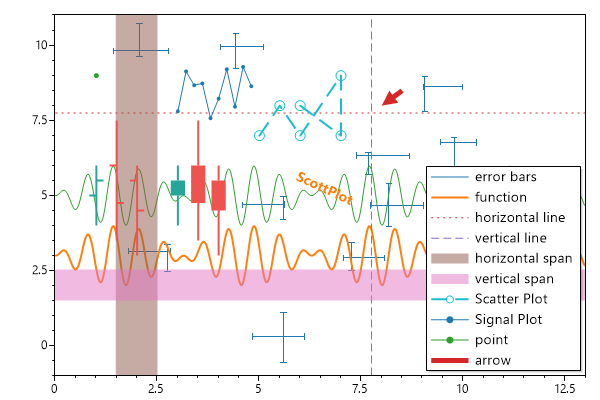


### Customize: PlotStyle - Modify styles after plotting


Styles are typically defined as arguments when data is initially plotted. However, plotting functions return objects which contain style information that can be modified after it has been plotted. In some cases these properties allow more extensive customization than the initial function arguments.


```cs
// Code from /src/ScottPlot.Demo/Customize/PlotStyle.cs
var plt = new ScottPlot.Plot(600, 400);

int pointCount = 51;
double[] x = DataGen.Consecutive(pointCount);
double[] sin = DataGen.Sin(pointCount);
double[] cos = DataGen.Cos(pointCount);

var thing1 = plt.PlotScatter(x, sin, label: "thing 1");
var thing2 = plt.PlotScatter(x, cos, label: "thing 2");

thing1.lineWidth = 5;
thing1.markerShape = MarkerShape.openCircle;
thing1.markerSize = 20;

thing2.color = Color.Magenta;

plt.Legend();

plt.SaveFig("Customize_PlotStyle_ModifyAfterPlot.png");
```


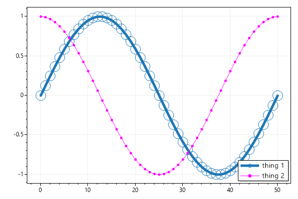


### Customize: PlotStyle - Custom Fonts Everywhere


Uses cutom font, color, and sizes for numerous types of labels


```cs
// Code from /src/ScottPlot.Demo/Customize/PlotStyle.cs
var plt = new ScottPlot.Plot(600, 400);

int pointCount = 51;
double[] x = DataGen.Consecutive(pointCount);
double[] sin = DataGen.Sin(pointCount);
double[] cos = DataGen.Cos(pointCount);

plt.PlotScatter(x, sin);
plt.PlotScatter(x, cos);

plt.Title("Impressive Graph", fontName: "courier new", fontSize: 24, color: Color.Purple, bold: true);
plt.YLabel("vertical units", fontName: "impact", fontSize: 24, color: Color.Red, bold: true);
plt.XLabel("horizontal units", fontName: "georgia", fontSize: 24, color: Color.Blue, bold: true);
plt.PlotText("very graph", 25, .8, fontName: "comic sans ms", fontSize: 24, color: Color.Blue, bold: true);
plt.PlotText("so data", 0, 0, fontName: "comic sans ms", fontSize: 42, color: Color.Magenta, bold: true);
plt.PlotText("many documentation", 3, -.6, fontName: "comic sans ms", fontSize: 18, color: Color.DarkCyan, bold: true);
plt.PlotText("wow.", 10, .6, fontName: "comic sans ms", fontSize: 36, color: Color.Green, bold: true);
plt.PlotText("NuGet", 32, 0, fontName: "comic sans ms", fontSize: 24, color: Color.Gold, bold: true);
plt.Legend(fontName: "comic sans ms", fontSize: 16, bold: true, fontColor: Color.DarkBlue);
plt.Ticks(fontName: "comic sans ms", fontSize: 12, color: Color.DarkBlue);

plt.SaveFig("Customize_PlotStyle_StyledLabels.png");
```


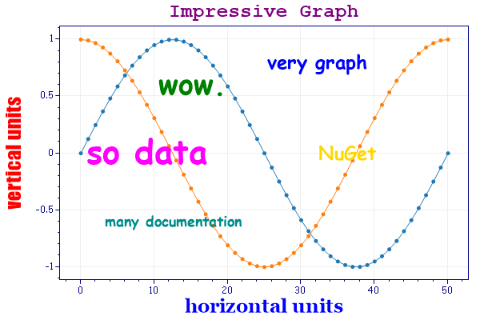


### Customize: PlotStyle - Legend


A legend is available to display data that was plotted using the 'label' argument. Arguments for Legend() allow the user to define its position.


```cs
// Code from /src/ScottPlot.Demo/Customize/PlotStyle.cs
var plt = new ScottPlot.Plot(600, 400);

int pointCount = 51;
double[] x = DataGen.Consecutive(pointCount);
double[] sin = DataGen.Sin(pointCount);
double[] cos = DataGen.Cos(pointCount);

plt.PlotScatter(x, sin, label: "sin");
plt.PlotScatter(x, cos, label: "cos");
plt.Legend();

plt.SaveFig("Customize_PlotStyle_CustomLegend.png");
```


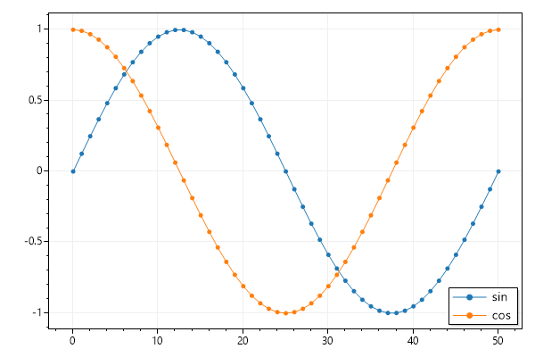


### Customize: PlotStyles - Plot Style (Default)


no description provided...


```cs
// Code from /src/ScottPlot.Demo/Customize/PlotStyles.cs
var plt = new ScottPlot.Plot(600, 400);

int pointCount = 51;
double[] x = DataGen.Consecutive(pointCount);
double[] sin = DataGen.Sin(pointCount);
double[] cos = DataGen.Cos(pointCount);

plt.PlotScatter(x, sin);
plt.PlotScatter(x, cos);

plt.Style(ScottPlot.Style.Default);

plt.SaveFig("Customize_PlotStyles_Default.png");
```


### Customize: PlotStyles - Plot Style (Seaborn)


no description provided...


```cs
// Code from /src/ScottPlot.Demo/Customize/PlotStyles.cs
var plt = new ScottPlot.Plot(600, 400);

int pointCount = 51;
double[] x = DataGen.Consecutive(pointCount);
double[] sin = DataGen.Sin(pointCount);
double[] cos = DataGen.Cos(pointCount);

plt.PlotScatter(x, sin);
plt.PlotScatter(x, cos);

plt.Style(ScottPlot.Style.Seaborn);

plt.SaveFig("Customize_PlotStyles_Seaborn.png");
```


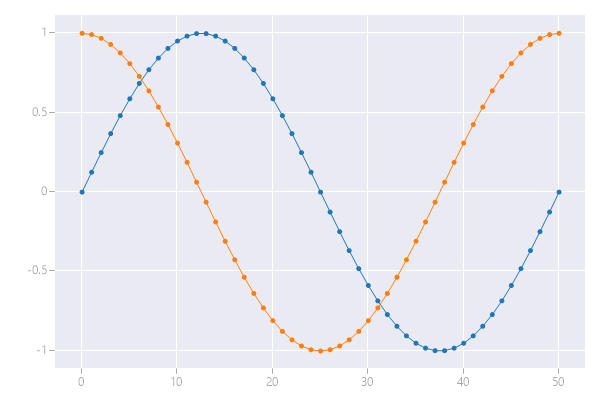


### Customize: PlotStyles - Plot Style (Control)


no description provided...


```cs
// Code from /src/ScottPlot.Demo/Customize/PlotStyles.cs
var plt = new ScottPlot.Plot(600, 400);

int pointCount = 51;
double[] x = DataGen.Consecutive(pointCount);
double[] sin = DataGen.Sin(pointCount);
double[] cos = DataGen.Cos(pointCount);

plt.PlotScatter(x, sin);
plt.PlotScatter(x, cos);

plt.Style(ScottPlot.Style.Control);

plt.SaveFig("Customize_PlotStyles_Control.png");
```


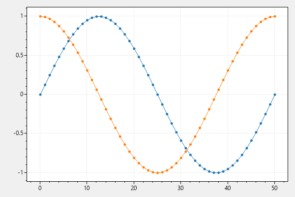


### Customize: PlotStyles - Plot Style (Blue1)


no description provided...


```cs
// Code from /src/ScottPlot.Demo/Customize/PlotStyles.cs
var plt = new ScottPlot.Plot(600, 400);

int pointCount = 51;
double[] x = DataGen.Consecutive(pointCount);
double[] sin = DataGen.Sin(pointCount);
double[] cos = DataGen.Cos(pointCount);

plt.PlotScatter(x, sin);
plt.PlotScatter(x, cos);

plt.Style(ScottPlot.Style.Blue1);

plt.SaveFig("Customize_PlotStyles_Blue1.png");
```


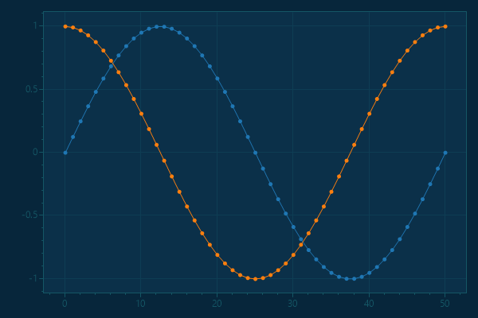


### Customize: PlotStyles - Plot Style (Blue2)


no description provided...


```cs
// Code from /src/ScottPlot.Demo/Customize/PlotStyles.cs
var plt = new ScottPlot.Plot(600, 400);

int pointCount = 51;
double[] x = DataGen.Consecutive(pointCount);
double[] sin = DataGen.Sin(pointCount);
double[] cos = DataGen.Cos(pointCount);

plt.PlotScatter(x, sin);
plt.PlotScatter(x, cos);

plt.Style(ScottPlot.Style.Blue2);

plt.SaveFig("Customize_PlotStyles_Blue2.png");
```


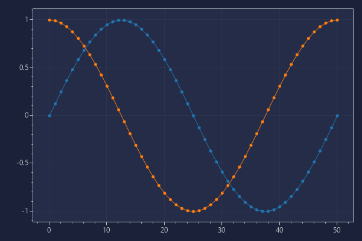


### Customize: PlotStyles - Plot Style (Blue3)


no description provided...


```cs
// Code from /src/ScottPlot.Demo/Customize/PlotStyles.cs
var plt = new ScottPlot.Plot(600, 400);

int pointCount = 51;
double[] x = DataGen.Consecutive(pointCount);
double[] sin = DataGen.Sin(pointCount);
double[] cos = DataGen.Cos(pointCount);

plt.PlotScatter(x, sin);
plt.PlotScatter(x, cos);

plt.Style(ScottPlot.Style.Blue3);

plt.SaveFig("Customize_PlotStyles_Blue3.png");
```


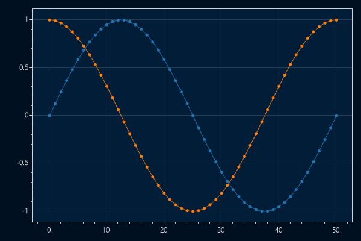


### Customize: PlotStyles - Plot Style (Light1)


no description provided...


```cs
// Code from /src/ScottPlot.Demo/Customize/PlotStyles.cs
var plt = new ScottPlot.Plot(600, 400);

int pointCount = 51;
double[] x = DataGen.Consecutive(pointCount);
double[] sin = DataGen.Sin(pointCount);
double[] cos = DataGen.Cos(pointCount);

plt.PlotScatter(x, sin);
plt.PlotScatter(x, cos);

plt.Style(ScottPlot.Style.Light1);

plt.SaveFig("Customize_PlotStyles_Light1.png");
```


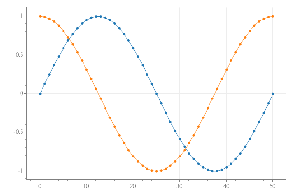


### Customize: PlotStyles - Plot Style (Light2)


no description provided...


```cs
// Code from /src/ScottPlot.Demo/Customize/PlotStyles.cs
var plt = new ScottPlot.Plot(600, 400);

int pointCount = 51;
double[] x = DataGen.Consecutive(pointCount);
double[] sin = DataGen.Sin(pointCount);
double[] cos = DataGen.Cos(pointCount);

plt.PlotScatter(x, sin);
plt.PlotScatter(x, cos);

plt.Style(ScottPlot.Style.Light2);

plt.SaveFig("Customize_PlotStyles_Light2.png");
```


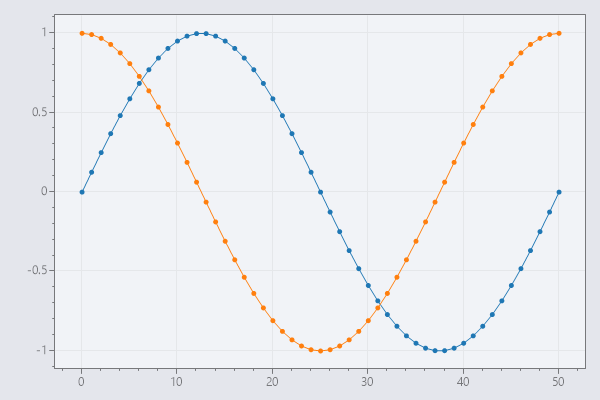


### Customize: PlotStyles - Plot Style (Gray1)


no description provided...


```cs
// Code from /src/ScottPlot.Demo/Customize/PlotStyles.cs
var plt = new ScottPlot.Plot(600, 400);

int pointCount = 51;
double[] x = DataGen.Consecutive(pointCount);
double[] sin = DataGen.Sin(pointCount);
double[] cos = DataGen.Cos(pointCount);

plt.PlotScatter(x, sin);
plt.PlotScatter(x, cos);

plt.Style(ScottPlot.Style.Gray1);

plt.SaveFig("Customize_PlotStyles_Gray1.png");
```


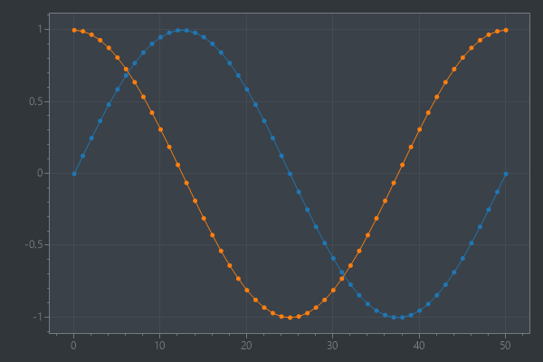


### Customize: PlotStyles - Plot Style (Gray2)


no description provided...


```cs
// Code from /src/ScottPlot.Demo/Customize/PlotStyles.cs
var plt = new ScottPlot.Plot(600, 400);

int pointCount = 51;
double[] x = DataGen.Consecutive(pointCount);
double[] sin = DataGen.Sin(pointCount);
double[] cos = DataGen.Cos(pointCount);

plt.PlotScatter(x, sin);
plt.PlotScatter(x, cos);

plt.Style(ScottPlot.Style.Gray2);

plt.SaveFig("Customize_PlotStyles_Gray2.png");
```


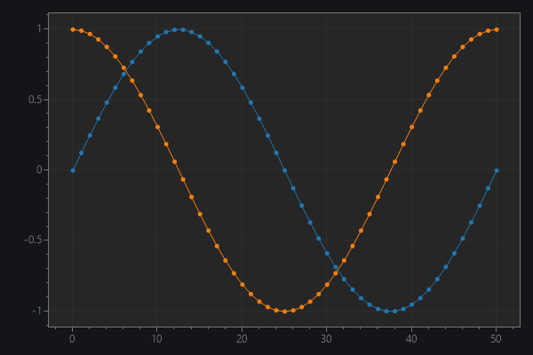


### Customize: PlotStyles - Plot Style (Black)


no description provided...


```cs
// Code from /src/ScottPlot.Demo/Customize/PlotStyles.cs
var plt = new ScottPlot.Plot(600, 400);

int pointCount = 51;
double[] x = DataGen.Consecutive(pointCount);
double[] sin = DataGen.Sin(pointCount);
double[] cos = DataGen.Cos(pointCount);

plt.PlotScatter(x, sin);
plt.PlotScatter(x, cos);

plt.Style(ScottPlot.Style.Black);

plt.SaveFig("Customize_PlotStyles_Black.png");
```


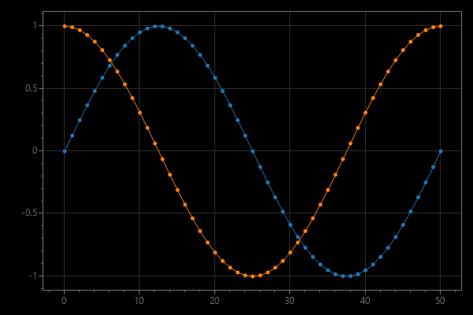


### Customize: Ticks - Hide Tick Labels


Tick label visibility can be controlled with arguments to the Ticks() method


```cs
// Code from /src/ScottPlot.Demo/Customize/Ticks.cs
var plt = new ScottPlot.Plot(600, 400);

int pointCount = 51;
double[] x = DataGen.Consecutive(pointCount);
double[] sin = DataGen.Sin(pointCount);
double[] cos = DataGen.Cos(pointCount);

plt.PlotScatter(x, sin);
plt.PlotScatter(x, cos);

plt.Ticks(displayTicksX: false);

plt.SaveFig("Customize_Ticks_Visibility.png");
```


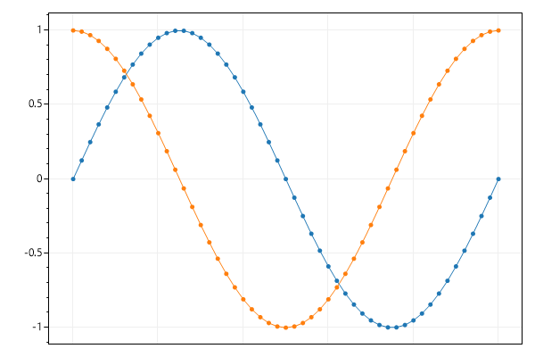


### Customize: Ticks - Numeric Tick Formatting


Display format of numeric ticks can be customized using numeric format strings.


```cs
// Code from /src/ScottPlot.Demo/Customize/Ticks.cs
var plt = new ScottPlot.Plot(600, 400);

int pointCount = 51;
double[] x = DataGen.Consecutive(pointCount);
double[] sin = DataGen.Sin(pointCount);
double[] cos = DataGen.Cos(pointCount);

plt.PlotScatter(x, sin);
plt.PlotScatter(x, cos);

// See https://tinyurl.com/y86clj9k to learn about numeric format strings
plt.Ticks(numericFormatStringX: "E2", numericFormatStringY: "P1");

plt.SaveFig("Customize_Ticks_Formatting.png");
```


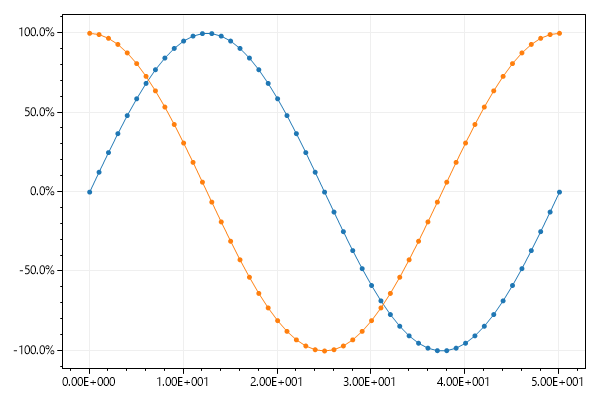


### Customize: Ticks - DateTime Axis


Axis tick labels can be set to display date and time format if the values (double[]) are OATime values.


```cs
// Code from /src/ScottPlot.Demo/Customize/Ticks.cs
var plt = new ScottPlot.Plot(600, 400);

Random rand = new Random(0);
double[] temperature = DataGen.RandomWalk(rand, 60 * 8);
DateTime start = new DateTime(2019, 08, 25, 8, 30, 00);
double pointsPerDay = 24 * 60;

plt.PlotSignal(temperature, sampleRate: pointsPerDay, xOffset: start.ToOADate());
plt.Ticks(dateTimeX: true);
plt.YLabel("Temperature (C)");

plt.SaveFig("Customize_Ticks_DateAxis.png");
```


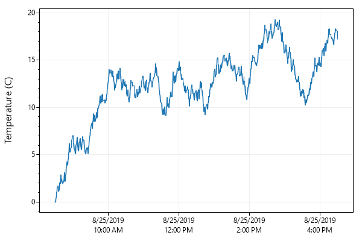


### Customize: Ticks - Define Tick Positions


An array of tick positions and labels can be manually defined.


```cs
// Code from /src/ScottPlot.Demo/Customize/Ticks.cs
var plt = new ScottPlot.Plot(600, 400);

int pointCount = 51;
double[] x = DataGen.Consecutive(pointCount);
double[] sin = DataGen.Sin(pointCount);
double[] cos = DataGen.Cos(pointCount);

plt.PlotScatter(x, sin);
plt.PlotScatter(x, cos);

double[] xPositions = { 7, 21, 37, 46 };
string[] xLabels = { "VII", "XXI", "XXXVII", "XLVI" };
plt.XTicks(xPositions, xLabels);

double[] yPositions = { -1, 0, .5, 1 };
string[] yPabels = { "bottom", "center", "half", "top" };
plt.YTicks(yPositions, yPabels);

plt.SaveFig("Customize_Ticks_Positions.png");
```


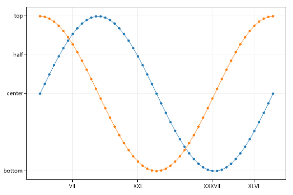


### Customize: Ticks - Nonlinear Tick Spacing


Customize tick labels to give a nonlinear axis appearance


```cs
// Code from /src/ScottPlot.Demo/Customize/Ticks.cs
var plt = new ScottPlot.Plot(600, 400);

// these are our nonlinear data values we wish to plot
double[] amplitudes = { 23.9, 24.2, 24.3, 24.5, 25.3, 26.3, 27.6, 31.4, 33.7, 36,
                        38.4, 42, 43.5, 46.1, 48.8, 51.5, 53.2, 55, 56.9, 58.7, 60.6 };
double[] frequencies = { 50, 63, 80, 100, 125, 160, 200, 250, 315, 400, 500, 630,
                         800, 1000, 1250, 1600, 2000, 2500, 3150, 4000, 5000 };

// ignore the "real" X values and plot data at consecutive X values (0, 1, 2, 3...)
double[] positions = DataGen.Consecutive(frequencies.Length);
plt.PlotScatter(positions, amplitudes);

// then define tick labels based on "real" X values, rotate them, and give them extra space
string[] labels = frequencies.Select(x => x.ToString()).ToArray();
plt.XTicks(positions, labels);
plt.Ticks(xTickRotation: 45);

// apply axis labels, trigging a layout reset
plt.Title("Vibrational Coupling");
plt.YLabel("Amplitude (dB)");
plt.XLabel("Frequency (Hz)");

// manually tweak the layout to add extra padding for rotated labels
plt.Layout(xScaleHeight: 30);

plt.SaveFig("Customize_Ticks_NonlinearTickSpacing.png");
```


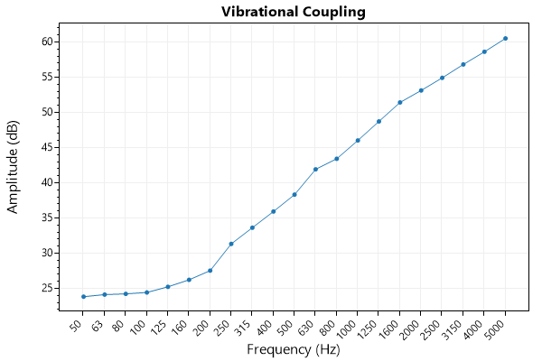


### Customize: Ticks - Descending Ticks


ScottPlot will ALWAYS display data where X values ascend from left to right. To simulate an inverted axis (where numbers decrease from left to right) plot data in the NEGATIVE space, then use a Tick() argument to invert the sign of tick labels.


```cs
// Code from /src/ScottPlot.Demo/Customize/Ticks.cs
var plt = new ScottPlot.Plot(600, 400);

// plot in the negative space
plt.PlotSignal(DataGen.Sin(50), xOffset: -50);

// then invert the sign of the axis tick labels
plt.Ticks(invertSignX: true);
plt.Ticks(invertSignY: true);

plt.SaveFig("Customize_Ticks_Inverted.png");
```


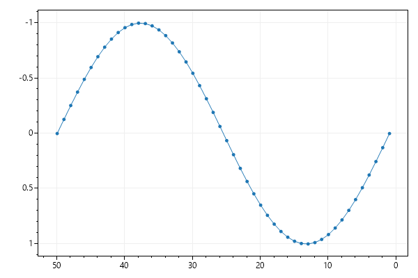


### Customize: Ticks - Defined Tick Spacing


The space between tick marks can be manually defined by setting the grid spacing.


```cs
// Code from /src/ScottPlot.Demo/Customize/Ticks.cs
var plt = new ScottPlot.Plot(600, 400);

int pointCount = 51;
double[] x = DataGen.Consecutive(pointCount);
double[] sin = DataGen.Sin(pointCount);
double[] cos = DataGen.Cos(pointCount);

plt.PlotScatter(x, sin);
plt.PlotScatter(x, cos);

plt.Grid(xSpacing: 2, ySpacing: .1);

plt.SaveFig("Customize_Ticks_DefineSpacing.png");
```


### Customize: Ticks - Localized Formatting (Hungarian)


Large numbers and dates are formatted differently for different cultures. Hungarian is a good example of this: they use spaces to separate large numbers, and periods to separate fields in dates.


```cs
// Code from /src/ScottPlot.Demo/Customize/Ticks.cs
var plt = new ScottPlot.Plot(600, 400);

// generate some data
Random rand = new Random(0);
double[] price = ScottPlot.DataGen.RandomWalk(rand, 60 * 8, 10000);
DateTime start = new DateTime(2019, 08, 25, 8, 30, 00);
double pointsPerDay = 24 * 60;

// create the plot
plt.PlotSignal(price, sampleRate: pointsPerDay, xOffset: start.ToOADate());
plt.Ticks(dateTimeX: true);
plt.YLabel("Price");
plt.XLabel("Date and Time");
plt.Title("Hungarian Formatted DateTime Tick Labels");

// set the localization
var culture = System.Globalization.CultureInfo.CreateSpecificCulture("hu"); // Hungarian
plt.SetCulture(culture);

plt.SaveFig("Customize_Ticks_LocalizedHungarian.png");
```


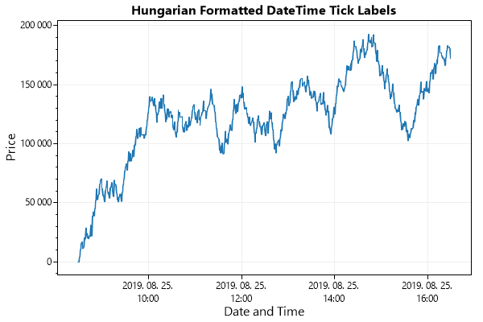


### Customize: Ticks - Localized Formatting (German)


Large numbers and dates are formatted differently for different cultures. German is a good example of this: they use periods to separate large numbers, and periods to separate fields in dates.


```cs
// Code from /src/ScottPlot.Demo/Customize/Ticks.cs
var plt = new ScottPlot.Plot(600, 400);

// generate some data
Random rand = new Random(0);
double[] price = ScottPlot.DataGen.RandomWalk(rand, 60 * 8, 10000);
DateTime start = new DateTime(2019, 08, 25, 8, 30, 00);
double pointsPerDay = 24 * 60;

// create the plot
plt.PlotSignal(price, sampleRate: pointsPerDay, xOffset: start.ToOADate());
plt.Ticks(dateTimeX: true);
plt.YLabel("Price");
plt.XLabel("Date and Time");
plt.Title("German Formatted DateTime Tick Labels");

// set the localization
var culture = System.Globalization.CultureInfo.CreateSpecificCulture("de"); // German
plt.SetCulture(culture);

plt.SaveFig("Customize_Ticks_LocalizedGerman.png");
```


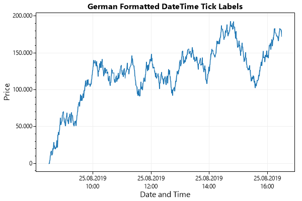


### Customize: Ticks - Format Ticks with Custom Culture


SetCulture() as arguments to let the user manually define formatting strings which will be used globally to change how numbers and dates are formatted.


```cs
// Code from /src/ScottPlot.Demo/Customize/Ticks.cs
var plt = new ScottPlot.Plot(600, 400);

// generate 10 days of data
int pointCount = 10;
double[] values = DataGen.RandomWalk(null, pointCount);
double[] days = new double[pointCount];
DateTime day1 = new DateTime(1985, 09, 24);
for (int i = 0; i < days.Length; i++)
    days[i] = day1.AddDays(1).AddDays(i).ToOADate();

// plot the data with custom tick format (https://tinyurl.com/ycwh45af)
plt.PlotScatter(days, values);
plt.Ticks(dateTimeX: true);
plt.SetCulture(shortDatePattern: "M\\/dd");

plt.SaveFig("Customize_Ticks_CustomCulture.png");
```


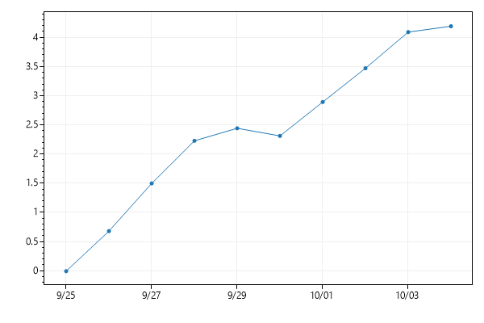


### Customize: Ticks - Accomodating Large Ticks


The plot layout adjusts automatically to accomodate large tick labels.


```cs
// Code from /src/ScottPlot.Demo/Customize/Ticks.cs
var plt = new ScottPlot.Plot(600, 400);

// generate LARGE data
Random rand = new Random(0);
double[] xs = ScottPlot.DataGen.Consecutive(100);
double[] ys = ScottPlot.DataGen.RandomWalk(rand, 100, 1e2, 1e15);
plt.PlotScatter(xs, ys);
plt.YLabel("vertical units");
plt.XLabel("horizontal units");

plt.SaveFig("Customize_Ticks_Large.png");
```


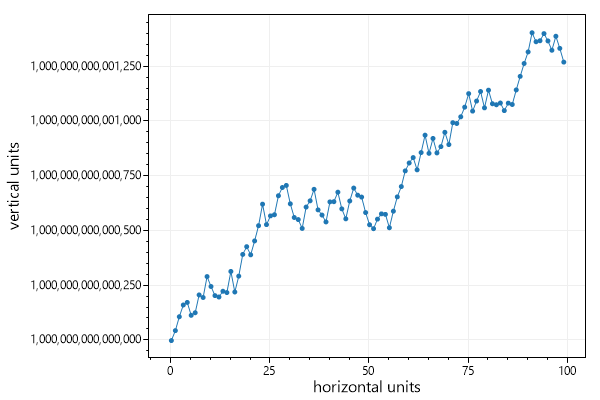


### Customize: Ticks - Multiplier Notation


To keep tick labels small 'multiplier' notation can be used when their values are large.


```cs
// Code from /src/ScottPlot.Demo/Customize/Ticks.cs
var plt = new ScottPlot.Plot(600, 400);

Random rand = new Random(0);
int pointCount = 100;
double[] largeXs = DataGen.Consecutive(pointCount, spacing: 1e6);
double[] largeYs = DataGen.Random(rand, pointCount, multiplier: 1e6);

plt.PlotScatter(largeXs, largeYs);
plt.Ticks(useMultiplierNotation: true);

plt.SaveFig("Customize_Ticks_MultiplierNotation.png");
```


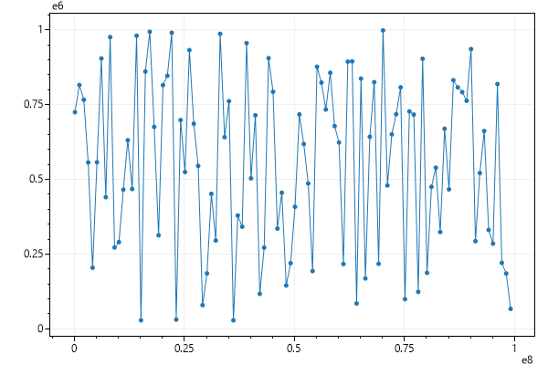


### Customize: Ticks - Offset Notation


To keep tick labels small 'offset' notation can be used when their values are very far from zero.


```cs
// Code from /src/ScottPlot.Demo/Customize/Ticks.cs
var plt = new ScottPlot.Plot(600, 400);

Random rand = new Random(0);
int pointCount = 100;
double[] largeXs = DataGen.Consecutive(pointCount, offset: 1e6);
double[] largeYs = DataGen.Random(rand, pointCount, offset: 1e6);

plt.PlotScatter(largeXs, largeYs);
plt.Ticks(useOffsetNotation: true);

plt.SaveFig("Customize_Ticks_OffsetNotation.png");
```


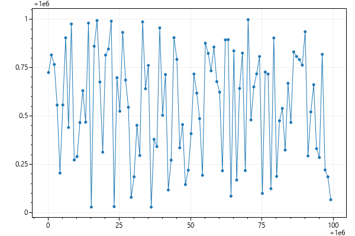


### Customize: Ticks - Rotated Ticks


Horizontal ticks can be rotated an arbitrary amount.


```cs
// Code from /src/ScottPlot.Demo/Customize/Ticks.cs
var plt = new ScottPlot.Plot(600, 400);

int pointCount = 51;
double[] x = DataGen.Consecutive(pointCount);
double[] sin = DataGen.Sin(pointCount);
double[] cos = DataGen.Cos(pointCount);

plt.PlotScatter(x, sin);
plt.PlotScatter(x, cos);

// setting the axis label resets the layout so call this first
plt.XLabel("Horizontal Axis Label");

// define axis tick rotation and tweak the layout to provide extra padding
plt.Ticks(xTickRotation: 45);

plt.SaveFig("Customize_Ticks_RotatedTicks.png");
```


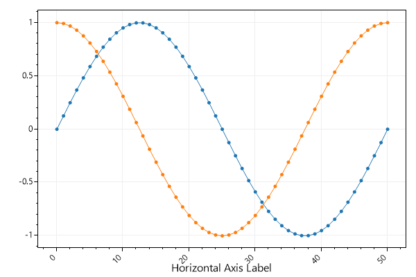


### Customize: Ticks - Defined DateTime Tick Spacing


This example shows how to use a fixed inter-tick distance.


```cs
// Code from /src/ScottPlot.Demo/Customize/Ticks.cs
var plt = new ScottPlot.Plot(600, 400);

int pointCount = 20;

// create a series of dates
double[] dates = new double[pointCount];
var firstDay = new DateTime(2020, 1, 22);
for (int i = 0; i < pointCount; i++)
    dates[i] = firstDay.AddDays(i).ToOADate();

// simulate data for each date
double[] values = new double[pointCount];
Random rand = new Random(0);
for (int i = 1; i < pointCount; i++)
    values[i] = values[i - 1] + rand.NextDouble();

plt.PlotScatter(dates, values);
plt.Ticks(dateTimeX: true);

// define tick spacing as 1 day (every day will be shown)
plt.Grid(xSpacing: 1, xSpacingDateTimeUnit: Config.DateTimeUnit.Day);
plt.Ticks(dateTimeX: true, xTickRotation: 45);
plt.Layout(xScaleHeight: 60);

plt.SaveFig("Customize_Ticks_DateAxisFixedSpace.png");
```


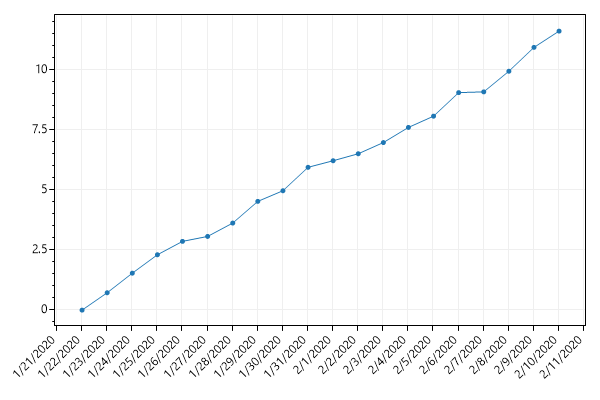


## Advanced


### Advanced: Bar - Multiple Bar Graphs


Multiple bar graphs can be displayed together by tweaking the widths and offsets of two separate bar graphs. However in most cases this is not necessary because the PlotBar() and PlotPopulation() tools are so robust (see those examples).


```cs
// Code from /src/ScottPlot.Demo/Advanced/Bar.cs
var plt = new ScottPlot.Plot(600, 400);

// generate random data to plot
Random rand = new Random(0);
int pointCount = 10;
double[] xs = DataGen.Consecutive(pointCount);
double[] ys1 = DataGen.RandomNormal(rand, pointCount, 20, 5);
double[] ys2 = DataGen.RandomNormal(rand, pointCount, 20, 5);
double[] err1 = DataGen.RandomNormal(rand, pointCount, 5, 2);
double[] err2 = DataGen.RandomNormal(rand, pointCount, 5, 2);

// add both bar plots with a careful widths and offsets
plt.PlotBar(xs, ys1, err1, "data A", barWidth: .3, xOffset: -.2);
plt.PlotBar(xs, ys2, err2, "data B", barWidth: .3, xOffset: .2);

// customize the plot to make it look nicer
plt.Axis(y1: 0);
plt.Grid(enableVertical: false, lineStyle: LineStyle.Dot);
plt.Axis(y1: 0);
plt.Legend(location: legendLocation.upperRight);

// apply custom axis tick labels
string[] labels = { "one", "two", "three", "four", "five", "six", "seven", "eight", "nine", "ten" };
plt.XTicks(xs, labels);

plt.SaveFig("Advanced_Bar_MultipleBars.png");
```


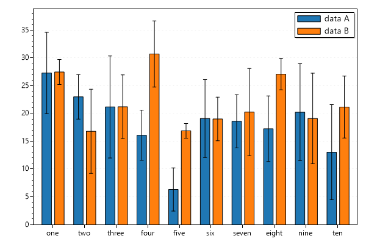


### Advanced: Multiplot - Multiplot Quickstart


Multiplots are single images which contain multiple subplots.


```cs
// Code from /src/ScottPlot.Demo/Advanced/Multiplot.cs
Random rand = new Random(0);

var mp = new MultiPlot(width: width, height: height, rows: 2, cols: 2);
mp.GetSubplot(0, 0).PlotSignal(DataGen.Sin(50));
mp.GetSubplot(0, 1).PlotSignal(DataGen.Cos(50));
mp.GetSubplot(1, 0).PlotSignal(DataGen.Random(rand, 50));
mp.GetSubplot(1, 1).PlotSignal(DataGen.RandomWalk(rand, 50));

mp.SaveFig("Advanced_Multiplot_Quickstart.png");
```


### Advanced: Multiplot - Match Subplot Axis


Axis and layout information from one subplot can be applied to another subplot.


```cs
// Code from /src/ScottPlot.Demo/Advanced/Multiplot.cs
Random rand = new Random(0);

var mp = new MultiPlot(width: width, height: height, rows: 2, cols: 2);
mp.GetSubplot(0, 0).PlotSignal(DataGen.Sin(50));
mp.GetSubplot(0, 1).PlotSignal(DataGen.Cos(50));
mp.GetSubplot(1, 0).PlotSignal(DataGen.Random(rand, 50));
mp.GetSubplot(1, 1).PlotSignal(DataGen.RandomWalk(rand, 50));

// adjust the bottom left plot to match the bottom right plot
var plotToAdjust = mp.GetSubplot(1, 0);
var plotReference = mp.GetSubplot(1, 1);
plotToAdjust.MatchAxis(plotReference);
plotToAdjust.MatchLayout(plotReference);

mp.SaveFig("Advanced_Multiplot_MatchAxis.png");
```


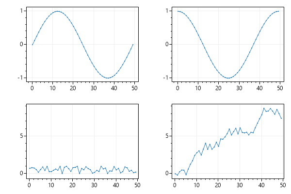


### Advanced: Statistics - Histogram


This example demonstrates how to plot the histogram of a dataset.


```cs
// Code from /src/ScottPlot.Demo/Advanced/Statistics.cs
var plt = new ScottPlot.Plot(600, 400);

Random rand = new Random(0);
double[] values = DataGen.RandomNormal(rand, pointCount: 1000, mean: 50, stdDev: 20);
var hist = new ScottPlot.Statistics.Histogram(values, min: 0, max: 100);

double barWidth = hist.binSize * 1.2; // slightly over-side to reduce anti-alias rendering artifacts

plt.PlotBar(hist.bins, hist.countsFrac, barWidth: barWidth, outlineWidth: 0);
plt.PlotScatter(hist.bins, hist.countsFracCurve, markerSize: 0, lineWidth: 2, color: Color.Black);
plt.Title("Normal Random Data");
plt.YLabel("Frequency (fraction)");
plt.XLabel("Value (units)");
plt.Axis(null, null, 0, null);
plt.Grid(lineStyle: LineStyle.Dot);

plt.SaveFig("Advanced_Statistics_Histogram.png");
```


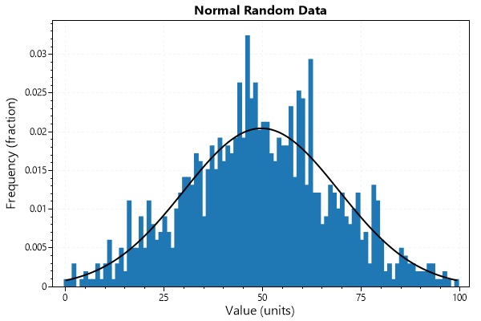


### Advanced: Statistics - CPH


This example demonstrates how to plot a cumulative probability histogram (CPH) to compare the distribution of two datasets.


```cs
// Code from /src/ScottPlot.Demo/Advanced/Statistics.cs
var plt = new ScottPlot.Plot(600, 400);

// create sample data for two datasets
Random rand = new Random(0);
double[] values1 = DataGen.RandomNormal(rand, pointCount: 1000, mean: 50, stdDev: 20);
double[] values2 = DataGen.RandomNormal(rand, pointCount: 1000, mean: 45, stdDev: 25);
var hist1 = new ScottPlot.Statistics.Histogram(values1, min: 0, max: 100);
var hist2 = new ScottPlot.Statistics.Histogram(values2, min: 0, max: 100);

// display datasets as step plots
plt.Title("Cumulative Probability Histogram");
plt.YLabel("Probability (fraction)");
plt.XLabel("Value (units)");
plt.PlotStep(hist1.bins, hist1.cumulativeFrac, lineWidth: 1.5, label: "sample A");
plt.PlotStep(hist2.bins, hist2.cumulativeFrac, lineWidth: 1.5, label: "sample B");
plt.Legend();
plt.Axis(null, null, 0, 1);
plt.Grid(lineStyle: LineStyle.Dot);

plt.SaveFig("Advanced_Statistics_CPH.png");
```


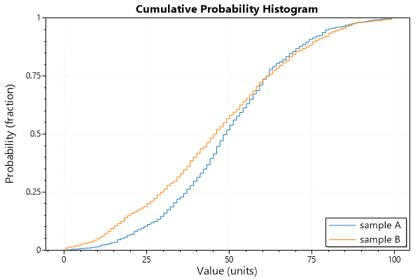


### Advanced: Statistics - Linear Regression


This example shows how to create a linear regression line for X/Y data.


```cs
// Code from /src/ScottPlot.Demo/Advanced/Statistics.cs
var plt = new ScottPlot.Plot(600, 400);

// Create some linear but noisy data
Random rand = new Random(0);
double[] ys = ScottPlot.DataGen.NoisyLinear(rand, pointCount: 100, noise: 30);
double[] xs = ScottPlot.DataGen.Consecutive(ys.Length);
double x1 = xs[0];
double x2 = xs[xs.Length - 1];

// use the linear regression fitter to fit these data
var model = new ScottPlot.Statistics.LinearRegressionLine(xs, ys);

// plot the original data and add the regression line
plt.Title($"Y = {model.slope:0.0000}x + {model.offset:0.0}\nR² = {model.rSquared:0.0000}");
plt.PlotScatter(xs, ys, lineWidth: 0);
plt.PlotLine(model.slope, model.offset, (x1, x2), lineWidth: 2);

plt.SaveFig("Advanced_Statistics_LinReg.png");
```


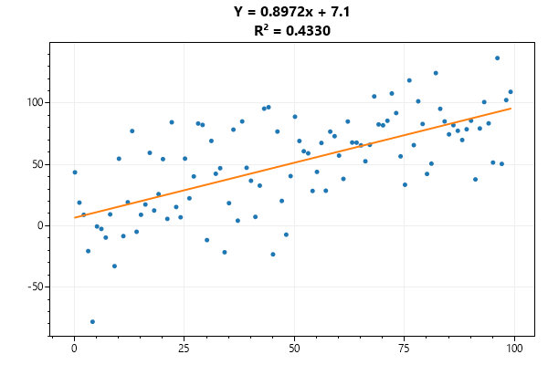


### Advanced: Statistics - Population Statistics


The Population class makes it easy to work with population statistics. Instantiate the Population class with a double array of values, then access its properties and methods as desired.


```cs
// Code from /src/ScottPlot.Demo/Advanced/Statistics.cs
var plt = new ScottPlot.Plot(600, 400);

// create some sample data to represent test scores
Random rand = new Random(0);
double[] scores = DataGen.RandomNormal(rand, 250, 85, 5);

// create a Population object from the data
var pop = new ScottPlot.Statistics.Population(scores);

// display the original values scattered vertically
double[] ys = DataGen.RandomNormal(rand, pop.values.Length, stdDev: .15);
plt.PlotScatter(pop.values, ys, markerSize: 10,
    markerShape: MarkerShape.openCircle, lineWidth: 0);

// display the bell curve for this distribution
double[] curveXs = DataGen.Range(pop.minus3stDev, pop.plus3stDev, .1);
double[] curveYs = pop.GetDistribution(curveXs, normalize: false);
plt.PlotScatter(curveXs, curveYs, markerSize: 0, lineWidth: 2);

// improve the style of the plot
plt.Title($"Test Scores (mean: {pop.mean:0.00} +/- {pop.stDev:0.00}, n={pop.n})");
plt.XLabel("Score");
plt.Grid(lineStyle: LineStyle.Dot);

plt.SaveFig("Advanced_Statistics_Population.png");
```


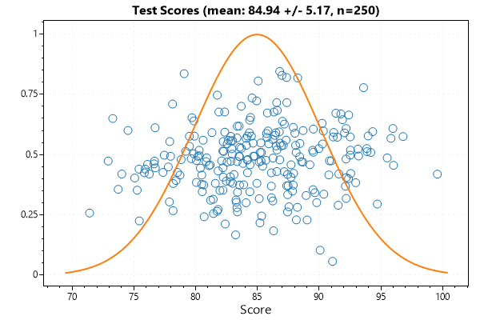


### Advanced: Statistics - Spline Interpolation


Interpolated splines create curves with many X/Y points to smoothly connect a limited number of input points.


```cs
// Code from /src/ScottPlot.Demo/Advanced/Statistics.cs
var plt = new ScottPlot.Plot(600, 400);

// create a small number of X/Y data points and display them
double[] xs = { 0, 10, 20, 30 };
double[] ys = { 65, 25, 55, 80 };
plt.PlotScatter(xs, ys, Color.Black, markerSize: 10, lineWidth: 0, label: "Original Data");

// Calculate the interpolated splines using three different methods:
//   Natural splines are "stiffer" than a polynomial interpolations and are less likely to oscillate.
//   Periodic splines are natural splines whose first and last point slopes are matched.
//   End slope splines let you define first and last data point slopes (defaults to zero).
var nsi = new ScottPlot.Statistics.Interpolation.NaturalSpline(xs, ys, resolution: 20);
var psi = new ScottPlot.Statistics.Interpolation.PeriodicSpline(xs, ys, resolution: 20);
var esi = new ScottPlot.Statistics.Interpolation.EndSlopeSpline(xs, ys, resolution: 20);

// plot the interpolated Xs and Ys
plt.PlotScatter(nsi.interpolatedXs, nsi.interpolatedYs, Color.Red, markerSize: 3, label: "Natural Spline");
plt.PlotScatter(psi.interpolatedXs, psi.interpolatedYs, Color.Green, markerSize: 3, label: "Periodic Spline");
plt.PlotScatter(esi.interpolatedXs, esi.interpolatedYs, Color.Blue, markerSize: 3, label: "End Slope Spline");

plt.Legend();

plt.SaveFig("Advanced_Statistics_SplineInterpolation.png");
```


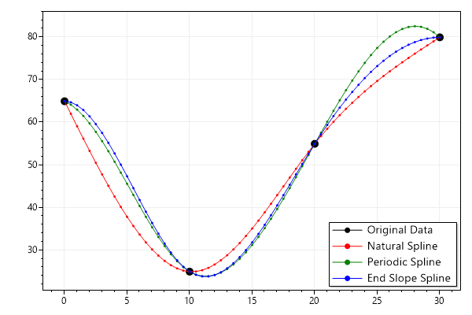


## Experimental


### Experimental: CustomPlottables - Add a Plottable Manually


Demonstrates how to add a Plottable to the plot without relying on a method in the Plot module.


```cs
// Code from /src/ScottPlot.Demo/Experimental/CustomPlottables.cs
var plt = new ScottPlot.Plot(600, 400);

// rather than call Plot.PlotText(), create the Plottable manually
var customPlottable = new PlottableText()
{
    text = "test",
    x = 2,
    y = 3,
    FontColor = System.Drawing.Color.Magenta,
    FontName = "arial",
    FontSize = 26,
    FontBold = true,
    alignment = TextAlignment.middleCenter,
    rotation = 0,
    frame = false,
    frameColor = System.Drawing.Color.Green
};

// you can access properties which may not be exposed by a Plot method
customPlottable.rotation = 45;

// add the custom plottable to the list of plottables like this
List<Plottable> plottables = plt.GetPlottables();
plottables.Add(customPlottable);

plt.SaveFig("Experimental_CustomPlottables_AddPlottable.png");
```


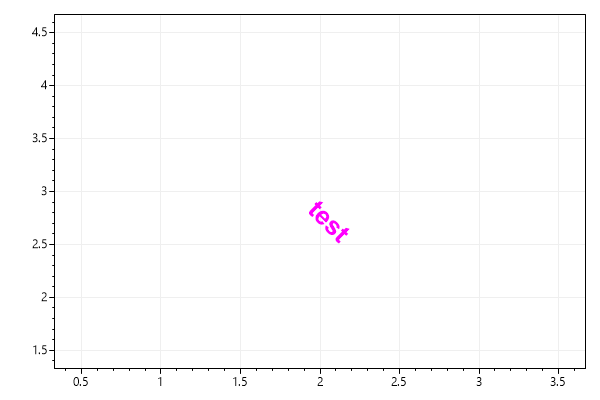


### Experimental: FringeCase - Empty Plot


This is what a plot looks like if you never added a plottable.


```cs
// Code from /src/ScottPlot.Demo/Experimental/FringeCase.cs
var plt = new ScottPlot.Plot(600, 400);

plt.Title("Empty Plot");

plt.SaveFig("Experimental_FringeCase_EmptyPlot.png");
```


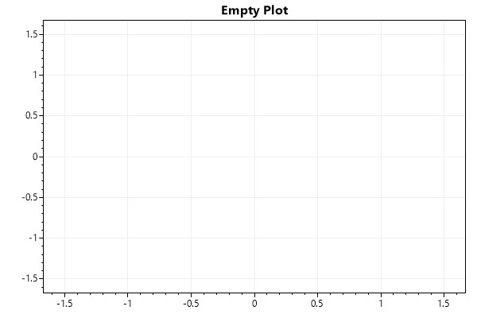


### Experimental: Heatmap - Heatmap Quickstart


Heatmaps are a good way to show intensity data.


```cs
// Code from /src/ScottPlot.Demo/Experimental/Heatmap.cs
var plt = new ScottPlot.Plot(600, 400);

double[,] imageData = { { 1, 2, 3 },
                        { 4, 5, 6 } };

plt.PlotHeatmap(imageData);

plt.SaveFig("Experimental_Heatmap_HeatmapQuickstart.png");
```


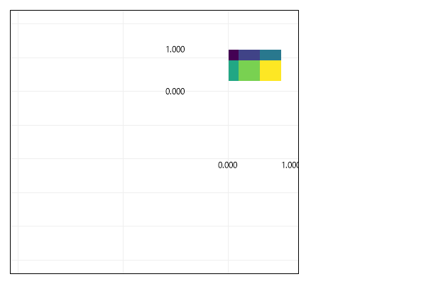


### Experimental: Heatmap - 2D Waveform


Another heatmap example.


```cs
// Code from /src/ScottPlot.Demo/Experimental/Heatmap.cs
var plt = new ScottPlot.Plot(600, 400);

int[] xs = Enumerable.Range(0, 100).ToArray();
int[] ys = Enumerable.Range(0, 100).ToArray();

double[,] intensities = new double[ys.Length, xs.Length];
for (int i = 0; i < ys.Length; i++)
{
    for (int j = 0; j < xs.Length; j++)
    {
        intensities[i, j] = (Math.Sin(i * .2) + Math.Cos(j * .2)) * 100;
    }
}

plt.PlotHeatmap(intensities);

plt.SaveFig("Experimental_Heatmap_HeatmapSinCos.png");
```


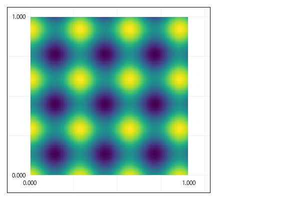


### Experimental: Heatmap - Customizing Heatmaps


Heatmaps have a lot of customization options


```cs
// Code from /src/ScottPlot.Demo/Experimental/Heatmap.cs
var plt = new ScottPlot.Plot(600, 400);

Random rand = new Random();
int[] xs = Enumerable.Range(0, 100).ToArray();
int[] ys = Enumerable.Range(0, 100).ToArray();

double[,] intensities = new double[ys.Length, xs.Length];

for (int i = 0; i < ys.Length; i++)
{
    for (int j = 0; j < xs.Length; j++)
    {
        intensities[i, j] = (Math.Sin(i * .2) + Math.Cos(j * .2)) * 100;
    }
}

//Change the color map to turbo, and renumber the axes
plt.PlotHeatmap(intensities, Colormap.Turbo, axisOffsets: new double[] { -5, -5 }, axisMultipliers: new double[] { 10, 10 });

plt.SaveFig("Experimental_Heatmap_HeatmapCustomizability.png");
```


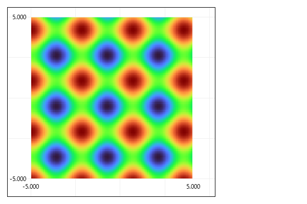


### Experimental: Heatmap - Custom Scale


Heatmaps have a lot of customization options


```cs
// Code from /src/ScottPlot.Demo/Experimental/Heatmap.cs
var plt = new ScottPlot.Plot(600, 400);

Random rand = new Random();
int[] xs = Enumerable.Range(0, 100).ToArray();
int[] ys = Enumerable.Range(0, 100).ToArray();

double[,] intensities = new double[ys.Length, xs.Length];

for (int i = 0; i < ys.Length; i++)
{
    for (int j = 0; j < xs.Length; j++)
    {
        intensities[i, j] = (Math.Sin(i * .2) + Math.Cos(j * .2)) * 100;
    }
}

//You'll notice these are the same settings as the previous demo, except the axis scale is noticably different
plt.PlotHeatmap(intensities, Colormap.Turbo, axisOffsets: new double[] { -5, -5 }, axisMultipliers: new double[] { 10, 10 }, scaleMin: -150, scaleMax: 300);

plt.SaveFig("Experimental_Heatmap_HeatmapCustomScale.png");
```


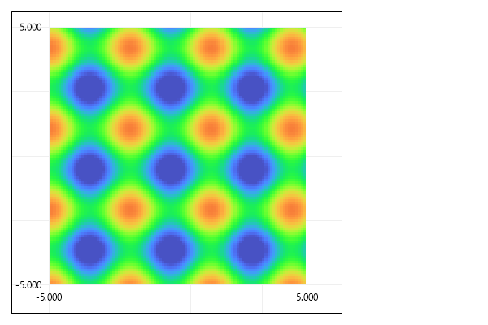


### Experimental: Heatmap - Heatmap From XY Data (Gaussian)


Useful for showing clusters of points


```cs
// Code from /src/ScottPlot.Demo/Experimental/Heatmap.cs
var plt = new ScottPlot.Plot(600, 400);

Random rand = new Random(0);
//Some noisy data centred around the middle
int[] xs = DataGen.RandomNormal(rand, 10000, 25, 10).Select(x => (int)x).ToArray();
int[] ys = DataGen.RandomNormal(rand, 10000, 25, 10).Select(y => (int)y).ToArray();

//Standard Deviation of 4
double[,] intensities = Tools.XYToIntensities(Tools.IntensityMode.gaussian, xs, ys, 50, 50, 4);
plt.PlotHeatmap(intensities);

plt.SaveFig("Experimental_Heatmap_HeatmapFromXYGaussian.png");
```


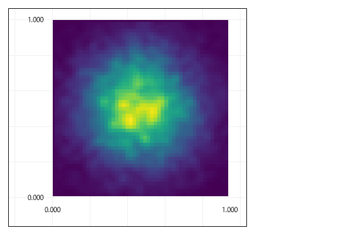


### Experimental: Heatmap - Heatmap From XY Data (Density)


Useful for showing clusters of points


```cs
// Code from /src/ScottPlot.Demo/Experimental/Heatmap.cs
var plt = new ScottPlot.Plot(600, 400);

Random rand = new Random(0);
//Some noisy data centred around the middle
int[] xs = DataGen.RandomNormal(rand, 10000, 25, 10).Select(x => (int)x).ToArray();
int[] ys = DataGen.RandomNormal(rand, 10000, 25, 10).Select(y => (int)y).ToArray();

//Each cell is a square with side-length of 4
double[,] intensities = Tools.XYToIntensities(Tools.IntensityMode.density, xs, ys, 50, 50, 4);
plt.PlotHeatmap(intensities);

plt.SaveFig("Experimental_Heatmap_HeatmapFromXYDensity.png");
```


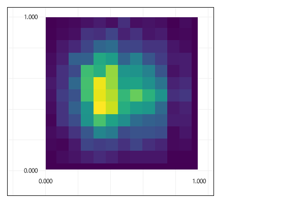


### Experimental: Heatmap - Heatmap Image


A sample image displayed using a heatmap


```cs
// Code from /src/ScottPlot.Demo/Experimental/Heatmap.cs
var plt = new ScottPlot.Plot(600, 400);

double[,] imageData = DataGen.SampleImageData();
plt.PlotHeatmap(imageData);

plt.SaveFig("Experimental_Heatmap_HeatmapImage.png");
```


### Experimental: Heatmap - Heatmap Background Image


Heatmap values below a threshold can be replaced by a Bitmap image.


```cs
// Code from /src/ScottPlot.Demo/Experimental/Heatmap.cs
var plt = new ScottPlot.Plot(600, 400);

double[,] imageData = DataGen.SampleImageData();

//This could be applied more usefully to an image pertinent to the data
//For example a map of the world, if your data is about geographic phenomenon
Bitmap background = DataGen.SampleImage();

plt.PlotHeatmap(imageData, transparencyThreshold: 20, backgroundImage: background);

plt.SaveFig("Experimental_Heatmap_BackGroundImage.png");
```


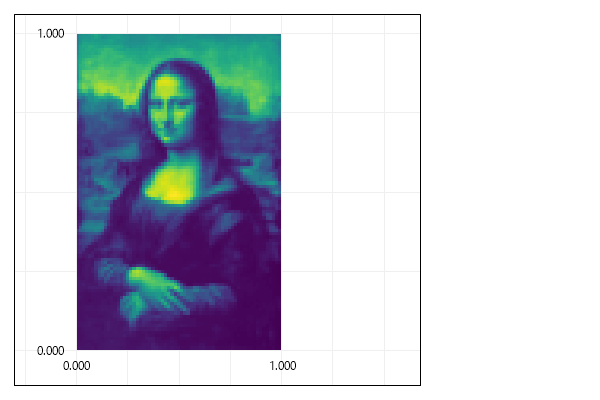

