# Advanced Axis Features
* This page contains recipes for the _Advanced Axis Features_ category.
* Visit the [Cookbook Home Page](../../) to view all cookbook recipes.
* Generated by ScottPlot 4.1.69 on 12/24/2023
<h2><a id='advanced-grid-customization' href='/cookbook/4.1/recipes/asis_gridadvanced/'>Advanced Grid Customization</a></h2>

Grid lines can be extensively customized using various configuration methods.

```cs
var plt = new ScottPlot.Plot(600, 400);

// plot sample data
plt.AddSignal(DataGen.Sin(51));
plt.AddSignal(DataGen.Cos(51));

// advanced grid customizations are available by accessing Axes directly
plt.XAxis.MajorGrid(color: Color.FromArgb(100, Color.Black));
plt.XAxis.MinorGrid(enable: true, color: Color.FromArgb(20, Color.Black));
plt.YAxis.MajorGrid(lineWidth: 2, lineStyle: LineStyle.Dash, color: Color.Magenta);

plt.SaveFig("asis_gridAdvanced.png");
```

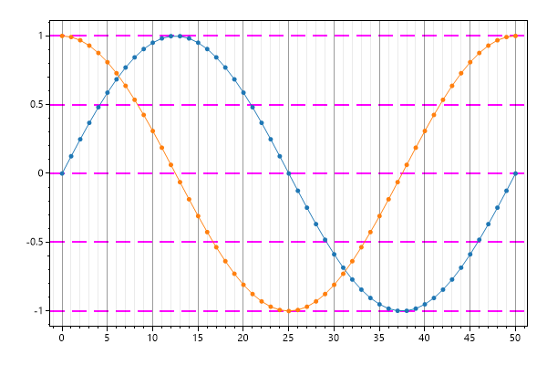


<h2><a id='numeric-format-string' href='/cookbook/4.1/recipes/ticks_numericformatstring/'>Numeric Format String</a></h2>

Tick labels can be converted to text using a custom format string.

```cs
var plt = new ScottPlot.Plot(600, 400);

// plot sample data
plt.AddSignal(DataGen.Sin(51));
plt.AddSignal(DataGen.Cos(51));

// See https://tinyurl.com/y86clj9k to learn about numeric format strings
plt.XAxis.TickLabelFormat("E2", dateTimeFormat: false);
plt.YAxis.TickLabelFormat("P1", dateTimeFormat: false);

plt.SaveFig("ticks_numericFormatString.png");
```

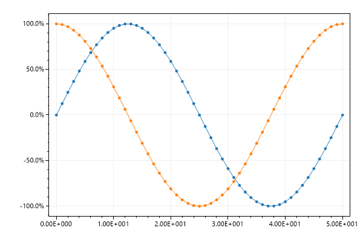


<h2><a id='manual-tick-labels' href='/cookbook/4.1/recipes/ticks_defined/'>Manual Tick Labels</a></h2>

Tick positions and labels can be defined manually.

```cs
var plt = new ScottPlot.Plot(600, 400);

// plot sample data
plt.AddSignal(DataGen.Sin(51));
plt.AddSignal(DataGen.Cos(51));

// manually define X axis tick positions and labels
double[] xPositions = { 7, 21, 37, 46 };
string[] xLabels = { "VII", "XXI", "XXXVII", "XLVI" };
plt.XAxis.ManualTickPositions(xPositions, xLabels);

// manually define Y axis tick positions and labels
double[] yPositions = { -1, 0, .5, 1 };
string[] yLabels = { "bottom", "center", "half", "top" };
plt.YAxis.ManualTickPositions(yPositions, yLabels);

plt.SaveFig("ticks_defined.png");
```

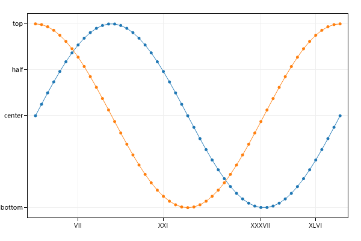


<h2><a id='manual-and-automatic-tick-labels' href='/cookbook/4.1/recipes/ticks_defined_and_unioned/'>Manual and Automatic Tick Labels</a></h2>

Tick positions and labels can be defined manually, but also added alongside automatic tick labels.

```cs
var plt = new ScottPlot.Plot(600, 400);

plt.AddSignal(DataGen.Sin(15), 2);
plt.AddSignal(DataGen.Cos(15), 2);

double[] positions = { Math.PI, 2 * Math.PI };
string[] labels = { "π", "2π" };
plt.XAxis.AutomaticTickPositions(positions, labels);
plt.XAxis.TickDensity(0.5);

plt.SaveFig("ticks_defined_and_unioned.png");
```

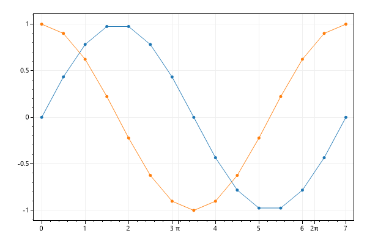


<h2><a id='nonlinear-tick-spacing' href='/cookbook/4.1/recipes/ticks_nonlinearx/'>NonLinear Tick Spacing</a></h2>

Plot data on regular cartesian space then manually control axis labels to give the appearance of non-linear spacing between points.

```cs
var plt = new ScottPlot.Plot(600, 400);

// these are our nonlinear data values we wish to plot
double[] amplitudes = { 23.9, 24.2, 24.3, 24.5, 25.3, 26.3, 27.6, 31.4, 33.7, 36,
38.4, 42, 43.5, 46.1, 48.8, 51.5, 53.2, 55, 56.9, 58.7, 60.6 };
double[] frequencies = { 50, 63, 80, 100, 125, 160, 200, 250, 315, 400, 500, 630,
 800, 1000, 1250, 1600, 2000, 2500, 3150, 4000, 5000 };

// ignore the "real" X values and plot data at consecutive X values (0, 1, 2, 3...)
double[] positions = DataGen.Consecutive(frequencies.Length);
plt.AddScatter(positions, amplitudes);

// then define tick labels based on "real" X values, rotate them, and give them extra space
string[] labels = frequencies.Select(x => x.ToString()).ToArray();
plt.XAxis.ManualTickPositions(positions, labels);
plt.XAxis.TickLabelStyle(rotation: 45);
plt.XAxis.SetSizeLimit(min: 50); // extra space for rotated ticks

// apply axis labels, trigging a layout reset
plt.Title("Vibrational Coupling");
plt.YLabel("Amplitude (dB)");
plt.XLabel("Frequency (Hz)");

plt.SaveFig("ticks_nonLinearX.png");
```

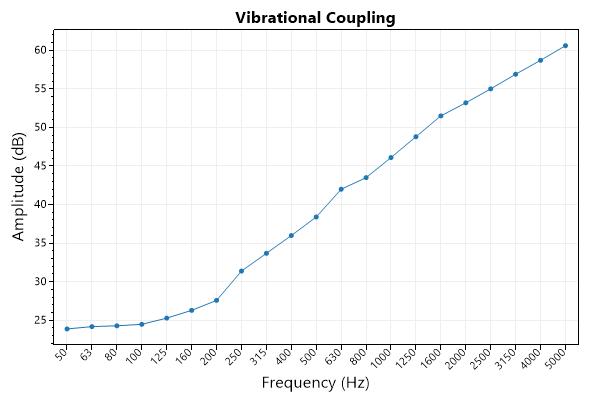


<h2><a id='manual-ticks' href='/cookbook/4.1/recipes/ticks_manual/'>Manual Ticks</a></h2>

Full customization of ticks can be achieved using the ManualTickCollection helper class.

```cs
var plt = new ScottPlot.Plot(600, 400);

plt.AddSignal(DataGen.Sin(51));
plt.AddSignal(DataGen.Cos(51));

// use a helper class to build a colelction of major and minor ticks
ScottPlot.Ticks.ManualTickCollection tc = new();

// add major ticks with their labels
tc.AddMajor(0, "zero");
tc.AddMajor(20, "twenty");
tc.AddMajor(50, "fifty");

// add minor ticks
tc.AddMinor(22);
tc.AddMinor(25);
tc.AddMinor(32);
tc.AddMinor(35);
tc.AddMinor(42);
tc.AddMinor(45);

// get the tick array and apply it to the axis
ScottPlot.Ticks.Tick[] ticks = tc.GetTicks();
plt.BottomAxis.SetTicks(ticks);

plt.SaveFig("ticks_manual.png");
```

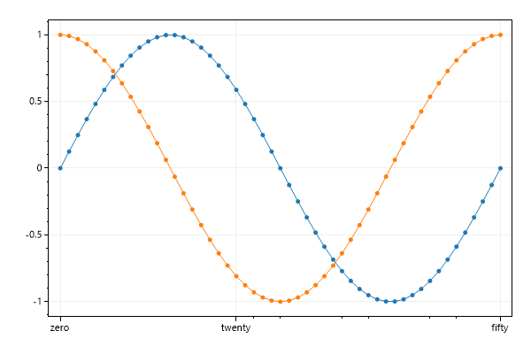


<h2><a id='reverse-axis-direction' href='/cookbook/4.1/recipes/reverse_axisdirection/'>Reverse Axis Direction</a></h2>

Plot data on reversed axis. And all points plotted match the reverse coordinate axis.

```cs
var plt = new ScottPlot.Plot(600, 400);

plt.AddSignal(DataGen.Sin(51), label: "sin");
plt.AddSignal(DataGen.Cos(51), label: "cos");
plt.Legend();

plt.XAxis.IsReverse = true;
plt.YAxis.IsReverse = true;

plt.SaveFig("reverse_axisDirection.png");
```

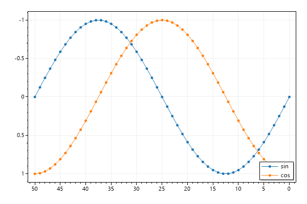


<h2><a id='descending-ticks' href='/cookbook/4.1/recipes/ticks_descending/'>Descending Ticks</a></h2>

Axis tick labels can be inverted in sign to give the apperance of a reversed axis.

```cs
var plt = new ScottPlot.Plot(600, 400);

plt.AddSignal(DataGen.Sin(51), label: "sin");
plt.AddSignal(DataGen.Cos(51), label: "cos");
plt.Legend();

plt.XAxis.TickLabelNotation(invertSign: true);
plt.YAxis.TickLabelNotation(invertSign: true);

plt.SaveFig("ticks_descending.png");
```

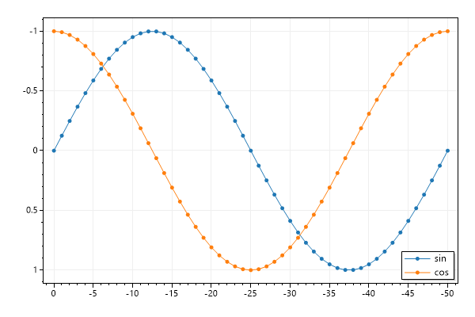


<h2><a id='defined-tick-spacing' href='/cookbook/4.1/recipes/ticks_definedspacing/'>Defined Tick Spacing</a></h2>

The space between tick marks can be manually defined by setting the grid spacing.

```cs
var plt = new ScottPlot.Plot(600, 400);

// plot the positive data in the negative space
double[] values = DataGen.Sin(50);
var sig = plt.AddSignal(values);
sig.OffsetX = -50;

// then invert the sign of the axis tick labels
plt.XAxis.ManualTickSpacing(2);
plt.YAxis.ManualTickSpacing(.1);

plt.SaveFig("ticks_definedSpacing.png");
```

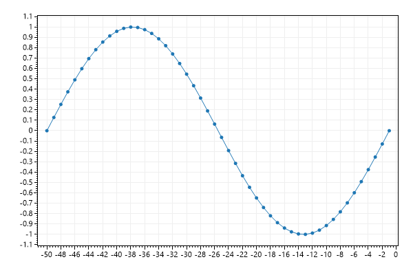


<h2><a id='tick-label-culture' href='/cookbook/4.1/recipes/ticks_culture/'>Tick Label Culture</a></h2>

Large numbers and dates are formatted differently for different cultures. Hungarian uses spaces to separate large numbers and periods to separate fields in dates.

```cs
var plt = new ScottPlot.Plot(600, 400);

// generate some data
double[] price = DataGen.RandomWalk(null, 60 * 8, 10000);
DateTime start = new DateTime(2019, 08, 25, 8, 30, 00);
double pointsPerDay = 24 * 60;

// create the plot
var sig = plt.AddSignal(price, pointsPerDay);
sig.OffsetX = start.ToOADate();

// set the localization
var culture = System.Globalization.CultureInfo.CreateSpecificCulture("hu"); // Hungarian
plt.SetCulture(culture);

// further decorate the plot
plt.XAxis.DateTimeFormat(true);
plt.YAxis.Label("Price");
plt.XAxis.Label("Date and Time");
plt.XAxis2.Label("Hungarian Formatted DateTime Tick Labels");

plt.SaveFig("ticks_culture.png");
```

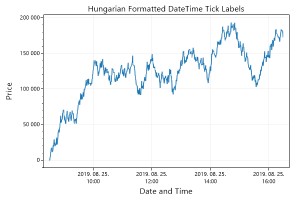


<h2><a id='custom-tick-label-culture' href='/cookbook/4.1/recipes/ticks_culturecustom/'>Custom Tick Label Culture</a></h2>

SetCulture() as arguments to let the user manually define formatting strings which will be used globally to change how numbers and dates are formatted.

```cs
var plt = new ScottPlot.Plot(600, 400);

// generate 10 days of data
int pointCount = 10;
double[] values = DataGen.RandomWalk(null, pointCount);
double[] days = new double[pointCount];
DateTime day1 = new DateTime(1985, 09, 24);
for (int i = 0; i < days.Length; i++)
    days[i] = day1.AddDays(1).AddDays(i).ToOADate();

// plot the data with custom tick format (https://tinyurl.com/ycwh45af)
plt.AddScatter(days, values);
plt.XAxis.TickLabelFormat("M\\/dd", dateTimeFormat: true);

plt.SaveFig("ticks_cultureCustom.png");
```

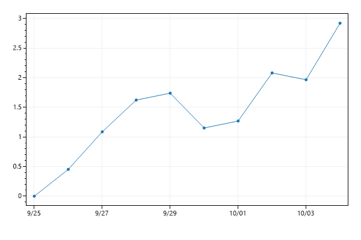


<h2><a id='multiplier-notation' href='/cookbook/4.1/recipes/ticks_multiplier/'>Multiplier Notation</a></h2>

Multiplier notation keeps tick labels small when plotting large data values. This style is also called engineering notation or scientific notation.

```cs
var plt = new ScottPlot.Plot(600, 400);

plt.AddLine(-1e5, -1e10, 1e5, 1e10);

plt.XAxis.TickLabelNotation(multiplier: true);
plt.YAxis.TickLabelNotation(multiplier: true);

plt.SaveFig("ticks_multiplier.png");
```


<h2><a id='offset-notation' href='/cookbook/4.1/recipes/ticks_offset/'>Offset Notation</a></h2>

Offset notation keeps tick labels small when plotting large data values that are close together.

```cs
var plt = new ScottPlot.Plot(600, 400);

plt.AddLine(1e5 + 111, 1e10 + 111, 1e5 + 222, 1e10 + 222);

plt.XAxis.TickLabelNotation(offset: true);
plt.YAxis.TickLabelNotation(offset: true);

plt.SaveFig("ticks_offset.png");
```

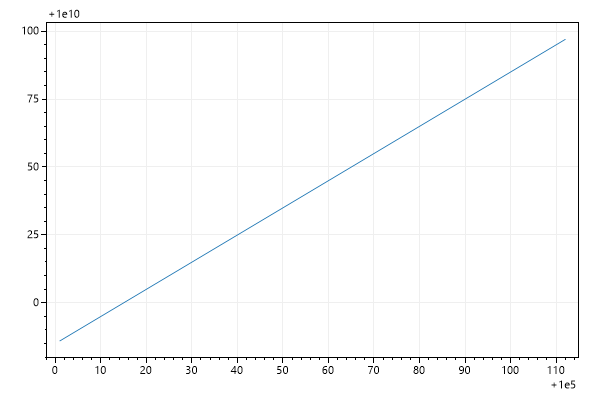


<h2><a id='defined-datetime-spacing' href='/cookbook/4.1/recipes/ticks_defineddatetimespace/'>Defined DateTime Spacing</a></h2>

This example shows how to use a fixed inter-tick distance for a DateTime axis

```cs
var plt = new ScottPlot.Plot(600, 400);

// create a series of dates
int pointCount = 20;
double[] dates = new double[pointCount];
var firstDay = new DateTime(2020, 1, 22);
for (int i = 0; i < pointCount; i++)
    dates[i] = firstDay.AddDays(i).ToOADate();

// simulate data for each date
double[] values = new double[pointCount];
Random rand = new Random(0);
for (int i = 1; i < pointCount; i++)
    values[i] = values[i - 1] + rand.NextDouble();

plt.AddScatter(dates, values);
plt.XAxis.DateTimeFormat(true);

// define tick spacing as 1 day (every day will be shown)
plt.XAxis.ManualTickSpacing(1, ScottPlot.Ticks.DateTimeUnit.Day);
plt.XAxis.TickLabelStyle(rotation: 45);

// add some extra space for rotated ticks
plt.XAxis.SetSizeLimit(min: 50);

plt.SaveFig("ticks_definedDateTimeSpace.png");
```

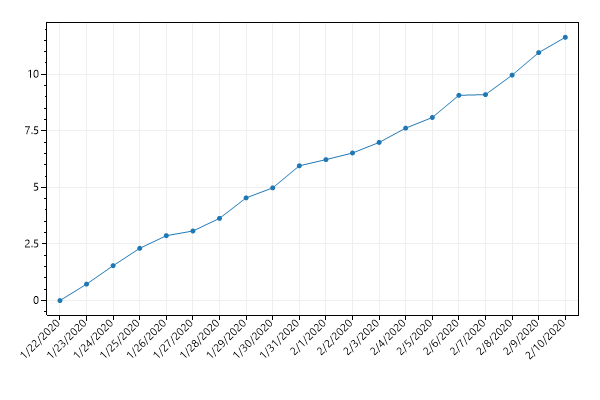


<h2><a id='log-scale' href='/cookbook/4.1/recipes/asis_log/'>Log Scale</a></h2>

ScottPlot is designed to display 2D data on linear X and Y axes, but you can log-transform data before plotting it and customize the ticks and grid to give the appearance of logarithmic scales.

```cs
var plt = new ScottPlot.Plot(600, 400);

// These are the dat we will plot with a linear X scale but log Y scale
double[] xs = { 1, 2, 3, 4, 5 };
double[] ys = { 10, 2_000, 50_000, 1_000_000, 1_500_000 };

// Plot the Log10 of all the Y values
double[] logYs = ys.Select(y => Math.Log10(y)).ToArray();
var scatter = plt.AddScatter(xs, logYs, lineWidth: 2, markerSize: 10);

// Use a custom formatter to control the label for each tick mark
static string logTickLabels(double y) => Math.Pow(10, y).ToString("N0");
plt.YAxis.TickLabelFormat(logTickLabels);

// Use log-spaced minor tick marks and grid lines to make it more convincing
plt.YAxis.MinorLogScale(true);
plt.YAxis.MajorGrid(true, Color.FromArgb(80, Color.Black));
plt.YAxis.MinorGrid(true, Color.FromArgb(20, Color.Black));
plt.XAxis.MajorGrid(true, Color.FromArgb(80, Color.Black));

// Set the axis limits manually to ensure edges terminate at desirable locations
plt.SetAxisLimits(0, 6, 0, Math.Log10(10_000_000));

plt.SaveFig("asis_log.png");
```

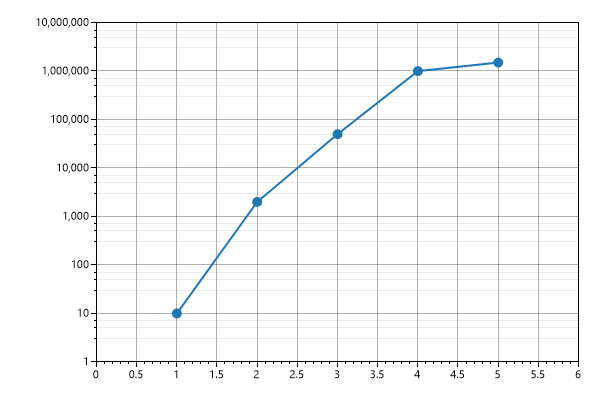


<h2><a id='log-scale-tick-density' href='/cookbook/4.1/recipes/asis_logtickdensity/'>Log Scale Tick Density</a></h2>

Numer of minor ticks between major ticks can be customized.

```cs
var plt = new ScottPlot.Plot(600, 400);

double[] ys = ScottPlot.DataGen.Range(100, 10_000, 100, true);
double[] xs = ScottPlot.DataGen.Consecutive(ys.Length);
double[] logYs = ys.Select(y => Math.Log10(y)).ToArray();

var scatter = plt.AddScatter(xs, logYs);

static string logTickLabels(double y) => Math.Pow(10, y).ToString("N0");
plt.YAxis.TickLabelFormat(logTickLabels);

// set the number of minor ticks per major tick here
plt.YAxis.MinorLogScale(true, minorTickCount: 20);

// darken grid line colors
plt.YAxis.MinorGrid(true);
plt.YAxis.MinorGrid(true, Color.FromArgb(20, Color.Black));
plt.YAxis.MajorGrid(true, Color.FromArgb(80, Color.Black));
plt.XAxis.MajorGrid(true, Color.FromArgb(80, Color.Black));

plt.SaveFig("asis_logTickDensity.png");
```

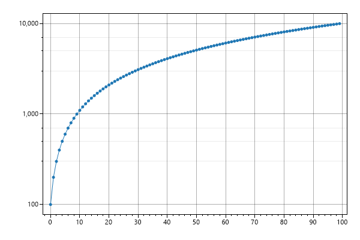


<h2><a id='ruler-mode' href='/cookbook/4.1/recipes/asis_ruler/'>Ruler mode</a></h2>

Ruler mode is an alternative way to display axis ticks. It draws long ticks and offsets the tick labels to give the appearance of a ruler.

```cs
var plt = new ScottPlot.Plot(600, 400);

plt.AddSignal(DataGen.Sin(51));
plt.AddSignal(DataGen.Cos(51));

plt.XAxis.RulerMode(true);
plt.YAxis.RulerMode(true);

plt.SaveFig("asis_ruler.png");
```

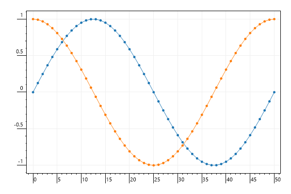


<h2><a id='polar-coordinates' href='/cookbook/4.1/recipes/asis_polar/'>Polar Coordinates</a></h2>

A helper function converts radius and theta arrays into Cartesian coordinates suitable for plotting with traditioanl plot types.

```cs
var plt = new ScottPlot.Plot(600, 400);

// create data with polar coordinates
int count = 400;
double step = 0.01;

double[] rs = new double[count];
double[] thetas = new double[count];

for (int i = 0; i < rs.Length; i++)
{
    rs[i] = 1 + i * step;
    thetas[i] = i * 2 * Math.PI * step;
}

// convert polar data to Cartesian data
(double[] xs, double[] ys) = ScottPlot.Tools.ConvertPolarCoordinates(rs, thetas);

// plot the Cartesian data
plt.AddScatter(xs, ys);

// decorate the plot
plt.Title("Scatter Plot of Polar Data");
plt.AxisScaleLock(true);

plt.SaveFig("asis_polar.png");
```

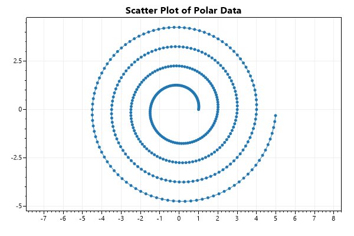


<h2><a id='images-as-axis-labels' href='/cookbook/4.1/recipes/asis_image/'>Images as Axis Labels</a></h2>

Images can be used as axis labels to allow for things like LaTeX axis labels.

```cs
var plt = new ScottPlot.Plot(600, 400);

// create an interesting plot
double[] xs = DataGen.Range(-5, 5, .5);
double[] ys = DataGen.Range(-5, 5, .5);
Vector2[,] vectors = new Vector2[xs.Length, ys.Length];
for (int i = 0; i < xs.Length; i++)
    for (int j = 0; j < ys.Length; j++)
        vectors[i, j] = new Vector2(ys[j], -15 * Math.Sin(xs[i]));
plt.AddVectorField(vectors, xs, ys, colormap: Drawing.Colormap.Turbo);

// use images as axis labels
plt.XAxis.ImageLabel(new Bitmap("Images/theta.png"));
plt.YAxis.ImageLabel(new Bitmap("Images/d_theta_dt.png"));

plt.SaveFig("asis_image.png");
```

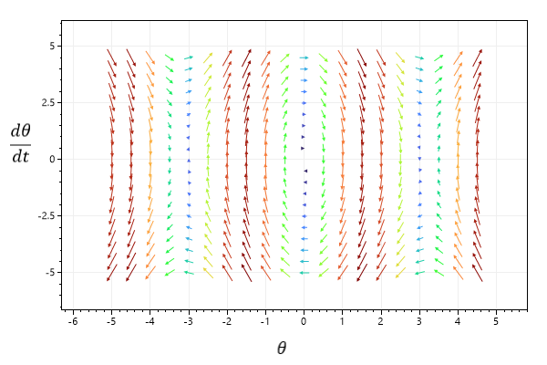


<h2><a id='transparent-images-axis-labels' href='/cookbook/4.1/recipes/asis_imagetransparent/'>Transparent Images Axis Labels</a></h2>

Transparency in PNGs is respected, but JPEG files do not support transparency.

```cs
var plt = new ScottPlot.Plot(600, 400);

plt.Style(Style.Light2);
plt.AddSignal(DataGen.Sin(51));
plt.AddSignal(DataGen.Cos(51));

// vertical axis label uses a transparent PNG
plt.YAxis.ImageLabel(new Bitmap("Images/d_theta_dt.png"));

// horizontal axis label uses a non-transparent JPEG
plt.XAxis.ImageLabel(new Bitmap("Images/theta.jpg"));

plt.SaveFig("asis_imageTransparent.png");
```

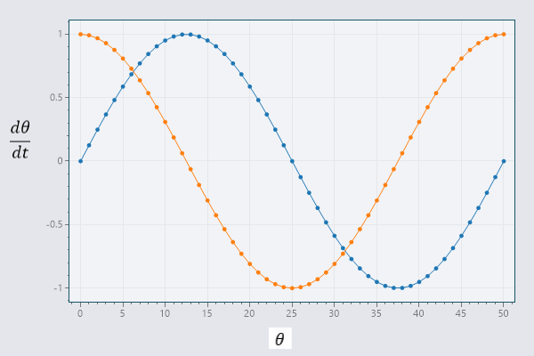


<h2><a id='tick-density' href='/cookbook/4.1/recipes/asis_tickdensity/'>Tick Density</a></h2>

Axis tick density can be adjusted by the user. The largest the density is, the more ticks are displayed. Setting this value too high will result in overlapping tick labels.

```cs
var plt = new ScottPlot.Plot(600, 400);

plt.AddSignal(DataGen.Sin(51));
plt.AddSignal(DataGen.Cos(51));

plt.XAxis.Label("Lower Density Ticks");
plt.XAxis.TickDensity(0.2);

plt.YAxis.Label("Higher Density Ticks");
plt.YAxis.TickDensity(3);

plt.SaveFig("asis_tickDensity.png");
```

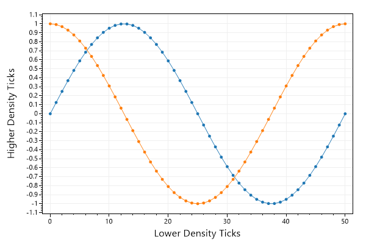


<h2><a id='minimum-tick-spacing' href='/cookbook/4.1/recipes/asis_minimumtickspacing/'>Minimum Tick Spacing</a></h2>

Minimum tick spacing can be defined such that zooming in does not produce more grid lines, ticks, and tick labels beyond the defined limit.

```cs
var plt = new ScottPlot.Plot(600, 400);

plt.AddSignal(DataGen.Sin(51));
plt.AddSignal(DataGen.Cos(51));

plt.YAxis.MinimumTickSpacing(1);
plt.XAxis.MinimumTickSpacing(25);

plt.SaveFig("asis_minimumTickSpacing.png");
```

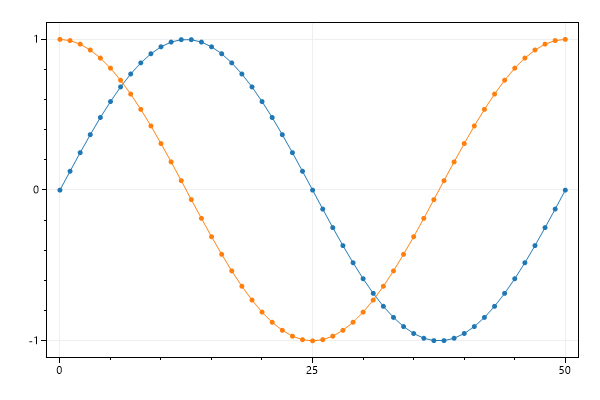


<h2><a id='custom-tick-formatter' href='/cookbook/4.1/recipes/asis_custom_tick_formatter/'>Custom Tick Formatter</a></h2>

For ultimate control over tick label format you can create a custom formatter function and use that to convert positions to labels. This allows logic to be used to format tick labels.

```cs
var plt = new ScottPlot.Plot(600, 400);

plt.AddSignal(ScottPlot.DataGen.Sin(51));
plt.AddSignal(ScottPlot.DataGen.Cos(51));

// create a custom formatter as a static class
static string customTickFormatter(double position)
{
    if (position == 0)
        return "zero";
    else if (position > 0)
        return $"+{position:F2}";
    else
        return $"({Math.Abs(position):F2})";
}

// use the custom formatter for horizontal and vertical tick labels
plt.XAxis.TickLabelFormat(customTickFormatter);
plt.YAxis.TickLabelFormat(customTickFormatter);

plt.SaveFig("asis_custom_tick_formatter.png");
```

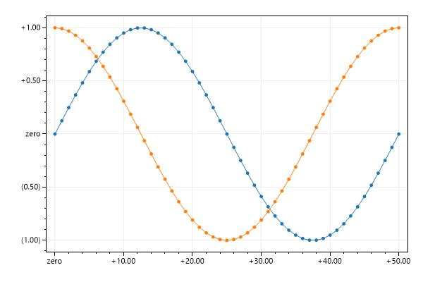


<h2><a id='invert-tick-mark-direction' href='/cookbook/4.1/recipes/ticks_invert_tick_mark_direction/'>Invert tick mark direction</a></h2>

Tick marks can be outward (default) or inverted to appear as inward lines relative to the edge of the plot area.

```cs
var plt = new ScottPlot.Plot(600, 400);

plt.AddSignal(DataGen.Sin(51));
plt.AddSignal(DataGen.Cos(51));

plt.XAxis.TickMarkDirection(outward: false);
plt.YAxis.TickMarkDirection(outward: false);

plt.SaveFig("ticks_invert_tick_mark_direction.png");
```

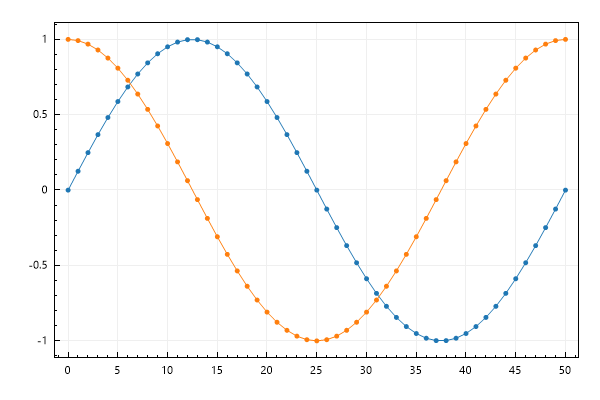


<h2><a id='advanced-axis-customization' href='/cookbook/4.1/recipes/advanced_axis_customization/'>Advanced Axis Customization</a></h2>

Axis labels, tick marks, and axis lines can all be extensively customized by interacting directly with axis configuration objects.

```cs
var plt = new ScottPlot.Plot(600, 400);

plt.AddSignal(DataGen.Sin(51));
plt.AddSignal(DataGen.Cos(51));

plt.XAxis.AxisTicks.MajorTickLength = 10;
plt.XAxis.AxisTicks.MinorTickLength = 5;

plt.XAxis.AxisTicks.MajorTickColor = Color.Magenta;
plt.XAxis.AxisTicks.MinorTickColor = Color.LightSkyBlue;

plt.YAxis.AxisLine.Width = 3;

plt.SaveFig("advanced_axis_customization.png");
```

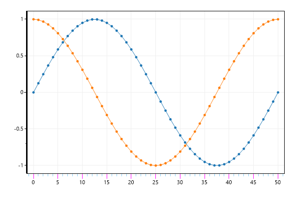


