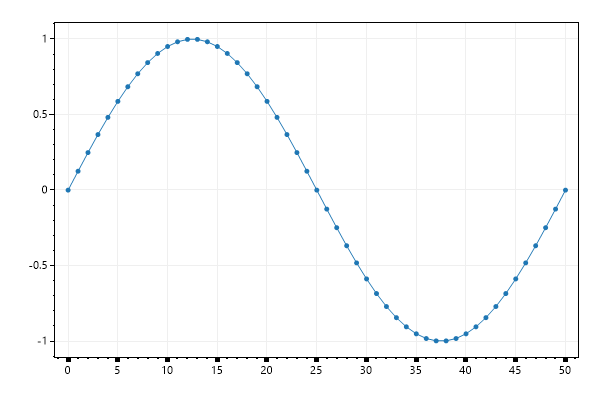
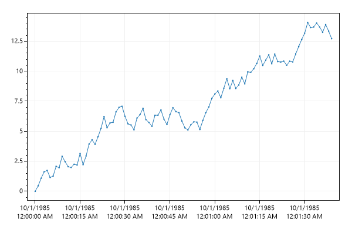

# Axis and Ticks
* This page contains recipes for the _Axis and Ticks_ category.
* Visit the [Cookbook Home Page](../../) to view all cookbook recipes.
* Generated by ScottPlot 4.1.70 on 12/28/2023
<h2><a id='axis-customizations' href='/cookbook/4.1/recipes/axis_label/'>Axis Customizations</a></h2>

Axes can be customized different ways. Axis labels and colors are the most common types of customizations.

```cs
var plt = new ScottPlot.Plot(600, 400);

// plot sample data
plt.AddSignal(DataGen.Sin(51));
plt.AddSignal(DataGen.Cos(51));

// These shortcuts are the easiest way to set axis labels
plt.XLabel("Horizontal Axis");
plt.YLabel("Vertical Axis");
plt.Title("Axis Customization");

// Axes labels can be further customized for any axis
plt.YAxis.Label("Vertical Axis", Color.Magenta, size: 24, fontName: "Comic Sans MS");

// This method will set the color of axis labels, lines, ticks, and tick labels
plt.XAxis.Color(Color.Green);

plt.SaveFig("Axis_label.png");
```


<h2><a id='disable-grid' href='/cookbook/4.1/recipes/axis_griddisableall/'>Disable Grid</a></h2>

Visibility of primary X and Y grids can be set using a single method.

```cs
var plt = new ScottPlot.Plot(600, 400);

// plot sample data
plt.AddSignal(DataGen.Sin(51));
plt.AddSignal(DataGen.Cos(51));

// hide grids
plt.Grid(false);

plt.SaveFig("axis_gridDisableAll.png");
```


<h2><a id='disable-vertical-grid' href='/cookbook/4.1/recipes/axis_griddisableone/'>Disable Vertical Grid</a></h2>

Grid line visibility can be controlled for each axis individually. Use this to selectively enable grid lines only for the axes of interest. Keep in mind that vertical grid lines are controlled by horizontal axes.

```cs
var plt = new ScottPlot.Plot(600, 400);

// plot sample data
plt.AddSignal(DataGen.Sin(51));
plt.AddSignal(DataGen.Cos(51));

// each axis has its own visibility controls
plt.XAxis.Grid(false);

plt.SaveFig("axis_gridDisableOne.png");
```


<h2><a id='draw-grid-above-plottables' href='/cookbook/4.1/recipes/axis_gridabove/'>Draw Grid Above Plottables</a></h2>

Sometimes it's useful to draw the grid lines above the plottables rather than below.

```cs
var plt = new ScottPlot.Plot(600, 400);

double[] xs = DataGen.Consecutive(51);
double[] sines = DataGen.Sin(51);
double[] cosines = DataGen.Cos(51);

plt.AddScatter(xs, sines);
plt.AddScatter(xs, cosines);
plt.AddFill(xs, sines);
plt.AddFill(xs, cosines);

plt.Grid(onTop: true);

plt.SaveFig("axis_gridAbove.png");
```


<h2><a id='grid-style' href='/cookbook/4.1/recipes/asis_gridconfigure/'>Grid Style</a></h2>

Common grid line configurations are available.

```cs
var plt = new ScottPlot.Plot(600, 400);

// plot sample data
plt.AddSignal(DataGen.Sin(51));
plt.AddSignal(DataGen.Cos(51));

// these helper methods set grid 
plt.Grid(color: Color.FromArgb(50, Color.Green));
plt.Grid(lineStyle: LineStyle.Dot);

plt.SaveFig("asis_gridConfigure.png");
```


<h2><a id='frameless-plots' href='/cookbook/4.1/recipes/asis_frameless/'>Frameless Plots</a></h2>

Frameless plots can display data that appraoches the edge of the figure.

```cs
var plt = new ScottPlot.Plot(600, 400);

plt.AddSignal(DataGen.Sin(51));
plt.AddSignal(DataGen.Cos(51));
plt.AxisAuto(0, 0); // zero margin between data and edge of plot
plt.Frameless();

plt.SaveFig("asis_frameless.png");
```


<h2><a id='one-axis-only' href='/cookbook/4.1/recipes/one_axisonly/'>One Axis Only</a></h2>

Axis ticks and lines can be disabled. Note that hiding them in this way preserves their whitespace. Setting XAxis.IsVisible to false would collapse the axis entirely. 

```cs
var plt = new ScottPlot.Plot(600, 400);

// plot sample data
plt.AddSignal(DataGen.Sin(51));
plt.AddSignal(DataGen.Cos(51));

// hide just the horizontal axis ticks
plt.XAxis.Ticks(false);

// hide the lines on the bottom, right, and top of the plot
plt.XAxis.Line(false);
plt.YAxis2.Line(false);
plt.XAxis2.Line(false);

plt.SaveFig("one_axisonly.png");
```


<h2><a id='rotated-x-ticks' href='/cookbook/4.1/recipes/ticks_rotated/'>Rotated X Ticks</a></h2>

Horizontal tick labels can be rotated as desired.

```cs
var plt = new ScottPlot.Plot(600, 400);

// plot sample data
plt.AddSignal(DataGen.Sin(51));
plt.AddSignal(DataGen.Cos(51));
plt.XAxis.Label("Horizontal Axis");
plt.YAxis.Label("Vertical Axis");

// rotate horizontal axis tick labels
plt.XAxis.TickLabelStyle(rotation: 45);

plt.SaveFig("ticks_rotated.png");
```


<h2><a id='rotated-y-ticks' href='/cookbook/4.1/recipes/ticks_rotatedy/'>Rotated Y Ticks</a></h2>

Vertical tick labels can be rotated as desired.

```cs
var plt = new ScottPlot.Plot(600, 400);

// plot sample data
plt.AddSignal(DataGen.Sin(51));
plt.AddSignal(DataGen.Cos(51));
plt.XAxis.Label("Horizontal Axis");
plt.YAxis.Label("Vertical Axis");

// rotate horizontal axis tick labels
plt.YAxis.TickLabelStyle(rotation: 45);

plt.SaveFig("ticks_rotatedY.png");
```


<h2><a id='x-ticks-width' href='/cookbook/4.1/recipes/ticks_width/'>X Ticks Width</a></h2>

This example show how to change the width of the X axe ticks

```cs
var plt = new ScottPlot.Plot(600, 400);

//Plot sample data
plt.AddSignal(DataGen.Sin(51));

//Change the width of the ticks
plt.XAxis.AxisTicks.MajorLineWidth = 5;
plt.XAxis.AxisTicks.MinorLineWidth = 2;

plt.SaveFig("ticks_width.png");
```




<h2><a id='plotting-datetime-data' href='/cookbook/4.1/recipes/ticks_datetime/'>Plotting DateTime Data</a></h2>

This example shows how to display DateTime data on the horizontal axis. Use DateTime.ToOADate() to convert DateTime[] to double[], plot the data,  then tell the axis to format tick labels as dates.

```cs
var plt = new ScottPlot.Plot(600, 400);

// create data sample data
DateTime[] myDates = new DateTime[100];
for (int i = 0; i < myDates.Length; i++)
    myDates[i] = new DateTime(1985, 9, 24).AddDays(7 * i);

// Convert DateTime[] to double[] before plotting
double[] xs = myDates.Select(x => x.ToOADate()).ToArray();
double[] ys = DataGen.RandomWalk(myDates.Length);
plt.AddScatter(xs, ys);

// Then tell the axis to display tick labels using a time format
plt.XAxis.DateTimeFormat(true);

plt.SaveFig("ticks_dateTime.png");
```


<h2><a id='plotting-datetime-data-on-a-signal-plot' href='/cookbook/4.1/recipes/ticks_datetime_signal/'>Plotting DateTime Data on a Signal Plot</a></h2>

DateTime can be displayed on the horizontal axis of a signal plot by using the sample rate to set the time interval per data point, and then setting the OffsetX to the desired start date.

```cs
var plt = new ScottPlot.Plot(600, 400);

// create data sample data
double[] ys = DataGen.RandomWalk(100);

TimeSpan ts = TimeSpan.FromSeconds(1); // time between data points
double sampleRate = (double)TimeSpan.TicksPerDay / ts.Ticks;
var signalPlot = plt.AddSignal(ys, sampleRate);

// Then tell the axis to display tick labels using a time format
plt.XAxis.DateTimeFormat(true);

// Set start date
signalPlot.OffsetX = new DateTime(1985, 10, 1).ToOADate();

plt.SaveFig("ticks_dateTime_signal.png");
```




<h2><a id='axis-boundary' href='/cookbook/4.1/recipes/axis_boundary/'>Axis Boundary</a></h2>

Axes can be given boundaries which prevent the user from panning outside a given range.

```cs
var plt = new ScottPlot.Plot(600, 400);

plt.AddSignal(DataGen.Sin(51));
plt.AddSignal(DataGen.Cos(51));

plt.YAxis.SetBoundary(-2, 2);
plt.XAxis.SetBoundary(-10, 60);

plt.SaveFig("Axis_boundary.png");
```


<h2><a id='axis-zoom-limit' href='/cookbook/4.1/recipes/axis_zoomlimit/'>Axis Zoom Limit</a></h2>

Axes can be given a zoom limit which allows the user to pan everywhere but never zoom in beyond a given span

```cs
var plt = new ScottPlot.Plot(600, 400);

plt.AddSignal(DataGen.Sin(51));
plt.AddSignal(DataGen.Cos(51));

plt.YAxis.SetZoomInLimit(2);
plt.XAxis.SetZoomInLimit(50);

plt.SaveFig("Axis_zoomLimit.png");
```


