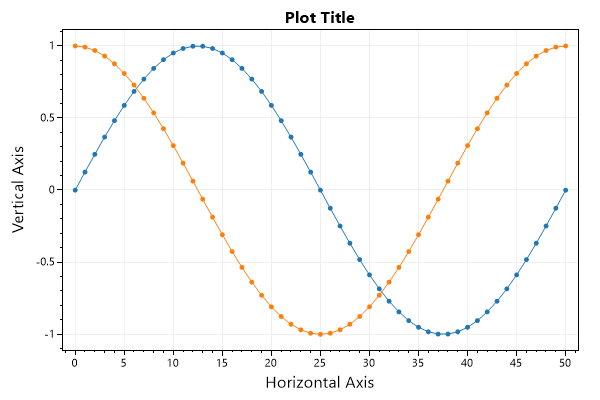
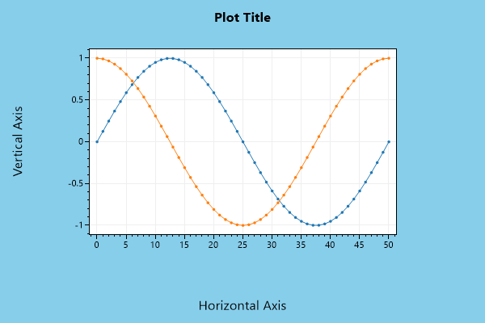
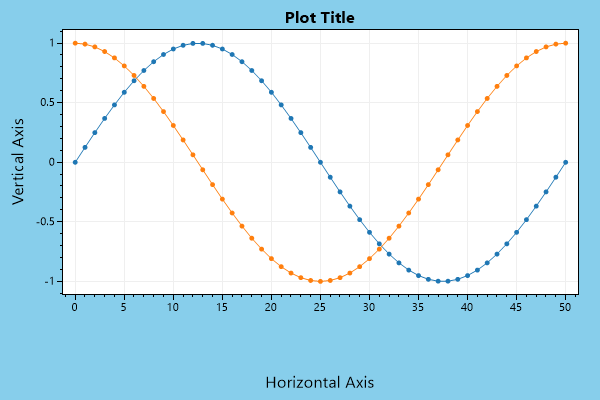
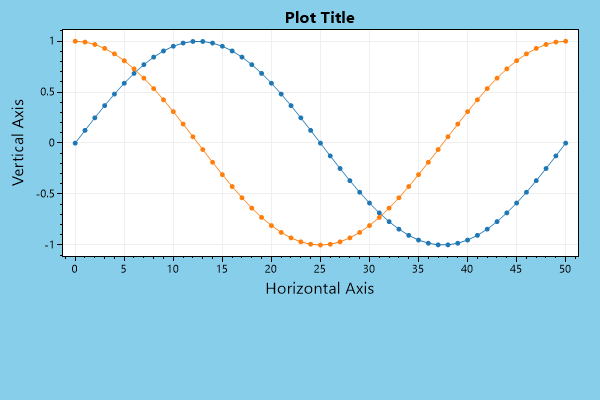
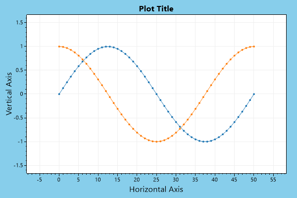
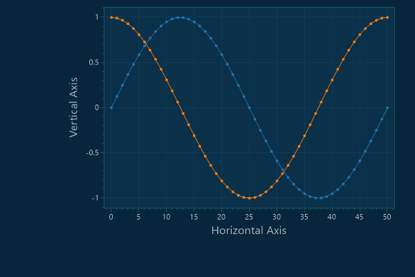

# Layout
* This page contains recipes for the _Layout_ category.
* Visit the [Cookbook Home Page](../../) to view all cookbook recipes.
* Generated by ScottPlot 4.1.70 on 12/28/2023
<h2><a id='default-layout' href='/cookbook/4.1/recipes/layout_default/'>Default Layout</a></h2>

ScottPlot has many ways to customize the layout. This example demonstrates the default layout, where padding around the data area is automatically determined by measuring the text in the axis labels and tick labels to ensure there is appropriate padding on all sides.

```cs
var plt = new ScottPlot.Plot(600, 400);

plt.AddSignal(DataGen.Sin(51));
plt.AddSignal(DataGen.Cos(51));
plt.XLabel("Horizontal Axis");
plt.YLabel("Vertical Axis");
plt.Title("Plot Title");

plt.SaveFig("layout_default.png");
```




<h2><a id='plot-layout' href='/cookbook/4.1/recipes/layout_plot/'>Plot Layout</a></h2>

Call Layout() to manually define padding on all edges of the data area. This is the easiest way to make room for large custom tick labels. Under the hood, this method sets the minimum size of all 4 primary axes.

```cs
var plt = new ScottPlot.Plot(600, 400);

plt.AddSignal(DataGen.Sin(51));
plt.AddSignal(DataGen.Cos(51));
plt.XLabel("Horizontal Axis");
plt.YLabel("Vertical Axis");
plt.Title("Plot Title");
plt.Style(figureBackground: Color.SkyBlue);

plt.Layout(left: 100, right: 100, bottom: 100, top: 50);

plt.SaveFig("layout_plot.png");
```




<h2><a id='axis-size' href='/cookbook/4.1/recipes/layout_axis_size/'>Axis Size</a></h2>

The size of each axis can be individually customized. Note that axes automatically resize themselves to accomodate tick labels, but this method lets users customize the min/max boundaries of axis size. Set both numbers to the same value to force an axis to always be a specific size.

```cs
var plt = new ScottPlot.Plot(600, 400);

plt.AddSignal(DataGen.Sin(51));
plt.AddSignal(DataGen.Cos(51));
plt.XLabel("Horizontal Axis");
plt.YLabel("Vertical Axis");
plt.Title("Plot Title");
plt.Style(figureBackground: Color.SkyBlue);

plt.XAxis.Layout(minimumSize: 100, maximumSize: 150);

plt.SaveFig("layout_axis_size.png");
```




<h2><a id='axis-padding' href='/cookbook/4.1/recipes/layout_axis_padding/'>Axis Padding</a></h2>

Axis label and ticks are enclosed in a rectangle that is automatically sized to accomodate them (optionally limited to a min/max size as seen earlier). This rectangle has a small amount of padding on all sides so axis labels do not touch the final pixel on the edge of the figure. The amount of extra padding around each axis can be customized.

```cs
var plt = new ScottPlot.Plot(600, 400);

plt.AddSignal(DataGen.Sin(51));
plt.AddSignal(DataGen.Cos(51));
plt.XLabel("Horizontal Axis");
plt.YLabel("Vertical Axis");
plt.Title("Plot Title");
plt.Style(figureBackground: Color.SkyBlue);

plt.XAxis.Layout(padding: 50);

plt.SaveFig("layout_axis_padding.png");
```




<h2><a id='frameless-plot' href='/cookbook/4.1/recipes/layout_frameless/'>Frameless Plot</a></h2>

The Frameless() method disables and collapses all axes so the data area is all that appears. Although the figure background is blue in this example, none of it will show, because the data area occupies all of the available space.

```cs
var plt = new ScottPlot.Plot(600, 400);

plt.AddSignal(DataGen.Sin(51));
plt.AddSignal(DataGen.Cos(51));
plt.Style(figureBackground: Color.SkyBlue);

plt.Frameless();

plt.SaveFig("layout_frameless.png");
```


<h2><a id='data-margins' href='/cookbook/4.1/recipes/layout_margins/'>Data Margins</a></h2>

Users who want to define the amount of space around their data can use Margins() to automatically pad data boundaries with a certain percentage of extra space when axis limits are calculated automatically. Note that this operation acts on the axis limits, and does not technically adjust the layout of the plot itself.

```cs
var plt = new ScottPlot.Plot(600, 400);

plt.AddSignal(DataGen.Sin(51));
plt.AddSignal(DataGen.Cos(51));
plt.XLabel("Horizontal Axis");
plt.YLabel("Vertical Axis");
plt.Title("Plot Title");
plt.Style(figureBackground: Color.SkyBlue);

// 25% horizontal padding means data occupies 75% of horizontal space
// 40% vertical padding means data occupies 60% of vertical space
plt.Margins(x: .25, y: .4);

plt.SaveFig("layout_margins.png");
```




<h2><a id='manual-data-area' href='/cookbook/4.1/recipes/layout_manual/'>Manual Data Area</a></h2>

The layout system automatically measures axis labels and ticks to provide a plot with the largest data area possible. However, this can be problematic for animated plots (with changing tick label sizes) or when users wish to achieve pixel-perfect similarity between two different plots. In these cases the user can manually override the layout system and define exactly how large the data area is.

```cs
var plt = new ScottPlot.Plot(600, 400);

plt.Style(Style.Blue1);
plt.AddSignal(DataGen.Sin(51));
plt.AddSignal(DataGen.Cos(51));
plt.XLabel("Horizontal Axis");
plt.YLabel("Vertical Axis");

var padding = new ScottPlot.PixelPadding(
    left: 150,
    right: 30,
    bottom: 100,
    top: 10);

plt.ManualDataArea(padding);

plt.SaveFig("layout_manual.png");
```




