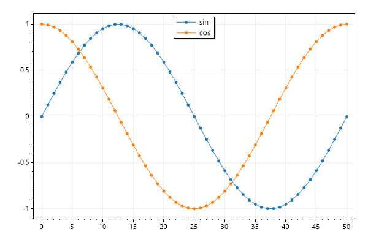
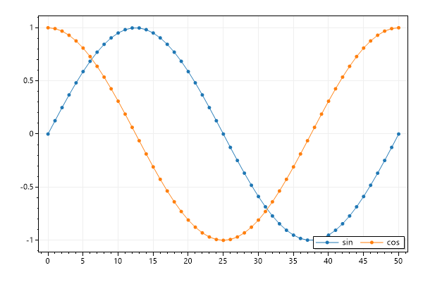

* This page contains recipes for the _Legend_ category.
* Visit the [Cookbook Home Page](../../) to view all cookbook recipes.
* Generated by ScottPlot 4.1.64 on 5/17/2023
## Legend Quickstart

Add labels to plot items, then enable the legend to display a key in the corner of the data area.

```cs
var plt = new ScottPlot.Plot(600, 400);

// add a label using the helper methods
plt.AddSignal(Generate.Sin(), label: "sin");

// or add a label manually
var sig2 = plt.AddSignal(Generate.Cos());
sig2.Label = "Second Label";

// enable the legend
plt.Legend();

plt.SaveFig("legend_quickstart.png");
```


## Legend Location

Legends can be placed at various locations within the plot area

```cs
var plt = new ScottPlot.Plot(600, 400);

plt.AddSignal(Generate.Sin(), label: "sin");
plt.AddSignal(Generate.Cos(), label: "cos");

var legend = plt.Legend();
legend.Location = Alignment.UpperCenter;

plt.SaveFig("legend_location.png");
```




## Legend Orientation

Legends can be customized to support horizontal orientation

```cs
var plt = new ScottPlot.Plot(600, 400);

plt.AddSignal(DataGen.Sin(51), label: "sin");
plt.AddSignal(DataGen.Cos(51), label: "cos");

var legend = plt.Legend(enable: true);
legend.Orientation = Orientation.Horizontal;

plt.SaveFig("legend_orientation.png");
```




