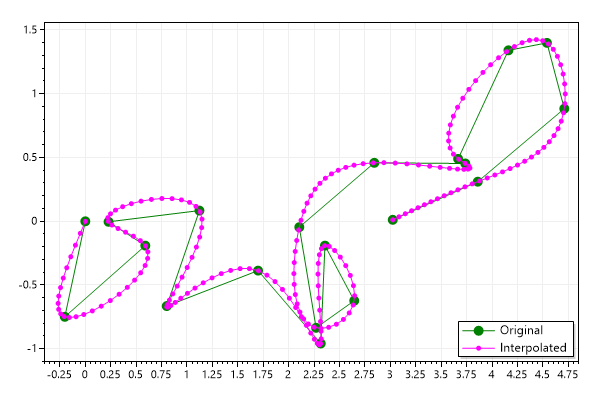
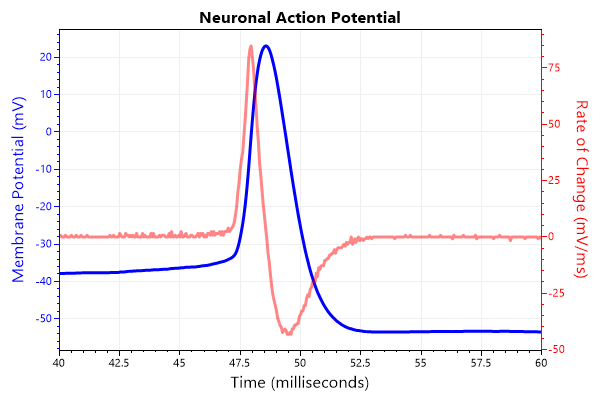
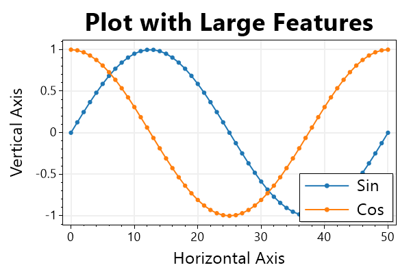
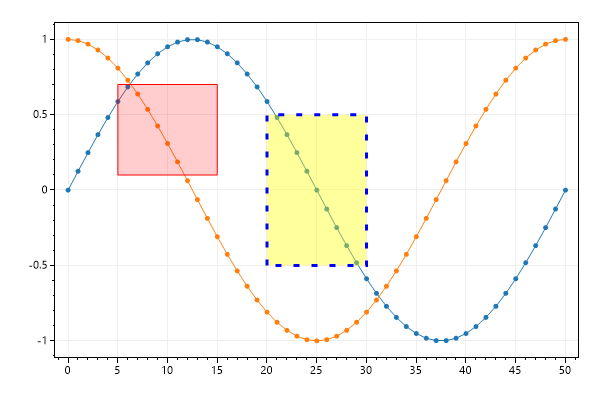

# Miscellaneous
* This page contains recipes for the _Miscellaneous_ category.
* Visit the [Cookbook Home Page](../../) to view all cookbook recipes.
* Generated by ScottPlot 4.1.69 on 12/24/2023
<h2><a id='spline-interpolation' href='/cookbook/4.1/recipes/misc_interpolation/'>Spline Interpolation</a></h2>

Interpolated splines create curves with many X/Y points to smoothly connect a limited number of input points.

```cs
var plt = new ScottPlot.Plot(600, 400);

// create a small number of X/Y data points and display them
Random rand = new(1234);
double[] xs = DataGen.RandomWalk(rand, 20);
double[] ys = DataGen.RandomWalk(rand, 20);

// interpolate the data to create a smooth curve
(double[] smoothXs, double[] smoothYs) = ScottPlot.Statistics.Interpolation.Cubic.InterpolateXY(xs, ys, 200);

// plot the original vs interpolated lines
plt.AddScatter(xs, ys, Color.Green, markerSize: 10, lineWidth: 1, label: "Original");
plt.AddScatter(smoothXs, smoothYs, Color.Magenta, label: "Interpolated");
plt.Legend();

plt.SaveFig("misc_interpolation.png");
```




<h2><a id='spline-interpolation-types' href='/cookbook/4.1/recipes/misc_interpolation_types/'>Spline Interpolation Types</a></h2>

Different methods are available for smoothing data using interpolation, curve fitting, or corner cutting. Notice that some methods produce curves which pass through the original data points and others do not.

```cs
var plt = new ScottPlot.Plot(600, 400);

plt.Palette = ScottPlot.Palette.ColorblindFriendly;

// generate random data
System.Random rand = new(12345);
var xs = ScottPlot.DataGen.RandomWalk(rand, 20);
var ys = ScottPlot.DataGen.RandomWalk(rand, 20);
plt.AddScatter(xs, ys, lineStyle: ScottPlot.LineStyle.Dash, markerSize: 10, label: "original");

// interpolate the same data in different ways
(double[] bzX, double[] bzY) = ScottPlot.Statistics.Interpolation.Bezier.InterpolateXY(xs, ys, .005);
(double[] crX, double[] crY) = ScottPlot.Statistics.Interpolation.CatmullRom.InterpolateXY(xs, ys, 15);
(double[] chX, double[] chY) = ScottPlot.Statistics.Interpolation.Chaikin.InterpolateXY(xs, ys, 4);
(double[] cbX, double[] cbY) = ScottPlot.Statistics.Interpolation.Cubic.InterpolateXY(xs, ys, 200);

// display the different curves as line plots
plt.AddScatterLines(bzX, bzY, lineWidth: 2, label: $"Bezier");
plt.AddScatterLines(crX, crY, lineWidth: 2, label: $"Catmull-Rom");
plt.AddScatterLines(chX, chY, lineWidth: 2, label: $"Chaikin");
plt.AddScatterLines(cbX, cbY, lineWidth: 2, label: $"Cubic");

// style the plot
plt.Legend();
plt.Frameless();
plt.Grid(false);
plt.XAxis2.Label("Spline Interpolation", size: 28, bold: true);

plt.SaveFig("misc_interpolation_types.png");
```


<h2><a id='action-potential' href='/cookbook/4.1/recipes/misc_ap/'>Action Potential</a></h2>

The raw trace (voltage) and first derivative (voltage change / time) of a mammalian action potential.

```cs
var plt = new ScottPlot.Plot(600, 400);

// obtain a signal for the voltage
double[] ap = DataGen.ActionPotential();
plt.Title("Neuronal Action Potential");

// data is sampled at 20 kHz but we want to display ms units
int sampleRate = 20;
plt.XAxis.Label("Time (milliseconds)");

// plot the voltage in blue on the primary Y axis
var sig1 = plt.AddSignal(ap, sampleRate);
sig1.YAxisIndex = 0;
sig1.LineWidth = 3;
sig1.Color = Color.Blue;
plt.YAxis.Label("Membrane Potential (mV)");
plt.YAxis.Color(Color.Blue);

// calculate the first derivative
double[] deriv = new double[ap.Length];
for (int i = 1; i < deriv.Length; i++)
    deriv[i] = (ap[i] - ap[i - 1]) * sampleRate;
deriv[0] = deriv[1];

// plot the first derivative in red on the secondary Y axis
var sig2 = plt.AddSignal(deriv, sampleRate);
sig2.YAxisIndex = 1;
sig2.LineWidth = 3;
sig2.Color = Color.FromArgb(120, Color.Red);
plt.YAxis2.Label("Rate of Change (mV/ms)");
plt.YAxis2.Color(Color.Red);
plt.YAxis2.Ticks(true);

// zoom in on the interesting area
plt.SetAxisLimits(40, 60);

plt.SaveFig("misc_ap.png");
```




<h2><a id='display-scaling' href='/cookbook/4.1/recipes/misc_dpiscale/'>Display Scaling</a></h2>

When display scaling is enabled the dots per inch (DPI) is changed so images appear larger. When scaling is increased bitmap images are stretched to appear larger, but may appear blurry as a result. Alternatively images could be increased in size when DPI scaling is enabled, but fonts and lines may appear small. This example shows how to increase the size of common plot components so they look good on high resolution scaled displays (e.g., 4K monitors). DPI stretching can be set in the user control's Configuration module.

```cs
var plt = new ScottPlot.Plot(600, 400);

var sig1 = plt.AddSignal(DataGen.Sin(51));
sig1.Label = "Sin";
sig1.MarkerSize = 7;
sig1.LineWidth = 2;

var sig2 = plt.AddSignal(DataGen.Cos(51));
sig2.Label = "Cos";
sig2.MarkerSize = 7;
sig2.LineWidth = 2;

var legend = plt.Legend();
legend.FontSize = 24;

plt.Title("Plot with Large Features");
plt.YLabel("Vertical Axis");
plt.XLabel("Horizontal Axis");

plt.YAxis.LabelStyle(fontSize: 24);
plt.XAxis.LabelStyle(fontSize: 24);
plt.XAxis2.LabelStyle(fontSize: 36);

plt.YAxis.TickLabelStyle(fontSize: 18);
plt.XAxis.TickLabelStyle(fontSize: 18);

plt.YAxis.MajorGrid(lineWidth: 2);
plt.XAxis.MajorGrid(lineWidth: 2);

plt.SaveFig("misc_dpiScale.png");
```




<h2><a id='rectangle' href='/cookbook/4.1/recipes/misc_addrectangle/'>Rectangle</a></h2>

Rectangles can be added to plots.

```cs
var plt = new ScottPlot.Plot(600, 400);

plt.AddSignal(DataGen.Sin(51));
plt.AddSignal(DataGen.Cos(51));

// add a rectangle to the plot
plt.AddRectangle(xMin: 5, xMax: 15, yMin: .1, yMax: .7);

// customize its appearance
var rp = plt.AddRectangle(xMin: 20, xMax: 30, yMin: -.5, yMax: .5);
rp.BorderColor = Color.Blue;
rp.BorderLineWidth = 3;
rp.BorderLineStyle = LineStyle.Dot;
rp.Color = Color.FromArgb(100, Color.Yellow);

plt.SaveFig("misc_addRectangle.png");
```




