* This page contains recipes for the _Palette_ category.
* Visit the [Cookbook Home Page](../../) to view all cookbook recipes.
* Generated by ScottPlot 4.1.66 on 8/6/2023
## Category10

This 10-color palette is the default colorset used by ScottPlot. It is the same default colorset used by modern versions of Matplotlib (https://matplotlib.org/2.0.2/users/dflt_style_changes.html)

```cs
var plt = new ScottPlot.Plot(600, 400);

plt.Palette = ScottPlot.Palette.Category10;

for (int i = 0; i < plt.Palette.Count(); i++)
{
    double[] xs = DataGen.Consecutive(100);
    double[] ys = DataGen.Sin(100, phase: -i * .5 / plt.Palette.Count());
    plt.AddScatterLines(xs, ys, lineWidth: 3);
}

plt.Title($"{plt.Palette}");
plt.AxisAuto(0, 0.1);

plt.SaveFig("palette_Category10.png");
```

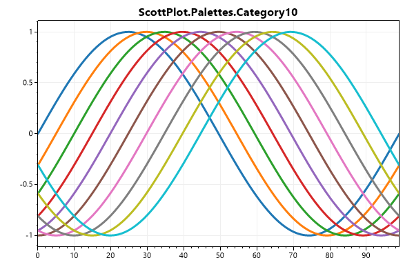


## Category20

This 20-color palette is similar to the default, but optimized for situations where more than 10 plottables are required. Every second color is a lighter version of the color before it. This palette was sourced from Matplotlib.

```cs
var plt = new ScottPlot.Plot(600, 400);

plt.Palette = ScottPlot.Palette.Category20;

for (int i = 0; i < plt.Palette.Count(); i++)
{
    double[] xs = DataGen.Consecutive(100);
    double[] ys = DataGen.Sin(100, phase: -i * .5 / plt.Palette.Count());
    plt.AddScatterLines(xs, ys, lineWidth: 3);
}

plt.Title($"{plt.Palette}");
plt.AxisAuto(0, 0.1);

plt.SaveFig("palette_Category20.png");
```

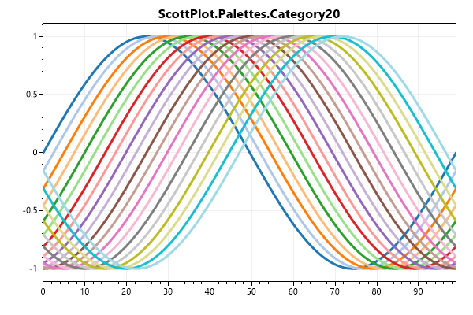


## Aurora

Aurora is a 5-color palette sourced from Nord.

```cs
var plt = new ScottPlot.Plot(600, 400);

plt.Palette = ScottPlot.Palette.Aurora;

for (int i = 0; i < plt.Palette.Count(); i++)
{
    double[] xs = DataGen.Consecutive(100);
    double[] ys = DataGen.Sin(100, phase: -i * .5 / plt.Palette.Count());
    plt.AddScatterLines(xs, ys, lineWidth: 3);
}

plt.Title($"{plt.Palette}");
plt.AxisAuto(0, 0.1);

plt.SaveFig("palette_Aurora.png");
```

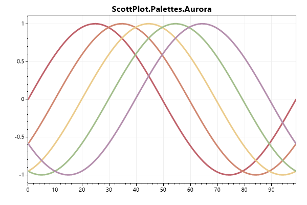


## Frost

Frost is a 4-color palette sourced from Nord.

```cs
var plt = new ScottPlot.Plot(600, 400);

plt.Palette = ScottPlot.Palette.Frost;

for (int i = 0; i < plt.Palette.Count(); i++)
{
    double[] xs = DataGen.Consecutive(100);
    double[] ys = DataGen.Sin(100, phase: -i * .5 / plt.Palette.Count());
    plt.AddScatterLines(xs, ys, lineWidth: 3);
}

plt.Title($"{plt.Palette}");
plt.AxisAuto(0, 0.1);

plt.SaveFig("palette_Frost.png");
```


## Nord

Nord is a 7-color palette derived from Aurora source from NordConEmu.

```cs
var plt = new ScottPlot.Plot(600, 400);

plt.Palette = ScottPlot.Palette.Nord;

for (int i = 0; i < plt.Palette.Count(); i++)
{
    double[] xs = DataGen.Consecutive(100);
    double[] ys = DataGen.Sin(100, phase: -i * .5 / plt.Palette.Count());
    plt.AddScatterLines(xs, ys, lineWidth: 3);
}

plt.Title($"{plt.Palette}");
plt.AxisAuto(0, 0.1);

plt.SaveFig("palette_Nord.png");
```

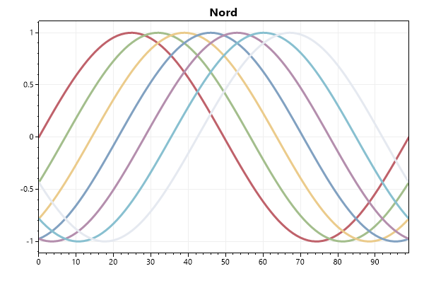


## PolarNight

PolarNight is a 4-color palette sourced from Nord. This palette is optimized for a dark background.

```cs
var plt = new ScottPlot.Plot(600, 400);

plt.Palette = ScottPlot.Palette.PolarNight;

for (int i = 0; i < plt.Palette.Count(); i++)
{
    double[] xs = DataGen.Consecutive(100);
    double[] ys = DataGen.Sin(100, phase: -i * .5 / plt.Palette.Count());
    plt.AddScatterLines(xs, ys, lineWidth: 3);
}

plt.Title($"{plt.Palette}");
plt.AxisAuto(0, 0.1);
plt.Style(ScottPlot.Style.Blue2);

plt.SaveFig("palette_PolarNight.png");
```

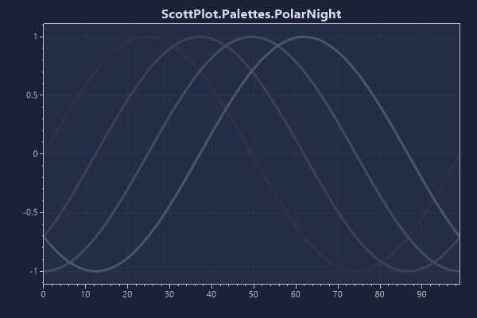


## SnowStorm

SnowStorm is a 3-color palette sourced from Nord.

```cs
var plt = new ScottPlot.Plot(600, 400);

plt.Palette = ScottPlot.Palette.SnowStorm;

for (int i = 0; i < plt.Palette.Count(); i++)
{
    double[] xs = DataGen.Consecutive(100);
    double[] ys = DataGen.Sin(100, phase: -i * .5 / plt.Palette.Count());
    plt.AddScatterLines(xs, ys, lineWidth: 3);
}

plt.Title($"{plt.Palette}");
plt.AxisAuto(0, 0.1);

plt.SaveFig("palette_SnowStorm.png");
```

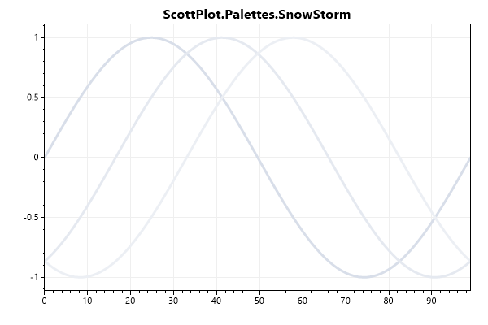


## OneHalf

OneHalf is a 7-color palette sourced from Sublime

```cs
var plt = new ScottPlot.Plot(600, 400);

plt.Palette = ScottPlot.Palette.OneHalf;

for (int i = 0; i < plt.Palette.Count(); i++)
{
    double[] xs = DataGen.Consecutive(100);
    double[] ys = DataGen.Sin(100, phase: -i * .5 / plt.Palette.Count());
    plt.AddScatterLines(xs, ys, lineWidth: 3);
}

plt.Title($"{plt.Palette}");
plt.AxisAuto(0, 0.1);

plt.SaveFig("palette_OneHalf.png");
```

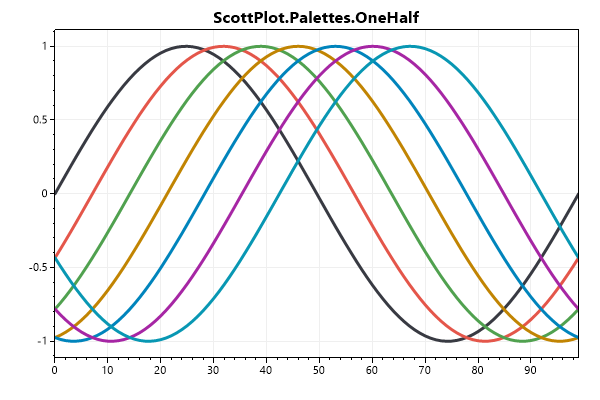


## OneHalfDark

OneHalfDark is a 7-color palette of colors complimentary to the OneHalf palette desaturated and optimized for a dark background. #2e3440 is a recommended background color with this palette.

```cs
var plt = new ScottPlot.Plot(600, 400);

plt.Palette = ScottPlot.Palette.OneHalfDark;

for (int i = 0; i < plt.Palette.Count(); i++)
{
    double[] xs = DataGen.Consecutive(100);
    double[] ys = DataGen.Sin(100, phase: -i * .5 / plt.Palette.Count());
    plt.AddScatterLines(xs, ys, lineWidth: 3);
}

plt.Title($"{plt.Palette}");
plt.AxisAuto(0, 0.1);
plt.Style(ScottPlot.Style.Gray1);
var bnColor = System.Drawing.ColorTranslator.FromHtml("#2e3440");
plt.Style(figureBackground: bnColor, dataBackground: bnColor);

plt.SaveFig("palette_OneHalfDark.png");
```

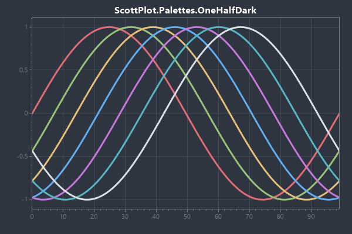


## Custom

A custom palette can be created from an array of HTML color values. These colors will be used as the default colors for new plottables added to the plot.

```cs
var plt = new ScottPlot.Plot(600, 400);

// custom colors generated using "i want hue" http://medialab.github.io/iwanthue/
string[] customColors = { "#019d9f", "#7d3091", "#57e075", "#e5b5fa", "#009118" };

// create a custom palette and set it in the plot module
plt.Palette = ScottPlot.Palette.FromHtmlColors(customColors);

for (int i = 0; i < plt.Palette.Count(); i++)
{
    double[] xs = DataGen.Consecutive(100);
    double[] ys = DataGen.Sin(100, phase: -i * .5 / plt.Palette.Count());
    plt.AddScatterLines(xs, ys, lineWidth: 3);
}

plt.Title($"{plt.Palette}");
plt.AxisAuto(0, 0.1);

plt.SaveFig("palette_Custom.png");
```

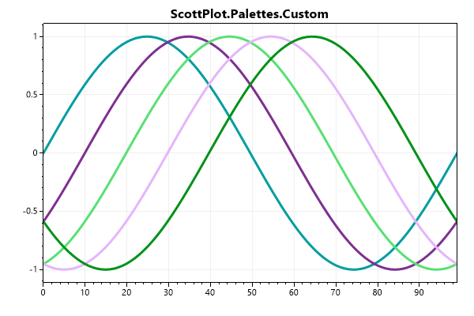


## Microcharts

This is the default 12-color palette used by Microcharts.

```cs
var plt = new ScottPlot.Plot(600, 400);

plt.Palette = ScottPlot.Palette.Microcharts;

for (int i = 0; i < plt.Palette.Count(); i++)
{
    double[] xs = DataGen.Consecutive(100);
    double[] ys = DataGen.Sin(100, phase: -i * .5 / plt.Palette.Count());
    plt.AddScatterLines(xs, ys, lineWidth: 3);
}

plt.Title($"{plt.Palette}");
plt.AxisAuto(0, 0.1);

plt.SaveFig("palette_Microcharts.png");
```

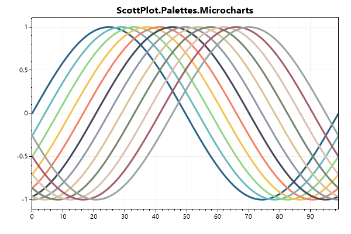


## Colorblind Friendly

8-color palette that has good overall variability and can be differentiated by individuals with red-green color blindness. Colors originated from Wong 2011, https://www.nature.com/articles/nmeth.1618.pdf

```cs
var plt = new ScottPlot.Plot(600, 400);

plt.Palette = ScottPlot.Palette.ColorblindFriendly;

for (int i = 0; i < plt.Palette.Count(); i++)
{
    double[] xs = DataGen.Consecutive(100);
    double[] ys = DataGen.Sin(100, phase: -i * .5 / plt.Palette.Count());
    plt.AddScatterLines(xs, ys, lineWidth: 3);
}

plt.Title($"{plt.Palette}");
plt.AxisAuto(0, 0.1);

plt.SaveFig("palette_ColorblindFriendly.png");
```

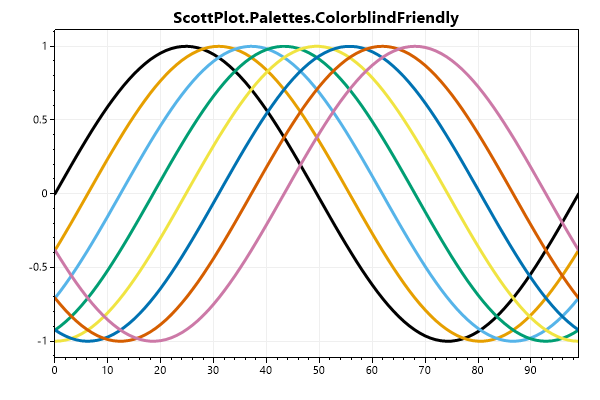


