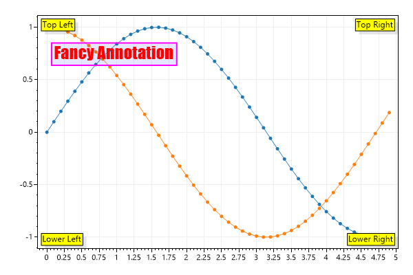

* This page contains recipes for the _Annotation_ category.
* Visit the [Cookbook Home Page](../../) to view all cookbook recipes.
* Generated by ScottPlot 4.1.64 on 5/17/2023
## Figure Annotations

Annotations are labels placed at a X/Y location on the figure (not coordinates of the data area). Unlike the Text plottable, annotations do not move as the axes are adjusted.

```cs
var plt = new ScottPlot.Plot(600, 400);

double[] xs = DataGen.Range(0, 5, .1);
plt.AddScatter(xs, DataGen.Sin(xs));
plt.AddScatter(xs, DataGen.Cos(xs));

// default placement is upper left
plt.AddAnnotation("Top Left", Alignment.UpperLeft);

// negative coordinates can be used to place text along different edges
plt.AddAnnotation("Lower Left", Alignment.LowerLeft);
plt.AddAnnotation("Top Right", Alignment.UpperRight);
plt.AddAnnotation("Lower Right", Alignment.LowerRight);

// Additional customizations are available
var fancy = plt.AddAnnotation("Fancy Annotation", Alignment.UpperLeft);
fancy.MarginX = 20;
fancy.MarginY = 40;
fancy.Font.Size = 24;
fancy.Font.Name = "Impact";
fancy.Font.Color = Color.Red;
fancy.Shadow = false;
fancy.BackgroundColor = Color.FromArgb(25, Color.Blue);
fancy.BorderWidth = 2;
fancy.BorderColor = Color.Magenta;

plt.SaveFig("annotation_quickstart.png");
```




