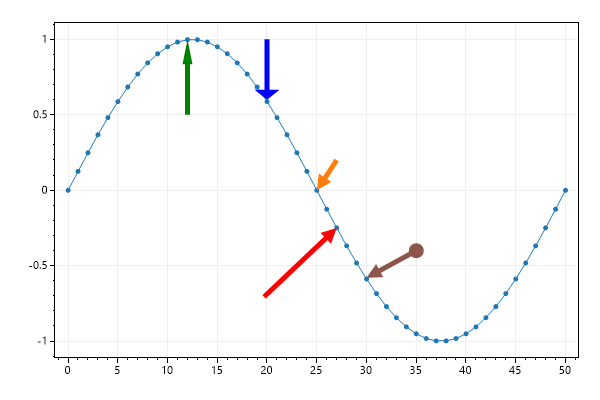

# Plot Type: Arrow
* This page contains recipes for the _Arrow_ category.
* Visit the [Cookbook Home Page](../../) to view all cookbook recipes.
* Generated by ScottPlot 4.1.70 on 12/28/2023
<h2><a id='arrows' href='/cookbook/4.1/recipes/plottable_arrow_quickstart/'>Arrows</a></h2>

Arrows point to specific locations on the plot. 

```cs
var plt = new ScottPlot.Plot(600, 400);

// plot some sample data
plt.AddSignal(DataGen.Sin(51));

// add arrows using coordinates
plt.AddArrow(25, 0, 27, .2);

// you can define a minimum length so the line persists even when zooming out
var arrow2 = plt.AddArrow(27, -.25, 23, -.5);
arrow2.Color = System.Drawing.Color.Red;
arrow2.MinimumLengthPixels = 100;

// the shape of the arrowhead can be adjusted
var skinny = plt.AddArrow(12, 1, 12, .5);
skinny.Color = System.Drawing.Color.Green;
skinny.ArrowheadLength = 5;
skinny.ArrowheadWidth = 2;

var fat = plt.AddArrow(20, .6, 20, 1);
fat.Color = System.Drawing.Color.Blue;
fat.ArrowheadLength = 2;
fat.ArrowheadWidth = 5;

// a marker can be drawn at the base of the arrow
var arrow3 = plt.AddArrow(30, -.58, 35, -.4);
arrow3.MarkerSize = 15;

plt.SaveFig("plottable_arrow_quickstart.png");
```




