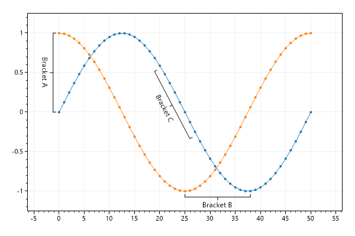
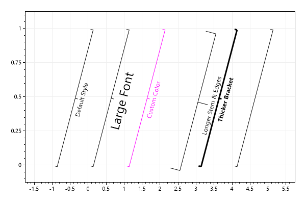

* This page contains recipes for the _Bracket_ category.
* Visit the [Cookbook Home Page](../../) to view all cookbook recipes.
* Generated by ScottPlot 4.1.53 on 8/12/2022
## Bracket Annotations

Brackets are useful for annotating a range of data.

```cs
var plt = new ScottPlot.Plot(600, 400);

plt.AddSignal(DataGen.Sin(51));
plt.AddSignal(DataGen.Cos(51));

plt.AddBracket(0, 1, 0, 0, "Bracket A");
plt.AddBracket(25, -1, 38, -1, "Bracket B");
plt.AddBracket(20, .55, 27, -.3, "Bracket C");

plt.Margins(.2, .2); // zoom out slightly to make room for labels

plt.SaveFig("bracket_quickstart.png");
```




## Inverted Brackets

By default bracket labels appear clockwise relative to the line formed by their two points. Users can invert the direction of brackets as needed.

```cs
var plt = new ScottPlot.Plot(600, 400);

plt.AddSignal(DataGen.Sin(51));
plt.AddSignal(DataGen.Cos(51));

var bracketA = plt.AddBracket(50, 1, 50, 0, "Bracket A");
bracketA.LabelCounterClockwise = true;

var backetB = plt.AddBracket(13, 1, 50, 1, "Bracket B");
backetB.LabelCounterClockwise = true;

var backetC = plt.AddBracket(20, .65, 27, -.20, "Bracket C");
backetC.LabelCounterClockwise = true;

plt.Margins(.2, .2); // zoom out slightly to make room for labels

plt.SaveFig("bracket_invert.png");
```


## Styling Brackets

Brackets have additional options for customizations.

```cs
var plt = new ScottPlot.Plot(600, 400);

plt.AddBracket(-1, 0, 0, 1, "Default Style");

var bracketA = plt.AddBracket(0, 0, 1, 1, "Large Font");
bracketA.Font.Size = 24;

var bracketB = plt.AddBracket(1, 0, 2, 1, "Custom Color");
bracketB.Color = Color.Magenta;

var bracketC = plt.AddBracket(2, 0, 3, 1, "Longer Stem & Edges");
bracketC.EdgeLength = 20;

var bracketD = plt.AddBracket(3, 0, 4, 1, "Thicker Bracket");
bracketD.LineWidth = 3;
bracketD.Font.Bold = true;

plt.AddBracket(4, 0, 5, 1, label: null);

plt.Margins(.2, .2); // zoom out slightly to make room for labels

plt.SaveFig("bracket_style.png");
```




