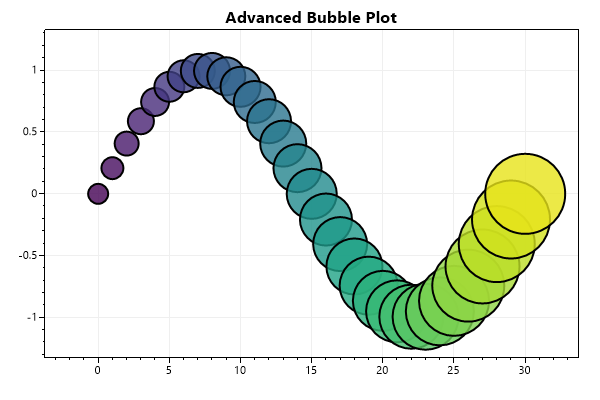
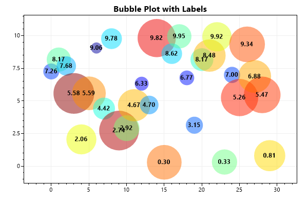

* This page contains recipes for the _Bubble Plot_ category.
* Visit the [Cookbook Home Page](../../) to view all cookbook recipes.
* Generated by ScottPlot 4.1.61 on 2/27/2023
## Bubble Plot

Bubble plots display circles at specific X/Y locations. Each circle can be individually customized. Save the object that is returned when the bubble plot is created and call its Add() method to add bubbles.

```cs
var plt = new ScottPlot.Plot(600, 400);

double[] xs = DataGen.Consecutive(31);
double[] ys = DataGen.Sin(31);
var colormap = Drawing.Colormap.Viridis;

var myBubblePlot = plt.AddBubblePlot();
for (int i = 0; i < xs.Length; i++)
{
    double fraction = (double)i / xs.Length;
    myBubblePlot.Add(
        x: xs[i],
        y: ys[i],
        radius: 10 + i,
        fillColor: colormap.GetColor(fraction, alpha: .8),
        edgeColor: System.Drawing.Color.Black,
        edgeWidth: 2
    );
}

plt.Title("Advanced Bubble Plot");
plt.AxisAuto(.2, .25); // zoom out to accommodate large bubbles

plt.SaveFig("bubble_quickstart.png");
```




## Bubbles with Labels

Bubble plots can be combined with other plot types to create more advanced charts. In this example each bubble is accompanied by a text object. Bubbles are also colored according to their size such that smaller bubbles are bluer.

```cs
var plt = new ScottPlot.Plot(600, 400);

Random rand = new(0);
int pointCount = 30;
double[] xs = DataGen.Consecutive(pointCount);
double[] ys = DataGen.Random(rand, pointCount, 10);
string[] labels = ys.Select(x => x.ToString("N2")).ToArray();
var labelFont = new Drawing.Font
{
    Bold = true,
    Color = Color.Black,
    Alignment = Alignment.MiddleCenter
};

var myBubblePlot = plt.AddBubblePlot();
for (int i = 0; i < xs.Length; i++)
{
    // give each bubble a random size and make smaller ones bluer
    double randomValue = rand.NextDouble();
    double bubbleSize = randomValue * 30 + 10;
    Color bubbleColor = Drawing.Colormap.Jet.GetColor(randomValue, .5);

    myBubblePlot.Add(
        x: xs[i],
        y: ys[i],
        radius: bubbleSize,
        fillColor: bubbleColor,
        edgeColor: Color.Transparent,
        edgeWidth: 1
    );

    plt.AddText(labels[i], xs[i], ys[i], labelFont);
}

plt.Title("Bubble Plot with Labels");
plt.AxisAuto(.2, .25); // zoom out to accommodate large bubbles

plt.SaveFig("bubble_withText.png");
```




