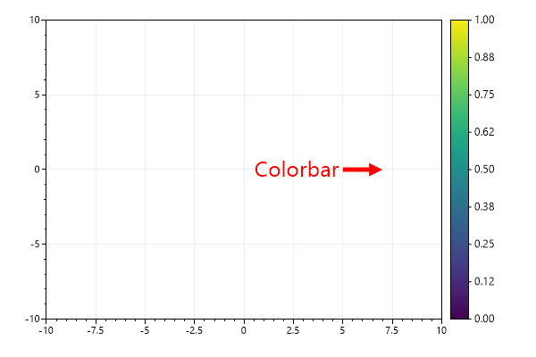
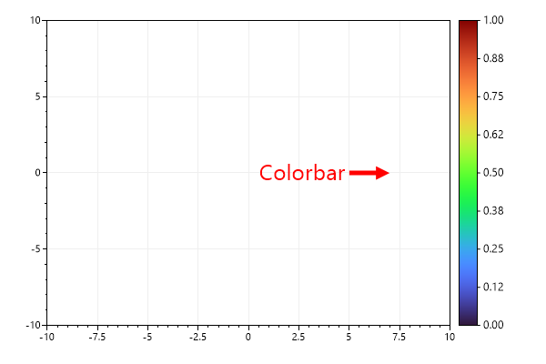
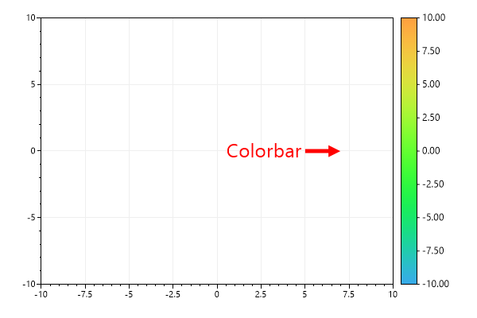
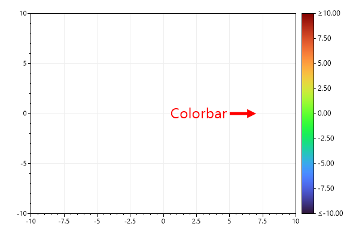
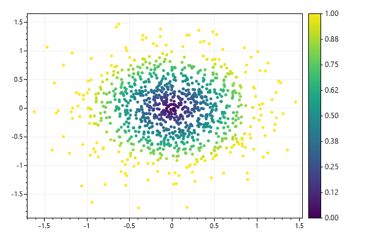
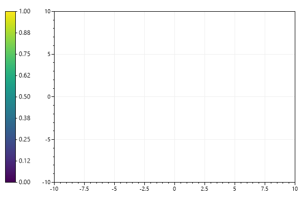
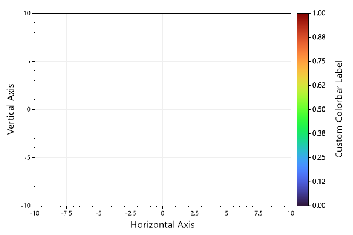

# Plot Type: Colorbar
* This page contains recipes for the _Colorbar_ category.
* Visit the [Cookbook Home Page](../../) to view all cookbook recipes.
* Generated by ScottPlot 4.1.70 on 1/14/2024
<h2><a id='colorbar' href='/cookbook/4.1/recipes/colorbar_quickstart/'>Colorbar</a></h2>

A colorbar displays a colormap beside the data area. Colorbars are typically added to plots containing heatmaps.



```cs
ScottPlot.Version.ShouldBe(4, 1, 70);
var plt = new ScottPlot.Plot(600, 400);

plt.AddColorbar();

// direct attention to the colorbar
var text = plt.AddText("Colorbar", 5, 0, 24, Color.Red);
text.Alignment = Alignment.MiddleRight;
plt.AddArrow(7, 0, 5, 0, color: Color.Red);
plt.SetAxisLimits(-10, 10, -10, 10);

plt.SaveFig("colorbar_quickstart.png");
```






<h2><a id='colorbar-for-colormap' href='/cookbook/4.1/recipes/colorbar_colormap/'>Colorbar for Colormap</a></h2>

By default colorbars use the Viridis colormap, but this behavior can be customized and many colormaps are available.



```cs
ScottPlot.Version.ShouldBe(4, 1, 70);
var plt = new ScottPlot.Plot(600, 400);

plt.AddColorbar(Drawing.Colormap.Turbo);

// direct attention to the colorbar
var text = plt.AddText("Colorbar", 5, 0, 24, Color.Red);
text.Alignment = Alignment.MiddleRight;
plt.AddArrow(7, 0, 5, 0, color: Color.Red);
plt.SetAxisLimits(-10, 10, -10, 10);

plt.SaveFig("colorbar_colormap.png");
```






<h2><a id='colorbar-ticks' href='/cookbook/4.1/recipes/colorbar_ticks/'>Colorbar Ticks</a></h2>

Tick marks can be added to colorbars. Each tick is described by a position (a fraction of the distance from the bottom to the top) and a string (the tick label).



```cs
ScottPlot.Version.ShouldBe(4, 1, 70);
var plt = new ScottPlot.Plot(600, 400);

var cb = plt.AddColorbar(Drawing.Colormap.Turbo);

// Add manual ticks (disabling automatic ticks)
cb.AddTick(0, "-123");
cb.AddTick(1, "+123");
cb.AddTick(.5, "0");
cb.AddTick(.25, "-61.5");
cb.AddTick(.75, "+61.5");

// To re-enable automatic ticks call cb.AutomaticTicks(true)

// direct attention to the colorbar
var text = plt.AddText("Colorbar", 5, 0, 24, Color.Red);
text.Alignment = Alignment.MiddleRight;
plt.AddArrow(7, 0, 5, 0, color: Color.Red);
plt.SetAxisLimits(-10, 10, -10, 10);

plt.SaveFig("colorbar_ticks.png");
```




<h2><a id='color-range' href='/cookbook/4.1/recipes/colorbar_range/'>Color Range</a></h2>

You can restrict a colorbar to only show a small range of a colormap. In this example we only use the middle of a rainbow colormap.



```cs
ScottPlot.Version.ShouldBe(4, 1, 70);
var plt = new ScottPlot.Plot(600, 400);

var cb = plt.AddColorbar(Drawing.Colormap.Turbo);
cb.MinValue = -10;
cb.MaxValue = 10;
cb.MinColor = .25;
cb.MaxColor = .75;

// direct attention to the colorbar
var text = plt.AddText("Colorbar", 5, 0, 24, Color.Red);
text.Alignment = Alignment.MiddleRight;
plt.AddArrow(7, 0, 5, 0, color: Color.Red);
plt.SetAxisLimits(-10, 10, -10, 10);

plt.SaveFig("colorbar_Range.png");
```






<h2><a id='clipped-value-range' href='/cookbook/4.1/recipes/colorbar_clip/'>Clipped value range</a></h2>

If data values extend beyond the min/max range displayed by a colorbar you can indicate the colormap is clipping the data values and inequality symbols will be displayed in the tick labeles at the edge of the colorbar.



```cs
ScottPlot.Version.ShouldBe(4, 1, 70);
var plt = new ScottPlot.Plot(600, 400);

var cb = plt.AddColorbar(Drawing.Colormap.Turbo);
cb.MinValue = -10;
cb.MaxValue = 10;
cb.MinIsClipped = true;
cb.MaxIsClipped = true;

// direct attention to the colorbar
var text = plt.AddText("Colorbar", 5, 0, 24, Color.Red);
text.Alignment = Alignment.MiddleRight;
plt.AddArrow(7, 0, 5, 0, color: Color.Red);
plt.SetAxisLimits(-10, 10, -10, 10);

plt.SaveFig("colorbar_clip.png");
```






<h2><a id='scatter-plot-with-colorbar' href='/cookbook/4.1/recipes/colorbar_scatter/'>Scatter Plot with Colorbar</a></h2>

This example shows how to add differently colored markers to the plot to simulate a scatter plot with points colored according to a colorbar. Note that the colormap generates the colors, and that a colorbar just displays a colormap



```cs
ScottPlot.Version.ShouldBe(4, 1, 70);
var plt = new ScottPlot.Plot(600, 400);

var cmap = ScottPlot.Drawing.Colormap.Viridis;
plt.AddColorbar(cmap);

Random rand = new(0);
for (int i = 0; i < 1000; i++)
{
    double x = ScottPlot.DataGen.RandomNormalValue(rand, mean: 0, stdDev: .5);
    double y = ScottPlot.DataGen.RandomNormalValue(rand, mean: 0, stdDev: .5);
    double colorFraction = Math.Sqrt(x * x + y * y);
    System.Drawing.Color c = ScottPlot.Drawing.Colormap.Viridis.GetColor(colorFraction);
    plt.AddPoint(x, y, c);
}

plt.SaveFig("colorbar_scatter.png");
```






<h2><a id='colorbar-on-left' href='/cookbook/4.1/recipes/colorbar_left/'>Colorbar on Left</a></h2>

A colorbar may be added to the left side of the chart



```cs
ScottPlot.Version.ShouldBe(4, 1, 70);
var plt = new ScottPlot.Plot(600, 400);

plt.AddColorbar(rightSide: false);

plt.SaveFig("colorbar_left.png");
```






<h2><a id='colorbar-label' href='/cookbook/4.1/recipes/colorbar_label/'>Colorbar Label</a></h2>

Colorbars have a Label property similar to X and Y axes.



```cs
ScottPlot.Version.ShouldBe(4, 1, 70);
var plt = new ScottPlot.Plot(600, 400);

plt.AddColorbar();

plt.XLabel("Horizontal Axis");
plt.YLabel("Vertical Axis");

var cmap = ScottPlot.Drawing.Colormap.Turbo;
var cb = plt.AddColorbar(cmap);
cb.Label = "Custom Colorbar Label";

plt.SaveFig("colorbar_label.png");
```






