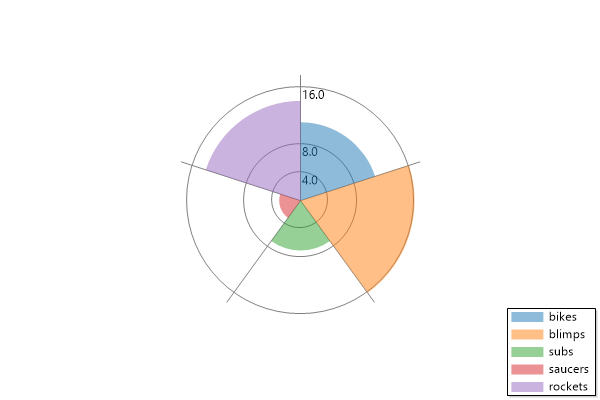
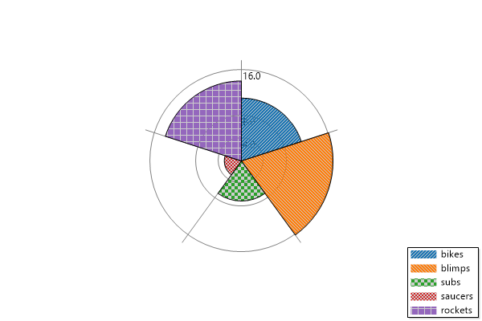
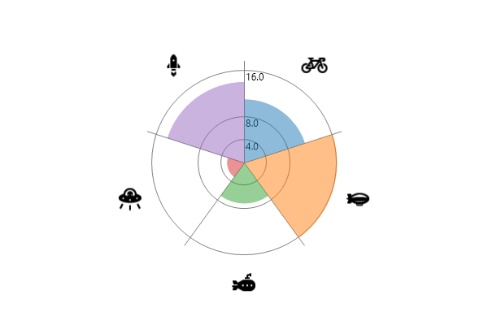

# Plot Type: Coxcomb Chart
* This page contains recipes for the _Coxcomb Chart_ category.
* Visit the [Cookbook Home Page](../../) to view all cookbook recipes.
* Generated by ScottPlot 4.1.69 on 12/11/2023
<h2><a href='/cookbook/4.1/recipes/coxcomb_quickstart/'>Coxcomb Chart</a></h2>

A Pie chart where the angle of slices is constant but the radii are not.

```cs
var plt = new ScottPlot.Plot(600, 400);

double[] values = { 11, 16, 7, 3, 14 };
var coxcomb = plt.AddCoxcomb(values);
coxcomb.FillColors = plt.Palette.GetColors(5, 0, .5);
coxcomb.SliceLabels = new string[] { "bikes", "blimps", "subs", "saucers", "rockets" };

plt.SaveFig("coxcomb_quickstart.png");
```




<h2><a href='/cookbook/4.1/recipes/coxcomb_hatch/'>Custom Hatching (patterns)</a></h2>

Coxcomb charts allow custom hatching of their slices.

```cs
var plt = new ScottPlot.Plot(600, 400);

double[] values = { 11, 16, 7, 3, 14 };
var coxcomb = plt.AddCoxcomb(values);
coxcomb.HatchOptions = new HatchOptions[] {
    new () { Pattern = HatchStyle.StripedUpwardDiagonal, Color = Color.FromArgb(100, Color.Gray) },
    new () { Pattern = HatchStyle.StripedDownwardDiagonal, Color = Color.FromArgb(100, Color.Gray) },
    new () { Pattern = HatchStyle.LargeCheckerBoard, Color = Color.FromArgb(100, Color.Gray) },
    new () { Pattern = HatchStyle.SmallCheckerBoard, Color = Color.FromArgb(100, Color.Gray) },
    new () { Pattern = HatchStyle.LargeGrid, Color = Color.FromArgb(100, Color.Gray) },
};
coxcomb.OutlineWidth = 1;

coxcomb.SliceLabels = new string[] { "bikes", "blimps", "subs", "saucers", "rockets" };
plt.Legend();

plt.SaveFig("coxcomb_hatch.png");
```




<h2><a href='/cookbook/4.1/recipes/coxcomb_iconvalue/'>Coxcomb Chart with icons</a></h2>

A Pie chart where the angle of slices is constant but the radii are not, icons are used for quick reference.

```cs
var plt = new ScottPlot.Plot(600, 400);

double[] values = { 11, 16, 7, 3, 14 };
var coxcomb = plt.AddCoxcomb(values);
coxcomb.CategoryImages = CategoryImages;
coxcomb.FillColors = plt.Palette.GetColors(5, 0, .5);
plt.Legend();

plt.SaveFig("coxcomb_iconValue.png");
```




