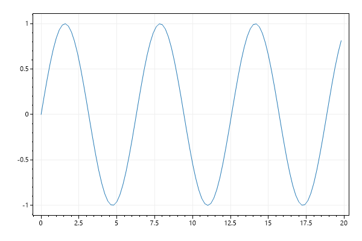
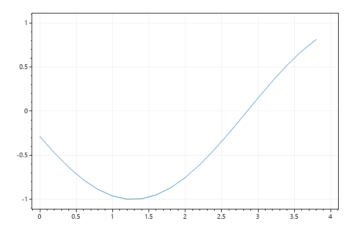

# Plot Type: Data Logger
* This page contains recipes for the _Data Logger_ category.
* Visit the [Cookbook Home Page](../../) to view all cookbook recipes.
* Generated by ScottPlot 4.1.69 on 12/11/2023
## DataLogger

A DataLogger is a plot type designed for growing datasets. Unlike most other plot types, the DataLogger can automatically expand the axis limits to accommodate new data as it is added.

```cs
var plt = new ScottPlot.Plot(600, 400);

var logger = plt.AddDataLogger();

for (int i = 0; i < 100; i++)
{
    double x = i * .2;
    double y = Math.Sin(x);
    logger.Add(x, y); // data grows as new data is added
}

plt.SaveFig("datalogger_quickstart.png");
```




## DataStreamer

A DataStreamer is a plot type designed for streaming datasets with a fixed length display and even X spacing between Y data points. As new data is shifted in, old data is shifted out, and the displayed trace is always the same size.

```cs
var plt = new ScottPlot.Plot(600, 400);

var streamer = plt.AddDataStreamer(length: 20);
streamer.SamplePeriod = 0.2;

for (int i = 0; i < 100; i++)
{
    double y = Math.Sin(i * .2);
    streamer.Add(y); // data remains same length as new data is shifted in
}

// Call different view methods to change the shift behavior
streamer.ViewWipeRight(); // new data overwrites old data left to right
streamer.ViewWipeLeft(); // new data overwrites old data right to left
streamer.ViewScrollRight(); // new data is inserted on the left
streamer.ViewScrollLeft(); // new data is inserted on the right

plt.SaveFig("datastreamer_quickstart.png");
```




