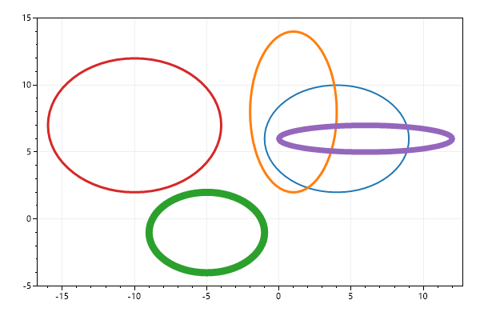
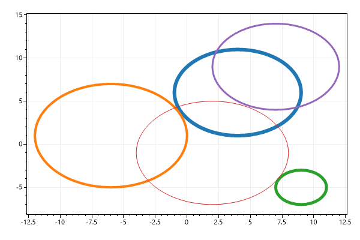
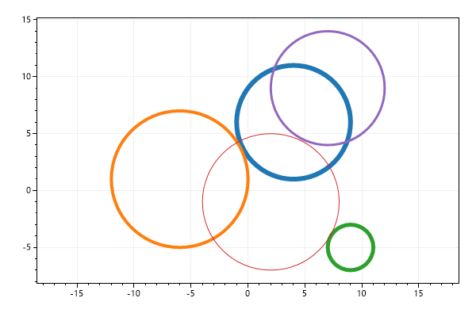
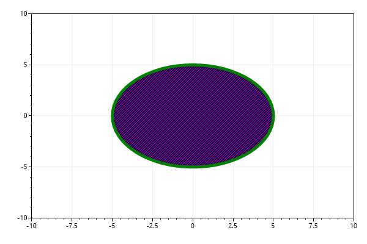
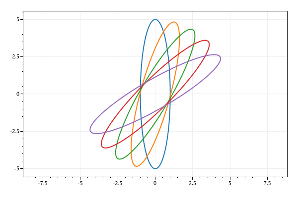

* This page contains recipes for the _Ellipse_ category.
* Visit the [Cookbook Home Page](../../) to view all cookbook recipes.
* Generated by ScottPlot 4.1.67 on 8/13/2023
## Ellipse Quickstart

Ellipses can be added to plots

```cs
var plt = new ScottPlot.Plot(600, 400);

Random rand = new(0);
for (int i = 0; i < 5; i++)
{
    plt.AddEllipse(
        x: rand.Next(-10, 10),
        y: rand.Next(-10, 10),
        xRadius: rand.Next(1, 7),
        yRadius: rand.Next(1, 7),
        lineWidth: rand.Next(1, 10));
}

plt.SaveFig("ellipse_quickstart.png");
```




## Circle Quickstart

Circles can be added to plots. Circles are really Ellipses with the same X and Y radius. Note that circles appear as ellipses unless the plot has a square coordinate system.

```cs
var plt = new ScottPlot.Plot(600, 400);

Random rand = new(0);
for (int i = 0; i < 5; i++)
{
    plt.AddCircle(
        x: rand.Next(-10, 10),
        y: rand.Next(-10, 10),
        radius: rand.Next(1, 7),
        lineWidth: rand.Next(1, 10));
}

plt.SaveFig("circle_quickstart.png");
```




## Circle with Locked Scale

For circles to always appear circular, the coordinate system must be forced to always display square-shaped pixels. This can be achieved by enabling the axis scale lock.

```cs
var plt = new ScottPlot.Plot(600, 400);

Random rand = new(0);
for (int i = 0; i < 5; i++)
{
    plt.AddCircle(
        x: rand.Next(-10, 10),
        y: rand.Next(-10, 10),
        radius: rand.Next(1, 7),
        lineWidth: rand.Next(1, 10));
}

plt.AxisScaleLock(true); // this forces pixels to have 1:1 scale ratio

plt.SaveFig("circle_square_pixel.png");
```




## Ellipse Styling

Ellipses styles can be extensively customized

```cs
var plt = new ScottPlot.Plot(600, 400);

var el = plt.AddCircle(0, 0, 5);
el.BorderLineWidth = 5;
el.BorderLineStyle = LineStyle.Dash;
el.BorderColor = Color.Green;
el.Color = Color.Navy;
el.HatchColor = Color.Red;
el.HatchStyle = Drawing.HatchStyle.StripedUpwardDiagonal;

plt.SetAxisLimits(-10, 10, -10, 10);

plt.SaveFig("ellipse_styling.png");
```




## Ellipse Rotation

Ellipses can also be rotated

```cs
var plt = new ScottPlot.Plot(600, 400);

for (int i = 0; i < 5; i++)
{
    var el = plt.AddEllipse(x: 0, y: 0, xRadius: 1, yRadius: 5);
    el.Rotation = i * 15;
}

plt.AxisScaleLock(true);

plt.SaveFig("ellipse_rotation.png");
```




