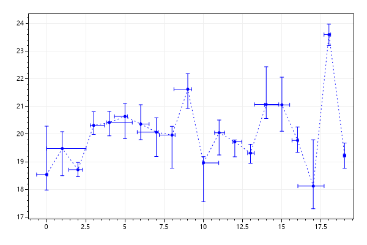
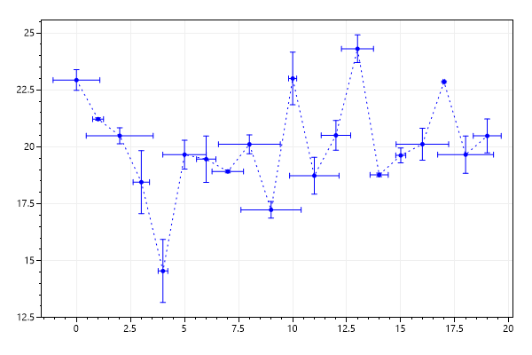
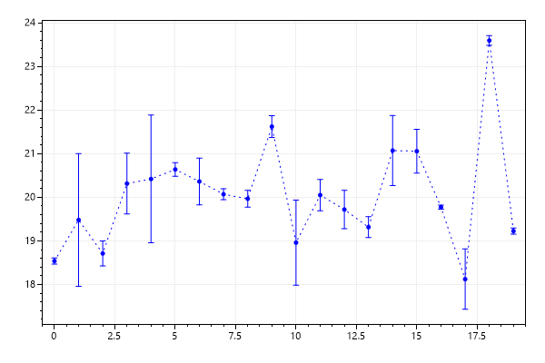
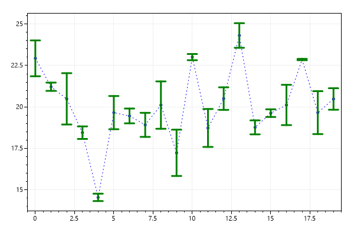
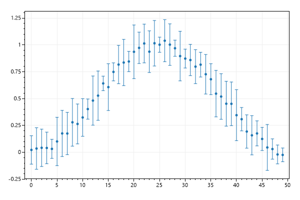

# Plot Type: Error Bar
* This page contains recipes for the _Error Bar_ category.
* Visit the [Cookbook Home Page](../../) to view all cookbook recipes.
* Generated by ScottPlot 4.1.69 on 12/24/2023
<h2><a id='error-bar-quickstart' href='/cookbook/4.1/recipes/errorbar_quickstart/'>Error Bar Quickstart</a></h2>

Error Bars allow more fine-grained control over how your error bars are shown.

```cs
var plt = new ScottPlot.Plot(600, 400);

Random rand = new Random(0);
int pointCount = 20;

double[] xs = DataGen.Consecutive(pointCount);
double[] ys = DataGen.RandomNormal(rand, pointCount, mean: 20, stdDev: 2);

double[] xErrPos = DataGen.RandomNormal(rand, pointCount).Select(e => Math.Abs(e)).ToArray();
double[] xErrNeg = DataGen.RandomNormal(rand, pointCount).Select(e => Math.Abs(e)).ToArray();
double[] yErrPos = DataGen.RandomNormal(rand, pointCount).Select(e => Math.Abs(e)).ToArray();
double[] yErrNeg = DataGen.RandomNormal(rand, pointCount).Select(e => Math.Abs(e)).ToArray();

plt.AddScatter(xs, ys, System.Drawing.Color.Blue, lineStyle: LineStyle.Dot);
plt.AddErrorBars(xs, ys, xErrPos, xErrNeg, yErrPos, yErrNeg, System.Drawing.Color.Blue);

plt.SaveFig("errorBar_quickstart.png");
```




<h2><a id='symmetric-error-bars' href='/cookbook/4.1/recipes/errorbar_symmetric/'>Symmetric Error Bars</a></h2>

There's a shorthand method for error bars where the positive and negative error is the same.

```cs
var plt = new ScottPlot.Plot(600, 400);

Random rand = new Random(0);
int pointCount = 20;

double[] xs = DataGen.Consecutive(pointCount);
double[] ys = DataGen.RandomNormal(rand, pointCount, mean: 20, stdDev: 2);

double[] xErr = DataGen.RandomNormal(rand, pointCount).Select(e => Math.Abs(e)).ToArray();
double[] yErr = DataGen.RandomNormal(rand, pointCount).Select(e => Math.Abs(e)).ToArray();

plt.AddScatter(xs, ys, System.Drawing.Color.Blue, lineStyle: LineStyle.Dot);
plt.AddErrorBars(xs, ys, xErr, yErr, System.Drawing.Color.Blue);

plt.SaveFig("errorBar_symmetric.png");
```




<h2><a id='error-bars-in-one-dimension' href='/cookbook/4.1/recipes/errorbar_onedimension/'>Error Bars in One Dimension</a></h2>

If you only have error data for one dimension you can simply pass in null for the other dimension.

```cs
var plt = new ScottPlot.Plot(600, 400);

Random rand = new Random(0);
int pointCount = 20;

double[] xs = DataGen.Consecutive(pointCount);
double[] ys = DataGen.RandomNormal(rand, pointCount, mean: 20, stdDev: 2);

double[] yErr = DataGen.RandomNormal(rand, pointCount).Select(e => Math.Abs(e)).ToArray();

plt.AddScatter(xs, ys, System.Drawing.Color.Blue, lineStyle: LineStyle.Dot);
plt.AddErrorBars(xs, ys, null, yErr, System.Drawing.Color.Blue);

plt.SaveFig("errorBar_oneDimension.png");
```




<h2><a id='customization' href='/cookbook/4.1/recipes/errorbar_customization/'>Customization</a></h2>

You can customize the colour, cap size, and line width of the error bars.

```cs
var plt = new ScottPlot.Plot(600, 400);

Random rand = new Random(0);
int pointCount = 20;

double[] xs = DataGen.Consecutive(pointCount);
double[] ys = DataGen.RandomNormal(rand, pointCount, mean: 20, stdDev: 2);

double[] yErr = DataGen.RandomNormal(rand, pointCount).Select(e => Math.Abs(e)).ToArray();

plt.AddScatter(xs, ys, System.Drawing.Color.Blue, lineStyle: LineStyle.Dot);

var errorBars = plt.AddErrorBars(xs, ys, null, yErr);
errorBars.CapSize = 8;
errorBars.Color = System.Drawing.Color.Green;
errorBars.LineWidth = 3;

plt.SaveFig("errorBar_customization.png");
```




<h2><a id='error-bar-marker' href='/cookbook/4.1/recipes/errorbar_marker/'>Error Bar Marker</a></h2>

An optional marker can be drawn at the center X/Y position for each error bar.

```cs
var plt = new ScottPlot.Plot(600, 400);

Random rand = new Random(0);
int pointCount = 50;
double[] xs = DataGen.Consecutive(pointCount);
double[] ys = DataGen.NoisyBellCurve(rand, pointCount);
double[] yErr = DataGen.Random(rand, pointCount, multiplier: .2, offset: .05);

plt.AddErrorBars(xs, ys, null, yErr, markerSize: 5);

plt.SaveFig("errorBar_marker.png");
```




