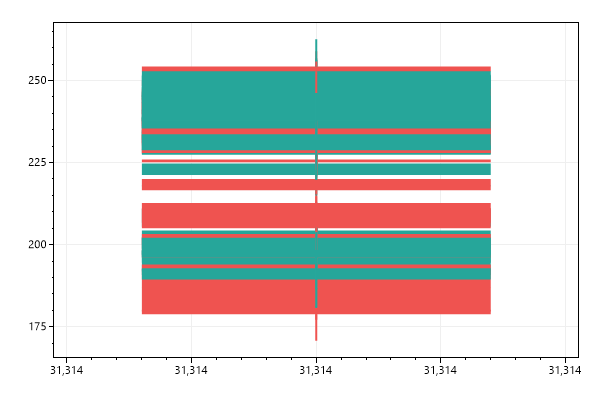
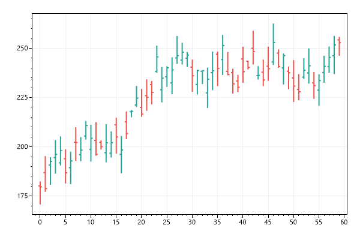
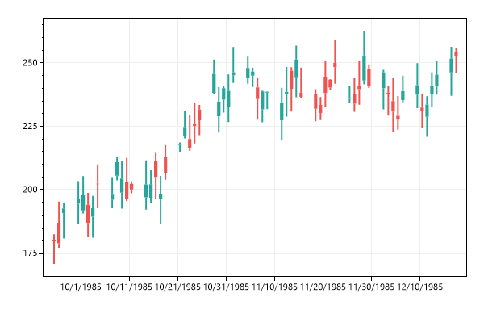
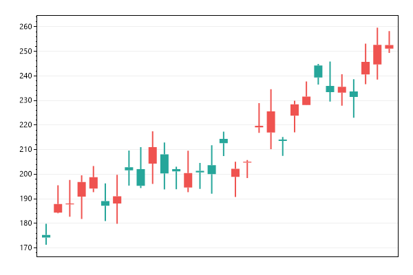
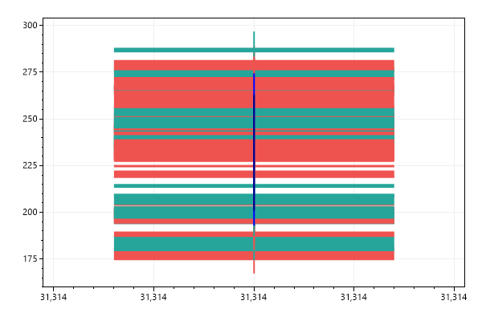
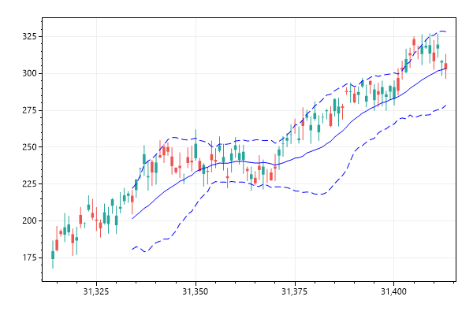
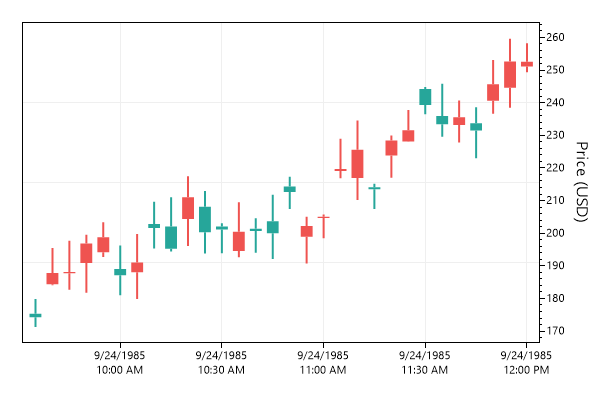
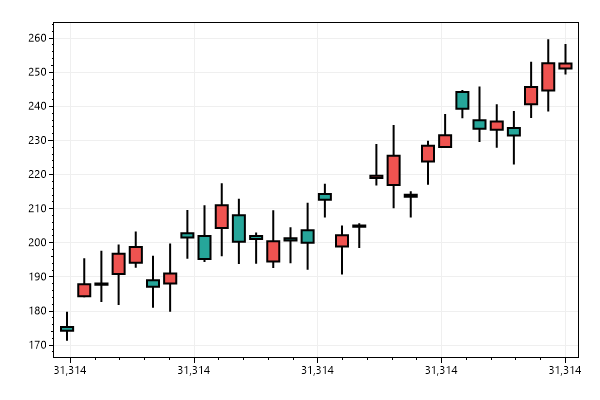
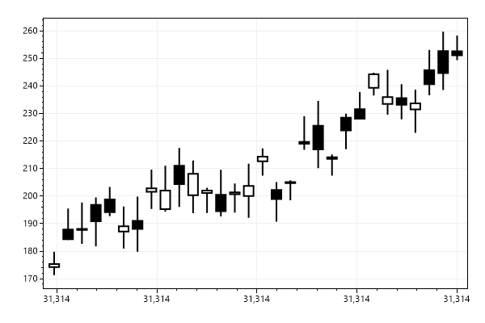
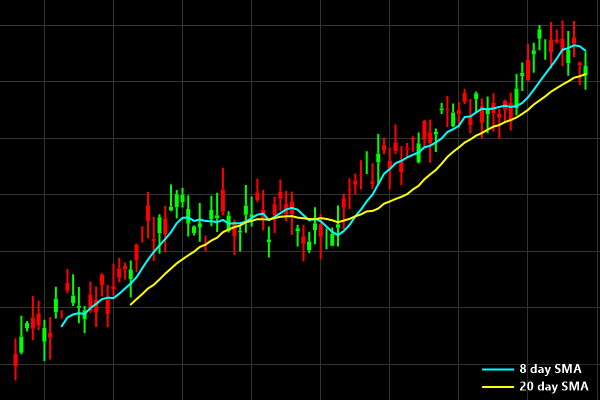

# Plot Type: Finance
* This page contains recipes for the _Finance_ category.
* Visit the [Cookbook Home Page](../../) to view all cookbook recipes.
* Generated by ScottPlot 4.1.69 on 12/11/2023
## Candlestick Chart

Price movement over time periods are represented using OHLC objects. A single OHLC holds open, high, low, and close pricing. Users can create their own OHLC arrays, or use the sample data generator to practice working with financial data.

```cs
var plt = new ScottPlot.Plot(600, 400);

// Each candle is represented by a single OHLC object.
OHLC price = new(
    open: 100,
    high: 120,
    low: 80,
    close: 105,
    timeStart: new DateTime(1985, 09, 24),
    timeSpan: TimeSpan.FromDays(1));

// Users could be build their own array of OHLCs, or lean on 
// the sample data generator to simulate price data over time.
OHLC[] prices = DataGen.RandomStockPrices(new Random(0), 60);

// Add a financial chart to the plot using an array of OHLC objects
plt.AddCandlesticks(prices);

plt.SaveFig("finance_quickstart.png");
```




## OHLC Chart

OHLC charts are an alternative to candlestick charts. They show high and low prices as a vertical line, and indicate open and close prices with little ticks to the left and to the right.

```cs
var plt = new ScottPlot.Plot(600, 400);

OHLC[] prices = DataGen.RandomStockPrices(null, 60);
plt.AddOHLCs(prices);

plt.SaveFig("finance_ohlc.png");
```




## Using a DateTime Axis

You probably never want to do this... but OHLCs have an X value you can customize to be a DateTime (converted to a double using DateTime.ToOATime()). The advantage is that you can use the native DateTime axis support on the horizontal axis. The disadvantage is that gaps in time appear as gaps in the candlesticks. Weekends without trading will appear as gaps. The alternative to this method is to plot a series of OHLCs using sequential numbers, then manually define the axis tick labels.

```cs
var plt = new ScottPlot.Plot(600, 400);

OHLC[] prices = DataGen.RandomStockPrices(null, 60, TimeSpan.FromDays(1));

// add the OHLCs to the plot and the horizontal axis to display DateTime tick labels
plt.AddCandlesticks(prices);
plt.XAxis.DateTimeFormat(true);

plt.SaveFig("finance_dateTimeAxis.png");
```




## Candlesticks with Custom Tick Labels

A better way to represent time on the horizontal axis is to use traditional Cartesian coordinates so each candlestick is placed at X positions (0, 1, 2, etc.), then manually define the locations and label text of important positions on the plot. This is clunky, but possible. This inelegance is why financial charting is probably best done with real financial charting libraries, not a scientific charting library like ScottPlot...

```cs
var plt = new ScottPlot.Plot(600, 400);

OHLC[] prices = DataGen.RandomStockPrices(null, 30);
plt.AddCandlesticks(prices);

// manually indicate where axis ticks should be and what their labels should say
double[] tickPositions = { 0, 6, 13, 20, 27 };
string[] tickLabels = { "Sep 23", "Sep 30", "Oct 7", "Oct 14", "Oct 21" };
plt.XTicks(tickPositions, tickLabels);

plt.SaveFig("finance_tickLabels.png");
```




## Simple Moving Average (SMA)

A simple moving average (SMA) technical indicator can be calculated and drawn as a scatter plot.

```cs
var plt = new ScottPlot.Plot(600, 400);

OHLC[] ohlcs = DataGen.RandomStockPrices(null, 75);
var candlePlot = plt.AddCandlesticks(ohlcs);

var sma8 = candlePlot.GetSMA(8);
plt.AddScatterLines(sma8.xs, sma8.ys, Color.Blue, 2);

var sma20 = candlePlot.GetSMA(20);
plt.AddScatterLines(sma20.xs, sma20.ys, Color.Navy, 2);

plt.SaveFig("finance_sma.png");
```




## Bollinger Bands

Bollinger bands are a common technical indicator that show the average +/- two times the standard deviation of a given time range preceeding it.

```cs
var plt = new ScottPlot.Plot(600, 400);

OHLC[] ohlcs = DataGen.RandomStockPrices(null, 100);
var candlePlot = plt.AddCandlesticks(ohlcs);

var bol = candlePlot.GetBollingerBands(20);
plt.AddScatterLines(bol.xs, bol.sma, Color.Blue);
plt.AddScatterLines(bol.xs, bol.lower, Color.Blue, lineStyle: LineStyle.Dash);
plt.AddScatterLines(bol.xs, bol.upper, Color.Blue, lineStyle: LineStyle.Dash);

plt.SaveFig("finance_bollinger.png");
```




## Price on Right

Newer data appears on the ride side of the chart so financial charts are often displayed with the vertical axis label on the right side as well. This is possible by disabling the left vertical axis (YAxis) and enabling the right one (YAxis2). The left and right Y axes are index 0 and 1 (respectively), and the plottable has to be update to indicate which axis index it should render on.

```cs
var plt = new ScottPlot.Plot(600, 400);

OHLC[] prices = DataGen.RandomStockPrices(null, 30, TimeSpan.FromMinutes(5));
var candlePlot = plt.AddCandlesticks(prices);
candlePlot.YAxisIndex = 1;
plt.XAxis.DateTimeFormat(true);

plt.YAxis.Ticks(false);
plt.YAxis2.Ticks(true);
plt.YAxis2.Label("Price (USD)");

plt.SaveFig("finance_right.png");
```




## Custom Wick Color

By default candle wicks are the same color as their bodies, but this can be customized.

```cs
var plt = new ScottPlot.Plot(600, 400);

OHLC[] prices = DataGen.RandomStockPrices(null, 30, TimeSpan.FromMinutes(5));
var fp = plt.AddCandlesticks(prices);
fp.WickColor = Color.Black;

plt.SaveFig("finance_wick.png");
```




## Custom Colors

Candles that close below their open price are colored differently from candles which close at or above it. These colors can be customized. Combine this styling with a custom wick color (which also controls the candle border) to create a different visual style.

```cs
var plt = new ScottPlot.Plot(600, 400);

OHLC[] prices = DataGen.RandomStockPrices(null, 30, TimeSpan.FromMinutes(5));
var fp = plt.AddCandlesticks(prices);
fp.ColorDown = Color.Black;
fp.ColorUp = Color.White;
fp.WickColor = Color.Black;

plt.SaveFig("finance_color.png");
```




## Dark Mode

A dark mode finance plot can be realized by customizing color options of the candles and figure. Colors in this example were chosen to mimic TC2000.

```cs
var plt = new ScottPlot.Plot(600, 400);

// add some random candles
OHLC[] prices = DataGen.RandomStockPrices(null, 100, TimeSpan.FromMinutes(5));
double[] xs = prices.Select(x => x.DateTime.ToOADate()).ToArray();
var candlePlot = plt.AddCandlesticks(prices);
candlePlot.YAxisIndex = 1;

plt.XAxis.DateTimeFormat(true);

// add SMA indicators for 8 and 20 days
var sma8 = candlePlot.GetSMA(8);
var sma20 = candlePlot.GetSMA(20);
var sma8plot = plt.AddScatterLines(sma8.xs, sma8.ys, Color.Cyan, 2, label: "8 day SMA");
var sma20plot = plt.AddScatterLines(sma20.xs, sma20.ys, Color.Yellow, 2, label: "20 day SMA");
sma8plot.YAxisIndex = 1;
sma20plot.YAxisIndex = 1;

// customize candle styling
candlePlot.ColorDown = ColorTranslator.FromHtml("#00FF00");
candlePlot.ColorUp = ColorTranslator.FromHtml("#FF0000");

// customize figure styling
plt.Layout(padding: 12);
plt.Style(figureBackground: Color.Black, dataBackground: Color.Black);
plt.Frameless();
plt.XAxis.TickLabelStyle(color: Color.White);
plt.XAxis.TickMarkColor(ColorTranslator.FromHtml("#333333"));
plt.XAxis.MajorGrid(color: ColorTranslator.FromHtml("#333333"));

// hide the left axis and show a right axis
plt.YAxis.Ticks(false);
plt.YAxis.Grid(false);
plt.YAxis2.Ticks(true);
plt.YAxis2.Grid(true);
plt.YAxis2.TickLabelStyle(color: ColorTranslator.FromHtml("#00FF00"));
plt.YAxis2.TickMarkColor(ColorTranslator.FromHtml("#333333"));
plt.YAxis2.MajorGrid(color: ColorTranslator.FromHtml("#333333"));

// customize the legend style
var legend = plt.Legend();
legend.FillColor = Color.Transparent;
legend.OutlineColor = Color.Transparent;
legend.Font.Color = Color.White;
legend.Font.Bold = true;

plt.SaveFig("finance_dark.png");
```




