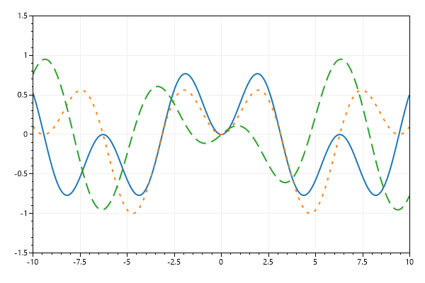

# Plot Type: Function
* This page contains recipes for the _Function_ category.
* Visit the [Cookbook Home Page](../../) to view all cookbook recipes.
* Generated by ScottPlot 4.1.69 on 12/11/2023
<h2><a href='/cookbook/4.1/recipes/function_quickstart/'>Function</a></h2>

Function plots are defined by a function (not X/Y data points) so the curve is continuous and can be zoomed in and out infinitely

```cs
var plt = new ScottPlot.Plot(600, 400);

// Functions are defined as delegates with an input and output
var func1 = new Func<double, double?>((x) => Math.Sin(x) * Math.Sin(x / 2));
var func2 = new Func<double, double?>((x) => Math.Sin(x) * Math.Sin(x / 3));
var func3 = new Func<double, double?>((x) => Math.Cos(x) * Math.Sin(x / 5));

// Add functions to the plot
plt.AddFunction(func1, lineWidth: 2);
plt.AddFunction(func2, lineWidth: 2, lineStyle: LineStyle.Dot);
plt.AddFunction(func3, lineWidth: 2, lineStyle: LineStyle.Dash);

// Manually set axis limits because functions do not have discrete data points
plt.SetAxisLimits(-10, 10, -1.5, 1.5);

plt.SaveFig("function_quickstart.png");
```




