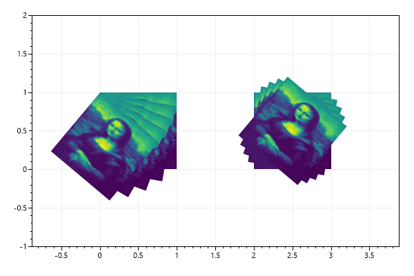
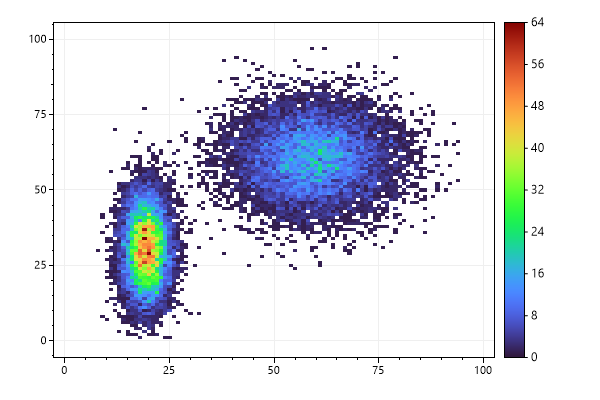
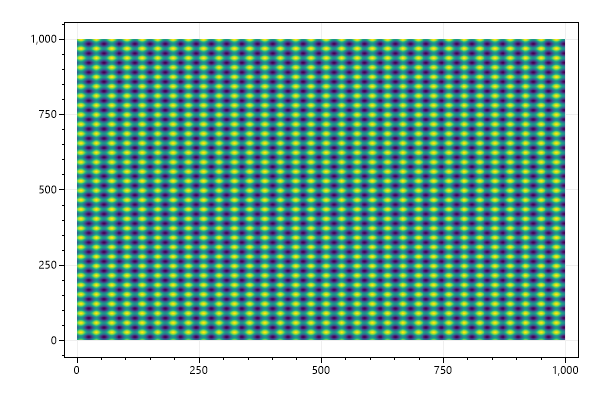

# Plot Type: Heatmap
* This page contains recipes for the _Heatmap_ category.
* Visit the [Cookbook Home Page](../../) to view all cookbook recipes.
* Generated by ScottPlot 4.1.70 on 1/14/2024
<h2><a id='heatmap-quickstart' href='/cookbook/4.1/recipes/heatmap_quickstart/'>Heatmap Quickstart</a></h2>

Heatmaps display a 2D array using a colormap.



```cs
ScottPlot.Version.ShouldBe(4, 1, 70);
var plt = new ScottPlot.Plot(600, 400);

double[,] data2D = { { 1, 2, 3 },
         { 4, 5, 6 } };

plt.AddHeatmap(data2D);

plt.SaveFig("heatmap_quickstart.png");
```




<h2><a id='flipped-heatmap' href='/cookbook/4.1/recipes/heatmap_flip/'>Flipped Heatmap</a></h2>

Heatmaps can be flipped vertically and/or horizontally.



```cs
ScottPlot.Version.ShouldBe(4, 1, 70);
var plt = new ScottPlot.Plot(600, 400);

double[,] data = ScottPlot.DataGen.SampleImageData();

var hm1 = plt.AddHeatmap(data, lockScales: false);
hm1.XMin = 0;

var hm2 = plt.AddHeatmap(data, lockScales: false);
hm2.XMin = 100;
hm2.FlipHorizontally = true;

var hm3 = plt.AddHeatmap(data, lockScales: false);
hm3.XMin = 200;
hm3.FlipVertically = true;

var hm4 = plt.AddHeatmap(data, lockScales: false);
hm4.XMin = 300;
hm4.FlipVertically = true;
hm4.FlipHorizontally = true;

plt.SaveFig("heatmap_flip.png");
```




<h2><a id='heatmap-with-tight-margins' href='/cookbook/4.1/recipes/heatmap_margins/'>Heatmap with Tight Margins</a></h2>

The heatmap can fit the plot area exactly if margins are set to zero and the square axis lock is disabled.



```cs
ScottPlot.Version.ShouldBe(4, 1, 70);
var plt = new ScottPlot.Plot(600, 400);

double[,] data2D = { { 1, 2, 3 },
         { 4, 5, 6 } };

plt.AddHeatmap(data2D, lockScales: false);
plt.Margins(0, 0);

plt.SaveFig("heatmap_margins.png");
```




<h2><a id='heatmap-with-colorbar' href='/cookbook/4.1/recipes/heatmap_colorbar/'>Heatmap with Colorbar</a></h2>

Colorbars are often added when heatmaps are used.



```cs
ScottPlot.Version.ShouldBe(4, 1, 70);
var plt = new ScottPlot.Plot(600, 400);

double[,] data2D = { { 1, 2, 3 },
         { 4, 5, 6 } };

var hm = plt.AddHeatmap(data2D, lockScales: false);
var cb = plt.AddColorbar(hm);
plt.Margins(0, 0);

plt.SaveFig("heatmap_colorbar.png");
```




<h2><a id='smooth-heatmap' href='/cookbook/4.1/recipes/heatmap_smooth/'>Smooth Heatmap</a></h2>

Heatmaps display values as rectangles with sharp borders by default. Enabling the Smooth feature uses bicubic interpolation to display the heatmap as a smooth gradient between values.



```cs
ScottPlot.Version.ShouldBe(4, 1, 70);
var plt = new ScottPlot.Plot(600, 400);

var rand = new Random(0);
double[,] data2D = DataGen.Random2D(rand, 5, 4);

var hm = plt.AddHeatmap(data2D, lockScales: false);
hm.Smooth = true;

plt.SaveFig("heatmap_smooth.png");
```




<h2><a id='heatmap-image' href='/cookbook/4.1/recipes/heatmap_image/'>Heatmap Image</a></h2>

Image data can be plotted using the heatmap plot type.



```cs
ScottPlot.Version.ShouldBe(4, 1, 70);
var plt = new ScottPlot.Plot(600, 400);

double[,] imageData = DataGen.SampleImageData();
plt.AddHeatmap(imageData);

plt.SaveFig("heatmap_image.png");
```




<h2><a id='frameless-heatmap' href='/cookbook/4.1/recipes/heatmap_frameless/'>Frameless Heatmap</a></h2>

Disable the frame and set margins to zero to create a heatmap plot that fills the entire image.



```cs
ScottPlot.Version.ShouldBe(4, 1, 70);
var plt = new ScottPlot.Plot(600, 400);

double[,] imageData = DataGen.SampleImageData();
plt.AddHeatmap(imageData, lockScales: false);
plt.Frameless();
plt.Margins(0, 0);

plt.SaveFig("heatmap_frameless.png");
```




<h2><a id='heatmap-opacity' href='/cookbook/4.1/recipes/heatmap_opacity/'>Heatmap Opacity</a></h2>

Heatmaps have an Opacity property that can be set anywhere from 0 (transparent) to 1 (opaque).



```cs
ScottPlot.Version.ShouldBe(4, 1, 70);
var plt = new ScottPlot.Plot(600, 400);

double[,] imageData = DataGen.SampleImageData();
var hm = plt.AddHeatmap(imageData);
hm.Opacity = 0.5;

plt.SaveFig("heatmap_opacity.png");
```




<h2><a id='single-color-heatmap' href='/cookbook/4.1/recipes/heatmap_single_color/'>Single Color Heatmap</a></h2>

A single-color heatmap can be created where cell transparency is defined by a 2D array containing values 0 to 1.



```cs
ScottPlot.Version.ShouldBe(4, 1, 70);
var plt = new ScottPlot.Plot(600, 400);

double?[,] data = DataGen.SampleImageDataNullable();

var hm1 = plt.AddHeatmap(Color.Red, data, lockScales: false);
hm1.OffsetX = 0;
hm1.OffsetY = 0;

var hm2 = plt.AddHeatmap(Color.Green, data, lockScales: false);
hm2.OffsetX = 30;
hm2.OffsetY = 20;

var hm3 = plt.AddHeatmap(Color.Blue, data, lockScales: false);
hm3.OffsetX = 60;
hm3.OffsetY = 40;

plt.SaveFig("heatmap_single_color.png");
```




<h2><a id='2d-waveform' href='/cookbook/4.1/recipes/heatmap_2dwaveform/'>2D Waveform</a></h2>

This example demonstrates a heatmap with 1000 tiles



```cs
ScottPlot.Version.ShouldBe(4, 1, 70);
var plt = new ScottPlot.Plot(600, 400);

int width = 100;
int height = 100;

double[,] intensities = new double[width, height];

for (int x = 0; x < width; x++)
    for (int y = 0; y < height; y++)
        intensities[x, y] = (Math.Sin(x * .2) + Math.Cos(y * .2)) * 100;

var hm = plt.AddHeatmap(intensities);
var cb = plt.AddColorbar(hm);

plt.SaveFig("heatmap_2dWaveform.png");
```




<h2><a id='colormap' href='/cookbook/4.1/recipes/heatmap_colormap/'>Colormap</a></h2>

Viridis is the default colormap, but several alternatives are available.



```cs
ScottPlot.Version.ShouldBe(4, 1, 70);
var plt = new ScottPlot.Plot(600, 400);

double[,] intensities = new double[100, 100];
for (int x = 0; x < 100; x++)
    for (int y = 0; y < 100; y++)
        intensities[x, y] = (Math.Sin(x * .2) + Math.Cos(y * .2)) * 100;

var hm = plt.AddHeatmap(intensities, Drawing.Colormap.Turbo);
var cb = plt.AddColorbar(hm);

plt.SaveFig("heatmap_colormap.png");
```




<h2><a id='styled-colormap' href='/cookbook/4.1/recipes/styled_heatmap_colormap/'>Styled Colormap</a></h2>

Viridis is the default colormap, but several alternatives are available.



```cs
ScottPlot.Version.ShouldBe(4, 1, 70);
var plt = new ScottPlot.Plot(600, 400);

double[,] intensities = new double[100, 100];
for (int x = 0; x < 100; x++)
    for (int y = 0; y < 100; y++)
        intensities[x, y] = (Math.Sin(x * .2) + Math.Cos(y * .2)) * 100;

var hm = plt.AddHeatmap(intensities, Drawing.Colormap.Turbo);
var cb = plt.AddColorbar(hm);

plt.Style(Style.Black);

plt.SaveFig("styled_heatmap_colormap.png");
```




<h2><a id='palette-colormap' href='/cookbook/4.1/recipes/heatmap_palette/'>Palette Colormap</a></h2>

Heatmap data can be presented using a colormap defined by a fixed set of colors.



```cs
ScottPlot.Version.ShouldBe(4, 1, 70);
var plt = new ScottPlot.Plot(600, 400);

double[,] data = DataGen.SampleImageData();

// create a colormap from a defined set of colors
Color[] colors = { Color.Indigo, Color.Blue, Color.Green, Color.Yellow, Color.Orange, Color.Red, };

// display the colormap on the plot as a colorbar
ScottPlot.Drawing.Colormap cmap = new(colors);
var cbar = plt.AddColorbar(cmap);
cbar.MaxValue = 255;

// use custom tick positions
double[] tickPositions = Enumerable.Range(0, colors.Length + 1)
    .Select(x => (double)x / colors.Length)
    .ToArray();
string[] tickLabels = tickPositions.Select(x => $"{x * 255:N2}").ToArray();
cbar.SetTicks(tickPositions, tickLabels);

// add a heatmap using the custom colormap
plt.AddHeatmap(data, cmap);

plt.SaveFig("heatmap_palette.png");
```




<h2><a id='scale-limits' href='/cookbook/4.1/recipes/heatmap_limitscale/'>Scale Limits</a></h2>

Heatmap colormap scale can use a defined min/max value.



```cs
ScottPlot.Version.ShouldBe(4, 1, 70);
var plt = new ScottPlot.Plot(600, 400);

double[,] intensities = new double[100, 100];
for (int x = 0; x < 100; x++)
    for (int y = 0; y < 100; y++)
        intensities[x, y] = (Math.Sin(x * .2) + Math.Cos(y * .2)) * 100;

// scale the colors between 0 and 200
var hm = plt.AddHeatmap(intensities);
hm.Update(intensities, min: 0, max: 200);

// add a colorbar with custom ticks
var cb = plt.AddColorbar(hm);
double[] tickPositions = ScottPlot.DataGen.Range(0, 200, 25, true);
string[] tickLabels = tickPositions.Select(x => x.ToString()).ToArray();
cb.SetTicks(tickPositions, tickLabels, min: 0, max: 200);

plt.SaveFig("heatmap_limitScale.png");
```




<h2><a id='color-clipping' href='/cookbook/4.1/recipes/heatmap_clip/'>Color Clipping</a></h2>

The value range displayed by the colormap can restricted to a narrow subset of the full data range. Tick labels at the edges of the colorbar can be made to show inequality symbols to indicate the range of data is being clipped when translating values to colors.



```cs
ScottPlot.Version.ShouldBe(4, 1, 70);
var plt = new ScottPlot.Plot(600, 400);

double[,] imageData = DataGen.SampleImageData();
var heatmap = plt.AddHeatmap(imageData);
heatmap.Update(imageData, min: 75, max: 125);

var cb = plt.AddColorbar(heatmap);

// configure the colorbar to display inequality operators at the edges
cb.MaxIsClipped = true;
cb.MinIsClipped = true;

plt.SaveFig("heatmap_clip.png");
```




<h2><a id='interpolation-by-density' href='/cookbook/4.1/recipes/heatmap_density/'>Interpolation by Density</a></h2>

Heatmaps can be created from random 2D data points using the count within a square of fixed size.



```cs
ScottPlot.Version.ShouldBe(4, 1, 70);
var plt = new ScottPlot.Plot(600, 400);

Random rand = new Random(0);
int[] xs = DataGen.RandomNormal(rand, 10000, 25, 10).Select(x => (int)x).ToArray();
int[] ys = DataGen.RandomNormal(rand, 10000, 25, 10).Select(y => (int)y).ToArray();

double[,] intensities = Tools.XYToIntensities(mode: IntensityMode.Density,
    xs: xs, ys: ys, width: 50, height: 50, sampleWidth: 4);

var hm = plt.AddHeatmap(intensities);
var cb = plt.AddColorbar(hm);

plt.SaveFig("heatmap_density.png");
```




<h2><a id='gaussian-interpolation' href='/cookbook/4.1/recipes/heatmap_gaussian/'>Gaussian Interpolation</a></h2>

Heatmaps can be created from 2D data points using bilinear interpolation with Gaussian weighting. This option results in a heatmap with a standard deviation of 4.



```cs
ScottPlot.Version.ShouldBe(4, 1, 70);
var plt = new ScottPlot.Plot(600, 400);

Random rand = new Random(0);
int[] xs = DataGen.RandomNormal(rand, 10000, 25, 10).Select(x => (int)x).ToArray();
int[] ys = DataGen.RandomNormal(rand, 10000, 25, 10).Select(y => (int)y).ToArray();

double[,] intensities = Tools.XYToIntensities(mode: IntensityMode.Gaussian,
    xs: xs, ys: ys, width: 50, height: 50, sampleWidth: 4);

var hm = plt.AddHeatmap(intensities);
var cb = plt.AddColorbar(hm);

plt.SaveFig("heatmap_gaussian.png");
```




<h2><a id='custom-dimensions' href='/cookbook/4.1/recipes/heatmap_dimensions/'>Custom Dimensions</a></h2>

By default heatmaps start at the origin and each rectangle (cell) is 1 unit in size, but heatmap offset and cell size can be customized.



```cs
ScottPlot.Version.ShouldBe(4, 1, 70);
var plt = new ScottPlot.Plot(600, 400);

double[,] data2D = { { 1, 2, 3 },
         { 4, 5, 6 } };

var hm = plt.AddHeatmap(data2D, lockScales: false);
hm.OffsetX = 10;
hm.OffsetY = 20;
hm.CellWidth = 5;
hm.CellHeight = 10;

plt.SaveFig("heatmap_dimensions.png");
```




<h2><a id='heatmap-with-empty-squares' href='/cookbook/4.1/recipes/heatmap_transparent/'>Heatmap with Empty Squares</a></h2>

You can use a 2D array of nullable doubles to indicate some squares do not contain data. This allows the user to display heatmaps with transparency and implement non-rectangular heatmaps.



```cs
ScottPlot.Version.ShouldBe(4, 1, 70);
var plt = new ScottPlot.Plot(600, 400);

double?[,] intensities = {
    { 1, 7, 4, null },
    { 9, null, 2, 4 },
    { 1, 4, null, 8 },
    { null, 2, 4, null }
};

var hmc = plt.AddHeatmap(intensities);
var cb = plt.AddColorbar(hmc);

plt.SaveFig("heatmap_transparent.png");
```




<h2><a id='heatmap-with-semitransparent-squares' href='/cookbook/4.1/recipes/heatmap_semitransparent/'>Heatmap with Semitransparent Squares</a></h2>

The intensities of heatmaps are mapped to color, but an optional 2D array of alpha values may be provided to separately control transparency of squares.



```cs
ScottPlot.Version.ShouldBe(4, 1, 70);
var plt = new ScottPlot.Plot(600, 400);

double?[,] values = {
    { 1, 7, 4, 5 },
    { 9, 3, 2, 4 },
    { 1, 4, 5, 8 },
    { 7, 2, 4, 2 }
};

double?[,] opacities = {
    { 1, 1, 1, 1 },
    { 1, 0, 1, 0 },
    { 1, .75, .5, 0 },
    { 1, .8, .6, .4 }
};

var hm = plt.AddHeatmap(values);
hm.Update(values, opacity: opacities);

plt.AddColorbar(hm);

plt.SaveFig("heatmap_semitransparent.png");
```




<h2><a id='size-and-placement' href='/cookbook/4.1/recipes/heatmap_placement/'>Size and Placement</a></h2>

Edges of the heatmap can be defined as an alternative to defining offset and cell size,



```cs
ScottPlot.Version.ShouldBe(4, 1, 70);
var plt = new ScottPlot.Plot(600, 400);

double[,] imageData = DataGen.SampleImageData();
var hm = plt.AddHeatmap(imageData, lockScales: false);

hm.XMin = -100;
hm.XMax = 100;
hm.YMin = -10;
hm.YMax = 10;

plt.SaveFig("heatmap_placement.png");
```




<h2><a id='heatmap-rotation' href='/cookbook/4.1/recipes/heatmap_rotation/'>Heatmap Rotation</a></h2>

A Heatmap can be rotated clockwise around around a user-specified center of rotation. Locking axis scales to enforce square pixels is recommended. Rotation occurs after any flipping operations.



```cs
ScottPlot.Version.ShouldBe(4, 1, 70);
var plt = new ScottPlot.Plot(600, 400);

double[,] imageData = DataGen.SampleImageData();

for (int i = 0; i < 5; i++)
{
    var hm = plt.AddHeatmap(imageData, lockScales: true);
    hm.XMin = 0;
    hm.XMax = 1;
    hm.YMin = 0;
    hm.YMax = 1;
    hm.Rotation = i * 10;
}

for (int i = 0; i < 5; i++)
{
    var hm = plt.AddHeatmap(imageData, lockScales: true);
    hm.XMin = 2;
    hm.XMax = 3;
    hm.YMin = 0;
    hm.YMax = 1;

    hm.CenterOfRotation = Alignment.MiddleCenter;

    hm.Rotation = i * 10;
}

plt.SetAxisLimits(-1, 4, -1, 2);

plt.SaveFig("heatmap_rotation.png");
```






<h2><a id='heatmap-clipping' href='/cookbook/4.1/recipes/heatmap_clipping/'>Heatmap Clipping</a></h2>

Heatmaps can be clipped to an arbitrary polygon



```cs
ScottPlot.Version.ShouldBe(4, 1, 70);
var plt = new ScottPlot.Plot(600, 400);

double[,] imageData = DataGen.SampleImageData();
var hm = plt.AddHeatmap(imageData, lockScales: false);
hm.ClippingPoints = new Coordinate[]
{
    new Coordinate(30, 15),
    new Coordinate(55, 40),
    new Coordinate(60, 45),
    new Coordinate(80, 60),
    new Coordinate(40, 95),
    new Coordinate(15, 90),
    new Coordinate(5, 50),
};

plt.SaveFig("heatmap_clipping.png");
```




<h2><a id='binned-histogram' href='/cookbook/4.1/recipes/heatmap_binned/'>Binned Histogram</a></h2>

Binned histograms are 2D heatmaps that use a colormap to display cell counts. Charts like this are commonly used in scientific and medical applications.



```cs
ScottPlot.Version.ShouldBe(4, 1, 70);
var plt = new ScottPlot.Plot(600, 400);

// create a binned histogram
var hist2d = plt.AddBinnedHistogram(100, 100);

// data is a collection of X/Y points
Coordinate[] flowData = DataGen.FlowCytometry();

// add X/Y points to the histogram
hist2d.AddRange(flowData);

plt.SaveFig("heatmap_binned.png");
```






<h2><a id='parallel-processing' href='/cookbook/4.1/recipes/heatmap_parallel/'>Parallel Processing</a></h2>

Heatmaps have opt-in parallel processing which may improve performance when calling Update() for large datasets.



```cs
ScottPlot.Version.ShouldBe(4, 1, 70);
var plt = new ScottPlot.Plot(600, 400);

double[,] data = Generate.Sin2D(width: 1_000, height: 1_000);
var hm = plt.AddHeatmap(data, lockScales: false);

// opt into parallel processing
hm.UseParallel = true;

plt.SaveFig("heatmap_parallel.png");
```






<h2><a id='inverted-heatmap' href='/cookbook/4.1/recipes/heatmap_inverted/'>Inverted Heatmap</a></h2>

An inverted heatmap can be created by reversing the colors in the colormap.



```cs
ScottPlot.Version.ShouldBe(4, 1, 70);
var plt = new ScottPlot.Plot(600, 400);

double[,] data = DataGen.SampleImageData();

var hm1 = plt.AddHeatmap(data, lockScales: false);
hm1.Update(data, ScottPlot.Drawing.Colormap.Turbo);

var hm2 = plt.AddHeatmap(data, lockScales: false);
hm2.XMin = 75;
hm2.Update(data, ScottPlot.Drawing.Colormap.Turbo.Reversed());

plt.SaveFig("heatmap_inverted.png");
```




