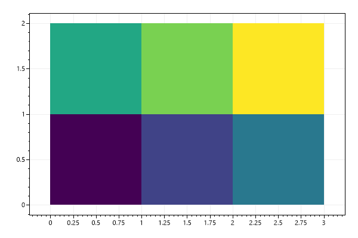
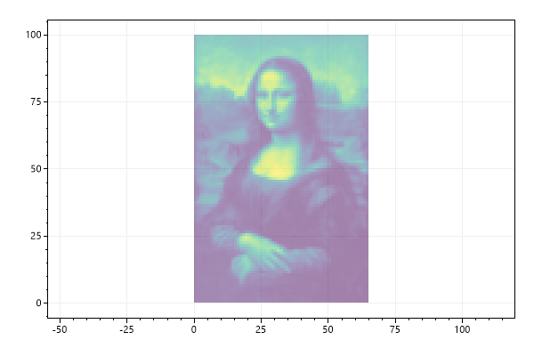
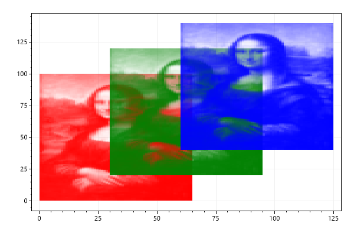
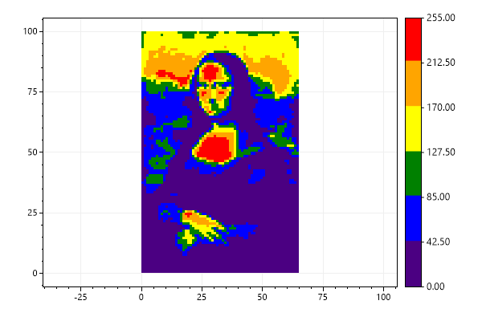
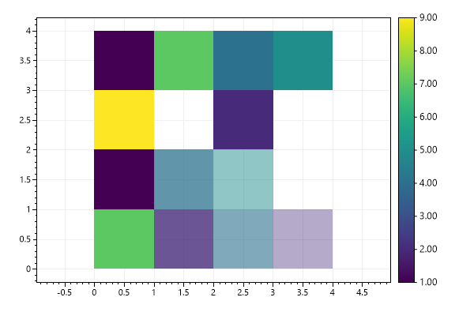
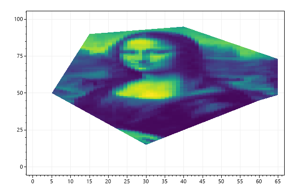

* This page contains recipes for the _Heatmap_ category.
* Visit the [Cookbook Home Page](../../) to view all cookbook recipes.
* Generated by ScottPlot 4.1.63 on 4/9/2023
## Heatmap Quickstart

Heatmaps display a 2D array using a colormap.

```cs
var plt = new ScottPlot.Plot(600, 400);

double[,] data2D = { { 1, 2, 3 },
         { 4, 5, 6 } };

plt.AddHeatmap(data2D);

plt.SaveFig("heatmap_quickstart.png");
```


## Flipped Heatmap

Heatmaps can be flipped vertically and/or horizontally.

```cs
var plt = new ScottPlot.Plot(600, 400);

double[,] data = ScottPlot.DataGen.SampleImageData();

var hm1 = plt.AddHeatmap(data, lockScales: false);
hm1.XMin = 0;

var hm2 = plt.AddHeatmap(data, lockScales: false);
hm2.XMin = 100;
hm2.FlipHorizontally = true;

var hm3 = plt.AddHeatmap(data, lockScales: false);
hm3.XMin = 200;
hm3.FlipVertically = true;

var hm4 = plt.AddHeatmap(data, lockScales: false);
hm4.XMin = 300;
hm4.FlipVertically = true;
hm4.FlipHorizontally = true;

plt.SaveFig("heatmap_flip.png");
```




## Heatmap with Tight Margins

The heatmap can fit the plot area exactly if margins are set to zero and the square axis lock is disabled.

```cs
var plt = new ScottPlot.Plot(600, 400);

double[,] data2D = { { 1, 2, 3 },
         { 4, 5, 6 } };

plt.AddHeatmap(data2D, lockScales: false);
plt.Margins(0, 0);

plt.SaveFig("heatmap_margins.png");
```


## Heatmap with Colorbar

Colorbars are often added when heatmaps are used.

```cs
var plt = new ScottPlot.Plot(600, 400);

double[,] data2D = { { 1, 2, 3 },
         { 4, 5, 6 } };

var hm = plt.AddHeatmap(data2D, lockScales: false);
var cb = plt.AddColorbar(hm);
plt.Margins(0, 0);

plt.SaveFig("heatmap_colorbar.png");
```


## Smooth Heatmap

Heatmaps display values as rectangles with sharp borders by default. Enabling the Smooth feature uses bicubic interpolation to display the heatmap as a smooth gradient between values.

```cs
var plt = new ScottPlot.Plot(600, 400);

var rand = new Random(0);
double[,] data2D = DataGen.Random2D(rand, 5, 4);

var hm = plt.AddHeatmap(data2D, lockScales: false);
hm.Smooth = true;

plt.SaveFig("heatmap_smooth.png");
```


## Heatmap Image

Image data can be plotted using the heatmap plot type.

```cs
var plt = new ScottPlot.Plot(600, 400);

double[,] imageData = DataGen.SampleImageData();
plt.AddHeatmap(imageData);

plt.SaveFig("heatmap_image.png");
```


## Heatmap Opacity

Heatmaps have an Opacity property that can be set anywhere from 0 (transparent) to 1 (opaque).

```cs
var plt = new ScottPlot.Plot(600, 400);

double[,] imageData = DataGen.SampleImageData();
var hm = plt.AddHeatmap(imageData);
hm.Opacity = 0.5;

plt.SaveFig("heatmap_opacity.png");
```




## Single Color Heatmap

A single-color heatmap can be created where cell transparency is defined by a 2D array containing values 0 to 1.

```cs
var plt = new ScottPlot.Plot(600, 400);

double?[,] data = DataGen.SampleImageDataNullable();

var hm1 = plt.AddHeatmap(Color.Red, data, lockScales: false);
hm1.OffsetX = 0;
hm1.OffsetY = 0;

var hm2 = plt.AddHeatmap(Color.Green, data, lockScales: false);
hm2.OffsetX = 30;
hm2.OffsetY = 20;

var hm3 = plt.AddHeatmap(Color.Blue, data, lockScales: false);
hm3.OffsetX = 60;
hm3.OffsetY = 40;

plt.SaveFig("heatmap_single_color.png");
```




## 2D Waveform

This example demonstrates a heatmap with 1000 tiles

```cs
var plt = new ScottPlot.Plot(600, 400);

int width = 100;
int height = 100;

double[,] intensities = new double[width, height];

for (int x = 0; x < width; x++)
    for (int y = 0; y < height; y++)
        intensities[x, y] = (Math.Sin(x * .2) + Math.Cos(y * .2)) * 100;

var hm = plt.AddHeatmap(intensities);
var cb = plt.AddColorbar(hm);

plt.SaveFig("heatmap_2dWaveform.png");
```


## Colormap

Viridis is the default colormap, but several alternatives are available.

```cs
var plt = new ScottPlot.Plot(600, 400);

double[,] intensities = new double[100, 100];
for (int x = 0; x < 100; x++)
    for (int y = 0; y < 100; y++)
        intensities[x, y] = (Math.Sin(x * .2) + Math.Cos(y * .2)) * 100;

var hm = plt.AddHeatmap(intensities, Drawing.Colormap.Turbo);
var cb = plt.AddColorbar(hm);

plt.SaveFig("heatmap_colormap.png");
```


## Styled Colormap

Viridis is the default colormap, but several alternatives are available.

```cs
var plt = new ScottPlot.Plot(600, 400);

double[,] intensities = new double[100, 100];
for (int x = 0; x < 100; x++)
    for (int y = 0; y < 100; y++)
        intensities[x, y] = (Math.Sin(x * .2) + Math.Cos(y * .2)) * 100;

var hm = plt.AddHeatmap(intensities, Drawing.Colormap.Turbo);
var cb = plt.AddColorbar(hm);

plt.Style(Style.Black);

plt.SaveFig("styled_heatmap_colormap.png");
```


## Palette Colormap

Heatmap data can be presented using a colormap defined by a fixed set of colors.

```cs
var plt = new ScottPlot.Plot(600, 400);

double[,] data = DataGen.SampleImageData();

// create a colormap from a defined set of colors
Color[] colors = { Color.Indigo, Color.Blue, Color.Green, Color.Yellow, Color.Orange, Color.Red, };

// display the colormap on the plot as a colorbar
ScottPlot.Drawing.Colormap cmap = new(colors);
var cbar = plt.AddColorbar(cmap);
cbar.MaxValue = 255;

// use custom tick positions
double[] tickPositions = Enumerable.Range(0, colors.Length + 1)
    .Select(x => (double)x / colors.Length)
    .ToArray();
string[] tickLabels = tickPositions.Select(x => $"{x * 255:N2}").ToArray();
cbar.SetTicks(tickPositions, tickLabels);

// add a heatmap using the custom colormap
plt.AddHeatmap(data, cmap);

plt.SaveFig("heatmap_palette.png");
```




## Scale Limits

Heatmap colormap scale can use a defined min/max value.

```cs
var plt = new ScottPlot.Plot(600, 400);

double[,] intensities = new double[100, 100];
for (int x = 0; x < 100; x++)
    for (int y = 0; y < 100; y++)
        intensities[x, y] = (Math.Sin(x * .2) + Math.Cos(y * .2)) * 100;

// scale the colors between 0 and 200
var hm = plt.AddHeatmap(intensities);
hm.Update(intensities, min: 0, max: 200);

// add a colorbar with custom ticks
var cb = plt.AddColorbar(hm);
double[] tickPositions = ScottPlot.DataGen.Range(0, 200, 25, true);
string[] tickLabels = tickPositions.Select(x => x.ToString()).ToArray();
cb.SetTicks(tickPositions, tickLabels, min: 0, max: 200);

plt.SaveFig("heatmap_limitScale.png");
```


## Color Clipping

The value range displayed by the colormap can restricted to a narrow subset of the full data range. Tick labels at the edges of the colorbar can be made to show inequality symbols to indicate the range of data is being clipped when translating values to colors.

```cs
var plt = new ScottPlot.Plot(600, 400);

double[,] imageData = DataGen.SampleImageData();
var heatmap = plt.AddHeatmap(imageData);
heatmap.Update(imageData, min: 75, max: 125);

var cb = plt.AddColorbar(heatmap);

// configure the colorbar to display inequality operators at the edges
cb.MaxIsClipped = true;
cb.MinIsClipped = true;

plt.SaveFig("heatmap_clip.png");
```


## Interpolation by Density

Heatmaps can be created from random 2D data points using the count within a square of fixed size.

```cs
var plt = new ScottPlot.Plot(600, 400);

Random rand = new Random(0);
int[] xs = DataGen.RandomNormal(rand, 10000, 25, 10).Select(x => (int)x).ToArray();
int[] ys = DataGen.RandomNormal(rand, 10000, 25, 10).Select(y => (int)y).ToArray();

double[,] intensities = Tools.XYToIntensities(mode: IntensityMode.Density,
    xs: xs, ys: ys, width: 50, height: 50, sampleWidth: 4);

var hm = plt.AddHeatmap(intensities);
var cb = plt.AddColorbar(hm);

plt.SaveFig("heatmap_density.png");
```


## Gaussian Interpolation

Heatmaps can be created from 2D data points using bilinear interpolation with Gaussian weighting. This option results in a heatmap with a standard deviation of 4.

```cs
var plt = new ScottPlot.Plot(600, 400);

Random rand = new Random(0);
int[] xs = DataGen.RandomNormal(rand, 10000, 25, 10).Select(x => (int)x).ToArray();
int[] ys = DataGen.RandomNormal(rand, 10000, 25, 10).Select(y => (int)y).ToArray();

double[,] intensities = Tools.XYToIntensities(mode: IntensityMode.Gaussian,
    xs: xs, ys: ys, width: 50, height: 50, sampleWidth: 4);

var hm = plt.AddHeatmap(intensities);
var cb = plt.AddColorbar(hm);

plt.SaveFig("heatmap_gaussian.png");
```


## Custom Dimensions

By default heatmaps start at the origin and each rectangle (cell) is 1 unit in size, but heatmap offset and cell size can be customized.

```cs
var plt = new ScottPlot.Plot(600, 400);

double[,] data2D = { { 1, 2, 3 },
         { 4, 5, 6 } };

var hm = plt.AddHeatmap(data2D, lockScales: false);
hm.OffsetX = 10;
hm.OffsetY = 20;
hm.CellWidth = 5;
hm.CellHeight = 10;

plt.SaveFig("heatmap_dimensions.png");
```


## Heatmap with Empty Squares

You can use a 2D array of nullable doubles to indicate some squares do not contain data. This allows the user to display heatmaps with transparency and implement non-rectangular heatmaps.

```cs
var plt = new ScottPlot.Plot(600, 400);

double?[,] intensities = {
    { 1, 7, 4, null },
    { 9, null, 2, 4 },
    { 1, 4, null, 8 },
    { null, 2, 4, null }
};

var hmc = plt.AddHeatmap(intensities);
var cb = plt.AddColorbar(hmc);

plt.SaveFig("heatmap_transparent.png");
```


## Heatmap with Semitransparent Squares

The intensities of heatmaps are mapped to color, but an optional 2D array of alpha values may be provided to separately control transparency of squares.

```cs
var plt = new ScottPlot.Plot(600, 400);

double?[,] values = {
    { 1, 7, 4, 5 },
    { 9, 3, 2, 4 },
    { 1, 4, 5, 8 },
    { 7, 2, 4, 2 }
};

double?[,] opacities = {
    { 1, 1, 1, 1 },
    { 1, 0, 1, 0 },
    { 1, .75, .5, 0 },
    { 1, .8, .6, .4 }
};

var hm = plt.AddHeatmap(values);
hm.Update(values, opacity: opacities);

plt.AddColorbar(hm);

plt.SaveFig("heatmap_semitransparent.png");
```




## Size and Placement

Edges of the heatmap can be defined as an alternative to defining offset and cell size,

```cs
var plt = new ScottPlot.Plot(600, 400);

double[,] imageData = DataGen.SampleImageData();
var hm = plt.AddHeatmap(imageData, lockScales: false);

hm.XMin = -100;
hm.XMax = 100;
hm.YMin = -10;
hm.YMax = 10;

plt.SaveFig("heatmap_placement.png");
```


## Heatmap Clipping

Heatmaps can be clipped to an arbitrary polygon

```cs
var plt = new ScottPlot.Plot(600, 400);

double[,] imageData = DataGen.SampleImageData();
var hm = plt.AddHeatmap(imageData, lockScales: false);
hm.ClippingPoints = new Coordinate[]
{
    new Coordinate(30, 15),
    new Coordinate(55, 40),
    new Coordinate(60, 45),
    new Coordinate(80, 60),
    new Coordinate(40, 95),
    new Coordinate(15, 90),
    new Coordinate(5, 50),
};

plt.SaveFig("heatmap_clipping.png");
```




