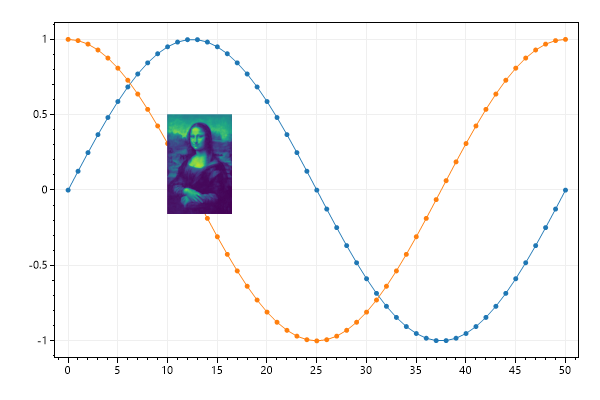
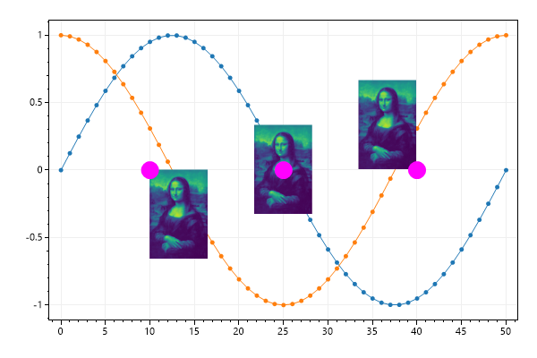
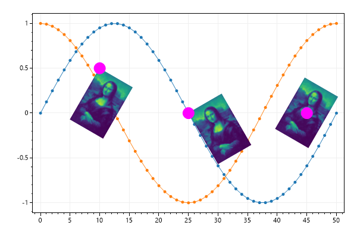
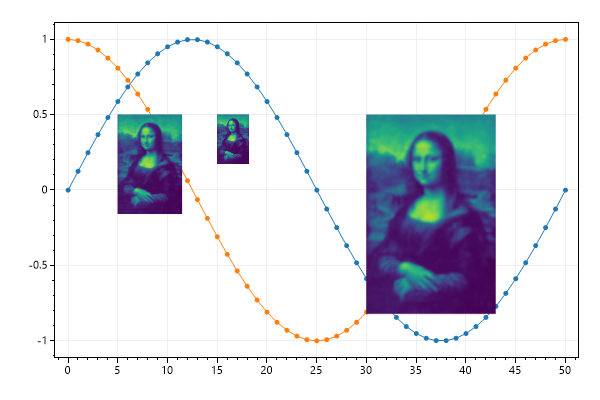
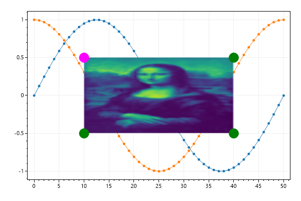
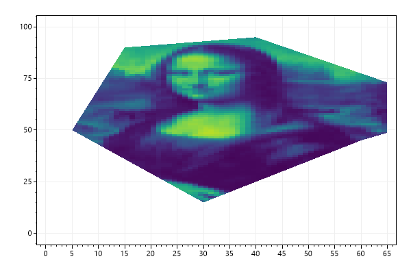
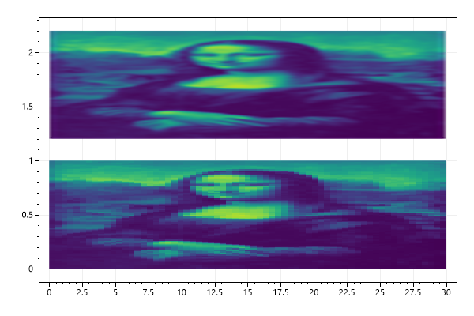

# Plot Type: Image
* This page contains recipes for the _Image_ category.
* Visit the [Cookbook Home Page](../../) to view all cookbook recipes.
* Generated by ScottPlot 4.1.69 on 12/11/2023
<h2><a href='/cookbook/4.1/recipes/image_quickstart/'>Image Quickstart</a></h2>

The Image plottable places a Bitmap at coordinte in axis space.

```cs
var plt = new ScottPlot.Plot(600, 400);

plt.AddSignal(DataGen.Sin(51));
plt.AddSignal(DataGen.Cos(51));

Bitmap monaLisa = DataGen.SampleImage();

plt.AddImage(monaLisa, 10, .5);

plt.SaveFig("image_quickstart.png");
```




<h2><a href='/cookbook/4.1/recipes/image_alignment/'>Image Alignment</a></h2>

By default the X/Y coordinates define the upper left position of the image, but alignment can be customized by defining the anchor.

```cs
var plt = new ScottPlot.Plot(600, 400);

plt.AddSignal(DataGen.Sin(51));
plt.AddSignal(DataGen.Cos(51));

Bitmap monaLisa = DataGen.SampleImage();

plt.AddImage(monaLisa, 10, 0);
plt.AddPoint(10, 0, Color.Magenta, size: 20);

plt.AddImage(monaLisa, 25, 0, anchor: Alignment.MiddleCenter);
plt.AddPoint(25, 0, Color.Magenta, size: 20);

plt.AddImage(monaLisa, 40, 0, anchor: Alignment.LowerRight);
plt.AddPoint(40, 0, Color.Magenta, size: 20);

plt.SaveFig("image_alignment.png");
```




<h2><a href='/cookbook/4.1/recipes/image_rotation/'>Image Rotation</a></h2>

Images can be rotated around the position defined by their anchor.

```cs
var plt = new ScottPlot.Plot(600, 400);

plt.AddSignal(DataGen.Sin(51));
plt.AddSignal(DataGen.Cos(51));

Bitmap monaLisa = DataGen.SampleImage();

plt.AddImage(monaLisa, 10, .5, rotation: 30);
plt.AddPoint(10, .5, color: Color.Magenta, size: 20);

plt.AddImage(monaLisa, 25, 0, rotation: -30);
plt.AddPoint(25, 0, color: Color.Magenta, size: 20);

plt.AddImage(monaLisa, 45, 0, rotation: 30, anchor: Alignment.MiddleCenter);
plt.AddPoint(45, 0, color: Color.Magenta, size: 20);

plt.SaveFig("image_rotation.png");
```




<h2><a href='/cookbook/4.1/recipes/image_border/'>Image Border</a></h2>

The borders of images can be customized.

```cs
var plt = new ScottPlot.Plot(600, 400);

plt.AddSignal(DataGen.Sin(51));
plt.AddSignal(DataGen.Cos(51));

Bitmap monaLisa = DataGen.SampleImage();

var img = plt.AddImage(monaLisa, 10, .5, rotation: 30);
img.BorderColor = Color.Magenta;
img.BorderSize = 5;

plt.SaveFig("image_border.png");
```


<h2><a href='/cookbook/4.1/recipes/image_scaling/'>Image Scaling</a></h2>

Size of the image (in relative pixel units) can be adjusted.

```cs
var plt = new ScottPlot.Plot(600, 400);

plt.AddSignal(DataGen.Sin(51));
plt.AddSignal(DataGen.Cos(51));

Bitmap monaLisa = DataGen.SampleImage();

plt.AddImage(monaLisa, 5, .5);
plt.AddImage(monaLisa, 15, .5, scale: .5);
plt.AddImage(monaLisa, 30, .5, scale: 2);

plt.SaveFig("image_scaling.png");
```




<h2><a href='/cookbook/4.1/recipes/image_stretching/'>Image Stretching</a></h2>

By default image dimensions are in pixel units so they are not stretched as axes are manipulated. However, users have the option to define image dimensions in axis units. In this case, corners of images will remain fixed on the coordinate system and will get stretched as axes are stretched.

```cs
var plt = new ScottPlot.Plot(600, 400);

// display some sample data
plt.AddSignal(DataGen.Sin(51));
plt.AddSignal(DataGen.Cos(51));

Bitmap monaLisa = DataGen.SampleImage();

var img = plt.AddImage(monaLisa, 10, .5);
img.HeightInAxisUnits = 1;
img.WidthInAxisUnits = 30;

// 4 corners of the image remain fixed in coordinate space
plt.AddPoint(10, .5, color: Color.Magenta, size: 20);
plt.AddPoint(40, .5, color: Color.Green, size: 20);
plt.AddPoint(10, -.5, color: Color.Green, size: 20);
plt.AddPoint(40, -.5, color: Color.Green, size: 20);

plt.SaveFig("image_stretching.png");
```




<h2><a href='/cookbook/4.1/recipes/image_clipping/'>Image Clipping</a></h2>

Images can be clipped to an arbitrary polygon

```cs
var plt = new ScottPlot.Plot(600, 400);

Bitmap bmp = DataGen.SampleImage();
var img = plt.AddImage(bmp, 0, bmp.Height);
img.HeightInAxisUnits = bmp.Height;
img.WidthInAxisUnits = bmp.Width;
img.ClippingPoints = new Coordinate[]
{
    new Coordinate(30, 15),
    new Coordinate(55, 40),
    new Coordinate(60, 45),
    new Coordinate(80, 60),
    new Coordinate(40, 95),
    new Coordinate(15, 90),
    new Coordinate(5, 50),
};

plt.SaveFig("image_clipping.png");
```




<h2><a href='/cookbook/4.1/recipes/images_smooth/'>Image Anti-Aliasing</a></h2>

Images have an option to enable or disable anti-aliasing

```cs
var plt = new ScottPlot.Plot(600, 400);

Bitmap bmp = DataGen.SampleImage();
var imgTop = plt.AddImage(bmp, 0, 2.2);
imgTop.HeightInAxisUnits = 1;
imgTop.WidthInAxisUnits = 30;
imgTop.AntiAlias = true;

var imgBottom = plt.AddImage(bmp, 0, 1.0);
imgBottom.HeightInAxisUnits = 1;
imgBottom.WidthInAxisUnits = 30;
imgBottom.AntiAlias = false;

plt.SaveFig("images_smooth.png");
```




