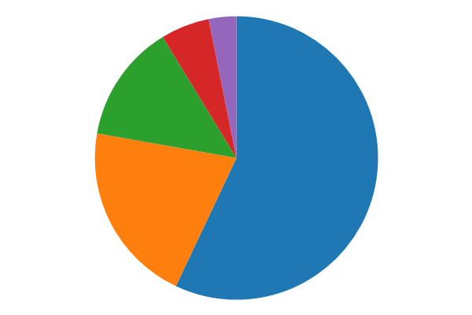
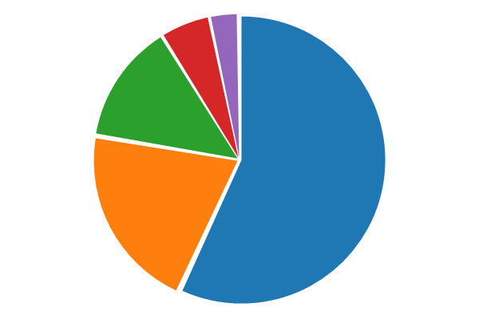
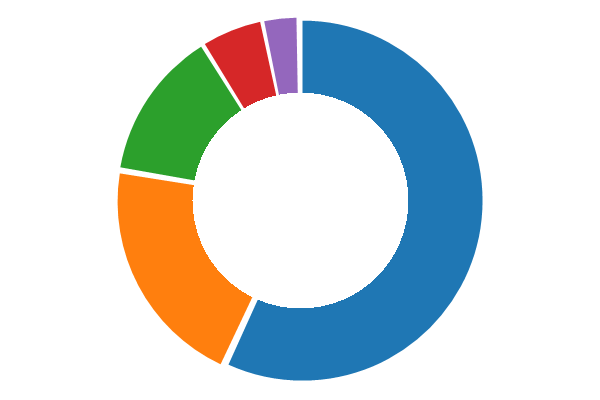
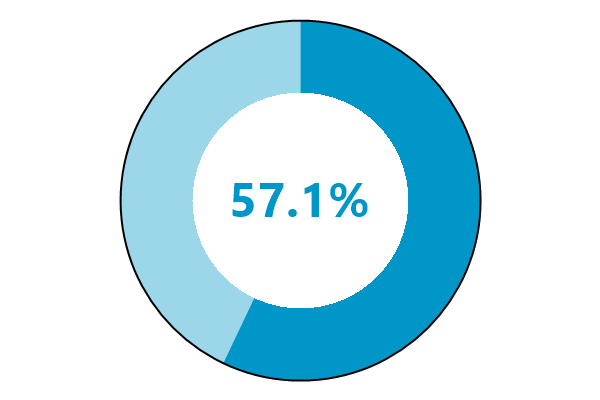
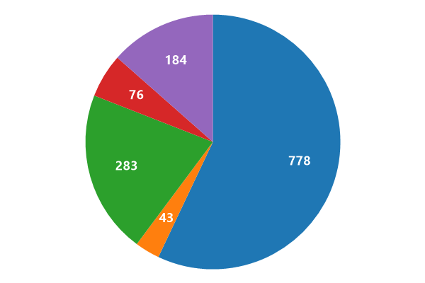
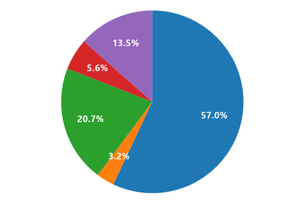
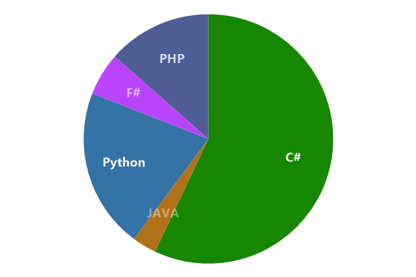
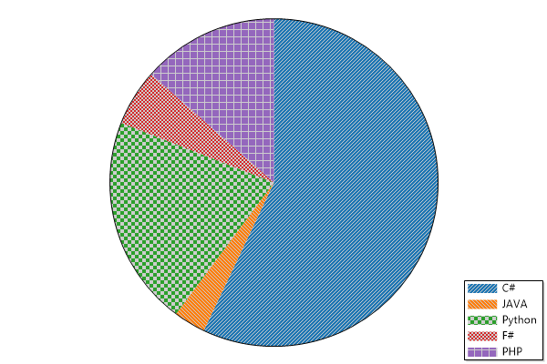
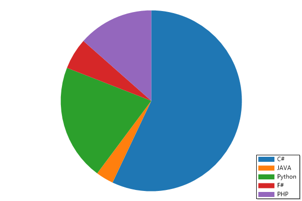
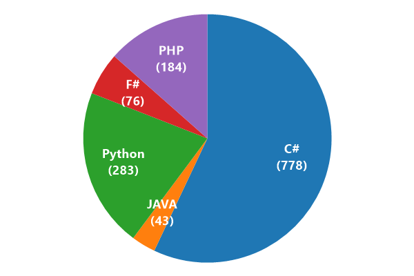

* This page contains recipes for the _Pie Chart_ category.
* Visit the [Cookbook Home Page](../../) to view all cookbook recipes.
* Generated by ScottPlot 4.1.53 on 8/12/2022
## Pie Chart

A pie chart illustrates numerical proportions as slices of a circle.

```cs
var plt = new ScottPlot.Plot(600, 400);

double[] values = { 778, 283, 184, 76, 43 };
plt.AddPie(values);

plt.SaveFig("pie_quickstart.png");
```




## Exploded Pie Chart

Exploded pie charts have a bit of space between their slices.

```cs
var plt = new ScottPlot.Plot(600, 400);

double[] values = { 778, 283, 184, 76, 43 };
var pie = plt.AddPie(values);
pie.Explode = true;

plt.SaveFig("pie_exploded.png");
```




## Donut Chart

Donut plots are pie charts with a hollow center.

```cs
var plt = new ScottPlot.Plot(600, 400);

double[] values = { 778, 283, 184, 76, 43 };
var pie = plt.AddPie(values);
pie.Explode = true;
pie.DonutSize = .6;

plt.SaveFig("pie_donut.png");
```




## Donut with Text

Custom text can be displayed in the center of a donut chart. Notice too how the colors of each slice are customized in this example.

```cs
var plt = new ScottPlot.Plot(600, 400);

double[] values = { 779, 586 };
string centerText = $"{values[0] / values.Sum() * 100:00.0}%";
Color color1 = Color.FromArgb(255, 0, 150, 200);
Color color2 = Color.FromArgb(100, 0, 150, 200);

var pie = plt.AddPie(values);
pie.DonutSize = .6;
pie.DonutLabel = centerText;
pie.CenterFont.Color = color1;
pie.OutlineSize = 2;
pie.SliceFillColors = new Color[] { color1, color2 };

plt.SaveFig("pie_donutText.png");
```




## Slice Values

The value of each slice can be displayed at its center.

```cs
var plt = new ScottPlot.Plot(600, 400);

double[] values = { 778, 43, 283, 76, 184 };
var pie = plt.AddPie(values);
pie.ShowValues = true;

plt.SaveFig("pie_showValues.png");
```




## Slice Percentages

The percentage of each slice can be displayed at its center.

```cs
var plt = new ScottPlot.Plot(600, 400);

double[] values = { 778, 43, 283, 76, 184 };
var pie = plt.AddPie(values);
pie.ShowPercentages = true;

plt.SaveFig("pie_showPercentage.png");
```




## Customize Pie Colors

Colors for pie slices and labels can be customized.

```cs
var plt = new ScottPlot.Plot(600, 400);

double[] values = { 778, 43, 283, 76, 184 };
string[] labels = { "C#", "JAVA", "Python", "F#", "PHP" };

// Language colors from https://github.com/ozh/github-colors
Color[] sliceColors =
{
    ColorTranslator.FromHtml("#178600"),
    ColorTranslator.FromHtml("#B07219"),
    ColorTranslator.FromHtml("#3572A5"),
    ColorTranslator.FromHtml("#B845FC"),
    ColorTranslator.FromHtml("#4F5D95"),
};

// Show labels using different transparencies
Color[] labelColors =
    new Color[] {
    Color.FromArgb(255, Color.White),
    Color.FromArgb(100, Color.White),
    Color.FromArgb(250, Color.White),
    Color.FromArgb(150, Color.White),
    Color.FromArgb(200, Color.White),
};

var pie = plt.AddPie(values);
pie.SliceLabels = labels;
pie.ShowLabels = true;
pie.SliceFillColors = sliceColors;
pie.SliceLabelColors = labelColors;

plt.SaveFig("pie_customColors.png");
```




## Customize Pie Hatching

Hatching (patterns) for pie slices and labels can be customized.

```cs
var plt = new ScottPlot.Plot(600, 400);

double[] values = { 778, 43, 283, 76, 184 };
string[] labels = { "C#", "JAVA", "Python", "F#", "PHP" };

var pie = plt.AddPie(values);
pie.HatchOptions = new HatchOptions[] {
    new () { Pattern = HatchStyle.StripedUpwardDiagonal, Color = Color.FromArgb(100, Color.Gray) },
    new () { Pattern = HatchStyle.StripedDownwardDiagonal, Color = Color.FromArgb(100, Color.Gray) },
    new () { Pattern = HatchStyle.LargeCheckerBoard, Color = Color.FromArgb(100, Color.Gray) },
    new () { Pattern = HatchStyle.SmallCheckerBoard, Color = Color.FromArgb(100, Color.Gray) },
    new () { Pattern = HatchStyle.LargeGrid, Color = Color.FromArgb(100, Color.Gray) },
};
pie.OutlineSize = 1;

pie.SliceLabels = labels;
plt.Legend();

plt.SaveFig("pie_customHatch.png");
```




## Slices in Legend

Slices can be labeled in the legend.

```cs
var plt = new ScottPlot.Plot(600, 400);

double[] values = { 778, 43, 283, 76, 184 };
string[] labels = { "C#", "JAVA", "Python", "F#", "PHP" };
var pie = plt.AddPie(values);
pie.SliceLabels = labels;
plt.Legend();

plt.SaveFig("pie_legend.png");
```




## Label Everything

Slices can labeled with values, percentages, and lables, with a legend.

```cs
var plt = new ScottPlot.Plot(600, 400);

double[] values = { 778, 43, 283, 76, 184 };
string[] labels = { "C#", "JAVA", "Python", "F#", "PHP" };
var pie = plt.AddPie(values);
pie.SliceLabels = labels;
pie.ShowPercentages = true;
pie.ShowValues = true;
pie.ShowLabels = true;
plt.Legend();

plt.SaveFig("pie_showEverything.png");
```


## Custom Slice Labels

Custom slice labels can be used to display values using custom formats

```cs
var plt = new ScottPlot.Plot(600, 400);

double[] values = { 778, 43, 283, 76, 184 };
string[] labels = { "C#", "JAVA", "Python", "F#", "PHP" };

// modify labels to include a custom formatted value
labels = Enumerable.Range(0, values.Length)
       .Select(i => $"{labels[i]}\n({values[i]})")
       .ToArray();

var pie = plt.AddPie(values);
pie.SliceLabels = labels;
pie.ShowLabels = true;

plt.SaveFig("pie_customLabels.png");
```




