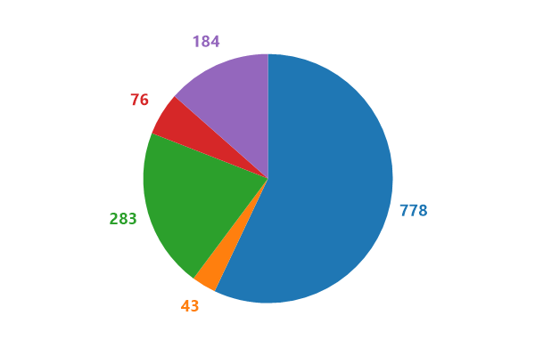
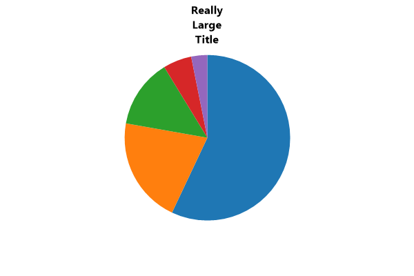
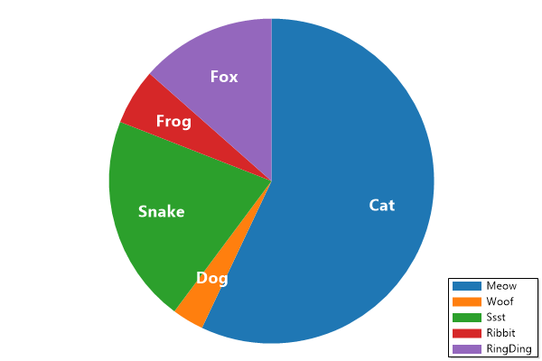

# Plot Type: Pie Chart
* This page contains recipes for the _Pie Chart_ category.
* Visit the [Cookbook Home Page](../../) to view all cookbook recipes.
* Generated by ScottPlot 4.1.71 on 1/21/2024
<h2><a id='pie-chart' href='/cookbook/4.1/recipes/pie_quickstart/'>Pie Chart</a></h2>

A pie chart illustrates numerical proportions as slices of a circle.



```cs
ScottPlot.Version.ShouldBe(4, 1, 71);
var plt = new ScottPlot.Plot(600, 400);

double[] values = { 778, 283, 184, 76, 43 };
plt.AddPie(values);

plt.SaveFig("pie_quickstart.png");
```




<h2><a id='exploded-pie-chart' href='/cookbook/4.1/recipes/pie_exploded/'>Exploded Pie Chart</a></h2>

Exploded pie charts have a bit of space between their slices.



```cs
ScottPlot.Version.ShouldBe(4, 1, 71);
var plt = new ScottPlot.Plot(600, 400);

double[] values = { 778, 283, 184, 76, 43 };
var pie = plt.AddPie(values);
pie.Explode = true;

plt.SaveFig("pie_exploded.png");
```




<h2><a id='donut-chart' href='/cookbook/4.1/recipes/pie_donut/'>Donut Chart</a></h2>

Donut plots are pie charts with a hollow center.



```cs
ScottPlot.Version.ShouldBe(4, 1, 71);
var plt = new ScottPlot.Plot(600, 400);

double[] values = { 778, 283, 184, 76, 43 };
var pie = plt.AddPie(values);
pie.Explode = true;
pie.DonutSize = .6;

plt.SaveFig("pie_donut.png");
```




<h2><a id='donut-with-text' href='/cookbook/4.1/recipes/pie_donuttext/'>Donut with Text</a></h2>

Custom text can be displayed in the center of a donut chart. Notice too how the colors of each slice are customized in this example.



```cs
ScottPlot.Version.ShouldBe(4, 1, 71);
var plt = new ScottPlot.Plot(600, 400);

double[] values = { 779, 586 };
string centerText = $"{values[0] / values.Sum() * 100:00.0}%";
Color color1 = Color.FromArgb(255, 0, 150, 200);
Color color2 = Color.FromArgb(100, 0, 150, 200);

var pie = plt.AddPie(values);
pie.DonutSize = .6;
pie.DonutLabel = centerText;
pie.CenterFont.Color = color1;
pie.OutlineSize = 2;
pie.SliceFillColors = new Color[] { color1, color2 };

plt.SaveFig("pie_donutText.png");
```




<h2><a id='slice-values' href='/cookbook/4.1/recipes/pie_showvalues/'>Slice Values</a></h2>

The value of each slice can be displayed at its center.



```cs
ScottPlot.Version.ShouldBe(4, 1, 71);
var plt = new ScottPlot.Plot(600, 400);

double[] values = { 778, 43, 283, 76, 184 };
var pie = plt.AddPie(values);
pie.ShowValues = true;

plt.SaveFig("pie_showValues.png");
```




<h2><a id='slice-percentages' href='/cookbook/4.1/recipes/pie_showpercentage/'>Slice Percentages</a></h2>

The percentage of each slice can be displayed at its center.



```cs
ScottPlot.Version.ShouldBe(4, 1, 71);
var plt = new ScottPlot.Plot(600, 400);

double[] values = { 778, 43, 283, 76, 184 };
var pie = plt.AddPie(values);
pie.ShowPercentages = true;

plt.SaveFig("pie_showPercentage.png");
```




<h2><a id='slice-label-position' href='/cookbook/4.1/recipes/pie_slicelabelposition/'>Slice Label Position</a></h2>

Slice label position can be customized to place labels outside the pie. If labels are placed outside the pie, the pie size should be reduced to make room for them.



```cs
ScottPlot.Version.ShouldBe(4, 1, 71);
var plt = new ScottPlot.Plot(600, 400);

double[] values = { 778, 43, 283, 76, 184 };
var pie = plt.AddPie(values);
pie.ShowValues = true;
pie.SliceLabelPosition = 0.6;
pie.Size = .7;
pie.SliceLabelColors = pie.SliceFillColors;

plt.SaveFig("pie_sliceLabelPosition.png");
```






<h2><a id='customize-pie-colors' href='/cookbook/4.1/recipes/pie_customcolors/'>Customize Pie Colors</a></h2>

Colors for pie slices and labels can be customized.



```cs
ScottPlot.Version.ShouldBe(4, 1, 71);
var plt = new ScottPlot.Plot(600, 400);

double[] values = { 778, 43, 283, 76, 184 };
string[] labels = { "C#", "JAVA", "Python", "F#", "PHP" };

// Language colors from https://github.com/ozh/github-colors
Color[] sliceColors =
{
    ColorTranslator.FromHtml("#178600"),
    ColorTranslator.FromHtml("#B07219"),
    ColorTranslator.FromHtml("#3572A5"),
    ColorTranslator.FromHtml("#B845FC"),
    ColorTranslator.FromHtml("#4F5D95"),
};

// Show labels using different transparencies
Color[] labelColors =
    new Color[] {
    Color.FromArgb(255, Color.White),
    Color.FromArgb(100, Color.White),
    Color.FromArgb(250, Color.White),
    Color.FromArgb(150, Color.White),
    Color.FromArgb(200, Color.White),
};

var pie = plt.AddPie(values);
pie.SliceLabels = labels;
pie.ShowLabels = true;
pie.SliceFillColors = sliceColors;
pie.SliceLabelColors = labelColors;

plt.SaveFig("pie_customColors.png");
```




<h2><a id='customize-pie-hatching' href='/cookbook/4.1/recipes/pie_customhatch/'>Customize Pie Hatching</a></h2>

Hatching (patterns) for pie slices and labels can be customized.



```cs
ScottPlot.Version.ShouldBe(4, 1, 71);
var plt = new ScottPlot.Plot(600, 400);

double[] values = { 778, 43, 283, 76, 184 };
string[] labels = { "C#", "JAVA", "Python", "F#", "PHP" };

var pie = plt.AddPie(values);
pie.HatchOptions = new HatchOptions[] {
    new () { Pattern = HatchStyle.StripedUpwardDiagonal, Color = Color.FromArgb(100, Color.Gray) },
    new () { Pattern = HatchStyle.StripedDownwardDiagonal, Color = Color.FromArgb(100, Color.Gray) },
    new () { Pattern = HatchStyle.LargeCheckerBoard, Color = Color.FromArgb(100, Color.Gray) },
    new () { Pattern = HatchStyle.SmallCheckerBoard, Color = Color.FromArgb(100, Color.Gray) },
    new () { Pattern = HatchStyle.LargeGrid, Color = Color.FromArgb(100, Color.Gray) },
};
pie.OutlineSize = 1;

pie.SliceLabels = labels;
plt.Legend();

plt.SaveFig("pie_customHatch.png");
```




<h2><a id='slices-in-legend' href='/cookbook/4.1/recipes/pie_legend/'>Slices in Legend</a></h2>

Slices can be labeled in the legend.



```cs
ScottPlot.Version.ShouldBe(4, 1, 71);
var plt = new ScottPlot.Plot(600, 400);

double[] values = { 778, 43, 283, 76, 184 };
string[] labels = { "C#", "JAVA", "Python", "F#", "PHP" };
var pie = plt.AddPie(values);
pie.SliceLabels = labels;
plt.Legend();

plt.SaveFig("pie_legend.png");
```




<h2><a id='label-everything' href='/cookbook/4.1/recipes/pie_showeverything/'>Label Everything</a></h2>

Slices can labeled with values, percentages, and lables, with a legend.



```cs
ScottPlot.Version.ShouldBe(4, 1, 71);
var plt = new ScottPlot.Plot(600, 400);

double[] values = { 778, 43, 283, 76, 184 };
string[] labels = { "C#", "JAVA", "Python", "F#", "PHP" };
var pie = plt.AddPie(values);
pie.SliceLabels = labels;
pie.ShowPercentages = true;
pie.ShowValues = true;
pie.ShowLabels = true;
plt.Legend();

plt.SaveFig("pie_showEverything.png");
```




<h2><a id='custom-slice-labels' href='/cookbook/4.1/recipes/pie_customlabels/'>Custom Slice Labels</a></h2>

Custom slice labels can be used to display values using custom formats



```cs
ScottPlot.Version.ShouldBe(4, 1, 71);
var plt = new ScottPlot.Plot(600, 400);

double[] values = { 778, 43, 283, 76, 184 };
string[] labels = { "C#", "JAVA", "Python", "F#", "PHP" };

// modify labels to include a custom formatted value
labels = Enumerable.Range(0, values.Length)
       .Select(i => $"{labels[i]}\n({values[i]})")
       .ToArray();

var pie = plt.AddPie(values);
pie.SliceLabels = labels;
pie.ShowLabels = true;

plt.SaveFig("pie_customLabels.png");
```




<h2><a id='custom-size' href='/cookbook/4.1/recipes/pie_size/'>Custom Size</a></h2>

You can define the size of the pie to make room for large labels.



```cs
ScottPlot.Version.ShouldBe(4, 1, 71);
var plt = new ScottPlot.Plot(600, 400);

plt.Title("Really\nLarge\nTitle");

double[] values = { 778, 283, 184, 76, 43 };
var pie = plt.AddPie(values);

pie.Size = .6; // size of the pie (default is .9)

plt.SaveFig("pie_size.png");
```






<h2><a id='custom-legend-labels' href='/cookbook/4.1/recipes/pie_custom_legend_labels/'>Custom Legend Labels</a></h2>

Labels for slices and legend items can be independently configured.



```cs
ScottPlot.Version.ShouldBe(4, 1, 71);
var plt = new ScottPlot.Plot(600, 400);

double[] values = { 778, 43, 283, 76, 184 };
string[] SliceLabels = { "Cat", "Dog", "Snake", "Frog", "Fox" };
string[] LegendLabels = { "Meow", "Woof", "Ssst", "Ribbit", "RingDing" };

var pie = plt.AddPie(values);
pie.SliceLabels = SliceLabels;
pie.ShowLabels = true;

pie.LegendLabels = LegendLabels;
plt.Legend();

plt.SaveFig("pie_custom_legend_labels.png");
```






