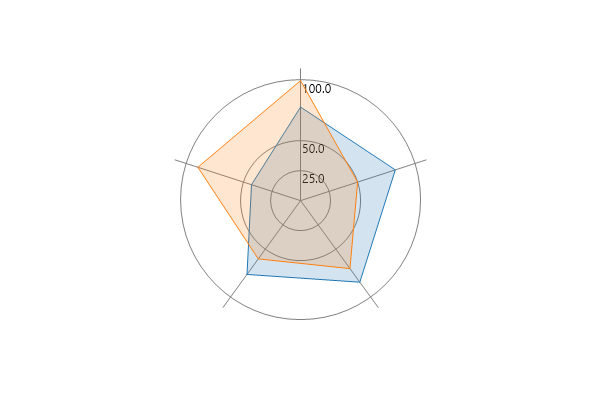
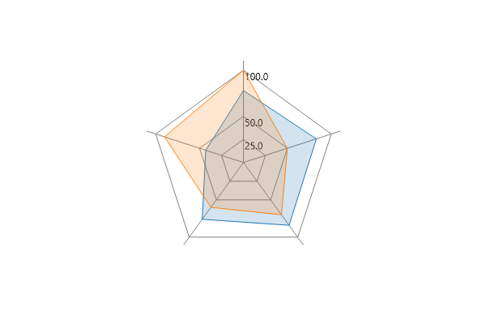
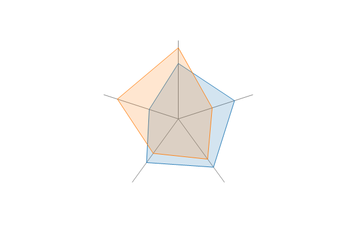
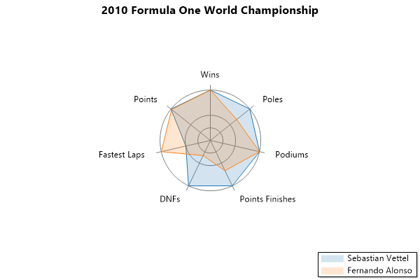
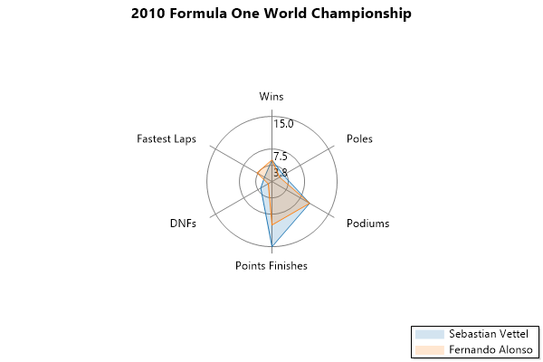
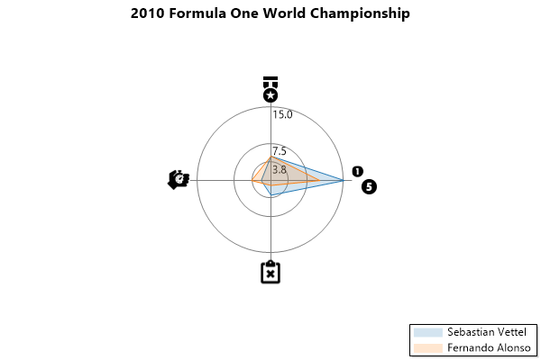
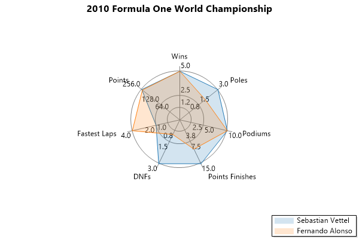
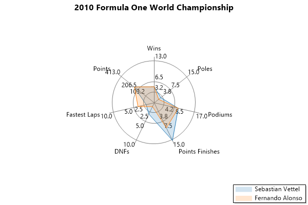
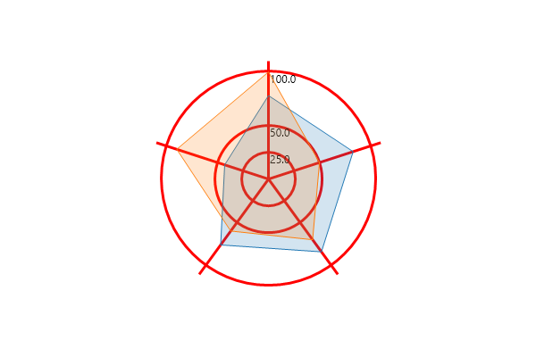

## Radar

A radar chart concisely displays multiple values. Radar plots are also called a spider charts or star charts.

```cs
var plt = new ScottPlot.Plot(600, 400);

double[,] values = {
    { 78,  83, 84, 76, 43 },
    { 100, 50, 70, 60, 90 }
};

plt.AddRadar(values);

// improve plot styling
plt.Frameless();
plt.Grid(enable: false);

plt.SaveFig("radar_quickstart.png");
```

<div class='text-center'>
<a href='../../images/radar_quickstart.png'></a>
</div>


<div class='m-2'>&nbsp;</div>

## Straight Axis Lines

Change the axis type to polygon to display radar charts with straight lines.

```cs
var plt = new ScottPlot.Plot(600, 400);

double[,] values = {
        { 78, 83, 84, 76, 43 },
        { 100, 50, 70, 60, 90 }
    };

var radarPlot = plt.AddRadar(values);
radarPlot.AxisType = RadarAxis.Polygon;

plt.SaveFig("radar_straightLines.png");
```

<div class='text-center'>
<a href='../../images/radar_straightlines.png'></a>
</div>


<div class='m-2'>&nbsp;</div>

## No Axis Lines

A radar chart can have no drawn axis as well.

```cs
var plt = new ScottPlot.Plot(600, 400);

double[,] values = {
        { 78, 83, 84, 76, 43 },
        { 100, 50, 70, 60, 90 }
    };

var radarPlot = plt.AddRadar(values);
radarPlot.AxisType = RadarAxis.None;
radarPlot.ShowAxisValues = false;

plt.SaveFig("radar_noLines.png");
```

<div class='text-center'>
<a href='../../images/radar_nolines.png'></a>
</div>


<div class='m-2'>&nbsp;</div>

## Labeled Categories

Category labels can be displayed on the radar chart.

```cs
var plt = new ScottPlot.Plot(600, 400);

double[,] values = {
    { 5, 3, 10, 15, 3, 2, 256 },
    { 5, 2, 10, 10, 1, 4, 252 },
};

var radar = plt.AddRadar(values, independentAxes: true);
radar.CategoryLabels = new string[] { "Wins", "Poles", "Podiums", "Points Finishes", "DNFs", "Fastest Laps", "Points" };
radar.GroupLabels = new[] { "Sebastian Vettel", "Fernando Alonso" };
radar.ShowAxisValues = false;

// customize the plot
plt.Title("2010 Formula One World Championship");
plt.Legend();

/* Data represents the 2010 Formula One World Championship
 * https://en.wikipedia.org/wiki/2010_Formula_One_World_Championship
 * Note: Alonso did not finish (DNF) in the Malaysian GP, but was included 
 * here because he completed >90% of the race distance.
 */

plt.SaveFig("radar_labelCategory.png");
```

<div class='text-center'>
<a href='../../images/radar_labelcategory.png'></a>
</div>


<div class='m-2'>&nbsp;</div>

## Labeled Values

Labels can be displayed on the arms of the radar chart.

```cs
var plt = new ScottPlot.Plot(600, 400);

double[,] values = {
    { 5, 3, 10, 15, 3, 2 },
    { 5, 2, 10, 10, 1, 4 },
};

var radar = plt.AddRadar(values);
radar.CategoryLabels = new string[] { "Wins", "Poles", "Podiums", "Points Finishes", "DNFs", "Fastest Laps" };
radar.GroupLabels = new string[] { "Sebastian Vettel", "Fernando Alonso" };

// customize the plot
plt.Title("2010 Formula One World Championship");
plt.Legend();

/* Data represents the 2010 Formula One World Championship
 * https://en.wikipedia.org/wiki/2010_Formula_One_World_Championship
 * Note: Alonso did not finish (DNF) in the Malaysian GP, but was included 
 * here because he completed >90% of the race distance.
 */

plt.SaveFig("radar_labelValue.png");
```

<div class='text-center'>
<a href='../../images/radar_labelvalue.png'></a>
</div>


<div class='m-2'>&nbsp;</div>

## Customizable polygon outline

The thickness of each radar plot's outline can be customized.

```cs
var plt = new ScottPlot.Plot(600, 400);

double[,] values = {
    { 5, 3, 10, 15, 3, 2 },
    { 5, 2, 10, 10, 1, 4 },
};

var radar = plt.AddRadar(values);
radar.OutlineWidth = 3;
radar.GroupLabels = new string[] { "Sebastian Vettel", "Fernando Alonso" };
plt.Title("2010 Formula One World Championship");
plt.Legend();

/* Data represents the 2010 Formula One World Championship
 * https://en.wikipedia.org/wiki/2010_Formula_One_World_Championship
 * Note: Alonso did not finish (DNF) in the Malaysian GP, but was included 
 * here because he completed >90% of the race distance.
 */

plt.SaveFig("radar_customizePolygonOutline.png");
```

<div class='text-center'>
<a href='../../images/radar_customizepolygonoutline.png'></a>
</div>


<div class='m-2'>&nbsp;</div>

## Categories with images

Images can be displayed on the arms of the radar chart. When using images, labels will be ignored so setting them will have no effect.

```cs
var plt = new ScottPlot.Plot(600, 400);

double[,] values = {
    { 5, 15, 3, 2 },
    { 5, 10, 1, 4 },
};

var radar = plt.AddRadar(values);
radar.CategoryImages = CategoryImages;
radar.GroupLabels = new string[] { "Sebastian Vettel", "Fernando Alonso" };

// customize the plot
plt.Title("2010 Formula One World Championship");
plt.Legend();

/* Data represents the 2010 Formula One World Championship
 * https://en.wikipedia.org/wiki/2010_Formula_One_World_Championship
 * Note: Alonso did not finish (DNF) in the Malaysian GP, but was included 
 * here because he completed >90% of the race distance.
 */

plt.SaveFig("radar_iconValue.png");
```

<div class='text-center'>
<a href='../../images/radar_iconvalue.png'></a>
</div>


<div class='m-2'>&nbsp;</div>

## Independent Axis Scaling

Axis scaling can be independent, allowing values for each category to be displayed using a different scale. When independent axis mode is enabled, axis limits are automatically adjusted to fit the range of the data.

```cs
var plt = new ScottPlot.Plot(600, 400);

double[,] values = { { 5, 3, 10, 15, 3, 2, 256 }, { 5, 2, 10, 10, 1, 4, 252 }, };

var radar = plt.AddRadar(values, independentAxes: true);
radar.CategoryLabels = new string[] { "Wins", "Poles", "Podiums", "Points Finishes", "DNFs", "Fastest Laps", "Points" };
radar.GroupLabels = new string[] { "Sebastian Vettel", "Fernando Alonso" };

// customize the plot
plt.Title("2010 Formula One World Championship");
plt.Legend();

/* Data represents the 2010 Formula One World Championship
 * https://en.wikipedia.org/wiki/2010_Formula_One_World_Championship
 * Note: Alonso did not finish (DNF) in the Malaysian GP, but was included 
 * here because he completed >90% of the race distance.
 */

plt.SaveFig("radar_axisScaling.png");
```

<div class='text-center'>
<a href='../../images/radar_axisscaling.png'></a>
</div>


<div class='m-2'>&nbsp;</div>

## Defined Axis Limits

Radar charts with independent axis limits use scales fitted to the data by default, but scaling can be controlled by defining the maximum value for each axis.

```cs
var plt = new ScottPlot.Plot(600, 400);

double[,] values = {
    { 5, 3, 10, 15, 3, 2, 256 },
    { 5, 2, 10, 10, 1, 4, 252 },
};

double[] maxValues = { 13, 15, 17, 15, 10, 10, 413 };

var radar = plt.AddRadar(values, independentAxes: true, maxValues: maxValues);
radar.CategoryLabels = new string[] { "Wins", "Poles", "Podiums", "Points Finishes", "DNFs", "Fastest Laps", "Points" };
radar.GroupLabels = new string[] { "Sebastian Vettel", "Fernando Alonso" };

// customize the plot
plt.Title("2010 Formula One World Championship");
plt.Legend();

/* Data represents the 2010 Formula One World Championship
 * https://en.wikipedia.org/wiki/2010_Formula_One_World_Championship
 * Note: Alonso did not finish (DNF) in the Malaysian GP, but was included 
 * here because he completed >90% of the race distance.
 *
 * Max values are based on https://en.wikipedia.org/wiki/List_of_Formula_One_World_Drivers%27_Champions.
 */

plt.SaveFig("radar_axisLimits.png");
```

<div class='text-center'>
<a href='../../images/radar_axislimits.png'></a>
</div>


<div class='m-2'>&nbsp;</div>

## Customization

Radar charts support customization of the line color and width.

```cs
var plt = new ScottPlot.Plot(600, 400);

double[,] values = {
    { 78,  83, 84, 76, 43 },
    { 100, 50, 70, 60, 90 }
};

var radar = plt.AddRadar(values);
radar.WebColor = System.Drawing.Color.Red;
radar.LineWidth = 3;

plt.SaveFig("radar_customization.png");
```

<div class='text-center'>
<a href='../../images/radar_customization.png'></a>
</div>

