* This page contains recipes for the _Radial Gauge_ category.
* Visit the [Cookbook Home Page](../../) to view all cookbook recipes.
* Generated by ScottPlot 4.1.52 on 7/9/2022
## Radial Gauge

A radial gauge chart displays scalar data as circular gauges. 

```cs
var plt = new ScottPlot.Plot(600, 400);

double[] values = { 100, 80, 65, 45, 20 };
plt.AddRadialGauge(values);

plt.SaveFig("radialgauge_quickstart.png");
```

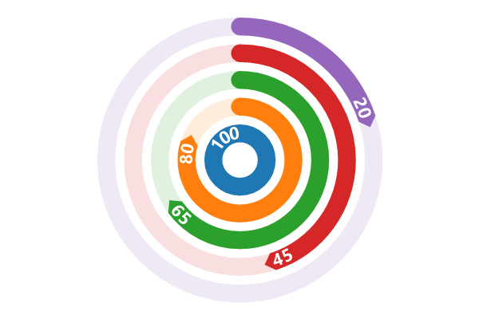


## Gauge Colors

Gauge colors can be customized by changing the default palette. 

```cs
var plt = new ScottPlot.Plot(600, 400);

double[] values = { 100, 80, 65, 45, 20 };
plt.Palette = ScottPlot.Drawing.Palette.Nord;
plt.AddRadialGauge(values);

plt.SaveFig("radialgauge_colors.png");
```


## Negative Values

Radial gauge plots support positive and negative values.

```cs
var plt = new ScottPlot.Plot(600, 400);

plt.Palette = ScottPlot.Drawing.Palette.Nord;
double[] values = { 100, 80, -65, 45, -20 };
plt.AddRadialGauge(values);

plt.SaveFig("radialgauge_negative.png");
```

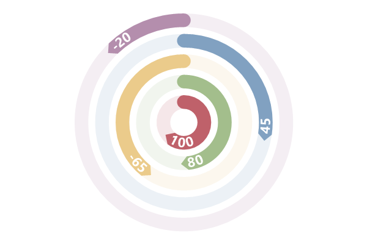


## Sequential Gauge Mode

Sequential gauge mode indicates that the base of each gauge starts at the tip of the previous gauge.

```cs
var plt = new ScottPlot.Plot(600, 400);

plt.Palette = ScottPlot.Drawing.Palette.Nord;
double[] values = { 100, 80, 65, 45, 50 };

var gauges = plt.AddRadialGauge(values);
gauges.GaugeMode = ScottPlot.RadialGaugeMode.Sequential;

plt.SaveFig("radialgauge_mode.png");
```

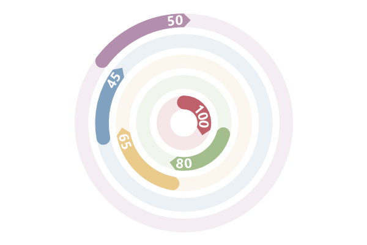


## Reverse Order

Gauges are displayed from the center outward by default but the order can be customized.

```cs
var plt = new ScottPlot.Plot(600, 400);

plt.Palette = ScottPlot.Drawing.Palette.Nord;
double[] values = { 100, 80, 65, 45, 50 };

var gauges = plt.AddRadialGauge(values);
gauges.GaugeMode = ScottPlot.RadialGaugeMode.Sequential;
gauges.OrderInsideOut = false;

plt.SaveFig("radialgauge_reverse.png");
```

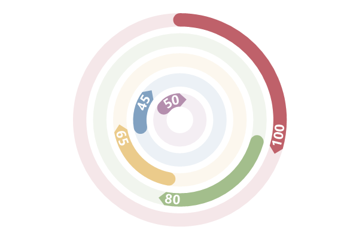


## Single Gauge Mode

The SingleGauge mode draws all gauges stacked together as a single gauge. This is useful for showing a progress gauges composed of many individual smaller gauges.

```cs
var plt = new ScottPlot.Plot(600, 400);

plt.Palette = ScottPlot.Drawing.Palette.Nord;
double[] values = { 100, 80, 65, 45 };

var gauges = plt.AddRadialGauge(values);
gauges.GaugeMode = ScottPlot.RadialGaugeMode.SingleGauge;
gauges.MaximumAngle = 180;
gauges.StartingAngle = 180;

plt.SaveFig("radialgauge_single.png");
```

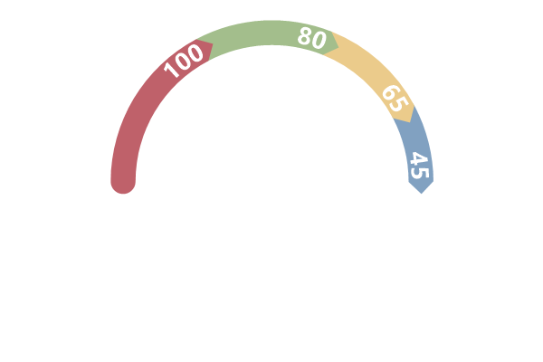


## Gauge Direction

The direction of gauges can be customized. Clockwise is used by default.

```cs
var plt = new ScottPlot.Plot(600, 400);

plt.Palette = ScottPlot.Drawing.Palette.Nord;
double[] values = { 100, 80, 65, 45, 20 };

var gauges = plt.AddRadialGauge(values);
gauges.Clockwise = false;

plt.SaveFig("radialgauge_direction.png");
```

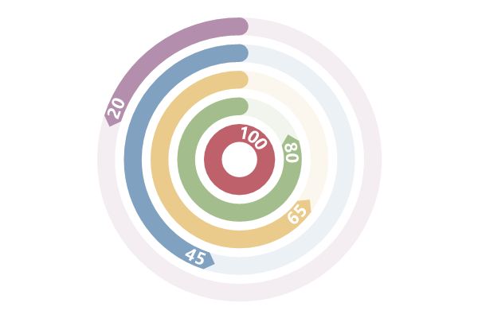


## Gauge Size

The empty space between gauges can be adjusted as a fraction of their width. 

```cs
var plt = new ScottPlot.Plot(600, 400);

plt.Palette = ScottPlot.Drawing.Palette.Nord;
double[] values = { 100, 80, 65, 45, 20 };
var gauges = plt.AddRadialGauge(values);
gauges.SpaceFraction = .05;

plt.SaveFig("radialgauge_size.png");
```

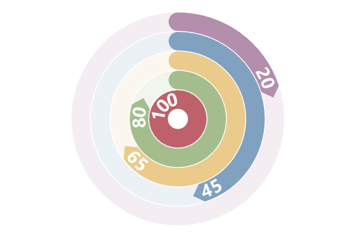


## Gauge Caps

Caps can be customized for the starting and end of the gauges. 

```cs
var plt = new ScottPlot.Plot(600, 400);

plt.Palette = ScottPlot.Drawing.Palette.Nord;
double[] values = { 100, 80, 65, 45, 20 };

var gauges = plt.AddRadialGauge(values);
gauges.CircularBackground = false;
gauges.StartCap = System.Drawing.Drawing2D.LineCap.Flat;
gauges.EndCap = System.Drawing.Drawing2D.LineCap.DiamondAnchor;

plt.SaveFig("radialgauge_caps.png");
```

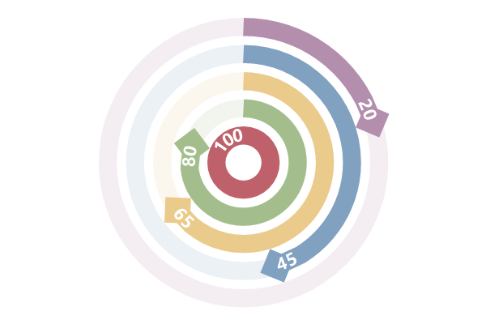


## Gauge Starting Angle

The starting angle for gauges can be customized. 270 for North (default value), 0 for East, 90 for South, 180 for West, etc.

```cs
var plt = new ScottPlot.Plot(600, 400);

plt.Palette = ScottPlot.Drawing.Palette.Nord;
double[] values = { 100, 80, 65, 45, 20 };

var gauges = plt.AddRadialGauge(values);
gauges.StartingAngle = 180;

plt.SaveFig("radialgauge_start.png");
```

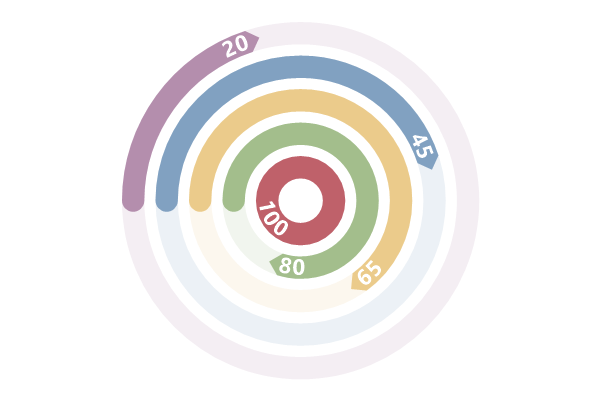


## Gauge Angular Range

By default gauges are full circles (360 degrees) but smaller gauges can be created by customizing the gauge size.

```cs
var plt = new ScottPlot.Plot(600, 400);

plt.Palette = ScottPlot.Drawing.Palette.Nord;
double[] values = { 100, 80, 65, 45, 20 };

var gauges = plt.AddRadialGauge(values);
gauges.MaximumAngle = 180;

plt.SaveFig("radialgauge_range.png");
```

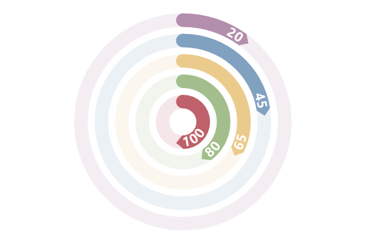


## Show Levels

The value of each gauge is displayed as text by default but this behavior can be overridden. Note that this is different than the labels fiels which is what appears in the legened.

```cs
var plt = new ScottPlot.Plot(600, 400);

plt.Palette = ScottPlot.Drawing.Palette.Nord;
double[] values = { 100, 80, 65, 45, 20 };

var gauges = plt.AddRadialGauge(values);
gauges.ShowLevels = false;

plt.SaveFig("radialgauge_levels.png");
```


## Gauge Label Position

Gauge level text is positioned at the tip of each gauge by default, but this position can be adjusted by the user.

```cs
var plt = new ScottPlot.Plot(600, 400);

plt.Palette = ScottPlot.Drawing.Palette.Nord;
double[] values = { 100, 80, 65, 45, 20 };

var gauges = plt.AddRadialGauge(values);
gauges.LabelPositionFraction = 0;

plt.SaveFig("radialgauge_labelpos.png");
```


## Gauge Label Font Percentage

Size of the gauge level text as a fraction of the gauge width.

```cs
var plt = new ScottPlot.Plot(600, 400);

plt.Palette = ScottPlot.Drawing.Palette.Nord;
double[] values = { 100, 80, 65, 45, 20 };

var gauges = plt.AddRadialGauge(values);
gauges.FontSizeFraction = .4;

plt.SaveFig("radialgauge_labelfontsize.png");
```

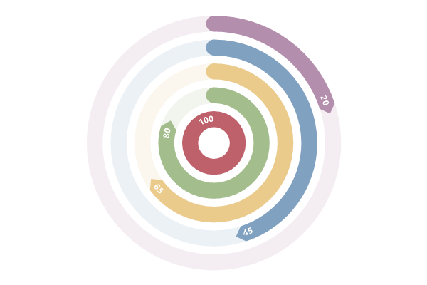


## Gauge Label Color

Level text fonts may be customized.

```cs
var plt = new ScottPlot.Plot(600, 400);

plt.Palette = ScottPlot.Drawing.Palette.Nord;
double[] values = { 100, 80, 65, 45, 20 };

var gauges = plt.AddRadialGauge(values);
gauges.Font.Color = Color.Black;

plt.SaveFig("radialgauge_labelcolor.png");
```

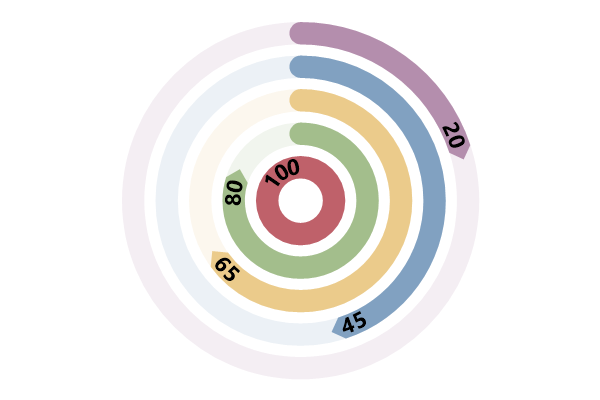


## Gauge Labels in Legend

Radial gauge labels will appear in the legend if they are assigned. 

```cs
var plt = new ScottPlot.Plot(600, 400);

plt.Palette = ScottPlot.Drawing.Palette.Nord;
double[] values = { 100, 80, 65, 45, 20 };

var gauges = plt.AddRadialGauge(values);
gauges.Labels = new string[] { "alpha", "beta", "gamma", "delta", "epsilon" };
plt.Legend(true);

plt.SaveFig("radialgauge_legend.png");
```

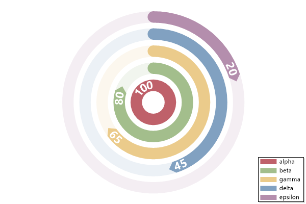


## Background Gauges Dim

By default the full range of each gauge is drawn as a semitransparent ring. The amount of transparency can be adjusted as desired.

```cs
var plt = new ScottPlot.Plot(600, 400);

plt.Palette = ScottPlot.Drawing.Palette.Nord;
double[] values = { 100, 80, 65, 45, 20 };

var gauges = plt.AddRadialGauge(values);
gauges.BackgroundTransparencyFraction = .5;

plt.SaveFig("radialgauge_backdim.png");
```

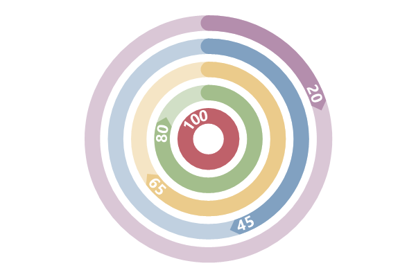


## Background Gauges Normalization

Gauge backgrounds are drawn as full circles by default. This behavior can be disabled to draw partial backgrounds for non-circular gauges.

```cs
var plt = new ScottPlot.Plot(600, 400);

plt.Palette = ScottPlot.Drawing.Palette.Nord;
double[] values = { 100, 80, 65, 45, 20 };

var gauges = plt.AddRadialGauge(values);
gauges.CircularBackground = false;
gauges.MaximumAngle = 180;
gauges.StartingAngle = 180;

plt.SaveFig("radialgauge_backnorm.png");
```

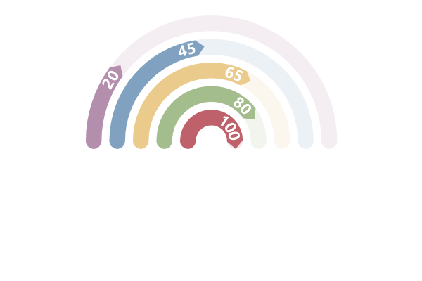


