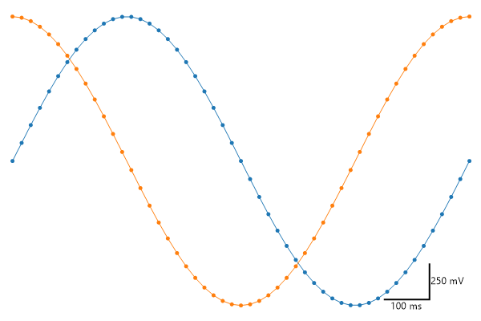
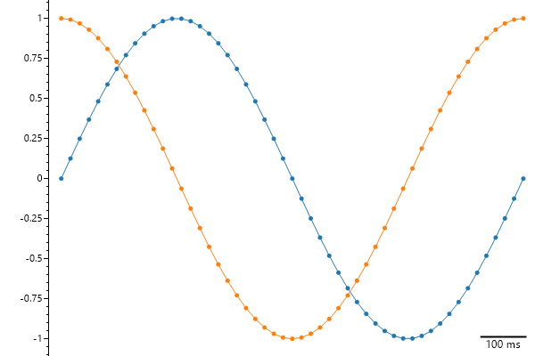
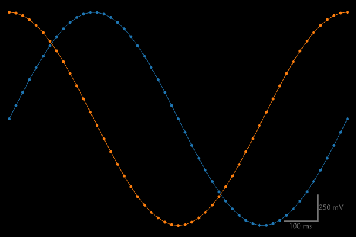

# Plot Type: Scale Bar
* This page contains recipes for the _Scale Bar_ category.
* Visit the [Cookbook Home Page](../../) to view all cookbook recipes.
* Generated by ScottPlot 4.1.69 on 12/11/2023
<h2><a href='/cookbook/4.1/recipes/scalebar_quickstart/'>Scale Bar</a></h2>

An L-shaped scalebar can be added in the corner of any plot. Set the vertical or horizontal sizer to zero and the scale bar will only span one dimension.

```cs
var plt = new ScottPlot.Plot(600, 400);

// plot sample data
plt.AddSignal(DataGen.Sin(51));
plt.AddSignal(DataGen.Cos(51));

// remove traditional scale indicators
plt.Grid(enable: false);
plt.Frameless();

// add an L-shaped scalebar
plt.AddScaleBar(5, .25, "100 ms", "250 mV");

plt.SaveFig("scalebar_quickstart.png");
```




<h2><a href='/cookbook/4.1/recipes/scalebar_horizontal/'>Horizontal Scale Bar</a></h2>

Set the vertical or horizontal sizer to zero and the scale bar will only span one dimension.

```cs
var plt = new ScottPlot.Plot(600, 400);

// plot sample data 
plt.AddSignal(DataGen.Sin(51));
plt.AddSignal(DataGen.Cos(51));

// show only the left axis
plt.XAxis.Hide();
plt.XAxis2.Hide();
plt.YAxis2.Hide();
plt.Grid(enable: false);

// add a horizontal scale bar (no Y height)
plt.AddScaleBar(5, 0, "100 ms", null);

plt.SaveFig("scalebar_horizontal.png");
```




<h2><a href='/cookbook/4.1/recipes/scalebar_styled/'>Styled Scale Bar</a></h2>

An L-shaped scalebar can be added in the corner of any plot. Set the vertical or horizontal sizer to zero and the scale bar will only span one dimension.

```cs
var plt = new ScottPlot.Plot(600, 400);

// plot sample data
plt.AddSignal(DataGen.Sin(51));
plt.AddSignal(DataGen.Cos(51));

// remove traditional scale indicators
plt.Grid(enable: false);
plt.Frameless();

// add an L-shaped scalebar
plt.AddScaleBar(5, .25, "100 ms", "250 mV");

// add style
plt.Style(Style.Black);

plt.SaveFig("scalebar_styled.png");
```




