* This page contains recipes for the _Scatter Plot_ category.
* Visit the [Cookbook Home Page](../../) to view all cookbook recipes.
* Generated by ScottPlot 4.1.65 on 7/9/2023
## Scatter Plot Quickstart

Scatter plots are best for small numbers of paired X/Y data points. For evenly-spaced data points Signal is much faster.

```cs
var plt = new ScottPlot.Plot(600, 400);

// create sample X/Y data
int pointCount = 51;
double[] x = DataGen.Consecutive(pointCount);
double[] sin = DataGen.Sin(pointCount);
double[] cos = DataGen.Cos(pointCount);

// add scatter plots
plt.AddScatter(x, sin);
plt.AddScatter(x, cos);

plt.SaveFig("scatter_quickstart.png");
```

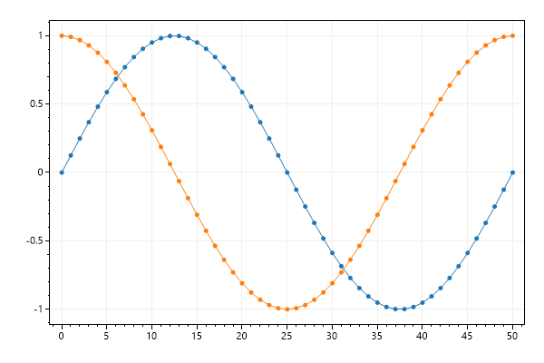


## Custom markers

Markers can be customized using optional arguments and public fields.

```cs
var plt = new ScottPlot.Plot(600, 400);

int pointCount = 51;
double[] x = DataGen.Consecutive(pointCount);
double[] sin = DataGen.Sin(pointCount);
double[] cos = DataGen.Cos(pointCount);

// add scatter plots and customize markers
var sp1 = plt.AddScatter(x, sin, markerSize: 15);
sp1.MarkerShape = MarkerShape.openCircle;

var sp2 = plt.AddScatter(x, cos, markerSize: 7);
sp2.MarkerShape = MarkerShape.filledSquare;

plt.SaveFig("scatter_markers.png");
```

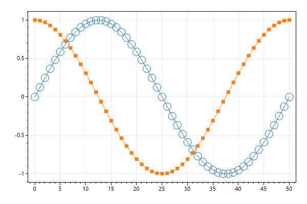


## All marker shapes

Legend indicates names of all available marker shapes

```cs
var plt = new ScottPlot.Plot(600, 400);

int pointCount = 51;
double[] xs = DataGen.Consecutive(pointCount);

string[] markerShapeNames = Enum.GetNames(typeof(MarkerShape));
for (int i = 0; i < markerShapeNames.Length; i++)
{
    Enum.TryParse(markerShapeNames[i], out MarkerShape ms);
    double[] ys = DataGen.Sin(pointCount, 2, -i);
    var sp = plt.AddScatter(xs, ys);
    sp.LineWidth = 2;
    sp.LineColor = Color.FromArgb(50, sp.LineColor);
    sp.MarkerSize = 7;
    sp.MarkerShape = ms;
    sp.Label = ms.ToString();
}

plt.Grid(enable: false);
var legend = plt.Legend();
legend.FontSize = 10;

plt.SaveFig("scatter_markerShape.png");
```

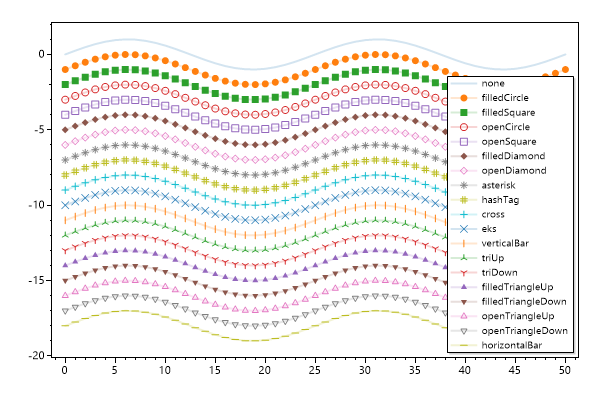


## Custom lines

Line color, size, and style can be customized. Setting markerSize to 0 prevents markers from being rendered.

```cs
var plt = new ScottPlot.Plot(600, 400);

int pointCount = 51;
double[] x = DataGen.Consecutive(pointCount);
double[] sin = DataGen.Sin(pointCount);
double[] cos = DataGen.Cos(pointCount);
double[] cos2 = DataGen.Cos(pointCount, mult: -1);

plt.AddScatter(x, sin, color: Color.Magenta, lineWidth: 0, markerSize: 10);
plt.AddScatter(x, cos, color: Color.Green, lineWidth: 5, markerSize: 0);
plt.AddScatter(x, cos2, color: Color.Blue, lineWidth: 3, markerSize: 0, lineStyle: LineStyle.DashDot);

var legend = plt.Legend();
legend.FixedLineWidth = false;

plt.SaveFig("scatter_lineStyle.png");
```

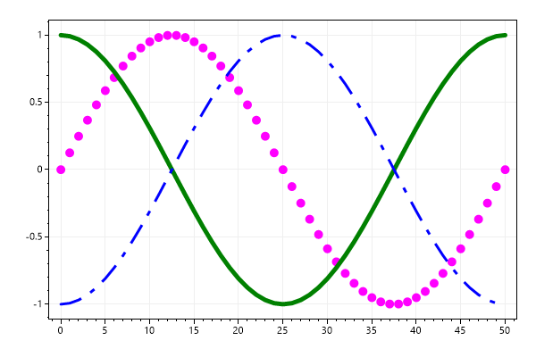


## Random X/Y Points

X data for scatter plots does not have to be evenly spaced, making scatter plots are ideal for displaying random data like this.

```cs
var plt = new ScottPlot.Plot(600, 400);

Random rand = new Random(0);
int pointCount = 51;
double[] xs1 = DataGen.RandomNormal(rand, pointCount, 1);
double[] xs2 = DataGen.RandomNormal(rand, pointCount, 3);
double[] ys1 = DataGen.RandomNormal(rand, pointCount, 5);
double[] ys2 = DataGen.RandomNormal(rand, pointCount, 7);

plt.AddScatter(xs1, ys1, markerSize: 0, label: "lines only");
plt.AddScatter(xs2, ys2, lineWidth: 0, label: "markers only");
plt.Legend();

plt.SaveFig("scatter_random.png");
```

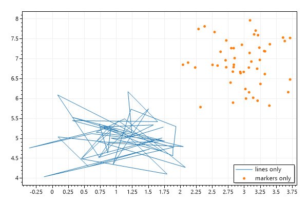


## Scatter Plot with Errorbars

An array of values can be supplied for error bars and redering options can be customized as desired

```cs
var plt = new ScottPlot.Plot(600, 400);

int pointCount = 20;
Random rand = new Random(0);
double[] xs = DataGen.Consecutive(pointCount);
double[] ys = DataGen.RandomWalk(rand, pointCount);
double[] xErr = DataGen.RandomNormal(rand, pointCount, .2);
double[] yErr = DataGen.RandomNormal(rand, pointCount);

var sp = plt.AddScatter(xs, ys);
sp.XError = xErr;
sp.YError = yErr;
sp.ErrorCapSize = 3;
sp.ErrorLineWidth = 1;
sp.LineStyle = LineStyle.Dot;

plt.SaveFig("scatter_errorbar.png");
```

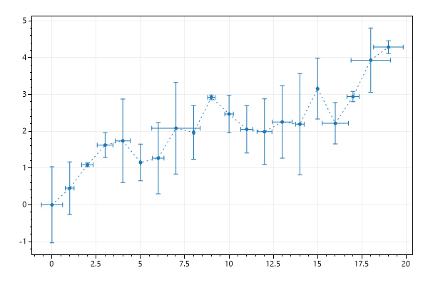


## Scatter Plot with Shaded Error

A semitransparent polygon can be created and placed behind the scatter plot to represent standard deviation or standard error.

```cs
var plt = new ScottPlot.Plot(600, 400);

int pointCount = 20;
Random rand = new Random(0);
double[] xs = DataGen.Consecutive(pointCount);
double[] ys = DataGen.RandomWalk(rand, pointCount, 2.0);
double[] yErr = DataGen.Random(rand, pointCount, 1.0, 1.0);

plt.AddScatter(xs, ys, Color.Blue);
plt.AddFillError(xs, ys, yErr, Color.FromArgb(50, Color.Blue));

plt.SaveFig("scatter_shaded_error.png");
```

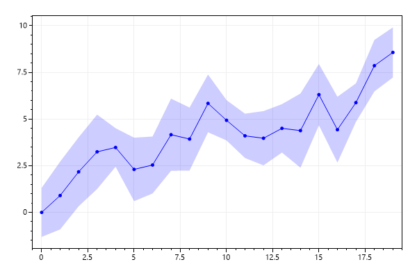


## Lines Only

A shortcut method makes it easy to create a scatter plot with just lines (no markers)

```cs
var plt = new ScottPlot.Plot(600, 400);

double[] xs = DataGen.Consecutive(51);
double[] ys = DataGen.Sin(51);

plt.AddScatterLines(xs, ys, Color.Red, 3);

plt.SaveFig("scatter_lineplot.png");
```

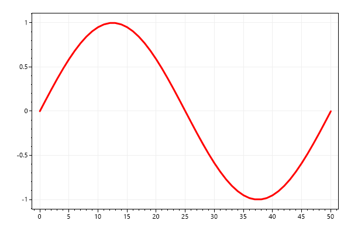


## Markers Only

A shortcut method makes it easy to create a scatter plot where markers are displayed at every point (without any connecting lines)

```cs
var plt = new ScottPlot.Plot(600, 400);

double[] xs = DataGen.Consecutive(51);
double[] ys = DataGen.Sin(51);

plt.AddScatterPoints(xs, ys, Color.Navy, 10, MarkerShape.filledDiamond);

plt.SaveFig("scatter_pointsplot.png");
```

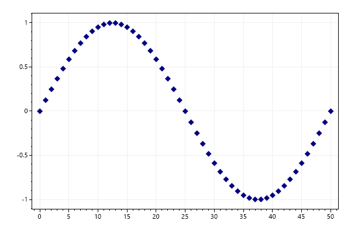


## Step Plot

A step plot is a special type of scatter plot where points are connected by right angles instead of straight lines.

```cs
var plt = new ScottPlot.Plot(600, 400);

double[] xs = DataGen.Consecutive(51);
double[] ys = DataGen.Sin(51);

plt.AddScatterStep(xs, ys);

plt.SaveFig("scatter_stepplot.png");
```

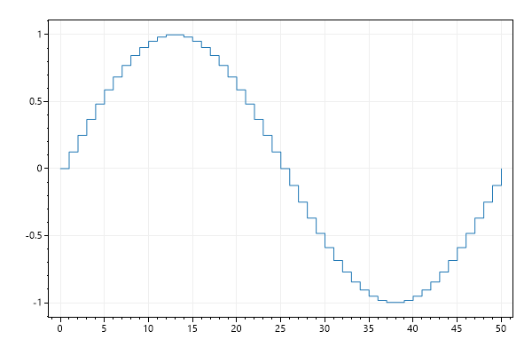


## Add markers

Want to place a marker at a position in X/Y space? AddMarker() will create a scatter plot with a single point.

```cs
var plt = new ScottPlot.Plot(600, 400);

Random rand = new(0);
for (int i = 0; i < 100; i++)
{
    double x = rand.Next(100);
    double y = rand.Next(100);
    double fraction = rand.NextDouble();
    double size = (fraction + .1) * 30;
    var color = Drawing.Colormap.Turbo.GetColor(fraction, alpha: .8);
    var shape = Marker.Random(rand);
    plt.AddMarker(x, y, shape, size, color);
}

plt.SaveFig("scatter_AddMarker.png");
```

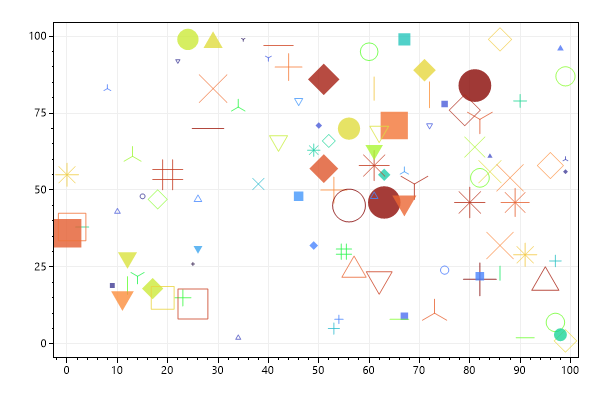


## Draggable Scatter Plot

Want to modify the scatter points interactively? A ScatterPlotDraggable lets you move the points around with the mouse. As you move the points around, the values in the original arrays change to reflect their new positions.

```cs
var plt = new ScottPlot.Plot(600, 400);

double[] x = ScottPlot.DataGen.Consecutive(50);
double[] y = ScottPlot.DataGen.Cos(50);

var scatter = new ScottPlot.Plottable.ScatterPlotDraggable(x, y)
{
    DragCursor = Cursor.Crosshair,
    DragEnabled = true,
};

plt.Add(scatter);

plt.SaveFig("scatter_draggable_vertical.png");
```


## Draggable Scatter Plot Vertical

You can restrict dragging to just X or Y directions.

```cs
var plt = new ScottPlot.Plot(600, 400);

double[] x = ScottPlot.DataGen.Consecutive(50);
double[] y = ScottPlot.DataGen.Cos(50);

var scatter = new ScottPlot.Plottable.ScatterPlotDraggable(x, y)
{
    DragCursor = Cursor.Crosshair,
    DragEnabled = true,   // controls whether anything can be dragged
    DragEnabledX = false, // controls whether points can be dragged horizontally 
    DragEnabledY = true,  // controls whether points can be dragged vertically
};

plt.Add(scatter);

plt.SaveFig("scatter_draggable.png");
```

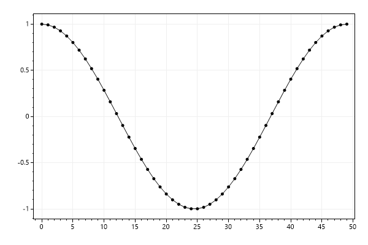


## Forest Plot

Scatter plots can be used to create forest plots, which are useful for showing the agreement between multiple estimates.

```cs
var plt = new ScottPlot.Plot(600, 400);

var plot1 = plt.AddScatter(new double[] { 2.5 }, new double[] { 5 }, label: "John Doe et al.");
plot1.XError = new double[] { 0.2 };

var plot2 = plt.AddScatter(new double[] { 2.7 }, new double[] { 4 }, label: "Jane Doe et al.");
plot2.XError = new double[] { 0.3 };

var plot3 = plt.AddScatter(new double[] { 2.3 }, new double[] { 3 }, label: "Jim Doe et al.");
plot3.XError = new double[] { 0.6 };

var plot4 = plt.AddScatter(new double[] { 2.8 }, new double[] { 2 }, label: "Joel Doe et al.");
plot4.XError = new double[] { 0.3 };

var plot5 = plt.AddScatter(new double[] { 2.5 }, new double[] { 1 }, label: "Jacqueline Doe et al.");
plot5.XError = new double[] { 0.2 };

plt.AddVerticalLine(2.6, style: LineStyle.Dash);

plt.SetAxisLimits(0, 5, 0, 6);
plt.Legend();

plt.SaveFig("scatter_forest.png");
```

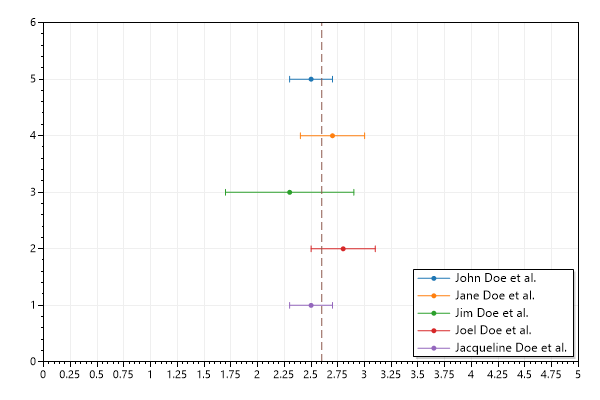


## Scatter Plot with Smooth Lines

Lines drawn between scatter plot points are typically connected with straight lines, but the Smooth property can be enabled to connect points with curves instead.

```cs
var plt = new ScottPlot.Plot(600, 400);

Random rand = new(1234);
double[] xs = DataGen.RandomWalk(rand, 20);
double[] ys = DataGen.RandomWalk(rand, 20);
plt.Palette = new ScottPlot.Palettes.ColorblindFriendly();

var sp1 = plt.AddScatter(xs, ys, label: "default");
sp1.Smooth = true;

var sp2 = plt.AddScatter(xs, ys, label: "high tension");
sp2.Smooth = true;
sp2.SmoothTension = 1.0f;

var sp3 = plt.AddScatter(xs, ys, label: "low tension");
sp3.Smooth = true;
sp3.SmoothTension = 0.2f;

plt.Legend();

plt.SaveFig("scatter_smooth.png");
```

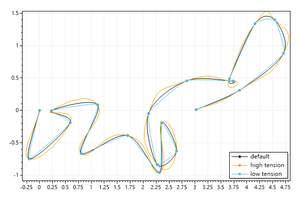


## NaN Values Ignored

When the OnNaN field is set to Ignore, points containing NaN X or Y values are skipped, and the scatter plot is drawn as one continuous line.

```cs
var plt = new ScottPlot.Plot(600, 400);

// create data that does NOT contain NaN
double[] xs = ScottPlot.DataGen.Consecutive(51);
double[] ys = ScottPlot.DataGen.Sin(51);

// plot it the traditional way
plt.AddScatter(xs, ys, Color.FromArgb(50, Color.Black));

// create new data that contains NaN
double[] ysWithNan = ScottPlot.DataGen.Sin(51);
static void FillWithNan(double[] values, int start, int count)
{
    for (int i = 0; i < count; i++)
        values[start + i] = double.NaN;
}
FillWithNan(ysWithNan, 5, 15);
FillWithNan(ysWithNan, 25, 1);
FillWithNan(ysWithNan, 30, 15);
ysWithNan[10] = ys[10];

// add a scatter plot and customize NaN behavior
var sp2 = plt.AddScatter(xs, ysWithNan, Color.Black);
sp2.OnNaN = ScottPlot.Plottable.ScatterPlot.NanBehavior.Ignore;
plt.Title($"OnNaN = {sp2.OnNaN}");

plt.SaveFig("scatter_nan_ignore.png");
```


## NaN Values Break the Line

When the OnNaN field is set to Gap, points containing NaN X or Y values break the line. This results in a scatter plot appearing as multiple lines, with gaps representing missing data.

```cs
var plt = new ScottPlot.Plot(600, 400);

// create data that does NOT contain NaN
double[] xs = ScottPlot.DataGen.Consecutive(51);
double[] ys = ScottPlot.DataGen.Sin(51);

// plot it the traditional way
plt.AddScatter(xs, ys, Color.FromArgb(50, Color.Black));

// create new data that contains NaN
double[] ysWithNan = ScottPlot.DataGen.Sin(51);
static void FillWithNan(double[] values, int start, int count)
{
    for (int i = 0; i < count; i++)
        values[start + i] = double.NaN;
}
FillWithNan(ysWithNan, 5, 15);
FillWithNan(ysWithNan, 25, 1);
FillWithNan(ysWithNan, 30, 15);
ysWithNan[10] = ys[10];

// add a scatter plot and customize NaN behavior
var sp2 = plt.AddScatter(xs, ysWithNan, Color.Black);
sp2.OnNaN = ScottPlot.Plottable.ScatterPlot.NanBehavior.Gap;
plt.Title($"OnNaN = {sp2.OnNaN}");

plt.SaveFig("scatter_nan_gap.png");
```


## Scatter Plot Labels

Individual points can be labeled.

```cs
var plt = new ScottPlot.Plot(600, 400);

double[] xs = { 18.5, 20.6, 22.3, 24.5, 26.6, 15, 15 };
double[] ys = { 1.43, 1.48, 1.6, 1.59, 1.53, 1.52, 1.6 };
string[] labels = { "A", "B", "C", "D", "E", "F", "G" };

var sp = plt.AddScatter(xs, ys);
sp.DataPointLabels = labels;
sp.DataPointLabelFont.Size = 24;

plt.SetAxisLimits(12, 28, 1.3, 1.7);

plt.SaveFig("scatter_labels.png");
```

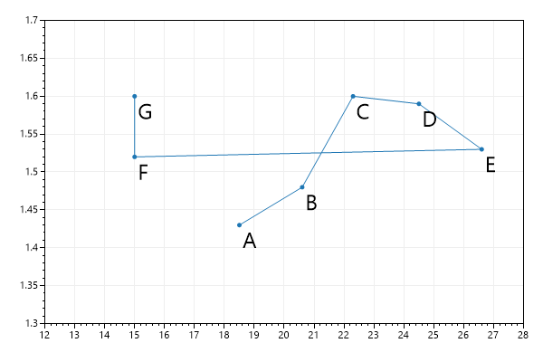


## Scatter List Quickstart

This experimental plot type has add/remove/clear methods like typical lists.

```cs
var plt = new ScottPlot.Plot(600, 400);

double[] xs = { 1, 2, 3, 4 };
double[] ys = { 1, 4, 9, 16 };

var scatterList = plt.AddScatterList();
scatterList.AddRange(xs, ys);
scatterList.Add(5, 25);

plt.SaveFig("scatterList_quickstart.png");
```


## Scatter List Generic

This plot type supports generics.

```cs
var plt = new ScottPlot.Plot(600, 400);

int[] xs = { 1, 2, 3, 4 };
int[] ys = { 1, 4, 9, 16 };

var scatterList = plt.AddScatterList<int>();
scatterList.AddRange(xs, ys);
scatterList.Add(5, 25);

plt.SaveFig("scatterList_generic.png");
```

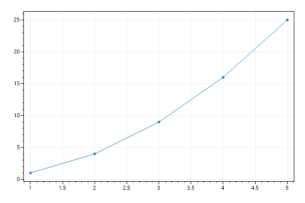


## Scatter List Draggable

There exists an experimental Scatter Plot List with draggable points.

```cs
var plt = new ScottPlot.Plot(600, 400);

double[] xs = ScottPlot.DataGen.Consecutive(51);
double[] ys = ScottPlot.DataGen.Sin(51);

var scatter = new ScottPlot.Plottable.ScatterPlotListDraggable();
scatter.AddRange(xs, ys);

plt.Add(scatter);

plt.SaveFig("scatterList_draggable.png");
```

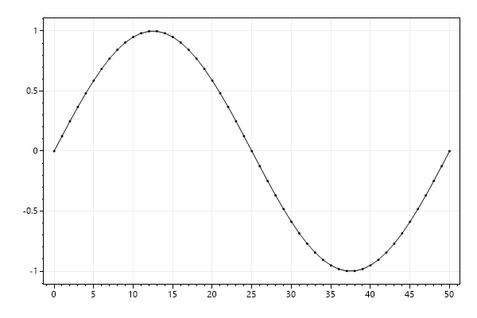


## Scatter List Draggable Limits

A custom function can be used to limit the range of draggable points.

```cs
var plt = new ScottPlot.Plot(600, 400);

// plot sample data
double[] xs = ScottPlot.DataGen.Consecutive(20);
double[] ys = ScottPlot.DataGen.Sin(20);
var scatter = new ScottPlot.Plottable.ScatterPlotListDraggable();
scatter.AddRange(xs, ys);
scatter.MarkerSize = 5;
plt.Add(scatter);

// use a custom function to limit the movement of points
static Coordinate MoveBetweenAdjacent(List<double> xs, List<double> ys, int index, Coordinate requested)
{
    int leftIndex = Math.Max(index - 1, 0);
    int rightIndex = Math.Min(index + 1, xs.Count - 1);

    double newX = requested.X;
    newX = Math.Max(newX, xs[leftIndex]);
    newX = Math.Min(newX, xs[rightIndex]);

    return new Coordinate(newX, requested.Y);
}

scatter.MovePointFunc = MoveBetweenAdjacent;

plt.SaveFig("scatterList_draggableLimits.png");
```

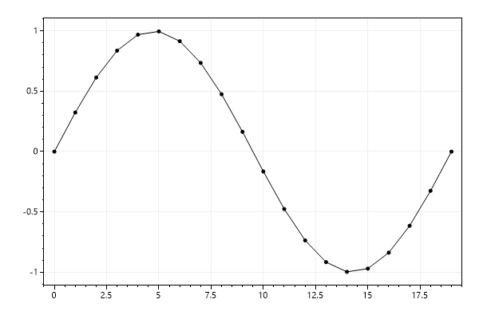


