# Plot Type: Signal Plot
* This page contains recipes for the _Signal Plot_ category.
* Visit the [Cookbook Home Page](../../) to view all cookbook recipes.
* Generated by ScottPlot 4.1.71 on 1/21/2024
<h2><a id='signal-plot-quickstart' href='/cookbook/4.1/recipes/signal_quickstart/'>Signal Plot Quickstart</a></h2>

Signal plots are ideal for evenly-spaced data with thousands or millions of points.



```cs
ScottPlot.Version.ShouldBe(4, 1, 71);
var plt = new ScottPlot.Plot(600, 400);

var rand = new Random(0);
double[] values = DataGen.RandomWalk(rand, 100_000);
int sampleRate = 20_000;

// Signal plots require a data array and a sample rate (points per unit)
plt.AddSignal(values, sampleRate);

plt.Benchmark(enable: true);
plt.Title($"Signal Plot: One Million Points");

plt.SaveFig("signal_quickstart.png");
```



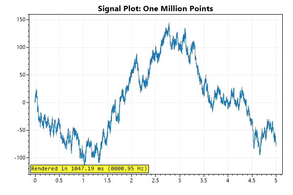


<h2><a id='signal-plot-with-generic-data' href='/cookbook/4.1/recipes/signal_generic/'>Signal Plot with Generic Data</a></h2>

Signal plots accept double arrays by default, but a generic signal plot exists which can display most numeric data types.



```cs
ScottPlot.Version.ShouldBe(4, 1, 71);
var plt = new ScottPlot.Plot(600, 400);

Random rand = new(0);
int points = 10_000;

float[] valuesFLOAT = DataGen.RandomWalk<float>(rand, points, 1, 0);
short[] valuesSHORT = DataGen.RandomWalk<short>(rand, points, 1, 0);
Int16[] valuesINT16 = DataGen.RandomWalk<Int16>(rand, points, 1, 0);

plt.AddSignal(valuesFLOAT, label: "float[]");
plt.AddSignal(valuesSHORT, label: "short[]");
plt.AddSignal(valuesINT16, label: "Int16[]");

plt.Legend();

plt.SaveFig("signal_generic.png");
```




<h2><a id='signal-offset' href='/cookbook/4.1/recipes/signal_offset/'>Signal Offset</a></h2>

Signal plots can have X and Y offsets that shift all data by a defined amount.



```cs
ScottPlot.Version.ShouldBe(4, 1, 71);
var plt = new ScottPlot.Plot(600, 400);

var rand = new Random(0);
double[] values = DataGen.RandomWalk(rand, 100_000);
var sig = plt.AddSignal(values);
sig.OffsetX = 10_000;
sig.OffsetY = 100;

plt.SaveFig("signal_offset.png");
```



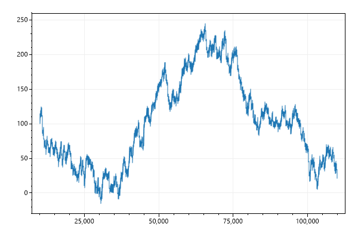


<h2><a id='signal-scale' href='/cookbook/4.1/recipes/signal_scale/'>Signal Scale</a></h2>

Signal plots can have a Y scale that multiply all data by a defined amount. ScaleY is applied before OffsetX and OffsetY.



```cs
ScottPlot.Version.ShouldBe(4, 1, 71);
var plt = new ScottPlot.Plot(600, 400);

// display 100,000 values between -1 and +1
double[] values = DataGen.Sin(100_000, oscillations: 10);
var sig = plt.AddSignal(values);

// scale Y by 500 so values span -500 to +500
sig.ScaleY = 500;

plt.SaveFig("signal_scale.png");
```



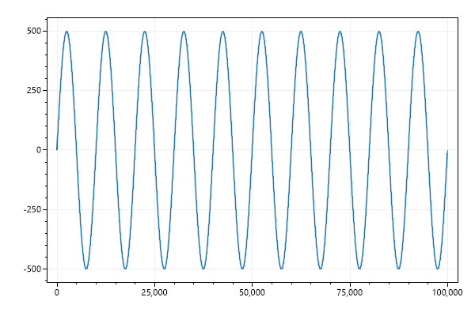


<h2><a id='speed-test' href='/cookbook/4.1/recipes/signal_advantage/'>Speed Test</a></h2>

Compare the speed to the same data plotted as a scatter plot.



```cs
ScottPlot.Version.ShouldBe(4, 1, 71);
var plt = new ScottPlot.Plot(600, 400);

double[] xs = DataGen.Consecutive(100_000, 1.0 / 20_000);
double[] values = DataGen.RandomWalk(null, 100_000);

plt.AddScatter(xs, values, Color.Red, markerSize: 0);

plt.Benchmark(enable: true);
plt.Title($"Scatter Plot: One Million Points");

plt.SaveFig("signal_advantage.png");
```



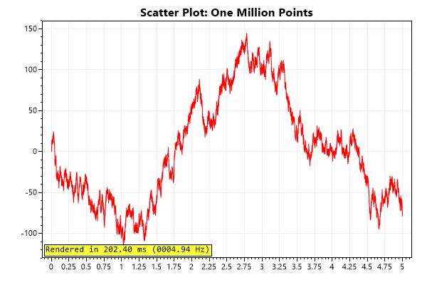


<h2><a id='styled-signal-plot' href='/cookbook/4.1/recipes/signal_styled/'>Styled Signal Plot</a></h2>

Signal plots can be styled using public fields. Signal plots can also be offset by a defined X or Y amount.



```cs
ScottPlot.Version.ShouldBe(4, 1, 71);
var plt = new ScottPlot.Plot(600, 400);

double[] ys = DataGen.RandomWalk(null, 500);
int sampleRate = 10;

var sp2 = plt.AddSignal(ys, sampleRate, Color.Magenta);
sp2.OffsetY = 1000;
sp2.OffsetX = 300;
sp2.LineStyle = LineStyle.Dash;
sp2.LineWidth = 2;

plt.SaveFig("signal_styled.png");
```



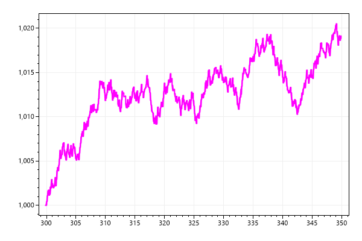


<h2><a id='step-display' href='/cookbook/4.1/recipes/signal_step/'>Step Display</a></h2>

Signal plots can be styled as step plots where points are connected by right angles instead of straight lines.



```cs
ScottPlot.Version.ShouldBe(4, 1, 71);
var plt = new ScottPlot.Plot(600, 400);

double[] ys = DataGen.Sin(51);

var sig = plt.AddSignal(ys);
sig.StepDisplay = true;
sig.MarkerSize = 0;

plt.SaveFig("signal_step.png");
```




<h2><a id='5-million-points' href='/cookbook/4.1/recipes/signal_5millionpoints/'>5 Million Points</a></h2>

Signal plots with millions of points can be interacted with in real time.



```cs
ScottPlot.Version.ShouldBe(4, 1, 71);
var plt = new ScottPlot.Plot(600, 400);

Random rand = new Random(0);
for (int i = 0; i < 5; i++)
{
    // add a new signal plot with one million points
    double[] values = DataGen.RandomWalk(rand, 1_000_000);
    plt.AddSignal(values);
}
plt.Benchmark(enable: true);

plt.SaveFig("signal_5millionPoints.png");
```




<h2><a id='display-data-density' href='/cookbook/4.1/recipes/signal_density/'>Display data density</a></h2>

When plotting extremely high density data, you can't always see the trends underneath all those overlapping data points. If you send an array of colors to PlotSignal(), it will use those colors to display density.



```cs
ScottPlot.Version.ShouldBe(4, 1, 71);
var plt = new ScottPlot.Plot(600, 400);

// create an extremely noisy signal with a subtle sine wave beneath it
Random rand = new Random(0);
int pointCount = 100_000;
double[] signal1 = DataGen.Sin(pointCount, 3);
double[] noise = DataGen.RandomNormal(rand, pointCount, 0, 5);
double[] data = new double[pointCount];
for (int i = 0; i < data.Length; i++)
    data[i] = signal1[i] + noise[i];

// plot the noisy signal using the traditional method
var sp1 = plt.AddSignal(data);
sp1.OffsetY = -40;
sp1.Color = Color.Red;

// use a custom colors to display data of different densities
string[] colorCodes = { "#440154", "#39568C", "#1F968B", "#73D055" };
Color[] colors = colorCodes.Select(x => ColorTranslator.FromHtml(x)).ToArray();

var sp2 = plt.AddSignal(data);
sp2.DensityColors = colors;
sp2.Color = colors[0];

plt.Title("Color by Density vs. Solid Color");
plt.AxisAuto(0, .1);

plt.SaveFig("signal_density.png");
```



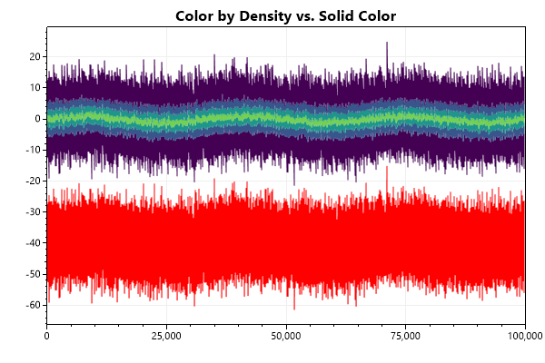


<h2><a id='display-first-n-points' href='/cookbook/4.1/recipes/signal_firstnpoints/'>Display first N points</a></h2>

When plotting live data it is useful to allocate a large array in memory then fill it with values as they come in. By setting the maxRenderIndex property of a scatter plot to can prevent rendering the end of the array (which is probably filled with zeros).



```cs
ScottPlot.Version.ShouldBe(4, 1, 71);
var plt = new ScottPlot.Plot(600, 400);

// create an array larger than we intend to display
double[] values = DataGen.RandomWalk(1000);

// only render the first N points of the signal
var sig = plt.AddSignal(values);
sig.MaxRenderIndex = 500;

plt.SaveFig("signal_firstNpoints.png");
```



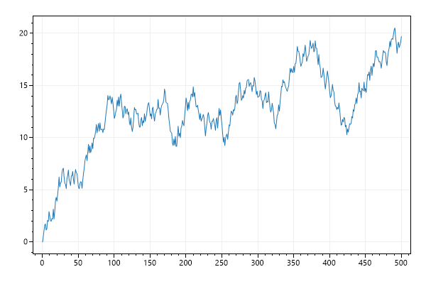


<h2><a id='plot-a-range-of-points' href='/cookbook/4.1/recipes/signal_range/'>Plot a Range of Points</a></h2>

It is sometimes useful to only display values within a range of the source data array.



```cs
ScottPlot.Version.ShouldBe(4, 1, 71);
var plt = new ScottPlot.Plot(600, 400);

// create an array larger than we intend to display
double[] values = DataGen.RandomWalk(1000);

// only render values between the two defined indexes
var sig = plt.AddSignal(values);
sig.MinRenderIndex = 400;
sig.MaxRenderIndex = 500;

plt.SaveFig("signal_range.png");
```



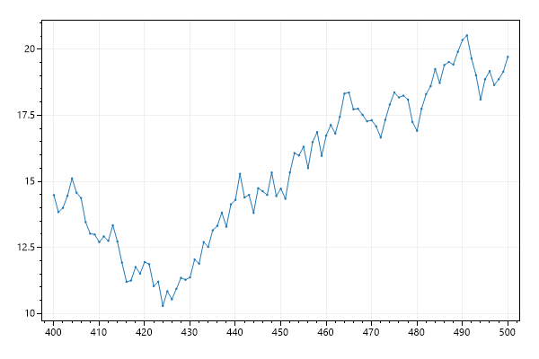


<h2><a id='fill-below' href='/cookbook/4.1/recipes/signal_fillbelow/'>Fill Below</a></h2>

Signal plots can be filled below with a solid color.



```cs
ScottPlot.Version.ShouldBe(4, 1, 71);
var plt = new ScottPlot.Plot(600, 400);

double[] data = DataGen.RandomWalk(1000);

var sig = plt.AddSignal(data);
sig.FillBelow();

plt.Margins(x: 0);

plt.SaveFig("signal_fillBelow.png");
```



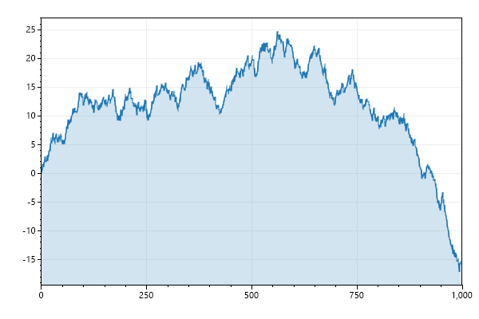


<h2><a id='gradient-fill-below' href='/cookbook/4.1/recipes/signal_fillbelowgradient/'>Gradient Fill Below</a></h2>

Signal plots can be filled below using a color gradient.



```cs
ScottPlot.Version.ShouldBe(4, 1, 71);
var plt = new ScottPlot.Plot(600, 400);

double[] data = DataGen.RandomWalk(1000);

var sig = plt.AddSignal(data);
sig.FillBelow(Color.Blue, Color.Transparent);

plt.Margins(x: 0);

plt.SaveFig("signal_fillBelowGradient.png");
```



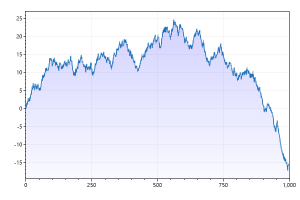


<h2><a id='gradient-fill-above' href='/cookbook/4.1/recipes/signal_fillabove/'>Gradient Fill Above</a></h2>

Signal plots can be filled above using a color gradient.



```cs
ScottPlot.Version.ShouldBe(4, 1, 71);
var plt = new ScottPlot.Plot(600, 400);

double[] data = DataGen.RandomWalk(1000);

var sig = plt.AddSignal(data);
sig.FillAbove(Color.Blue, Color.Transparent);

plt.Margins(x: 0);

plt.SaveFig("signal_fillAbove.png");
```



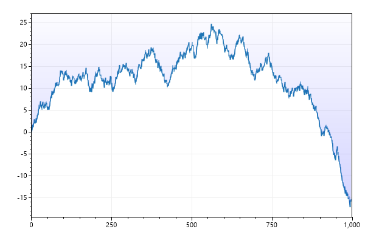


<h2><a id='fill-above-and-below' href='/cookbook/4.1/recipes/signal_fillaboveandbelow/'>Fill Above and Below</a></h2>

Signal plots can be filled above and below



```cs
ScottPlot.Version.ShouldBe(4, 1, 71);
var plt = new ScottPlot.Plot(600, 400);

double[] data = DataGen.RandomWalk(1000);

var sig = plt.AddSignal(data);
sig.FillAboveAndBelow(Color.Green, Color.Red);
sig.Color = Color.Black;
sig.BaselineY = 7;

plt.Margins(x: 0);

plt.SaveFig("signal_fillAboveAndBelow.png");
```



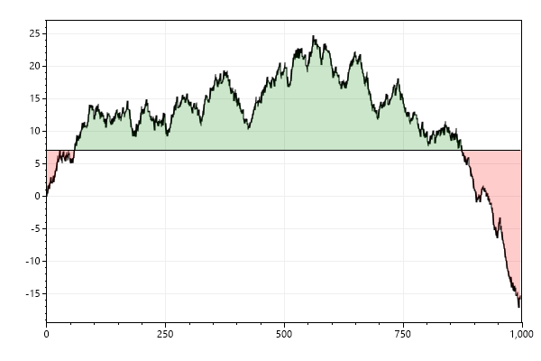


<h2><a id='gradient-fill-above-and-below' href='/cookbook/4.1/recipes/signal_gradientaboveandbelowgradient/'>Gradient Fill Above and Below</a></h2>

Gradients can be used to fill above and below.



```cs
ScottPlot.Version.ShouldBe(4, 1, 71);
var plt = new ScottPlot.Plot(600, 400);

double[] data = DataGen.RandomWalk(1000);

plt.Style(Style.Gray1);

var sig = plt.AddSignal(data);
sig.MarkerSize = 0;
sig.Color = Color.Black;
sig.FillAboveAndBelow(Color.Green, Color.Transparent, Color.Transparent, Color.Red, 1);
sig.BaselineY = 5;

plt.Margins(x: 0);

plt.SaveFig("signal_gradientAboveAndBelowGradient.png");
```



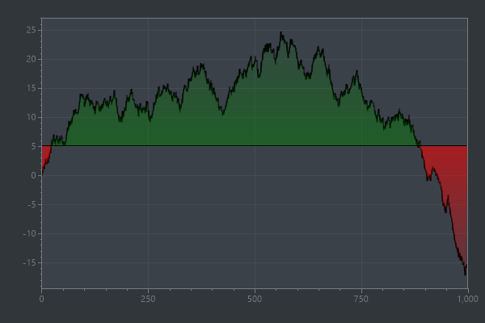


<h2><a id='signal-plot-with-smooth-lines' href='/cookbook/4.1/recipes/signal_smooth/'>Signal Plot with Smooth Lines</a></h2>

The Smooth field controls whether signal plot lines are drawn with smooth or straight line.



```cs
ScottPlot.Version.ShouldBe(4, 1, 71);
var plt = new ScottPlot.Plot(600, 400);

double[] data = DataGen.RandomWalk(1000);
plt.Palette = new ScottPlot.Palettes.ColorblindFriendly();

var sp = plt.AddSignal(data);
sp.Smooth = true;

plt.Legend();

plt.SaveFig("signal_smooth.png");
```



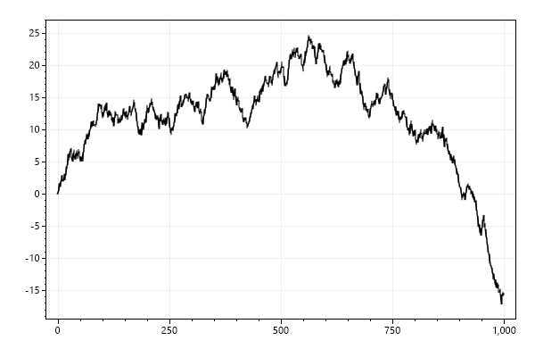


<h2><a id='signal-marker-color' href='/cookbook/4.1/recipes/signal_marker_color/'>Signal Marker Color</a></h2>

The markers that display when signal plots are zoomed in may have a different color than the lines connecting them



```cs
ScottPlot.Version.ShouldBe(4, 1, 71);
var plt = new ScottPlot.Plot(600, 400);

double[] values = DataGen.Sin(51);
var sig = plt.AddSignal(values);

sig.LineColor = Color.LightBlue;
sig.LineWidth = 3;
sig.MarkerColor = Color.Blue;

plt.SaveFig("signal_marker_color.png");
```



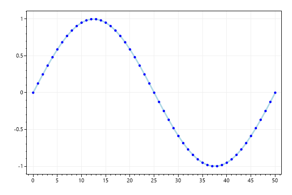


