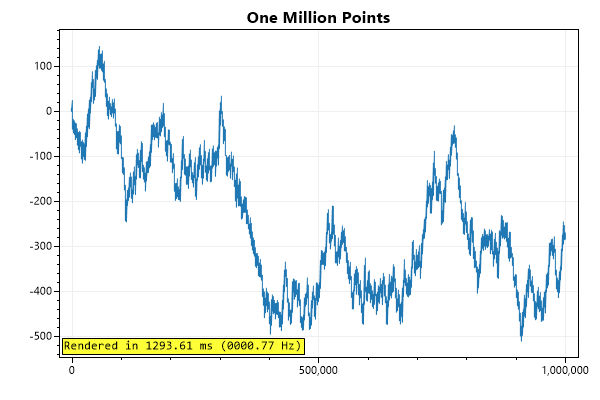
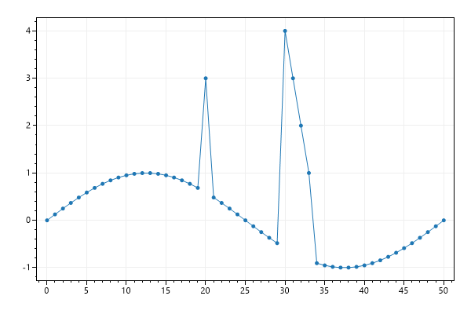

# Plot Type: SignalConst
* This page contains recipes for the _SignalConst_ category.
* Visit the [Cookbook Home Page](../../) to view all cookbook recipes.
* Generated by ScottPlot 4.1.70 on 1/14/2024
<h2><a id='signalconst-quickstart' href='/cookbook/4.1/recipes/signalconst_quickstart/'>SignalConst Quickstart</a></h2>

SignalConst plots pre-processes data to render much faster than Signal plots. Pre-processing takes a little time up-front and requires 4x the memory of Signal.



```cs
ScottPlot.Version.ShouldBe(4, 1, 70);
var plt = new ScottPlot.Plot(600, 400);

double[] values = DataGen.RandomWalk(1_000_000);
plt.AddSignalConst(values);
plt.Title("One Million Points");
plt.Benchmark();

plt.SaveFig("signalconst_quickstart.png");
```






<h2><a id='generic-data-type' href='/cookbook/4.1/recipes/signalconst_generic/'>Generic Data Type</a></h2>

SignalConst supports other data types beyond just double arrays. You can use this plot type to display data in any numerical format that can be cast to a double.



```cs
ScottPlot.Version.ShouldBe(4, 1, 70);
var plt = new ScottPlot.Plot(600, 400);

int[] data = { 2, 6, 3, 8, 5, 6, 1, 9, 7 };
plt.AddSignalConst(data);
plt.Title("SignalConst Displaying int[] Data");

plt.SaveFig("signalconst_generic.png");
```




<h2><a id='signalconst-data-updates' href='/cookbook/4.1/recipes/signalconst_update/'>SignalConst Data Updates</a></h2>

SignalConst is fast because it pre-processes data, but changing data requires additional processing before it can be rendered properly. Use the SignalPlot's Update() function to update data values instead of modifying contents of the original array that was used to create the signal plot.



```cs
ScottPlot.Version.ShouldBe(4, 1, 70);
var plt = new ScottPlot.Plot(600, 400);

double[] values = DataGen.Sin(51);
var sig = plt.AddSignalConst(values);

// update a single point
sig.Update(20, 3);

// update a small range of values
double[] newYs = { 4, 3, 2, 1 };
sig.Update(30, newYs);

plt.SaveFig("signalconst_update.png");
```






