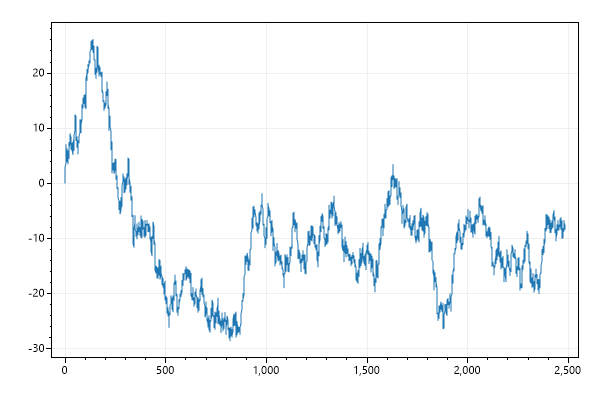
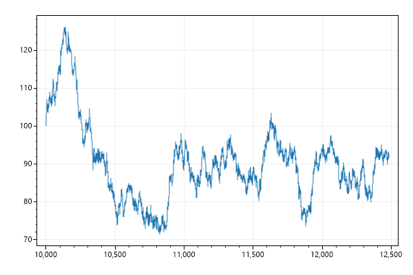
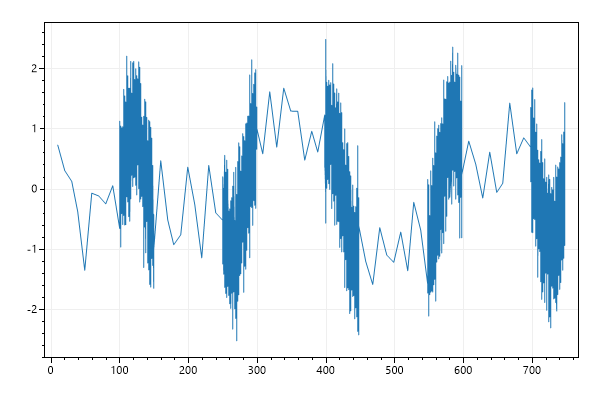
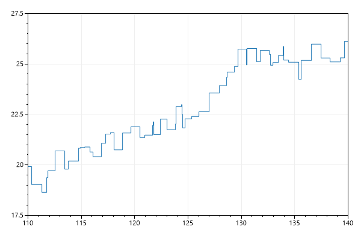
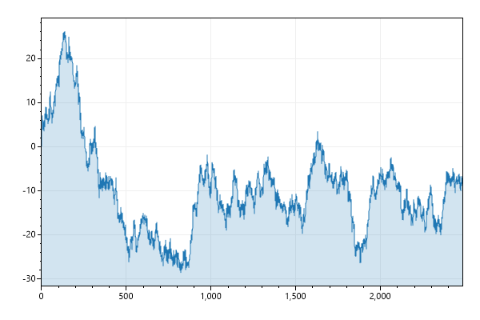
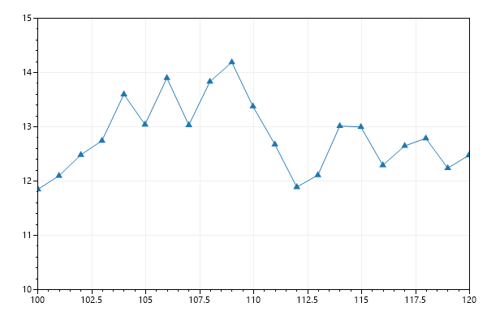
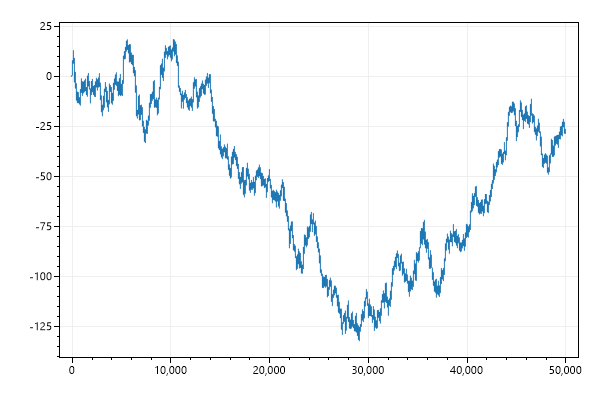
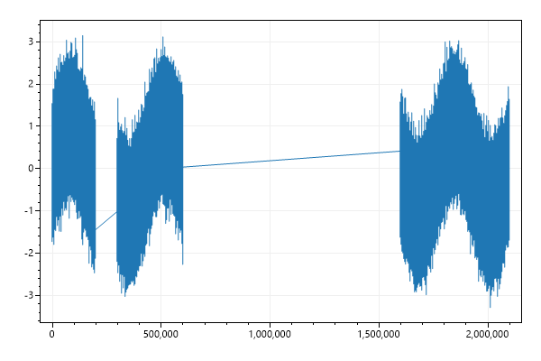
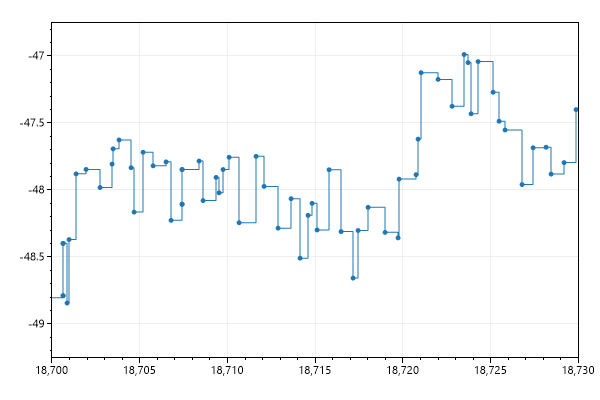

* This page contains recipes for the _SignalXY_ category.
* Visit the [Cookbook Home Page](../../) to view all cookbook recipes.
* Generated by ScottPlot 4.1.61 on 2/27/2023
## SignalXY Quickstart

SignalXY is a speed-optimized plot for displaying vaues (Ys) with unevenly-spaced positions (Xs) that are in ascending order. If your data is evenly-spaced, Signal and SignalConst is faster.

```cs
var plt = new ScottPlot.Plot(600, 400);

(double[] xs, double[] ys) = DataGen.RandomWalk2D(new Random(0), 5_000);

plt.AddSignalXY(xs, ys);

plt.SaveFig("signalxy_quickstart.png");
```




## SignalXY Offset

SignalXY plots can have X and Y offsets that shift all data by a defined amount.

```cs
var plt = new ScottPlot.Plot(600, 400);

(double[] xs, double[] ys) = DataGen.RandomWalk2D(new Random(0), 5_000);

var sig = plt.AddSignalXY(xs, ys);
sig.OffsetX = 10_000;
sig.OffsetY = 100;

plt.SaveFig("signalxy_offset.png");
```




## Signal Data with Gaps

Signal with defined Xs that contain gaps

```cs
var plt = new ScottPlot.Plot(600, 400);

var rand = new Random(0);
int pointCount = 10_000;
double[] sine = DataGen.Sin(pointCount, 3);
double[] noise = DataGen.RandomNormal(rand, pointCount, 0, 0.5);
double[] ys = sine.Zip(noise, (s, n) => s + n).ToArray();
double[] xs = Enumerable.Range(0, pointCount)
    .Select(x => (double)x)
    .Select(x => x > 3_000 ? x + 10_000 : x)
    .Select(x => x > 7_000 ? x + 20_000 : x)
    .ToArray();

plt.AddSignalXY(xs, ys);

plt.SaveFig("signalxy_gaps.png");
```


## Different Densities

Signal with mised low and high density data

```cs
var plt = new ScottPlot.Plot(600, 400);

Random rand = new(0);
int pointCount = 5_000;
double[] sine = DataGen.Sin(pointCount, 3);
double[] noise = DataGen.RandomNormal(rand, pointCount, 0, 0.5);
double[] ys = sine.Zip(noise, (s, n) => s + n).ToArray();
double[] xs = new double[pointCount];

double x = 0;
for (int i = 0; i < pointCount; i++)
{
    bool lowDensityPoint = (i % 1_000) < 10;
    x += lowDensityPoint ? 10 : .05;
    xs[i] = x;
}

plt.AddSignalXY(xs, ys);

plt.SaveFig("signalxy_density.png");
```




## SignalXY Step Mode

Data points can be connected with steps (instead of straight lines).

```cs
var plt = new ScottPlot.Plot(600, 400);

(double[] xs, double[] ys) = DataGen.RandomWalk2D(new Random(0), 5_000);

var sigxy = plt.AddSignalXY(xs, ys);
sigxy.StepDisplay = true;
sigxy.MarkerSize = 0;

plt.SetAxisLimits(110, 140, 17.5, 27.5);

plt.SaveFig("signalxy_step.png");
```




## SignalXY with Fill

Various options allow shading above/below the signal data.

```cs
var plt = new ScottPlot.Plot(600, 400);

(double[] xs, double[] ys) = DataGen.RandomWalk2D(new Random(0), 5_000);

var sigxy = plt.AddSignalXY(xs, ys);
sigxy.FillBelow();

plt.Margins(x: 0);

plt.SaveFig("signalxy_fillBelow.png");
```




## Customize Markers

SignalXY plots have markers which only appear when they are zoomed in.

```cs
var plt = new ScottPlot.Plot(600, 400);

var rand = new Random(0);
double[] ys = DataGen.RandomWalk(rand, 200);
double[] xs = DataGen.Consecutive(200);

var sig = plt.AddSignalXY(xs, ys);
sig.MarkerShape = MarkerShape.filledTriangleUp;
sig.MarkerSize = 10;

plt.SetAxisLimits(100, 120, 10, 15);

plt.SaveFig("signalxy_markers.png");
```




## SignalConst with X and Y data

SignalXYConst is a speed-optimized plot for displaying vaues (Ys) with unevenly-spaced positions (Xs) that are in ascending order. If your data is evenly-spaced, Signal and SignalConst is faster.

```cs
var plt = new ScottPlot.Plot(600, 400);

// generate random, unevenly-spaced data
Random rand = new Random(0);
int pointCount = 100_000;
double[] ys = new double[pointCount];
double[] xs = new double[pointCount];
for (int i = 1; i < ys.Length; i++)
{
    ys[i] = ys[i - 1] + rand.NextDouble() - .5;
    xs[i] = xs[i - 1] + rand.NextDouble();
}

plt.AddSignalXYConst(xs, ys);

plt.SaveFig("signalxyconst_quickstart.png");
```




## Different data types for xs and ys

SignalXYConst with (int)Xs and (float)Ys arrays

```cs
var plt = new ScottPlot.Plot(600, 400);

Random rand = new Random(0);
int pointCount = 1_000_000;
double[] sine = DataGen.Sin(pointCount, 3);
double[] noise = DataGen.RandomNormal(rand, pointCount, 0, 0.5);
float[] ys = sine.Zip(noise, (s, n) => s + n).Select(x => (float)x).ToArray();
int[] xs = Enumerable.Range(0, pointCount)
    .Select(x => (int)x)
    .Select(x => x > 500_000 ? x + 1_000_000 : x)
    .Select(x => x > 200_000 ? x + 100_000 : x)
    .ToArray();

plt.AddSignalXYConst(xs, ys);

plt.SaveFig("signalxyconst_types.png");
```




## SignalConst Step Mode

Data points can be connected with steps (instead of straight lines).

```cs
var plt = new ScottPlot.Plot(600, 400);

// generate random, unevenly-spaced data
Random rand = new Random(0);
int pointCount = 100_000;
double[] ys = new double[pointCount];
double[] xs = new double[pointCount];
for (int i = 1; i < ys.Length; i++)
{
    ys[i] = ys[i - 1] + rand.NextDouble() - .5;
    xs[i] = xs[i - 1] + rand.NextDouble();
}

var sigxyconst = plt.AddSignalXYConst(xs, ys);
sigxyconst.StepDisplay = true;
plt.SetAxisLimits(18700, 18730, -49.25, -46.75);

plt.SaveFig("signalxyconst_step.png");
```




