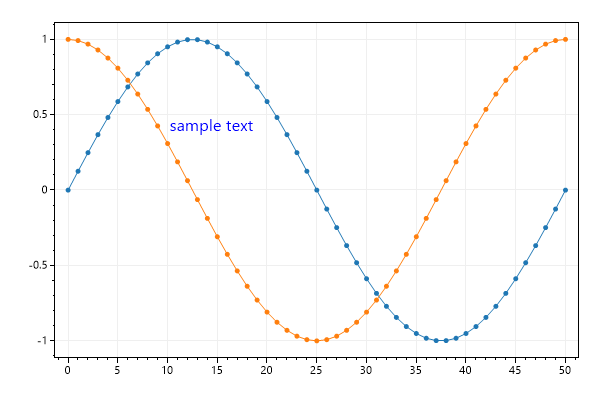
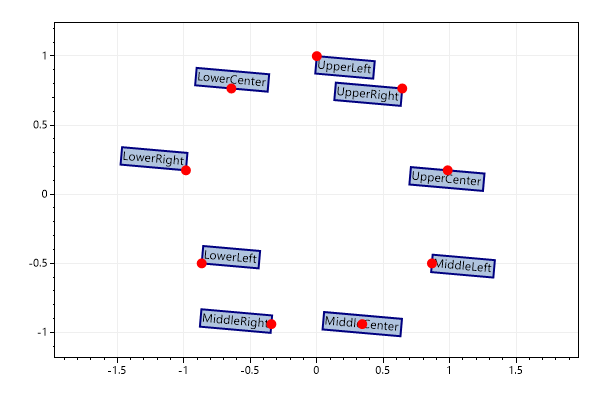
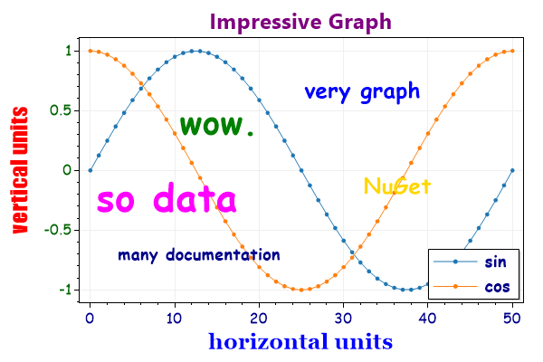

* This page contains recipes for the _Text_ category.
* Visit the [Cookbook Home Page](../../) to view all cookbook recipes.
* Generated by ScottPlot 4.1.46 on 6/5/2022
## Text

The Text plottable displays a string at an X/Y coordinate in unit space. Unlike the Annotation plottable, text moves when the axes are adjusted.

```cs
var plt = new ScottPlot.Plot(600, 400);

int pointCount = 51;
double[] x = DataGen.Consecutive(pointCount);
double[] sin = DataGen.Sin(pointCount);
double[] cos = DataGen.Cos(pointCount);

plt.AddScatter(x, sin);
plt.AddScatter(x, cos);

plt.AddText("sample text", 10, .5, size: 16, color: Color.Blue);

plt.SaveFig("text_quickstart.png");
```




## Text Alignment and Rotation

Alignment indicates which corner is placed at the X/Y coordinate.

```cs
var plt = new ScottPlot.Plot(600, 400);

ScottPlot.Alignment[] alignments = (ScottPlot.Alignment[])Enum.GetValues(typeof(ScottPlot.Alignment));

for (int i = 0; i < alignments.Length; i++)
{
    double frac = (double)i / alignments.Length;
    double x = Math.Sin(frac * Math.PI * 2);
    double y = Math.Cos(frac * Math.PI * 2);

    var txt = plt.AddText(alignments[i].ToString(), x, y);
    txt.Alignment = alignments[i];
    txt.Font.Color = Color.Black; ;
    txt.BackgroundColor = Color.LightSteelBlue;
    txt.BackgroundFill = true;
    txt.Rotation = 5;
    txt.BorderSize = 2;
    txt.BorderColor = Color.Navy;
    txt.DragEnabled = true;

    plt.AddPoint(x, y, Color.Red, 10);
}

plt.Margins(.5, .2);

plt.SaveFig("text_alignment.png");
```




## Custom Fonts

You can pass in a Font to further customize font options

```cs
var plt = new ScottPlot.Plot(600, 400);

// display some interesting data in the background
plt.AddSignal(DataGen.Sin(51), label: "sin");
plt.AddSignal(DataGen.Cos(51), label: "cos");

// add text with custom fonts
plt.AddText("very graph", 25, .8, new Drawing.Font() { Name = "comic sans ms", Size = 24, Color = Color.Blue, Bold = true });
plt.AddText("so data", 0, 0, new Drawing.Font() { Name = "comic sans ms", Size = 42, Color = Color.Magenta, Bold = true });
plt.AddText("many documentation", 3, -.6, new Drawing.Font() { Name = "comic sans ms", Size = 18, Color = Color.DarkBlue, Bold = true });
plt.AddText("wow.", 10, .6, new Drawing.Font() { Name = "comic sans ms", Size = 36, Color = Color.Green, Bold = true });
plt.AddText("NuGet", 32, 0, new Drawing.Font() { Name = "comic sans ms", Size = 24, Color = Color.Gold, Bold = true });

// configure axis labels
plt.YAxis.Label(label: "vertical units", fontName: "impact", size: 24, color: Color.Red, bold: true);
plt.XAxis.Label(label: "horizontal units", fontName: "georgia", size: 24, color: Color.Blue, bold: true);
plt.XAxis2.Label(label: "Impressive Graph", size: 24, color: Color.Purple, bold: true);

// configure tick labels
plt.XAxis.TickLabelStyle(color: Color.DarkBlue, fontName: "comic sans ms", fontSize: 16);
plt.YAxis.TickLabelStyle(color: Color.DarkGreen, fontName: "comic sans ms", fontSize: 16);

// add a legend to the corner
var legend = plt.Legend();
legend.FontName = "comic sans ms";
legend.FontSize = 18;
legend.FontBold = true;
legend.FontColor = Color.DarkBlue;

plt.SaveFig("text_fonts.png");
```




