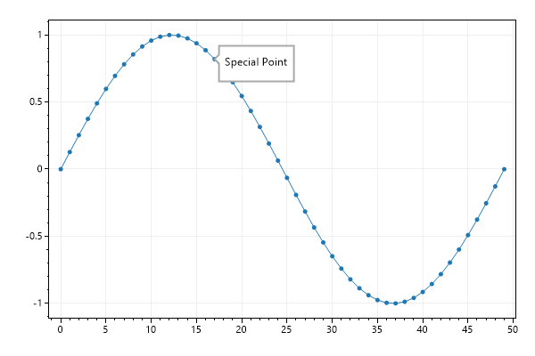
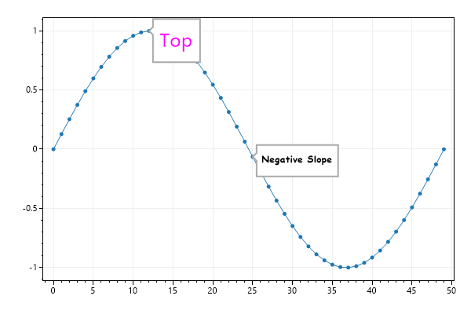
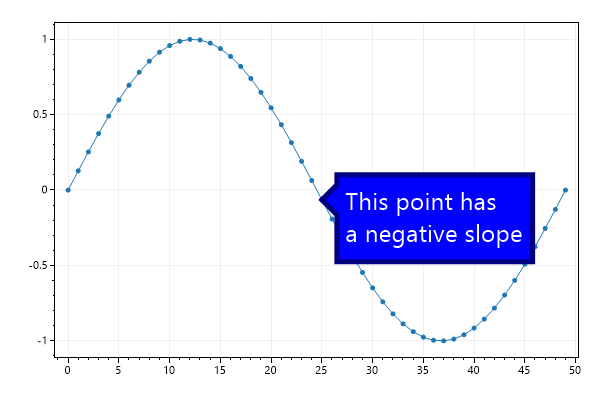

# Plot Type: Tooltip
* This page contains recipes for the _Tooltip_ category.
* Visit the [Cookbook Home Page](../../) to view all cookbook recipes.
* Generated by ScottPlot 4.1.70 on 12/28/2023
<h2><a id='tooltip-quickstart' href='/cookbook/4.1/recipes/tooltip_quickstart/'>Tooltip Quickstart</a></h2>

Tooltips are annotations that point to an X/Y coordinate on the plot

```cs
var plt = new ScottPlot.Plot(600, 400);

double[] ys = DataGen.Sin(50);
plt.AddSignal(ys);

plt.AddTooltip(label: "Special Point", x: 17, y: ys[17]);

plt.SaveFig("tooltip_quickstart.png");
```




<h2><a id='tooltip-font' href='/cookbook/4.1/recipes/tooltip_font/'>Tooltip Font</a></h2>

Tooltips fonts can be customized

```cs
var plt = new ScottPlot.Plot(600, 400);

double[] ys = DataGen.Sin(50);
plt.AddSignal(ys);

var tt1 = plt.AddTooltip("Top", 12, ys[12]);
tt1.Font.Color = System.Drawing.Color.Magenta;
tt1.Font.Size = 24;

var tt2 = plt.AddTooltip("Negative Slope", 25, ys[25]);
tt2.Font.Name = "Comic Sans MS";
tt2.Font.Bold = true;

plt.SaveFig("tooltip_font.png");
```




<h2><a id='tooltip-colors' href='/cookbook/4.1/recipes/tooltip_colors/'>Tooltip Colors</a></h2>

Tooltips border and fill styles can be customized

```cs
var plt = new ScottPlot.Plot(600, 400);

double[] ys = DataGen.Sin(50);
plt.AddSignal(ys);

var tt = plt.AddTooltip("This point has\na negative slope", 25, ys[25]);
tt.Font.Size = 24;
tt.Font.Color = System.Drawing.Color.White;
tt.FillColor = System.Drawing.Color.Blue;
tt.BorderWidth = 5;
tt.BorderColor = System.Drawing.Color.Navy;
tt.ArrowSize = 15;

plt.SaveFig("tooltip_colors.png");
```




