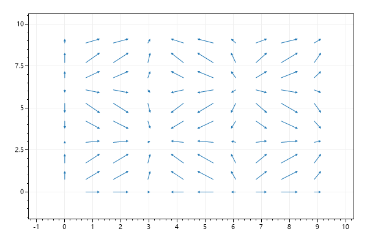
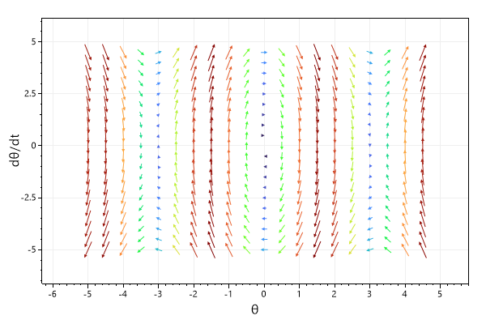
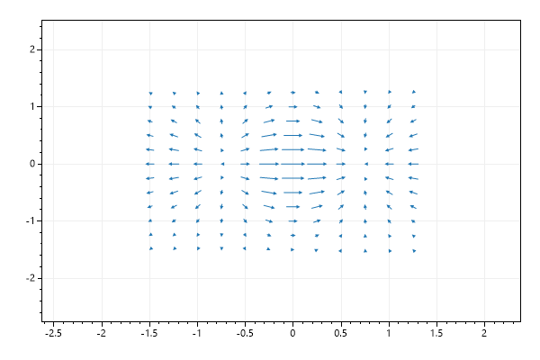
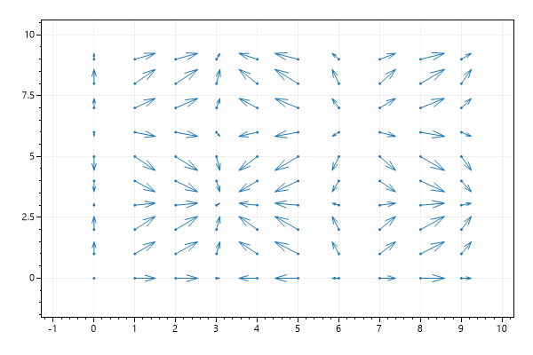

* This page contains recipes for the _Vector Field_ category.
* Visit the [Cookbook Home Page](../../) to view all cookbook recipes.
* Generated by ScottPlot 4.1.43 on 5/4/2022
## Quickstart

A vector field can be useful to show data explained by differential equations

```cs
var plt = new ScottPlot.Plot(600, 400);

double[] xPositions = DataGen.Range(0, 10);
double[] yPositions = DataGen.Range(0, 10);
Vector2[,] vectors = new Vector2[xPositions.Length, yPositions.Length];

for (int x = 0; x < xPositions.Length; x++)
    for (int y = 0; y < yPositions.Length; y++)
        vectors[x, y] = new Vector2(
x: Math.Sin(xPositions[x]),
y: Math.Sin(yPositions[y]));

plt.AddVectorField(vectors, xPositions, yPositions);

plt.SaveFig("vectorField_quickstart.png");
```




## Angle and Magnitude

This example demonstrates how to define vectors according to a given angle and magnitude.

```cs
var plt = new ScottPlot.Plot(600, 400);

double[] xs = DataGen.Range(-5, 6);
double[] ys = DataGen.Range(-5, 6);
Vector2[,] vectors = new Vector2[xs.Length, ys.Length];

for (int i = 0; i < xs.Length; i++)
{
    for (int j = 0; j < ys.Length; j++)
    {
        double slope = -xs[i];
        double magnitude = Math.Abs(xs[i]);
        double angle = Math.Atan(slope);

        vectors[i, j] = new Vector2(Math.Cos(angle) * magnitude, Math.Sin(angle) * magnitude);
    }
}

plt.AddVectorField(vectors, xs, ys);

plt.SaveFig("vectorField_angleMag.png");
```


## Custom Colormap

A colormap can be supplied to color arrows according to their magnitude

```cs
var plt = new ScottPlot.Plot(600, 400);

double[] xs = DataGen.Range(-5, 5, .5);
double[] ys = DataGen.Range(-5, 5, .5);
Vector2[,] vectors = new Vector2[xs.Length, ys.Length];
double r = 0.5;


for (int i = 0; i < xs.Length; i++)
{
    for (int j = 0; j < ys.Length; j++)
    {
        double x = ys[j];
        double y = -9.81 / r * Math.Sin(xs[i]);

        vectors[i, j] = new Vector2(x, y);
    }
}

plt.AddVectorField(vectors, xs, ys, colormap: Drawing.Colormap.Turbo);
plt.XLabel("θ");
plt.YLabel("dθ/dt");

plt.SaveFig("vectorField_colormap.png");
```




## Custom Scale Factor

A custom scale factor can adjust the length of the arrows.

```cs
var plt = new ScottPlot.Plot(600, 400);

double[] xs = DataGen.Range(-1.5, 1.5, .25);
double[] ys = DataGen.Range(-1.5, 1.5, .25);
Vector2[,] vectors = new Vector2[xs.Length, ys.Length];

for (int i = 0; i < xs.Length; i++)
{
    for (int j = 0; j < ys.Length; j++)
    {
        double x = xs[i];
        double y = ys[j];
        var e = Math.Exp(-x * x - y * y);
        var dx = (1 - 2 * x * x) * e;
        var dy = -2 * x * y * e;

        vectors[i, j] = new Vector2(dx, dy);
    }
}

plt.AddVectorField(vectors, xs, ys, scaleFactor: 0.3);

plt.SaveFig("vectorField_scaleFactor.png");
```




## Scaled Arrowheads

Use a slower drawing method that draws tips that are proportional to the length of the arrows.

```cs
var plt = new ScottPlot.Plot(600, 400);

double[] xPositions = DataGen.Range(0, 10);
double[] yPositions = DataGen.Range(0, 10);
Vector2[,] vectors = new Vector2[xPositions.Length, yPositions.Length];

for (int x = 0; x < xPositions.Length; x++)
    for (int y = 0; y < yPositions.Length; y++)
        vectors[x, y] = new Vector2(
  x: Math.Sin(xPositions[x]),
  y: Math.Sin(yPositions[y]));

var vf = plt.AddVectorField(vectors, xPositions, yPositions);
vf.ScaledArrowheads = true;
vf.Anchor = ArrowAnchor.Base;
vf.MarkerSize = 3;

plt.SaveFig("vectorField_fancytips.png");
```




