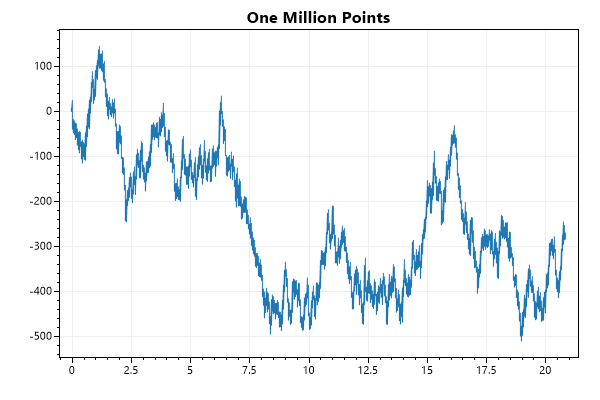
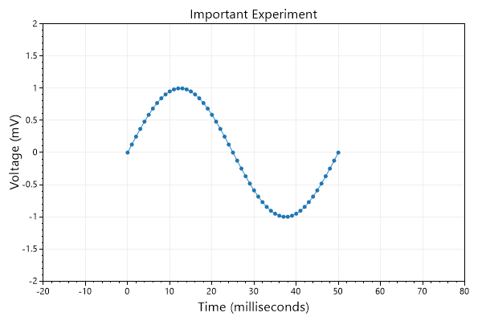
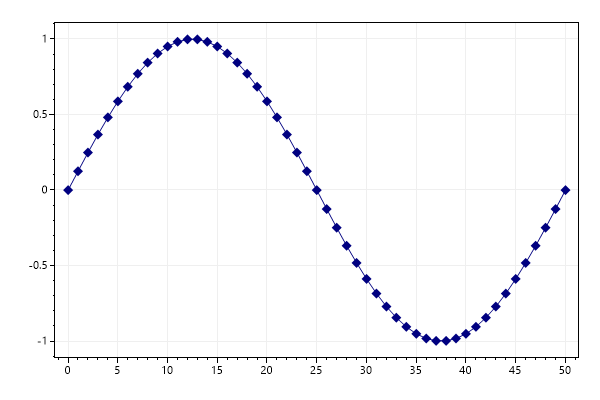
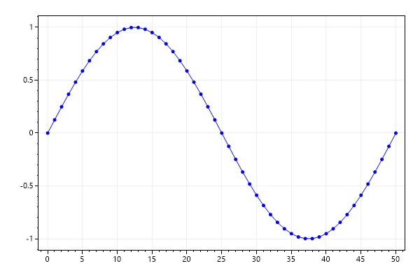
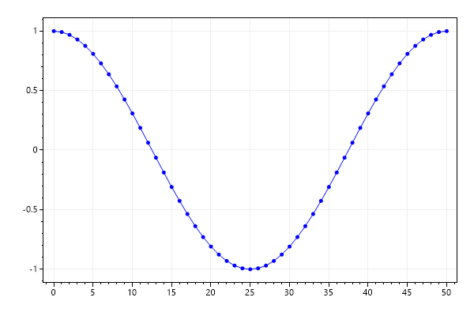

## Scatter Plot

Scatter plots have paired X/Y points.

```cs
var plt = new ScottPlot.Plot(600, 400);

// sample data
double[] xs = DataGen.Consecutive(51);
double[] sin = DataGen.Sin(51);
double[] cos = DataGen.Cos(51);

// plot the data
plt.AddScatter(xs, sin);
plt.AddScatter(xs, cos);

// customize the axis labels
plt.Title("ScottPlot Quickstart");
plt.XLabel("Horizontal Axis");
plt.YLabel("Vertical Axis");

plt.SaveFig("quickstart_scatter.png");
```

<div class='text-center'>
<a href='../../images/quickstart_scatter.png'></a>
</div>


<div class='m-2'>&nbsp;</div>

## Signal Plot

Signal plots have evenly spaced Y points. Signal plots are very fast and can interactively display millions of data points. There are many different types of plottable objects, each serving a different purpose.

```cs
var plt = new ScottPlot.Plot(600, 400);

double[] values = DataGen.RandomWalk(1_000_000);
plt.AddSignal(values, sampleRate: 48_000);
plt.Title("One Million Points");

plt.SaveFig("quickstart_signal.png");
```

<div class='text-center'>
<a href='../../images/quickstart_signal.png'></a>
</div>


<div class='m-2'>&nbsp;</div>

## Axis Labels and Limits

Axis labels and limits can be customized

```cs
var plt = new ScottPlot.Plot(600, 400);

double[] time = DataGen.Consecutive(51);
double[] voltage = DataGen.Sin(51);
plt.AddScatter(time, voltage);

// Axes can be customized
plt.XAxis.Label("Time (milliseconds)");
plt.YAxis.Label("Voltage (mV)");
plt.XAxis2.Label("Important Experiment");

// Set axis limits to control the view
plt.SetAxisLimits(-20, 80, -2, 2);

plt.SaveFig("quickstart_axis.png");
```

<div class='text-center'>
<a href='../../images/quickstart_axis.png'></a>
</div>


<div class='m-2'>&nbsp;</div>

## Manually add a Plottable

You can create a plot manually, then add it to the plot with Add(). This allows you to create custom plot types and add them to the plot.

```cs
var plt = new ScottPlot.Plot(600, 400);

double[] xs = DataGen.Consecutive(51);
double[] sin = DataGen.Sin(51);

// instantiate a plottable
var splt = new ScottPlot.Plottable.ScatterPlot(xs, sin);

// customize its style or change its data as desired
splt.Color = Color.Navy;
splt.MarkerSize = 10;
splt.MarkerShape = MarkerShape.filledDiamond;

// add it to the plot
plt.Add(splt);

plt.SaveFig("quickstart_add.png");
```

<div class='text-center'>
<a href='../../images/quickstart_add.png'></a>
</div>


<div class='m-2'>&nbsp;</div>

## Remove a Plottable

Call Remove() to remove a specific plottable.

```cs
var plt = new ScottPlot.Plot(600, 400);

double[] xs = DataGen.Consecutive(51);
double[] sin = DataGen.Sin(51);
double[] cos = DataGen.Sin(51);

var sinPlot = plt.AddScatter(xs, sin, color: Color.Red);
var cosPlot = plt.AddScatter(xs, cos, color: Color.Blue);

plt.Remove(sinPlot);

plt.SaveFig("quickstart_remove.png");
```

<div class='text-center'>
<a href='../../images/quickstart_remove.png'></a>
</div>


<div class='m-2'>&nbsp;</div>

## Clear Plottables

Call Clear() to remove all plottables from the plot. Overloads of Clear() allow you to remote one type of plottable, or a specific plottable.

```cs
var plt = new ScottPlot.Plot(600, 400);

double[] xs = DataGen.Consecutive(51);
double[] sin = DataGen.Sin(51);
double[] cos = DataGen.Sin(51);

plt.AddScatter(xs, sin, color: Color.Red);
plt.Clear();
plt.AddScatter(xs, cos, color: Color.Blue);

plt.SaveFig("quickstart_clear.png");
```

<div class='text-center'>
<a href='../../images/quickstart_clear.png'></a>
</div>

