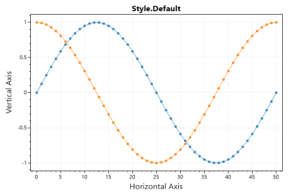
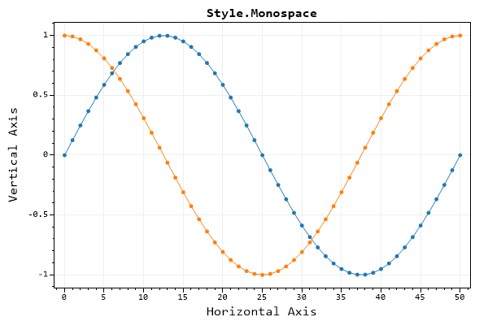
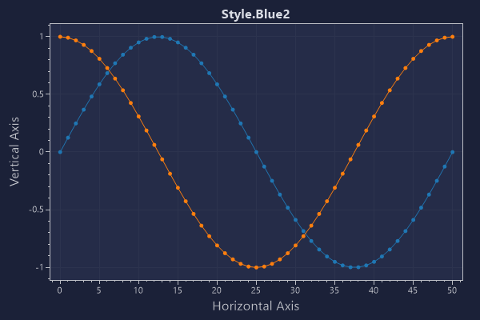
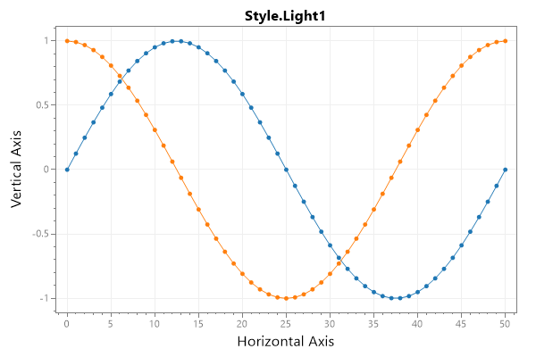
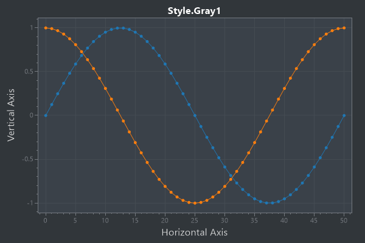
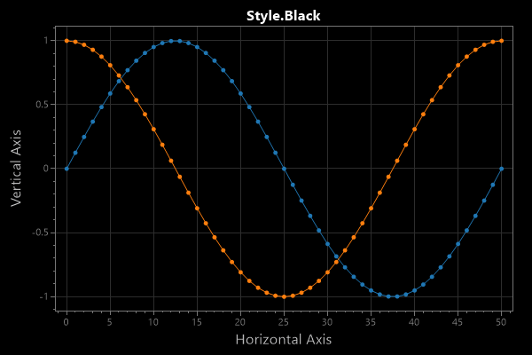
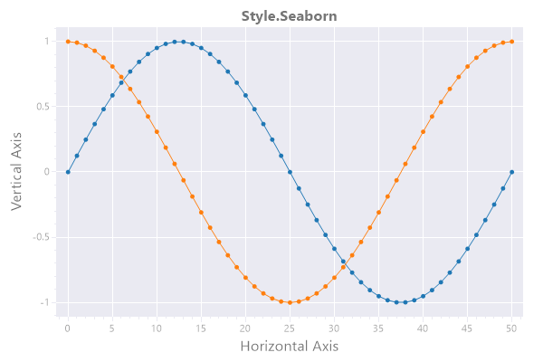

* This page contains recipes for the _Style_ category.
* Visit the [Cookbook Home Page](../../) to view all cookbook recipes.
* Generated by ScottPlot 4.1.45 on 5/9/2022
## Default Style

Customize many plot features using style presets

```cs
var plt = new ScottPlot.Plot(600, 400);

plt.AddSignal(DataGen.Sin(51));
plt.AddSignal(DataGen.Cos(51));

plt.Style(Style.Default);
plt.Title("Style.Default");
plt.XLabel("Horizontal Axis");
plt.YLabel("Vertical Axis");

plt.SaveFig("style_Default.png");
```




## Monospace Style

Customize many plot features using style presets

```cs
var plt = new ScottPlot.Plot(600, 400);

plt.AddSignal(DataGen.Sin(51));
plt.AddSignal(DataGen.Cos(51));

plt.Style(Style.Monospace);
plt.Title("Style.Monospace");
plt.XLabel("Horizontal Axis");
plt.YLabel("Vertical Axis");

plt.SaveFig("style_monospace.png");
```




## Blue1 Style

Customize many plot features using style presets

```cs
var plt = new ScottPlot.Plot(600, 400);

plt.AddSignal(DataGen.Sin(51));
plt.AddSignal(DataGen.Cos(51));

plt.Style(Style.Blue1);
plt.Title("Style.Blue1");
plt.XLabel("Horizontal Axis");
plt.YLabel("Vertical Axis");

plt.SaveFig("style_blue1.png");
```


## Blue2 Style

Customize many plot features using style presets

```cs
var plt = new ScottPlot.Plot(600, 400);

plt.AddSignal(DataGen.Sin(51));
plt.AddSignal(DataGen.Cos(51));

plt.Style(Style.Blue2);
plt.Title("Style.Blue2");
plt.XLabel("Horizontal Axis");
plt.YLabel("Vertical Axis");

plt.SaveFig("style_blue2.png");
```




## Light1 Style

Customize many plot features using style presets

```cs
var plt = new ScottPlot.Plot(600, 400);

plt.AddSignal(DataGen.Sin(51));
plt.AddSignal(DataGen.Cos(51));

plt.Style(Style.Light1);
plt.Title("Style.Light1");
plt.XLabel("Horizontal Axis");
plt.YLabel("Vertical Axis");

plt.SaveFig("style_light1.png");
```




## Gray1 Style

Customize many plot features using style presets

```cs
var plt = new ScottPlot.Plot(600, 400);

plt.AddSignal(DataGen.Sin(51));
plt.AddSignal(DataGen.Cos(51));

plt.Style(Style.Gray1);
plt.Title("Style.Gray1");
plt.XLabel("Horizontal Axis");
plt.YLabel("Vertical Axis");

plt.SaveFig("style_Gray1.png");
```




## Black Style

Customize many plot features using style presets

```cs
var plt = new ScottPlot.Plot(600, 400);

plt.AddSignal(DataGen.Sin(51));
plt.AddSignal(DataGen.Cos(51));

plt.Style(Style.Black);
plt.Title("Style.Black");
plt.XLabel("Horizontal Axis");
plt.YLabel("Vertical Axis");

plt.SaveFig("style_Black.png");
```




## Seaborn Style

Customize many plot features using style presets

```cs
var plt = new ScottPlot.Plot(600, 400);

plt.AddSignal(DataGen.Sin(51));
plt.AddSignal(DataGen.Cos(51));

plt.Style(Style.Seaborn);
plt.Title("Style.Seaborn");
plt.XLabel("Horizontal Axis");
plt.YLabel("Vertical Axis");

plt.SaveFig("style_Seaborn.png");
```




