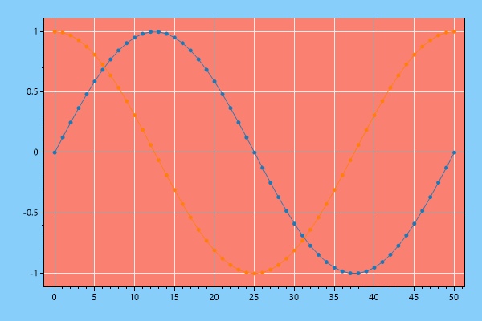
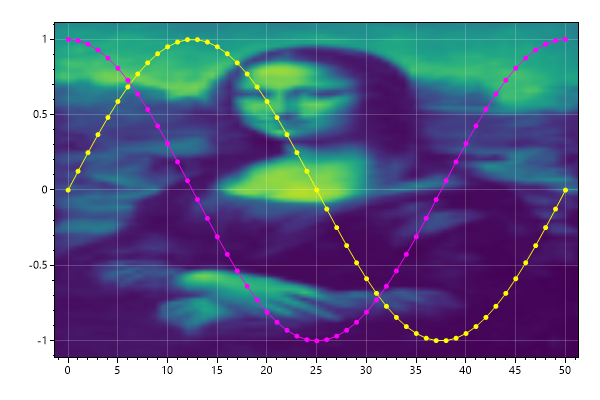
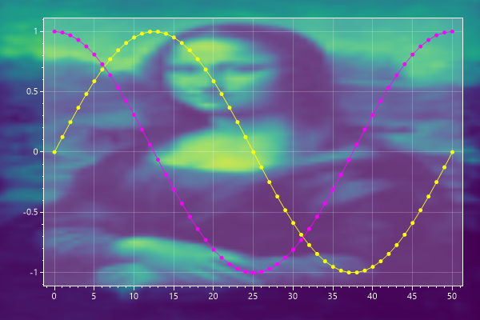
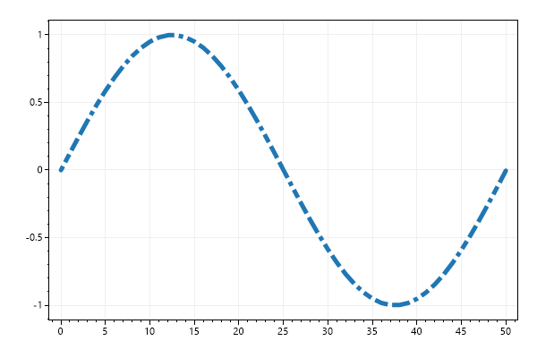

# Style
* This page contains recipes for the _Style_ category.
* Visit the [Cookbook Home Page](../../) to view all cookbook recipes.
* Generated by ScottPlot 4.1.70 on 12/28/2023
<h2><a id='default-plot-style' href='/cookbook/4.1/recipes/style_default/'>Default Plot Style</a></h2>

This example demonstrates the default plot style.

```cs
var plt = new ScottPlot.Plot(600, 400);

plt.AddSignal(DataGen.Sin(51));
plt.AddSignal(DataGen.Cos(51));
plt.Title("Default Style");
plt.XLabel("Horizontal Axis");
plt.YLabel("Vertical Axis");

plt.SaveFig("style_Default.png");
```


<h2><a id='background-color' href='/cookbook/4.1/recipes/style_background/'>Background Color</a></h2>

Plots have two background colors that can be individually customized. The figure background is the background of the whole image. The data background is the background of the rectangle that contains the data. Both background types support transparency, although PNG file export is required.

```cs
var plt = new ScottPlot.Plot(600, 400);

plt.AddSignal(DataGen.Sin(51));
plt.AddSignal(DataGen.Cos(51));

plt.Style(
    figureBackground: Color.LightSkyBlue,
    dataBackground: Color.Salmon);

plt.SaveFig("style_background.png");
```




<h2><a id='monospace-style' href='/cookbook/4.1/recipes/style_monospace/'>Monospace Style</a></h2>

Customize many plot features using style presets

```cs
var plt = new ScottPlot.Plot(600, 400);

plt.AddSignal(DataGen.Sin(51));
plt.AddSignal(DataGen.Cos(51));

plt.Style(Style.Monospace);
plt.Title("Style.Monospace");
plt.XLabel("Horizontal Axis");
plt.YLabel("Vertical Axis");

plt.SaveFig("style_monospace.png");
```


<h2><a id='blue1-style' href='/cookbook/4.1/recipes/style_blue1/'>Blue1 Style</a></h2>

Customize many plot features using style presets

```cs
var plt = new ScottPlot.Plot(600, 400);

plt.AddSignal(DataGen.Sin(51));
plt.AddSignal(DataGen.Cos(51));

plt.Style(Style.Blue1);
plt.Title("Style.Blue1");
plt.XLabel("Horizontal Axis");
plt.YLabel("Vertical Axis");

plt.SaveFig("style_blue1.png");
```


<h2><a id='blue2-style' href='/cookbook/4.1/recipes/style_blue2/'>Blue2 Style</a></h2>

Customize many plot features using style presets

```cs
var plt = new ScottPlot.Plot(600, 400);

plt.AddSignal(DataGen.Sin(51));
plt.AddSignal(DataGen.Cos(51));

plt.Style(Style.Blue2);
plt.Title("Style.Blue2");
plt.XLabel("Horizontal Axis");
plt.YLabel("Vertical Axis");

plt.SaveFig("style_blue2.png");
```


<h2><a id='light1-style' href='/cookbook/4.1/recipes/style_light1/'>Light1 Style</a></h2>

Customize many plot features using style presets

```cs
var plt = new ScottPlot.Plot(600, 400);

plt.AddSignal(DataGen.Sin(51));
plt.AddSignal(DataGen.Cos(51));

plt.Style(Style.Light1);
plt.Title("Style.Light1");
plt.XLabel("Horizontal Axis");
plt.YLabel("Vertical Axis");

plt.SaveFig("style_light1.png");
```


<h2><a id='gray1-style' href='/cookbook/4.1/recipes/style_gray1/'>Gray1 Style</a></h2>

Customize many plot features using style presets

```cs
var plt = new ScottPlot.Plot(600, 400);

plt.AddSignal(DataGen.Sin(51));
plt.AddSignal(DataGen.Cos(51));

plt.Style(Style.Gray1);
plt.Title("Style.Gray1");
plt.XLabel("Horizontal Axis");
plt.YLabel("Vertical Axis");

plt.SaveFig("style_Gray1.png");
```


<h2><a id='black-style' href='/cookbook/4.1/recipes/style_black/'>Black Style</a></h2>

Customize many plot features using style presets

```cs
var plt = new ScottPlot.Plot(600, 400);

plt.AddSignal(DataGen.Sin(51));
plt.AddSignal(DataGen.Cos(51));

plt.Style(Style.Black);
plt.Title("Style.Black");
plt.XLabel("Horizontal Axis");
plt.YLabel("Vertical Axis");

plt.SaveFig("style_Black.png");
```


<h2><a id='seaborn-style' href='/cookbook/4.1/recipes/style_seaborn/'>Seaborn Style</a></h2>

Customize many plot features using style presets

```cs
var plt = new ScottPlot.Plot(600, 400);

plt.AddSignal(DataGen.Sin(51));
plt.AddSignal(DataGen.Cos(51));

plt.Style(Style.Seaborn);
plt.Title("Style.Seaborn");
plt.XLabel("Horizontal Axis");
plt.YLabel("Vertical Axis");

plt.SaveFig("style_Seaborn.png");
```


<h2><a id='data-background-image' href='/cookbook/4.1/recipes/misc_background_image_data/'>Data Background Image</a></h2>

A backgorund image can be drawn behind the data area. Users to do this may want to make grid lines semitransparent.

```cs
var plt = new ScottPlot.Plot(600, 400);

plt.AddSignal(DataGen.Sin(51), 1, Color.Yellow);
plt.AddSignal(DataGen.Cos(51), 1, Color.Magenta);

Bitmap monaLisaBmp = ScottPlot.DataGen.SampleImage();

plt.Style(
    grid: Color.FromArgb(50, Color.White),
    dataBackgroundImage: monaLisaBmp);

plt.SaveFig("misc_background_image_data.png");
```




<h2><a id='figure-background-image' href='/cookbook/4.1/recipes/misc_background_image_figure/'>Figure Background Image</a></h2>

A backgorund image can be drawn behind the entire figure. If you do this you likely want to make your data background transparent.

```cs
var plt = new ScottPlot.Plot(600, 400);

plt.AddSignal(DataGen.Sin(51), 1, Color.Yellow);
plt.AddSignal(DataGen.Cos(51), 1, Color.Magenta);

Bitmap monaLisaBmp = ScottPlot.DataGen.SampleImage();

plt.Style(
    grid: Color.FromArgb(50, Color.White),
    tick: Color.White,
    dataBackground: Color.FromArgb(50, Color.White),
    figureBackgroundImage: monaLisaBmp);

plt.SaveFig("misc_background_image_figure.png");
```




<h2><a id='custom-line-style' href='/cookbook/4.1/recipes/misc_custom_line_style/'>Custom Line Style</a></h2>

A customizable line style exists which allows users to define any pattern.

```cs
var plt = new ScottPlot.Plot(600, 400);

// All default line style patterns can be customized.
// Numbers are the length of lines and spaces.
ScottPlot.LineStylePatterns.Custom = new float[] { 1, 1, 2, 1, 3, 1, 4, 1 };

// Use line style patterns anywhere
double[] xs = ScottPlot.DataGen.Consecutive(51);
double[] ys = ScottPlot.DataGen.Sin(51);
plt.AddScatter(xs, ys, markerSize: 0, lineStyle: LineStyle.Custom, lineWidth: 5);

plt.SaveFig("misc_custom_line_style.png");
```




