Generated by ScottPlot 4.1.67 on 8/13/2023  
<h4>Customization</h4>
<ul>
<li><a href='#quickstart'>Quickstart</a> - Simple examples designed to help new users get familiar with ScottPlot.</li>
<li><a href='#axis-and-ticks'>Axis and Ticks</a> - Examples of common customizations for axis labels and ticks.</li>
<li><a href='#advanced-axis-features'>Advanced Axis Features</a> - Examples demonstrating advanced configuration of axis labels, lines, and ticks.</li>
<li><a href='#multi-axis'>Multi-Axis</a> - Plot data using non-standard or additional axes.</li>
<li><a href='#style'>Style</a> - Plots can be styled to customize their colors and fonts.</li>
<li><a href='#palette'>Palette</a> - The Palette defines default colors for new objects added to the plot.</li>
<li><a href='#layout'>Layout</a> - How to customize plot layout, padding, margins, axis spacing, etc.</li>
<li><a href='#legend'>Legend</a> - A legend is a key used to label lines and markers.</li>
</ul>
<h4>Plot Types</h4>
<ul>
<li><a href='#annotation'>Annotation</a> - An Annotation is a text label that is placed on the plot in pixel space (not in coordinate space like a Text object).</li>
<li><a href='#arrow'>Arrow</a> - Arrows point to a location in coordinate space.</li>
<li><a href='#axis-line-and-span'>Axis Line and Span</a> - Axis lines and axis spans extend infinitely in one direction.</li>
<li><a href='#bar-graph'>Bar Graph</a> - How to create bar charts using ScottPlot.</li>
<li><a href='#bar-series'>Bar Series</a> - BarSeries plots allow customization of each bar individually.</li>
<li><a href='#bracket'>Bracket</a> - Brackets highlight a range in coordinate space.</li>
<li><a href='#bubble-plot'>Bubble Plot</a> - Bubble plots display circles at specific X/Y locations.</li>
<li><a href='#colorbar'>Colorbar</a> - A colorbar displays a colormap beside the data area. Colorbars are typically added to plots containing heatmaps.</li>
<li><a href='#coxcomb-chart'>Coxcomb Chart</a> - A Coxcomb chart is a pie graph where the angle of slices is constant but the radii are not.</li>
<li><a href='#crosshair'>Crosshair</a> - The Crosshair plot type draws vertical and horizontal lines that intersect at a point on the plot and the coordinates of those lines are displayed on top of the axis ticks. This plot type is typically updated after MouseMove events to track the mouse.</li>
<li><a href='#data-logger'>Data Logger</a> - The DataLogger plot type facilitates displaying live data by giving the developer a simple way to Add() new data points by either shifting them in or appending them to a growing list. This plot type also has special options to manage axis limits as new data arrives. See code in the WinForms Demo app for advanced usage information.</li>
<li><a href='#ellipse'>Ellipse</a> - Ellipses are cuves with a defined center and distinct X and Y radii. A circle is an ellipse with an X radius equal to its Y radius.</li>
<li><a href='#error-bar'>Error Bar</a> - Error bars represent a range of uncertainty using a line and a perpendicular cap.</li>
<li><a href='#fill'>Fill</a> - Helper methods are available to help fill the region under a curve.</li>
<li><a href='#finance'>Finance</a> - Finance charts represent price over a binned time range using OHLC (open, high, low, close) data format.</li>
<li><a href='#function'>Function</a> - Function plots accept a Func (not distinct X/Y data points) to create line plots which can be zoomed infinitely.</li>
<li><a href='#heatmap'>Heatmap</a> - Heatmaps display a 2D array using a colormap.</li>
<li><a href='#image'>Image</a> - An image bitmap can be placed on the plot.</li>
<li><a href='#marker'>Marker</a> - A marker is a symbol placed at an X/Y point in coordinate space.</li>
<li><a href='#pie-chart'>Pie Chart</a> - A pie chart illustrates numerical proportions as slices of a circle.</li>
<li><a href='#polygon'>Polygon</a> - Polygons are 2D shapes made from pairs of X/Y points.</li>
<li><a href='#population'>Population</a> - The population plot makes it easy to display populations as bar graphs, box-and-whisker plots, scattered values, or box plots and data points side-by-side. The population plot is different than using a box plot with an error bar in that you pass your original data into the population plot and it determines the standard deviation, standard error, quartiles, mean, median, outliers, etc., and you get to determine how to display these values.</li>
<li><a href='#radar-chart'>Radar Chart</a> - Radar charts (also called a spider charts or star charts) represent multi-axis data as a 2D shape on axes arranged circularly around a center point.</li>
<li><a href='#radial-gauge'>Radial Gauge</a> - A radial gauge chart displays scalar data as circular gauges.</li>
<li><a href='#scale-bar'>Scale Bar</a> - An L-shaped scalebar can be added in the corner of any plot.</li>
<li><a href='#scatter-plot'>Scatter Plot</a> - Scatter plots display small numbers of paired X/Y data points. Signal plots are much faster than scatter plots and should be used when X data is evenly spaced.</li>
<li><a href='#signal-plot'>Signal Plot</a> - Signal plots are optimized to display data with evenly-spaced X values.</li>
<li><a href='#signalconst'>SignalConst</a> - SignalConst plots pre-processes data to render much faster than Signal plots. Pre-processing takes time up-front and requires 4x the memory of Signal.</li>
<li><a href='#signalxy'>SignalXY</a> - SignalXY is a speed-optimized plot for displaying Y vaues with unevenly-spaced (but always increasing) X positions.</li>
<li><a href='#text'>Text</a> - A text label that is placed at an X/Y coordinate on the plot (not in pixel space like an Annotation).</li>
<li><a href='#tooltip'>Tooltip</a> - Tooltips are annotations that point to an X/Y coordinate on the plot.</li>
<li><a href='#vector-field'>Vector Field</a> - Vector fields use arrows to show direction and magnitude of data points in a 2D array and are ideal for visualizing data explained by differential equations.</li>
</ul>
<h4>Additional Examples</h4>
<ul>
<li><a href='#statistics'>Statistics</a> - How to use statistics tools bundled with ScottPlot.</li>
<li><a href='#miscellaneous'>Miscellaneous</a> - A collection of examples demonstrating obscure configuration options.</li>
</ul>
<h4>Colors</h4>
<ul>
<li><a href='colors/'>Color</a> - Lists of colors in each color palette for representing categorical data</li>
<li><a href='colormaps/'>Colormaps</a> - Color gradients available to represent continuous data</li>
</ul>

  <a href='#quickstart' class='text-dark'>Quickstart</a>

Simple examples designed to help new users get familiar with ScottPlot.

  
    <a href='category/quickstart/#scatter-plot'>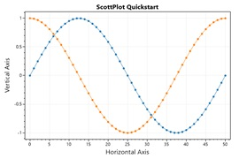</a>  
  
    
<a href='category/quickstart/#scatter-plot'>Scatter Plot</a>
    
Scatter plots have paired X/Y points.
  

  
    <a href='category/quickstart/#signal-plot'>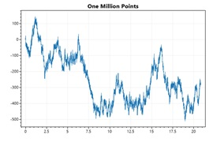</a>  
  
    
<a href='category/quickstart/#signal-plot'>Signal Plot</a>
    
Signal plots have evenly spaced Y points. Signal plots are very fast and can interactively display millions of data points. There are many different types of plottable objects, each serving a different purpose.
  

  
    <a href='category/quickstart/#axis-labels-and-limits'>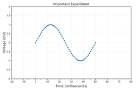</a>  
  
    
<a href='category/quickstart/#axis-labels-and-limits'>Axis Labels and Limits</a>
    
Axis labels and limits can be customized
  

  
    <a href='category/quickstart/#manually-add-a-plottable'>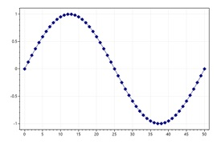</a>  
  
    
<a href='category/quickstart/#manually-add-a-plottable'>Manually add a Plottable</a>
    
You can create a plot manually, then add it to the plot with Add(). This allows you to create custom plot types and add them to the plot.
  

  
    <a href='category/quickstart/#remove-a-plottable'>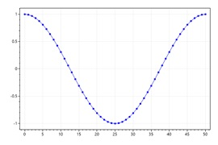</a>  
  
    
<a href='category/quickstart/#remove-a-plottable'>Remove a Plottable</a>
    
Call Remove() to remove a specific plottable.
  

  
    <a href='category/quickstart/#clear-plottables'>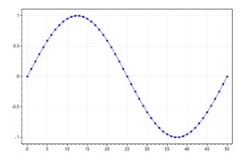</a>  
  
    
<a href='category/quickstart/#clear-plottables'>Clear Plottables</a>
    
Call Clear() to remove all plottables from the plot. Overloads of Clear() allow you to remote one type of plottable, or a specific plottable.
  

  
    <a href='category/quickstart/#legend'>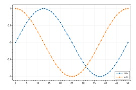</a>  
  
    
<a href='category/quickstart/#legend'>Legend</a>
    
Most plottable objects have a Label which defines how they appear in the legend
  

  <a href='#axis-and-ticks' class='text-dark'>Axis and Ticks</a>

Examples of common customizations for axis labels and ticks.

  
    <a href='category/axis-and-ticks/#axis-customizations'>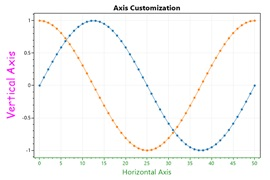</a>  
  
    
<a href='category/axis-and-ticks/#axis-customizations'>Axis Customizations</a>
    
Axes can be customized different ways. Axis labels and colors are the most common types of customizations.
  

  
    <a href='category/axis-and-ticks/#disable-grid'>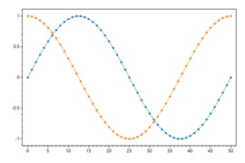</a>  
  
    
<a href='category/axis-and-ticks/#disable-grid'>Disable Grid</a>
    
Visibility of primary X and Y grids can be set using a single method.
  

  
    <a href='category/axis-and-ticks/#disable-vertical-grid'>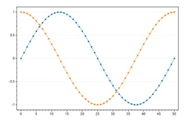</a>  
  
    
<a href='category/axis-and-ticks/#disable-vertical-grid'>Disable Vertical Grid</a>
    
Grid line visibility can be controlled for each axis individually. Use this to selectively enable grid lines only for the axes of interest. Keep in mind that vertical grid lines are controlled by horizontal axes.
  

  
    <a href='category/axis-and-ticks/#draw-grid-above-plottables'>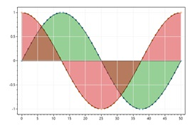</a>  
  
    
<a href='category/axis-and-ticks/#draw-grid-above-plottables'>Draw Grid Above Plottables</a>
    
Sometimes it's useful to draw the grid lines above the plottables rather than below.
  

  
    <a href='category/axis-and-ticks/#grid-style'>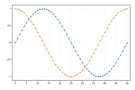</a>  
  
    
<a href='category/axis-and-ticks/#grid-style'>Grid Style</a>
    
Common grid line configurations are available.
  

  
    <a href='category/axis-and-ticks/#frameless-plots'>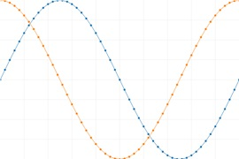</a>  
  
    
<a href='category/axis-and-ticks/#frameless-plots'>Frameless Plots</a>
    
Frameless plots can display data that appraoches the edge of the figure.
  

  
    <a href='category/axis-and-ticks/#one-axis-only'>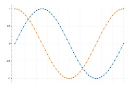</a>  
  
    
<a href='category/axis-and-ticks/#one-axis-only'>One Axis Only</a>
    
Axis ticks and lines can be disabled. Note that hiding them in this way preserves their whitespace. Setting XAxis.IsVisible to false would collapse the axis entirely. 
  

  
    <a href='category/axis-and-ticks/#rotated-x-ticks'>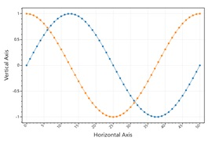</a>  
  
    
<a href='category/axis-and-ticks/#rotated-x-ticks'>Rotated X Ticks</a>
    
Horizontal tick labels can be rotated as desired.
  

  
    <a href='category/axis-and-ticks/#rotated-y-ticks'>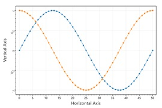</a>  
  
    
<a href='category/axis-and-ticks/#rotated-y-ticks'>Rotated Y Ticks</a>
    
Vertical tick labels can be rotated as desired.
  

  
    <a href='category/axis-and-ticks/#x-ticks-width'>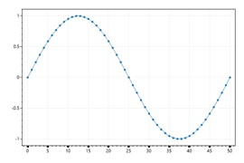</a>  
  
    
<a href='category/axis-and-ticks/#x-ticks-width'>X Ticks Width</a>
    
This example show how to change the width of the X axe ticks
  

  
    <a href='category/axis-and-ticks/#plotting-datetime-data'>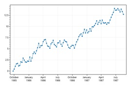</a>  
  
    
<a href='category/axis-and-ticks/#plotting-datetime-data'>Plotting DateTime Data</a>
    
This example shows how to display DateTime data on the horizontal axis. Use DateTime.ToOADate() to convert DateTime[] to double[], plot the data,  then tell the axis to format tick labels as dates.
  

  
    <a href='category/axis-and-ticks/#plotting-datetime-data-on-a-signal-plot'>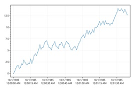</a>  
  
    
<a href='category/axis-and-ticks/#plotting-datetime-data-on-a-signal-plot'>Plotting DateTime Data on a Signal Plot</a>
    
DateTime can be displayed on the horizontal axis of a signal plot by using the sample rate to set the time interval per data point, and then setting the OffsetX to the desired start date.
  

  
      
  
    
<a href='category/axis-and-ticks/#axis-boundary'>Axis Boundary</a>
    
Axes can be given boundaries which prevent the user from panning outside a given range.
  

  
      
  
    
<a href='category/axis-and-ticks/#axis-zoom-limit'>Axis Zoom Limit</a>
    
Axes can be given a zoom limit which allows the user to pan everywhere but never zoom in beyond a given span
  

  <a href='#advanced-axis-features' class='text-dark'>Advanced Axis Features</a>

Examples demonstrating advanced configuration of axis labels, lines, and ticks.

  
    <a href='category/advanced-axis-features/#advanced-grid-customization'>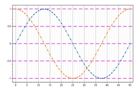</a>  
  
    
<a href='category/advanced-axis-features/#advanced-grid-customization'>Advanced Grid Customization</a>
    
Grid lines can be extensively customized using various configuration methods.
  

  
    <a href='category/advanced-axis-features/#numeric-format-string'>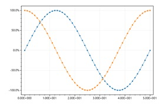</a>  
  
    
<a href='category/advanced-axis-features/#numeric-format-string'>Numeric Format String</a>
    
Tick labels can be converted to text using a custom format string.
  

  
    <a href='category/advanced-axis-features/#manual-tick-labels'>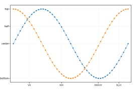</a>  
  
    
<a href='category/advanced-axis-features/#manual-tick-labels'>Manual Tick Labels</a>
    
Tick positions and labels can be defined manually.
  

  
      
  
    
<a href='category/advanced-axis-features/#manual-and-automatic-tick-labels'>Manual and Automatic Tick Labels</a>
    
Tick positions and labels can be defined manually, but also added alongside automatic tick labels.
  

  
    <a href='category/advanced-axis-features/#nonlinear-tick-spacing'>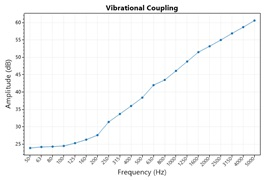</a>  
  
    
<a href='category/advanced-axis-features/#nonlinear-tick-spacing'>NonLinear Tick Spacing</a>
    
Plot data on regular cartesian space then manually control axis labels to give the appearance of non-linear spacing between points.
  

  
    <a href='category/advanced-axis-features/#descending-ticks'>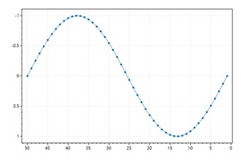</a>  
  
    
<a href='category/advanced-axis-features/#descending-ticks'>Descending Ticks</a>
    
ScottPlot will always display data where X values ascend from left to right. To simulate an inverted axis (where numbers decrease from left to right) plot data in the negative space, then invert the sign of tick labels.
  

  
    <a href='category/advanced-axis-features/#defined-tick-spacing'>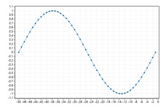</a>  
  
    
<a href='category/advanced-axis-features/#defined-tick-spacing'>Defined Tick Spacing</a>
    
The space between tick marks can be manually defined by setting the grid spacing.
  

  
    <a href='category/advanced-axis-features/#tick-label-culture'>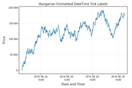</a>  
  
    
<a href='category/advanced-axis-features/#tick-label-culture'>Tick Label Culture</a>
    
Large numbers and dates are formatted differently for different cultures. Hungarian uses spaces to separate large numbers and periods to separate fields in dates.
  

  
    <a href='category/advanced-axis-features/#custom-tick-label-culture'>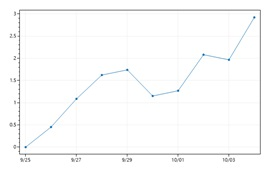</a>  
  
    
<a href='category/advanced-axis-features/#custom-tick-label-culture'>Custom Tick Label Culture</a>
    
SetCulture() as arguments to let the user manually define formatting strings which will be used globally to change how numbers and dates are formatted.
  

  
    <a href='category/advanced-axis-features/#multiplier-notation'>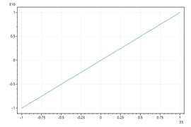</a>  
  
    
<a href='category/advanced-axis-features/#multiplier-notation'>Multiplier Notation</a>
    
Multiplier notation keeps tick labels small when plotting large data values. This style is also called engineering notation or scientific notation.
  

  
    <a href='category/advanced-axis-features/#offset-notation'>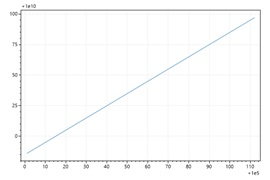</a>  
  
    
<a href='category/advanced-axis-features/#offset-notation'>Offset Notation</a>
    
Offset notation keeps tick labels small when plotting large data values that are close together.
  

  
    <a href='category/advanced-axis-features/#defined-datetime-spacing'>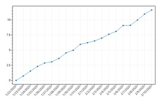</a>  
  
    
<a href='category/advanced-axis-features/#defined-datetime-spacing'>Defined DateTime Spacing</a>
    
This example shows how to use a fixed inter-tick distance for a DateTime axis
  

  
    <a href='category/advanced-axis-features/#log-scale'>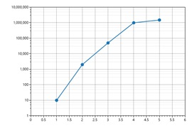</a>  
  
    
<a href='category/advanced-axis-features/#log-scale'>Log Scale</a>
    
ScottPlot is designed to display 2D data on linear X and Y axes, but you can log-transform data before plotting it and customize the ticks and grid to give the appearance of logarithmic scales.
  

  
    <a href='category/advanced-axis-features/#log-scale-tick-density'>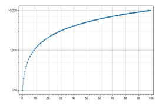</a>  
  
    
<a href='category/advanced-axis-features/#log-scale-tick-density'>Log Scale Tick Density</a>
    
Numer of minor ticks between major ticks can be customized.
  

  
    <a href='category/advanced-axis-features/#ruler-mode'>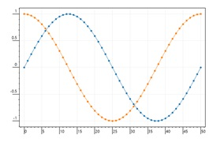</a>  
  
    
<a href='category/advanced-axis-features/#ruler-mode'>Ruler mode</a>
    
Ruler mode is an alternative way to display axis ticks. It draws long ticks and offsets the tick labels to give the appearance of a ruler.
  

  
    <a href='category/advanced-axis-features/#polar-coordinates'>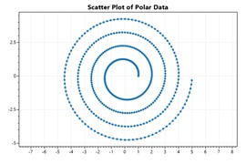</a>  
  
    
<a href='category/advanced-axis-features/#polar-coordinates'>Polar Coordinates</a>
    
A helper function converts radius and theta arrays into Cartesian coordinates suitable for plotting with traditioanl plot types.
  

  
    <a href='category/advanced-axis-features/#images-as-axis-labels'>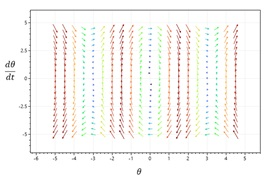</a>  
  
    
<a href='category/advanced-axis-features/#images-as-axis-labels'>Images as Axis Labels</a>
    
Images can be used as axis labels to allow for things like LaTeX axis labels.
  

  
    <a href='category/advanced-axis-features/#transparent-images-axis-labels'>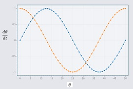</a>  
  
    
<a href='category/advanced-axis-features/#transparent-images-axis-labels'>Transparent Images Axis Labels</a>
    
Transparency in PNGs is respected, but JPEG files do not support transparency.
  

  
    <a href='category/advanced-axis-features/#tick-density'>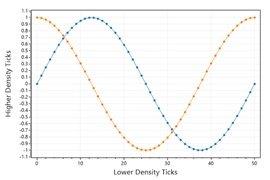</a>  
  
    
<a href='category/advanced-axis-features/#tick-density'>Tick Density</a>
    
Axis tick density can be adjusted by the user. The largest the density is, the more ticks are displayed. Setting this value too high will result in overlapping tick labels.
  

  
    <a href='category/advanced-axis-features/#minimum-tick-spacing'>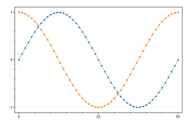</a>  
  
    
<a href='category/advanced-axis-features/#minimum-tick-spacing'>Minimum Tick Spacing</a>
    
Minimum tick spacing can be defined such that zooming in does not produce more grid lines, ticks, and tick labels beyond the defined limit.
  

  
    <a href='category/advanced-axis-features/#custom-tick-formatter'>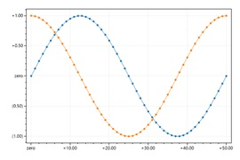</a>  
  
    
<a href='category/advanced-axis-features/#custom-tick-formatter'>Custom Tick Formatter</a>
    
For ultimate control over tick label format you can create a custom formatter function and use that to convert positions to labels. This allows logic to be used to format tick labels.
  

  
    <a href='category/advanced-axis-features/#invert-tick-mark-direction'>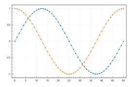</a>  
  
    
<a href='category/advanced-axis-features/#invert-tick-mark-direction'>Invert tick mark direction</a>
    
Tick marks can be outward (default) or inverted to appear as inward lines relative to the edge of the plot area.
  

  
    <a href='category/advanced-axis-features/#advanced-axis-customization'>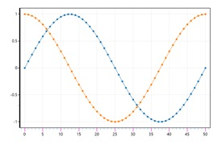</a>  
  
    
<a href='category/advanced-axis-features/#advanced-axis-customization'>Advanced Axis Customization</a>
    
Axis labels, tick marks, and axis lines can all be extensively customized by interacting directly with axis configuration objects.
  

  <a href='#multi-axis' class='text-dark'>Multi-Axis</a>

Plot data using non-standard or additional axes.

  
    <a href='category/multi-axis/#primary-axes'>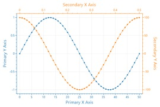</a>  
  
    
<a href='category/multi-axis/#primary-axes'>Primary Axes</a>
    
Plots always have 4 fundamental axes available to work with. By default primary axes are totally visible, and secondary axes have ticks hidden and no label. Sometimes the top axis is given a label to simulate a plot title.
  

  
    <a href='category/multi-axis/#additional-y-axis'>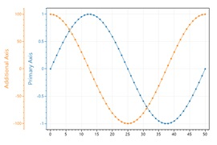</a>  
  
    
<a href='category/multi-axis/#additional-y-axis'>Additional Y Axis</a>
    
Additional axes can be added on any edge. Additional axes stack away from the plot area.
  

  
    <a href='category/multi-axis/#right-y-axis'>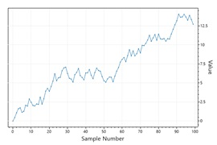</a>  
  
    
<a href='category/multi-axis/#right-y-axis'>Right Y Axis</a>
    
This example demonstrates how to display a Y axis on the right side of the figure. The vertical axis to the right of the figure is index 1, so plots must be updated to indicate they are to use a nonstandard axis index.
  

  
    <a href='category/multi-axis/#top-x-axis'>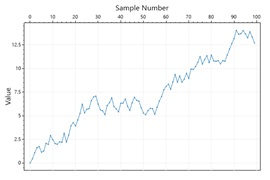</a>  
  
    
<a href='category/multi-axis/#top-x-axis'>Top X Axis</a>
    
This example demonstrates how to display an X axis above the figure. The horizontal axis above the figure is index 1, so plots must be updated to indicate they are to use a nonstandard axis index.
  

  
    <a href='category/multi-axis/#axis-visibility'>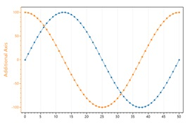</a>  
  
    
<a href='category/multi-axis/#axis-visibility'>Axis Visibility</a>
    
Visibility of axes can be toggled. In this example an additional Y axis is added but the primary Y axis is hidden. The result is a plot that appears to only have one Y axis.
  

  
    <a href='category/multi-axis/#setting-multi-axis-limits'>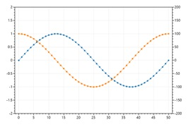</a>  
  
    
<a href='category/multi-axis/#setting-multi-axis-limits'>Setting Multi Axis Limits</a>
    
Axis limits can be set for each axis by indicating which axis index you are wish to modify when setting axis limits.
  

  <a href='#style' class='text-dark'>Style</a>

Plots can be styled to customize their colors and fonts.

  
    <a href='category/style/#default-plot-style'>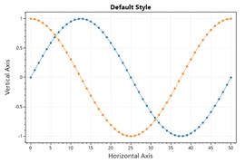</a>  
  
    
<a href='category/style/#default-plot-style'>Default Plot Style</a>
    
This example demonstrates the default plot style.
  

  
    <a href='category/style/#background-color'>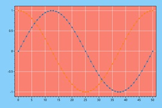</a>  
  
    
<a href='category/style/#background-color'>Background Color</a>
    
Plots have two background colors that can be individually customized. The figure background is the background of the whole image. The data background is the background of the rectangle that contains the data. Both background types support transparency, although PNG file export is required.
  

  
    <a href='category/style/#monospace-style'>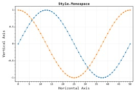</a>  
  
    
<a href='category/style/#monospace-style'>Monospace Style</a>
    
Customize many plot features using style presets
  

  
      
  
    
<a href='category/style/#blue1-style'>Blue1 Style</a>
    
Customize many plot features using style presets
  

  
      
  
    
<a href='category/style/#blue2-style'>Blue2 Style</a>
    
Customize many plot features using style presets
  

  
      
  
    
<a href='category/style/#light1-style'>Light1 Style</a>
    
Customize many plot features using style presets
  

  
      
  
    
<a href='category/style/#gray1-style'>Gray1 Style</a>
    
Customize many plot features using style presets
  

  
      
  
    
<a href='category/style/#black-style'>Black Style</a>
    
Customize many plot features using style presets
  

  
      
  
    
<a href='category/style/#seaborn-style'>Seaborn Style</a>
    
Customize many plot features using style presets
  

  
      
  
    
<a href='category/style/#data-background-image'>Data Background Image</a>
    
A backgorund image can be drawn behind the data area. Users to do this may want to make grid lines semitransparent.
  

  
      
  
    
<a href='category/style/#figure-background-image'>Figure Background Image</a>
    
A backgorund image can be drawn behind the entire figure. If you do this you likely want to make your data background transparent.
  

  
      
  
    
<a href='category/style/#custom-line-style'>Custom Line Style</a>
    
A customizable line style exists which allows users to define any pattern.
  

  <a href='#palette' class='text-dark'>Palette</a>

The Palette defines default colors for new objects added to the plot.

  
      
  
    
<a href='category/palette/#category10'>Category10</a>
    
This 10-color palette is the default colorset used by ScottPlot. It is the same default colorset used by modern versions of Matplotlib (https://matplotlib.org/2.0.2/users/dflt_style_changes.html)
  

  
      
  
    
<a href='category/palette/#category20'>Category20</a>
    
This 20-color palette is similar to the default, but optimized for situations where more than 10 plottables are required. Every second color is a lighter version of the color before it. This palette was sourced from Matplotlib.
  

  
      
  
    
<a href='category/palette/#aurora'>Aurora</a>
    
Aurora is a 5-color palette sourced from Nord.
  

  
      
  
    
<a href='category/palette/#frost'>Frost</a>
    
Frost is a 4-color palette sourced from Nord.
  

  
      
  
    
<a href='category/palette/#nord'>Nord</a>
    
Nord is a 7-color palette derived from Aurora source from NordConEmu.
  

  
      
  
    
<a href='category/palette/#polarnight'>PolarNight</a>
    
PolarNight is a 4-color palette sourced from Nord. This palette is optimized for a dark background.
  

  
      
  
    
<a href='category/palette/#snowstorm'>SnowStorm</a>
    
SnowStorm is a 3-color palette sourced from Nord.
  

  
      
  
    
<a href='category/palette/#onehalf'>OneHalf</a>
    
OneHalf is a 7-color palette sourced from Sublime
  

  
      
  
    
<a href='category/palette/#onehalfdark'>OneHalfDark</a>
    
OneHalfDark is a 7-color palette of colors complimentary to the OneHalf palette desaturated and optimized for a dark background. #2e3440 is a recommended background color with this palette.
  

  
      
  
    
<a href='category/palette/#custom'>Custom</a>
    
A custom palette can be created from an array of HTML color values. These colors will be used as the default colors for new plottables added to the plot.
  

  
      
  
    
<a href='category/palette/#microcharts'>Microcharts</a>
    
This is the default 12-color palette used by Microcharts.
  

  
      
  
    
<a href='category/palette/#colorblind-friendly'>Colorblind Friendly</a>
    
8-color palette that has good overall variability and can be differentiated by individuals with red-green color blindness. Colors originated from Wong 2011, https://www.nature.com/articles/nmeth.1618.pdf
  

  <a href='#annotation' class='text-dark'>Annotation</a>

An Annotation is a text label that is placed on the plot in pixel space (not in coordinate space like a Text object).

  
      
  
    
<a href='category/plottable-annotation/#figure-annotations'>Figure Annotations</a>
    
Annotations are labels placed at a X/Y location on the figure (not coordinates of the data area). Unlike the Text plottable, annotations do not move as the axes are adjusted.
  

  <a href='#arrow' class='text-dark'>Arrow</a>

Arrows point to a location in coordinate space.

  
      
  
    
<a href='category/plottable-arrow/#arrows'>Arrows</a>
    
Arrows point to specific locations on the plot. 
  

  <a href='#axis-line-and-span' class='text-dark'>Axis Line and Span</a>

Axis lines and axis spans extend infinitely in one direction.

  
      
  
    
<a href='category/plottable-axis-line-and-span/#axis-line'>Axis Line</a>
    
An axis line marks a position on an axis. Axis lines extend to positive and negative infinity on the other axis.
  

  
      
  
    
<a href='category/plottable-axis-line-and-span/#finite-axis-line'>Finite Axis Line</a>
    
Axis lines can have lower and/or upper bounds. This can be useful for labeling points of interest.
  

  
      
  
    
<a href='category/plottable-axis-line-and-span/#draggable-axis-lines'>Draggable Axis Lines</a>
    
In GUI environments, axis lines can be draggable and moved with the mouse. Drag limits define the boundaries the lines can be dragged.
  

  
      
  
    
<a href='category/plottable-axis-line-and-span/#draggable-with-snapping'>Draggable With Snapping</a>
    
Draggables can be configured to snap to the nearest integer or to a user-defined list of Positions out of the box.
  

  
      
  
    
<a href='category/plottable-axis-line-and-span/#draggable-custom-snap-function'>Draggable Custom Snap Function</a>
    
Custom logic can be added to draggables to customize how they snap.
  

  
      
  
    
<a href='category/plottable-axis-line-and-span/#position-labels'>Position Labels</a>
    
Axis line positions can be labeled on the axis on top of axis ticks and tick labels. Custom position formatters allow for full customization of the text displayed in these labels. If using a DateTime axis, implement a custom formatter that uses DateTime.FromOADate().
  

  
      
  
    
<a href='category/plottable-axis-line-and-span/#position-labels-on-additional-axes'>Position Labels on Additional Axes</a>
    
Position labels can be added to multi-axis plots. The axis line must be told which axis to render the label on.
  

  
      
  
    
<a href='category/plottable-axis-line-and-span/#axis-span'>Axis Span</a>
    
Axis spans shade a portion of one axis. Axis spans extend to negative and positive infinity on the other axis.
  

  
      
  
    
<a href='category/plottable-axis-line-and-span/#draggable-axis-span'>Draggable Axis Span</a>
    
Axis spans can be dragged using the mouse. Drag limits are boundaries over which the edges of spans cannot cross.
  

  
      
  
    
<a href='category/plottable-axis-line-and-span/#draggable-axis-span-events'>Draggable Axis Span Events</a>
    
Axis spans can be dragged using the mouse. Span events can be useful for binding span edge values to UI elements.
  

  
      
  
    
<a href='category/plottable-axis-line-and-span/#ignore-axis-limits'>Ignore Axis Limits</a>
    
Calling Plot.AxisAuto (or middle-clicking the plot) will set the axis limits automatically to fit the data on the plot. By default the position of axis lines and spans are included in automatic axis limit calculations, but setting the '' flag can disable this behavior.
  

  
      
  
    
<a href='category/plottable-axis-line-and-span/#repeating-axis-line'>Repeating Axis Line</a>
    
Repeating axis lines allows to plot several axis lines, either horizontal or vertical, draggable or not, whose positions are linked
  

  
      
  
    
<a href='category/plottable-axis-line-and-span/#axis-line-vector'>Axis Line Vector</a>
    
An AxisLineVector allows to setup a series of VLines or HLines, without hassle.These lines can optionally be dragged as their counterparts
  

  <a href='#bar-graph' class='text-dark'>Bar Graph</a>

How to create bar charts using ScottPlot.

  
      
  
    
<a href='category/plottable-bar-graph/#bar-graph'>Bar Graph</a>
    
A simple bar graph can be created from a series of values. By default values are palced at X positions 0, 1, 2, etc.
  

  
      
  
    
<a href='category/plottable-bar-graph/#bar-graph-with-defined-positions'>Bar Graph with Defined Positions</a>
    
Horizontal positions for each bar can be defined manually. If you define bar positions, you will probably want to define the bar width as well.
  

  
      
  
    
<a href='category/plottable-bar-graph/#bar-labels'>Bar Labels</a>
    
Bars placed at specific positions can be labeled by setting tick labels for those positions.
  

  
      
  
    
<a href='category/plottable-bar-graph/#bar-graph-with-error-bars'>Bar Graph with Error Bars</a>
    
Errorbars can be added to any bar graph.
  

  
      
  
    
<a href='category/plottable-bar-graph/#stacked-bar-graphs'>Stacked Bar Graphs</a>
    
Bars can be overlapped to give the appearance of stacking.
  

  
      
  
    
<a href='category/plottable-bar-graph/#values-above-bars'>Values Above Bars</a>
    
The value of each bar can be displayed above it.
  

  
      
  
    
<a href='category/plottable-bar-graph/#customizing-value-label-font'>Customizing Value Label Font</a>
    
Font styling for bar value labels can be customized.
  

  
      
  
    
<a href='category/plottable-bar-graph/#custom-value-formatter'>Custom Value Formatter</a>
    
A custom formatter can be used to generate labels above each bar using the numeric value of the bar itself.
  

  
      
  
    
<a href='category/plottable-bar-graph/#bar-fill-pattern'>Bar Fill Pattern</a>
    
Bar graph fill pattern can be customized.
  

  
      
  
    
<a href='category/plottable-bar-graph/#horizontal-bar-graph'>Horizontal Bar Graph</a>
    
Bar graphs are typically displayed as columns, but it's possible to show bars as rows.
  

  
      
  
    
<a href='category/plottable-bar-graph/#grouped-bar-graphs'>Grouped Bar Graphs</a>
    
By customizing positions of multiple bar plots you can achieve the appearance of grouped bar graphs. The AddBarGroups() method is designed to simplify this process. More advanced grouping and bar plot styling is possible using the Population plot type.
  

  
      
  
    
<a href='category/plottable-bar-graph/#bars-with-y-offsets'>Bars with Y Offsets</a>
    
By default bar graphs start at 0, but this does not have to be the case. Y offsets can be defined for each bar. When Y offsets are used, values represent the height of the bars (relative to their offsets).
  

  
      
  
    
<a href='category/plottable-bar-graph/#negative-bar-colors'>Negative Bar Colors</a>
    
Bars with negative values can be colored differently than positive ones.
  

  
      
  
    
<a href='category/plottable-bar-graph/#waterfall-bar-graph'>Waterfall Bar Graph</a>
    
Waterfall bar graphs use bars to represent changes in value from the previous level. This style graph can be created by offseting each bar by the sum of all bars preceeding it. This effect is similar to financial plots (OHLC and Candlestick) which are described in another section.
  

  
      
  
    
<a href='category/plottable-bar-graph/#lollipop-plot-quickstart'>Lollipop Plot Quickstart</a>
    
Lollipop plots convey the same information as Bar plots but have a different appearance.
  

  
      
  
    
<a href='category/plottable-bar-graph/#lollipop-plot-customizations'>Lollipop Plot Customizations</a>
    
Lollipop plots can be extensively customized.
  

  
      
  
    
<a href='category/plottable-bar-graph/#cleveland-dot-plot'>Cleveland Dot Plot</a>
    
Cleveland Dot Plots allow comparing two categories in situations where a Bar Plot may be crowded.
  

  
      
  
    
<a href='category/plottable-bar-graph/#datetime-bar-plot'>DateTime Bar Plot</a>
    
Bars have a default width of 1.0, but when using DateTime axis this means bars are one day wide. To plot DateTime data you may need to manually set the width of a bar to a desired size (in fractions of a day).
  

  <a href='#bar-series' class='text-dark'>Bar Series</a>

BarSeries plots allow customization of each bar individually.

  
      
  
    
<a href='category/plottable-bar-series/#barseries-quickstart'>BarSeries Quickstart</a>
    
A BarSeries plot allows each Bar to be created and customized individually.
  

  
      
  
    
<a href='category/plottable-bar-series/#barseries-horizontal'>BarSeries Horizontal</a>
    
Horizontal orientation can be achieved by customizing the IsVertical property of each Bar.
  

  
      
  
    
<a href='category/plottable-bar-series/#barseries-with-error-bars'>BarSeries with Error Bars</a>
    
Combine a BarSeries plot with an ErrorBar plot to achieve this effect.
  

  
      
  
    
<a href='category/plottable-bar-series/#stacked-bar-plot'>Stacked Bar Plot</a>
    
By customizing each Bar of a BarSeries we can achieve a stacked bar plot. Text objects can be added to the plot to serve as labels.
  

  
      
  
    
<a href='category/plottable-bar-series/#custom-label'>Custom Label</a>
    
Value labels above bars can be customized.
  

  <a href='#bracket' class='text-dark'>Bracket</a>

Brackets highlight a range in coordinate space.

  
      
  
    
<a href='category/plottable-bracket/#bracket-annotations'>Bracket Annotations</a>
    
Brackets are useful for annotating a range of data.
  

  
      
  
    
<a href='category/plottable-bracket/#inverted-brackets'>Inverted Brackets</a>
    
By default bracket labels appear clockwise relative to the line formed by their two points. Users can invert the direction of brackets as needed.
  

  
      
  
    
<a href='category/plottable-bracket/#styling-brackets'>Styling Brackets</a>
    
Brackets have additional options for customizations.
  

  <a href='#bubble-plot' class='text-dark'>Bubble Plot</a>

Bubble plots display circles at specific X/Y locations.

  
      
  
    
<a href='category/plottable-bubble/#bubble-plot'>Bubble Plot</a>
    
Bubble plots display circles at specific X/Y locations. Each circle can be individually customized. Save the object that is returned when the bubble plot is created and call its Add() method to add bubbles.
  

  
      
  
    
<a href='category/plottable-bubble/#bubble-size'>Bubble Size</a>
    
The size of bubbles are defined in pixel units by default. However, it is possible to define the size of bubbles using the same units the coordinate system and axes use. If using axis units, users may want to enable the axis scale lock feature to enforce bubble circularity.
  

  
      
  
    
<a href='category/plottable-bubble/#bubbles-with-labels'>Bubbles with Labels</a>
    
Bubble plots can be combined with other plot types to create more advanced charts. In this example each bubble is accompanied by a text object. Bubbles are also colored according to their size such that smaller bubbles are bluer.
  

  <a href='#colorbar' class='text-dark'>Colorbar</a>

A colorbar displays a colormap beside the data area. Colorbars are typically added to plots containing heatmaps.

  
      
  
    
<a href='category/plottable-colorbar/#colorbar'>Colorbar</a>
    
A colorbar displays a colormap beside the data area. Colorbars are typically added to plots containing heatmaps.
  

  
      
  
    
<a href='category/plottable-colorbar/#colorbar-for-colormap'>Colorbar for Colormap</a>
    
By default colorbars use the Viridis colormap, but this behavior can be customized and many colormaps are available.
  

  
      
  
    
<a href='category/plottable-colorbar/#colorbar-ticks'>Colorbar Ticks</a>
    
Tick marks can be added to colorbars. Each tick is described by a position (a fraction of the distance from the bottom to the top) and a string (the tick label).
  

  
      
  
    
<a href='category/plottable-colorbar/#color-range'>Color Range</a>
    
You can restrict a colorbar to only show a small range of a colormap. In this example we only use the middle of a rainbow colormap.
  

  
      
  
    
<a href='category/plottable-colorbar/#clipped-value-range'>Clipped value range</a>
    
If data values extend beyond the min/max range displayed by a colorbar you can indicate the colormap is clipping the data values and inequality symbols will be displayed in the tick labeles at the edge of the colorbar.
  

  
      
  
    
<a href='category/plottable-colorbar/#scatter-plot-with-colorbar'>Scatter Plot with Colorbar</a>
    
This example shows how to add differently colored markers to the plot to simulate a scatter plot with points colored according to a colorbar. Note that the colormap generates the colors, and that a colorbar just displays a colormap
  

  
      
  
    
<a href='category/plottable-colorbar/#colorbar-on-left'>Colorbar on Left</a>
    
A colorbar may be added to the left side of the chart
  

  
      
  
    
<a href='category/plottable-colorbar/#colorbar-label'>Colorbar Label</a>
    
Colorbars have a Label property similar to X and Y axes.
  

  <a href='#coxcomb-chart' class='text-dark'>Coxcomb Chart</a>

A Coxcomb chart is a pie graph where the angle of slices is constant but the radii are not.

  
      
  
    
<a href='category/plottable-coxcomb/#coxcomb-chart'>Coxcomb Chart</a>
    
A Pie chart where the angle of slices is constant but the radii are not.
  

  
      
  
    
<a href='category/plottable-coxcomb/#custom-hatching-(patterns)'>Custom Hatching (patterns)</a>
    
Coxcomb charts allow custom hatching of their slices.
  

  
      
  
    
<a href='category/plottable-coxcomb/#coxcomb-chart-with-icons'>Coxcomb Chart with icons</a>
    
A Pie chart where the angle of slices is constant but the radii are not, icons are used for quick reference.
  

  <a href='#crosshair' class='text-dark'>Crosshair</a>

The Crosshair plot type draws vertical and horizontal lines that intersect at a point on the plot and the coordinates of those lines are displayed on top of the axis ticks. This plot type is typically updated after MouseMove events to track the mouse.

  
      
  
    
<a href='category/plottable-crosshair/#crosshair'>Crosshair</a>
    
The Crosshair plot type draws vertical and horizontal lines that intersect at a point on the plot and the coordinates of those lines are displayed on top of the axis ticks. This plot type is typically updated after MouseMove events to track the mouse
  

  
      
  
    
<a href='category/plottable-crosshair/#crosshair-customization'>Crosshair Customization</a>
    
Crosshair styling and label formatting can be customized by accessing public fields.
  

  
      
  
    
<a href='category/plottable-crosshair/#datetime-axis-label'>DateTime Axis Label</a>
    
Crosshair labels display numeric labels by default, but a public field makes it possible to convert positions to DateTime (FromOATime) when generating their axis labels.
  

  
      
  
    
<a href='category/plottable-crosshair/#custom-label-format'>Custom Label Format</a>
    
For ultimate control over crosshair label format you can create a custom formatter function and use that to convert positions to labels. This allows logic to be used to format crosshair labels.
  

  
      
  
    
<a href='category/plottable-crosshair/#crosshairs-on-multiple-axes'>Crosshairs on Multiple Axes</a>
    
Crosshairs label coordinates on the primary axes by default, but the axis index can be changed allowing multiple crosshairs to label multiple axes.
  

  <a href='#data-logger' class='text-dark'>Data Logger</a>

The DataLogger plot type facilitates displaying live data by giving the developer a simple way to Add() new data points by either shifting them in or appending them to a growing list. This plot type also has special options to manage axis limits as new data arrives. See code in the WinForms Demo app for advanced usage information.

  
      
  
    
<a href='category/plottable-datalogger/#datalogger'>DataLogger</a>
    
A DataLogger is a plot type designed for growing datasets. Unlike most other plot types, the DataLogger can automatically expand the axis limits to accommodate new data as it is added.
  

  
      
  
    
<a href='category/plottable-datalogger/#datastreamer'>DataStreamer</a>
    
A DataStreamer is a plot type designed for streaming datasets with a fixed length display and even X spacing between Y data points. As new data is shifted in, old data is shifted out, and the displayed trace is always the same size.
  

  <a href='#ellipse' class='text-dark'>Ellipse</a>

Ellipses are cuves with a defined center and distinct X and Y radii. A circle is an ellipse with an X radius equal to its Y radius.

  
      
  
    
<a href='category/plottable-ellipse/#ellipse-quickstart'>Ellipse Quickstart</a>
    
Ellipses can be added to plots
  

  
      
  
    
<a href='category/plottable-ellipse/#circle-quickstart'>Circle Quickstart</a>
    
Circles can be added to plots. Circles are really Ellipses with the same X and Y radius. Note that circles appear as ellipses unless the plot has a square coordinate system.
  

  
      
  
    
<a href='category/plottable-ellipse/#circle-with-locked-scale'>Circle with Locked Scale</a>
    
For circles to always appear circular, the coordinate system must be forced to always display square-shaped pixels. This can be achieved by enabling the axis scale lock.
  

  
      
  
    
<a href='category/plottable-ellipse/#ellipse-styling'>Ellipse Styling</a>
    
Ellipses styles can be extensively customized
  

  
      
  
    
<a href='category/plottable-ellipse/#ellipse-rotation'>Ellipse Rotation</a>
    
Ellipses can also be rotated
  

  <a href='#error-bar' class='text-dark'>Error Bar</a>

Error bars represent a range of uncertainty using a line and a perpendicular cap.

  
      
  
    
<a href='category/plottable-error-bar/#error-bar-quickstart'>Error Bar Quickstart</a>
    
Error Bars allow more fine-grained control over how your error bars are shown.
  

  
      
  
    
<a href='category/plottable-error-bar/#symmetric-error-bars'>Symmetric Error Bars</a>
    
There's a shorthand method for error bars where the positive and negative error is the same.
  

  
      
  
    
<a href='category/plottable-error-bar/#error-bars-in-one-dimension'>Error Bars in One Dimension</a>
    
If you only have error data for one dimension you can simply pass in null for the other dimension.
  

  
      
  
    
<a href='category/plottable-error-bar/#customization'>Customization</a>
    
You can customize the colour, cap size, and line width of the error bars.
  

  
      
  
    
<a href='category/plottable-error-bar/#error-bar-marker'>Error Bar Marker</a>
    
An optional marker can be drawn at the center X/Y position for each error bar.
  

  <a href='#fill' class='text-dark'>Fill</a>

Helper methods are available to help fill the region under a curve.

  
      
  
    
<a href='category/plottable-fill/#fill-under-curve'>Fill Under Curve</a>
    
Fill methods help to create semitransparent polygons to fill the area under a curve. This can be used to give the appearance of shading under a scatter plot, even though the plottable created here is a polygon with optional edge color and fill color.
  

  
      
  
    
<a href='category/plottable-fill/#fill-above-and-below'>Fill Above and Below</a>
    
Sometimes you want to share the area under a curve, but change its color depending on which side of the baseline value it is. There's a helper method to make this easier.
  

  
      
  
    
<a href='category/plottable-fill/#fill-between-curves'>Fill Between Curves</a>
    
Given two curves, a polygon can be created to give the appearance of shading between them. Here we will display two scatter plots, then create a polygon to fill the region between them.
  

  
      
  
    
<a href='category/plottable-fill/#hatched-fill'>Hatched Fill</a>
    
Hatched Fills are useful for when there are overlapping fills, such as this diagram depicting the ranges of possible producer surpluses under a price floor.
  

  <a href='#finance' class='text-dark'>Finance</a>

Finance charts represent price over a binned time range using OHLC (open, high, low, close) data format.

  
      
  
    
<a href='category/plottable-finance/#candlestick-chart'>Candlestick Chart</a>
    
Price movement over time periods are represented using OHLC objects. A single OHLC holds open, high, low, and close pricing. Users can create their own OHLC arrays, or use the sample data generator to practice working with financial data.
  

  
      
  
    
<a href='category/plottable-finance/#ohlc-chart'>OHLC Chart</a>
    
OHLC charts are an alternative to candlestick charts. They show high and low prices as a vertical line, and indicate open and close prices with little ticks to the left and to the right.
  

  
      
  
    
<a href='category/plottable-finance/#using-a-datetime-axis'>Using a DateTime Axis</a>
    
You probably never want to do this... but OHLCs have an X value you can customize to be a DateTime (converted to a double using DateTime.ToOATime()). The advantage is that you can use the native DateTime axis support on the horizontal axis. The disadvantage is that gaps in time appear as gaps in the candlesticks. Weekends without trading will appear as gaps. The alternative to this method is to plot a series of OHLCs using sequential numbers, then manually define the axis tick labels.
  

  
      
  
    
<a href='category/plottable-finance/#candlesticks-with-custom-tick-labels'>Candlesticks with Custom Tick Labels</a>
    
A better way to represent time on the horizontal axis is to use traditional Cartesian coordinates so each candlestick is placed at X positions (0, 1, 2, etc.), then manually define the locations and label text of important positions on the plot. This is clunky, but possible. This inelegance is why financial charting is probably best done with real financial charting libraries, not a scientific charting library like ScottPlot...
  

  
      
  
    
<a href='category/plottable-finance/#simple-moving-average-(sma)'>Simple Moving Average (SMA)</a>
    
A simple moving average (SMA) technical indicator can be calculated and drawn as a scatter plot.
  

  
      
  
    
<a href='category/plottable-finance/#bollinger-bands'>Bollinger Bands</a>
    
Bollinger bands are a common technical indicator that show the average +/- two times the standard deviation of a given time range preceeding it.
  

  
      
  
    
<a href='category/plottable-finance/#price-on-right'>Price on Right</a>
    
Newer data appears on the ride side of the chart so financial charts are often displayed with the vertical axis label on the right side as well. This is possible by disabling the left vertical axis (YAxis) and enabling the right one (YAxis2). The left and right Y axes are index 0 and 1 (respectively), and the plottable has to be update to indicate which axis index it should render on.
  

  
      
  
    
<a href='category/plottable-finance/#custom-wick-color'>Custom Wick Color</a>
    
By default candle wicks are the same color as their bodies, but this can be customized.
  

  
      
  
    
<a href='category/plottable-finance/#custom-colors'>Custom Colors</a>
    
Candles that close below their open price are colored differently from candles which close at or above it. These colors can be customized. Combine this styling with a custom wick color (which also controls the candle border) to create a different visual style.
  

  
      
  
    
<a href='category/plottable-finance/#dark-mode'>Dark Mode</a>
    
A dark mode finance plot can be realized by customizing color options of the candles and figure. Colors in this example were chosen to mimic TC2000.
  

  <a href='#function' class='text-dark'>Function</a>

Function plots accept a Func (not distinct X/Y data points) to create line plots which can be zoomed infinitely.

  
      
  
    
<a href='category/plottable-function/#function'>Function</a>
    
Function plots are defined by a function (not X/Y data points) so the curve is continuous and can be zoomed in and out infinitely
  

  <a href='#heatmap' class='text-dark'>Heatmap</a>

Heatmaps display a 2D array using a colormap.

  
      
  
    
<a href='category/plottable-heatmap/#heatmap-quickstart'>Heatmap Quickstart</a>
    
Heatmaps display a 2D array using a colormap.
  

  
      
  
    
<a href='category/plottable-heatmap/#flipped-heatmap'>Flipped Heatmap</a>
    
Heatmaps can be flipped vertically and/or horizontally.
  

  
      
  
    
<a href='category/plottable-heatmap/#heatmap-with-tight-margins'>Heatmap with Tight Margins</a>
    
The heatmap can fit the plot area exactly if margins are set to zero and the square axis lock is disabled.
  

  
      
  
    
<a href='category/plottable-heatmap/#heatmap-with-colorbar'>Heatmap with Colorbar</a>
    
Colorbars are often added when heatmaps are used.
  

  
      
  
    
<a href='category/plottable-heatmap/#smooth-heatmap'>Smooth Heatmap</a>
    
Heatmaps display values as rectangles with sharp borders by default. Enabling the Smooth feature uses bicubic interpolation to display the heatmap as a smooth gradient between values.
  

  
      
  
    
<a href='category/plottable-heatmap/#heatmap-image'>Heatmap Image</a>
    
Image data can be plotted using the heatmap plot type.
  

  
      
  
    
<a href='category/plottable-heatmap/#heatmap-opacity'>Heatmap Opacity</a>
    
Heatmaps have an Opacity property that can be set anywhere from 0 (transparent) to 1 (opaque).
  

  
      
  
    
<a href='category/plottable-heatmap/#single-color-heatmap'>Single Color Heatmap</a>
    
A single-color heatmap can be created where cell transparency is defined by a 2D array containing values 0 to 1.
  

  
      
  
    
<a href='category/plottable-heatmap/#2d-waveform'>2D Waveform</a>
    
This example demonstrates a heatmap with 1000 tiles
  

  
      
  
    
<a href='category/plottable-heatmap/#colormap'>Colormap</a>
    
Viridis is the default colormap, but several alternatives are available.
  

  
      
  
    
<a href='category/plottable-heatmap/#styled-colormap'>Styled Colormap</a>
    
Viridis is the default colormap, but several alternatives are available.
  

  
      
  
    
<a href='category/plottable-heatmap/#palette-colormap'>Palette Colormap</a>
    
Heatmap data can be presented using a colormap defined by a fixed set of colors.
  

  
      
  
    
<a href='category/plottable-heatmap/#scale-limits'>Scale Limits</a>
    
Heatmap colormap scale can use a defined min/max value.
  

  
      
  
    
<a href='category/plottable-heatmap/#color-clipping'>Color Clipping</a>
    
The value range displayed by the colormap can restricted to a narrow subset of the full data range. Tick labels at the edges of the colorbar can be made to show inequality symbols to indicate the range of data is being clipped when translating values to colors.
  

  
      
  
    
<a href='category/plottable-heatmap/#interpolation-by-density'>Interpolation by Density</a>
    
Heatmaps can be created from random 2D data points using the count within a square of fixed size.
  

  
      
  
    
<a href='category/plottable-heatmap/#gaussian-interpolation'>Gaussian Interpolation</a>
    
Heatmaps can be created from 2D data points using bilinear interpolation with Gaussian weighting. This option results in a heatmap with a standard deviation of 4.
  

  
      
  
    
<a href='category/plottable-heatmap/#custom-dimensions'>Custom Dimensions</a>
    
By default heatmaps start at the origin and each rectangle (cell) is 1 unit in size, but heatmap offset and cell size can be customized.
  

  
      
  
    
<a href='category/plottable-heatmap/#heatmap-with-empty-squares'>Heatmap with Empty Squares</a>
    
You can use a 2D array of nullable doubles to indicate some squares do not contain data. This allows the user to display heatmaps with transparency and implement non-rectangular heatmaps.
  

  
      
  
    
<a href='category/plottable-heatmap/#heatmap-with-semitransparent-squares'>Heatmap with Semitransparent Squares</a>
    
The intensities of heatmaps are mapped to color, but an optional 2D array of alpha values may be provided to separately control transparency of squares.
  

  
      
  
    
<a href='category/plottable-heatmap/#size-and-placement'>Size and Placement</a>
    
Edges of the heatmap can be defined as an alternative to defining offset and cell size,
  

  
      
  
    
<a href='category/plottable-heatmap/#heatmap-rotation'>Heatmap Rotation</a>
    
A Heatmap can be rotated clockwise around around a user-specified center of rotation. Locking axis scales to enforce square pixels is recommended. Rotation occurs after any flipping operations.
  

  
      
  
    
<a href='category/plottable-heatmap/#heatmap-clipping'>Heatmap Clipping</a>
    
Heatmaps can be clipped to an arbitrary polygon
  

  
      
  
    
<a href='category/plottable-heatmap/#binned-histogram'>Binned Histogram</a>
    
Binned histograms are 2D heatmaps that use a colormap to display cell counts. Charts like this are commonly used in scientific and medical applications.
  

  <a href='#image' class='text-dark'>Image</a>

An image bitmap can be placed on the plot.

  
      
  
    
<a href='category/plottable-image/#image-quickstart'>Image Quickstart</a>
    
The Image plottable places a Bitmap at coordinte in axis space.
  

  
      
  
    
<a href='category/plottable-image/#image-alignment'>Image Alignment</a>
    
By default the X/Y coordinates define the upper left position of the image, but alignment can be customized by defining the anchor.
  

  
      
  
    
<a href='category/plottable-image/#image-rotation'>Image Rotation</a>
    
Images can be rotated around the position defined by their anchor.
  

  
      
  
    
<a href='category/plottable-image/#image-border'>Image Border</a>
    
The borders of images can be customized.
  

  
      
  
    
<a href='category/plottable-image/#image-scaling'>Image Scaling</a>
    
Size of the image (in relative pixel units) can be adjusted.
  

  
      
  
    
<a href='category/plottable-image/#image-stretching'>Image Stretching</a>
    
By default image dimensions are in pixel units so they are not stretched as axes are manipulated. However, users have the option to define image dimensions in axis units. In this case, corners of images will remain fixed on the coordinate system and will get stretched as axes are stretched.
  

  
      
  
    
<a href='category/plottable-image/#image-clipping'>Image Clipping</a>
    
Images can be clipped to an arbitrary polygon
  

  
      
  
    
<a href='category/plottable-image/#image-anti-aliasing'>Image Anti-Aliasing</a>
    
Images have an option to enable or disable anti-aliasing
  

  <a href='#layout' class='text-dark'>Layout</a>

How to customize plot layout, padding, margins, axis spacing, etc.

  
      
  
    
<a href='category/layout/#default-layout'>Default Layout</a>
    
ScottPlot has many ways to customize the layout. This example demonstrates the default layout, where padding around the data area is automatically determined by measuring the text in the axis labels and tick labels to ensure there is appropriate padding on all sides.
  

  
      
  
    
<a href='category/layout/#plot-layout'>Plot Layout</a>
    
Call Layout() to manually define padding on all edges of the data area. This is the easiest way to make room for large custom tick labels. Under the hood, this method sets the minimum size of all 4 primary axes.
  

  
      
  
    
<a href='category/layout/#axis-size'>Axis Size</a>
    
The size of each axis can be individually customized. Note that axes automatically resize themselves to accomodate tick labels, but this method lets users customize the min/max boundaries of axis size. Set both numbers to the same value to force an axis to always be a specific size.
  

  
      
  
    
<a href='category/layout/#axis-padding'>Axis Padding</a>
    
Axis label and ticks are enclosed in a rectangle that is automatically sized to accomodate them (optionally limited to a min/max size as seen earlier). This rectangle has a small amount of padding on all sides so axis labels do not touch the final pixel on the edge of the figure. The amount of extra padding around each axis can be customized.
  

  
      
  
    
<a href='category/layout/#frameless-plot'>Frameless Plot</a>
    
The Frameless() method disables and collapses all axes so the data area is all that appears. Although the figure background is blue in this example, none of it will show, because the data area occupies all of the available space.
  

  
      
  
    
<a href='category/layout/#data-margins'>Data Margins</a>
    
Users who want to define the amount of space around their data can use Margins() to automatically pad data boundaries with a certain percentage of extra space when axis limits are calculated automatically. Note that this operation acts on the axis limits, and does not technically adjust the layout of the plot itself.
  

  
      
  
    
<a href='category/layout/#manual-data-area'>Manual Data Area</a>
    
The layout system automatically measures axis labels and ticks to provide a plot with the largest data area possible. However, this can be problematic for animated plots (with changing tick label sizes) or when users wish to achieve pixel-perfect similarity between two different plots. In these cases the user can manually override the layout system and define exactly how large the data area is.
  

  <a href='#legend' class='text-dark'>Legend</a>

A legend is a key used to label lines and markers.

  
      
  
    
<a href='category/legend/#legend-quickstart'>Legend Quickstart</a>
    
Add labels to plot items, then enable the legend to display a key in the corner of the data area.
  

  
      
  
    
<a href='category/legend/#legend-location'>Legend Location</a>
    
Legends can be placed at various locations within the plot area
  

  
      
  
    
<a href='category/legend/#legend-orientation'>Legend Orientation</a>
    
Legends can be customized to support horizontal orientation
  

  <a href='#marker' class='text-dark'>Marker</a>

A marker is a symbol placed at an X/Y point in coordinate space.

  
      
  
    
<a href='category/plottable-marker/#marker'>Marker</a>
    
You can place individual markers anywhere on the plot. 
  

  
      
  
    
<a href='category/plottable-marker/#draggable-marker'>Draggable Marker</a>
    
A special type of marker exists which allows dragging with the mouse.
  

  
      
  
    
<a href='category/plottable-marker/#draggable-marker-snap'>Draggable Marker Snap</a>
    
This example shows how to add a draggable marker which is constrained to positions defined by an array of X/Y pairs.
  

  
      
  
    
<a href='category/plottable-marker/#labeled-marker'>Labeled Marker</a>
    
Markers have an optional text label.
  

  
      
  
    
<a href='category/plottable-marker/#marker-line-width'>Marker Line Width</a>
    
Markers have options that can be customized, such as line width.
  

  
      
  
    
<a href='category/plottable-marker/#circle-marker'>Circle Marker</a>
    
Circles can be added anywhere on the plot. If a line style is used, a custom pattern should be created.
  

  <a href='#pie-chart' class='text-dark'>Pie Chart</a>

A pie chart illustrates numerical proportions as slices of a circle.

  
      
  
    
<a href='category/plottable-pie/#pie-chart'>Pie Chart</a>
    
A pie chart illustrates numerical proportions as slices of a circle.
  

  
      
  
    
<a href='category/plottable-pie/#exploded-pie-chart'>Exploded Pie Chart</a>
    
Exploded pie charts have a bit of space between their slices.
  

  
      
  
    
<a href='category/plottable-pie/#donut-chart'>Donut Chart</a>
    
Donut plots are pie charts with a hollow center.
  

  
      
  
    
<a href='category/plottable-pie/#donut-with-text'>Donut with Text</a>
    
Custom text can be displayed in the center of a donut chart. Notice too how the colors of each slice are customized in this example.
  

  
      
  
    
<a href='category/plottable-pie/#slice-values'>Slice Values</a>
    
The value of each slice can be displayed at its center.
  

  
      
  
    
<a href='category/plottable-pie/#slice-percentages'>Slice Percentages</a>
    
The percentage of each slice can be displayed at its center.
  

  
      
  
    
<a href='category/plottable-pie/#slice-label-position'>Slice Label Position</a>
    
Slice label position can be customized to place labels outside the pie. If labels are placed outside the pie, the pie size should be reduced to make room for them.
  

  
      
  
    
<a href='category/plottable-pie/#customize-pie-colors'>Customize Pie Colors</a>
    
Colors for pie slices and labels can be customized.
  

  
      
  
    
<a href='category/plottable-pie/#customize-pie-hatching'>Customize Pie Hatching</a>
    
Hatching (patterns) for pie slices and labels can be customized.
  

  
      
  
    
<a href='category/plottable-pie/#slices-in-legend'>Slices in Legend</a>
    
Slices can be labeled in the legend.
  

  
      
  
    
<a href='category/plottable-pie/#label-everything'>Label Everything</a>
    
Slices can labeled with values, percentages, and lables, with a legend.
  

  
      
  
    
<a href='category/plottable-pie/#custom-slice-labels'>Custom Slice Labels</a>
    
Custom slice labels can be used to display values using custom formats
  

  
      
  
    
<a href='category/plottable-pie/#custom-size'>Custom Size</a>
    
You can define the size of the pie to make room for large labels.
  

  
      
  
    
<a href='category/plottable-pie/#custom-legend-labels'>Custom Legend Labels</a>
    
Labels for slices and legend items can be independently configured.
  

  <a href='#polygon' class='text-dark'>Polygon</a>

Polygons are 2D shapes made from pairs of X/Y points.

  
      
  
    
<a href='category/plottable-polygon/#polygon-quickstart'>Polygon Quickstart</a>
    
Polygons are 2D shapes made from pairs of X/Y points. The last point connects back to the first point, forming a closed shape. Polygons can be optionally outlined and optionally filled. Colors with semitransparency are especially useful for polygons.
  

  
      
  
    
<a href='category/plottable-polygon/#filled-line-plot'>Filled Line Plot</a>
    
Polygons can be used to create 2D shapes resembling filled line plots. When mixed with semitransprent fills, these can be useful for displaying data.
  

  
      
  
    
<a href='category/plottable-polygon/#fill-between-curves'>Fill Between Curves</a>
    
A shaded area between two curves can be created by enclosing the area as a polygon. For this to work the two curves must share the same X points.
  

  
      
  
    
<a href='category/plottable-polygon/#stacked-filled-line-plot'>Stacked Filled Line Plot</a>
    
A stacked filled line plot effect can be achieved by overlapping polygons.
  

  
      
  
    
<a href='category/plottable-polygon/#many-polygons'>Many Polygons</a>
    
Special rendering optimizations are available to display a large number of polygons.
  

  <a href='#population' class='text-dark'>Population</a>

The population plot makes it easy to display populations as bar graphs, box-and-whisker plots, scattered values, or box plots and data points side-by-side. The population plot is different than using a box plot with an error bar in that you pass your original data into the population plot and it determines the standard deviation, standard error, quartiles, mean, median, outliers, etc., and you get to determine how to display these values.

  
      
  
    
<a href='category/plottable-population/#population-plot'>Population Plot</a>
    
The population plot makes it easy to display populations as bar graphs, box-and-whisker plots, scattered values, or box plots and data points side-by-side. The population plot is different than using a box plot with an error bar in that you pass your original data into the population plot and it determines the standard deviation, standard error, quartiles, mean, median, outliers, etc., and you get to determine how to display these values.
  

  
      
  
    
<a href='category/plottable-population/#multiple-populations'>Multiple Populations</a>
    
Multiple populations can be assembled into an array and plotted as a single group.
  

  
      
  
    
<a href='category/plottable-population/#data-points-over-bar'>Data points over bar</a>
    
Alternate styling options allow data points to be displayed over the box and whisker plots.
  

  
      
  
    
<a href='category/plottable-population/#multiple-series'>Multiple Series</a>
    
Multiple series of population groups can be plotted Here each group is clustered on the horizontal axis, and each series is given a different color and appears in the legend.
  

  
      
  
    
<a href='category/plottable-population/#advanced-population-styling'>Advanced Population Styling</a>
    
Populations can be displayed many different ways. Scatter values can be displayed on either side of the bar or bar. Populations can be shown as bar graphs instead of box plots. Public fields allow many additional customizations.
  

  <a href='#radar-chart' class='text-dark'>Radar Chart</a>

Radar charts (also called a spider charts or star charts) represent multi-axis data as a 2D shape on axes arranged circularly around a center point.

  
      
  
    
<a href='category/plottable-radar/#radar'>Radar</a>
    
A radar chart concisely displays multiple values. Radar plots are also called a spider charts or star charts.
  

  
      
  
    
<a href='category/plottable-radar/#straight-axis-lines'>Straight Axis Lines</a>
    
Change the axis type to polygon to display radar charts with straight lines.
  

  
      
  
    
<a href='category/plottable-radar/#no-axis-lines'>No Axis Lines</a>
    
A radar chart can have no drawn axis as well.
  

  
      
  
    
<a href='category/plottable-radar/#smooth-radar'>Smooth Radar</a>
    
The Smooth field controls whether radar areas are drawn with smooth or straight lines.
  

  
      
  
    
<a href='category/plottable-radar/#labeled-categories'>Labeled Categories</a>
    
Category labels can be displayed on the radar chart.
  

  
      
  
    
<a href='category/plottable-radar/#labeled-values'>Labeled Values</a>
    
Labels can be displayed on the arms of the radar chart.
  

  
      
  
    
<a href='category/plottable-radar/#customizable-polygon-outline'>Customizable polygon outline</a>
    
The thickness of each radar plot's outline can be customized.
  

  
      
  
    
<a href='category/plottable-radar/#customizable-hatching-(pattern)'>Customizable hatching (pattern)</a>
    
The hatch of each radar plot can be customized
  

  
      
  
    
<a href='category/plottable-radar/#categories-with-images'>Categories with images</a>
    
Images can be displayed on the arms of the radar chart. When using images, labels will be ignored so setting them will have no effect.
  

  
      
  
    
<a href='category/plottable-radar/#independent-axis-scaling'>Independent Axis Scaling</a>
    
Axis scaling can be independent, allowing values for each category to be displayed using a different scale. When independent axis mode is enabled, axis limits are automatically adjusted to fit the range of the data.
  

  
      
  
    
<a href='category/plottable-radar/#defined-axis-limits'>Defined Axis Limits</a>
    
Radar charts with independent axis limits use scales fitted to the data by default, but scaling can be controlled by defining the maximum value for each axis.
  

  
      
  
    
<a href='category/plottable-radar/#customization'>Customization</a>
    
Radar charts support customization of the line color and width.
  

  <a href='#radial-gauge' class='text-dark'>Radial Gauge</a>

A radial gauge chart displays scalar data as circular gauges.

  
      
  
    
<a href='category/plottable-radialgauge/#radial-gauge'>Radial Gauge</a>
    
A radial gauge chart displays scalar data as circular gauges. 
  

  
      
  
    
<a href='category/plottable-radialgauge/#gauge-colors'>Gauge Colors</a>
    
Gauge colors can be customized by changing the default palette. 
  

  
      
  
    
<a href='category/plottable-radialgauge/#negative-values'>Negative Values</a>
    
Radial gauge plots support positive and negative values.
  

  
      
  
    
<a href='category/plottable-radialgauge/#sequential-gauge-mode'>Sequential Gauge Mode</a>
    
Sequential gauge mode indicates that the base of each gauge starts at the tip of the previous gauge.
  

  
      
  
    
<a href='category/plottable-radialgauge/#reverse-order'>Reverse Order</a>
    
Gauges are displayed from the center outward by default but the order can be customized.
  

  
      
  
    
<a href='category/plottable-radialgauge/#single-gauge-mode'>Single Gauge Mode</a>
    
The SingleGauge mode draws all gauges stacked together as a single gauge. This is useful for showing a progress gauges composed of many individual smaller gauges.
  

  
      
  
    
<a href='category/plottable-radialgauge/#gauge-direction'>Gauge Direction</a>
    
The direction of gauges can be customized. Clockwise is used by default.
  

  
      
  
    
<a href='category/plottable-radialgauge/#gauge-size'>Gauge Size</a>
    
The empty space between gauges can be adjusted as a fraction of their width. 
  

  
      
  
    
<a href='category/plottable-radialgauge/#gauge-caps'>Gauge Caps</a>
    
Caps can be customized for the starting and end of the gauges. 
  

  
      
  
    
<a href='category/plottable-radialgauge/#gauge-starting-angle'>Gauge Starting Angle</a>
    
The starting angle for gauges can be customized. 270 for North (default value), 0 for East, 90 for South, 180 for West, etc.
  

  
      
  
    
<a href='category/plottable-radialgauge/#gauge-angular-range'>Gauge Angular Range</a>
    
By default gauges are full circles (360 degrees) but smaller gauges can be created by customizing the gauge size.
  

  
      
  
    
<a href='category/plottable-radialgauge/#show-levels'>Show Levels</a>
    
The value of each gauge is displayed as text by default but this behavior can be overridden. Note that this is different than the labels fiels which is what appears in the legened.
  

  
      
  
    
<a href='category/plottable-radialgauge/#gauge-label-position'>Gauge Label Position</a>
    
Gauge level text is positioned at the tip of each gauge by default, but this position can be adjusted by the user.
  

  
      
  
    
<a href='category/plottable-radialgauge/#gauge-label-font-percentage'>Gauge Label Font Percentage</a>
    
Size of the gauge level text as a fraction of the gauge width.
  

  
      
  
    
<a href='category/plottable-radialgauge/#gauge-label-color'>Gauge Label Color</a>
    
Level text fonts may be customized.
  

  
      
  
    
<a href='category/plottable-radialgauge/#gauge-labels-in-legend'>Gauge Labels in Legend</a>
    
Radial gauge labels will appear in the legend if they are assigned. 
  

  
      
  
    
<a href='category/plottable-radialgauge/#background-gauges-dim'>Background Gauges Dim</a>
    
By default the full range of each gauge is drawn as a semitransparent ring. The amount of transparency can be adjusted as desired.
  

  
      
  
    
<a href='category/plottable-radialgauge/#background-gauges-normalization'>Background Gauges Normalization</a>
    
Gauge backgrounds are drawn as full circles by default. This behavior can be disabled to draw partial backgrounds for non-circular gauges.
  

  <a href='#scale-bar' class='text-dark'>Scale Bar</a>

An L-shaped scalebar can be added in the corner of any plot.

  
      
  
    
<a href='category/plottable-scale-bar/#scale-bar'>Scale Bar</a>
    
An L-shaped scalebar can be added in the corner of any plot. Set the vertical or horizontal sizer to zero and the scale bar will only span one dimension.
  

  
      
  
    
<a href='category/plottable-scale-bar/#horizontal-scale-bar'>Horizontal Scale Bar</a>
    
Set the vertical or horizontal sizer to zero and the scale bar will only span one dimension.
  

  
      
  
    
<a href='category/plottable-scale-bar/#styled-scale-bar'>Styled Scale Bar</a>
    
An L-shaped scalebar can be added in the corner of any plot. Set the vertical or horizontal sizer to zero and the scale bar will only span one dimension.
  

  <a href='#scatter-plot' class='text-dark'>Scatter Plot</a>

Scatter plots display small numbers of paired X/Y data points. Signal plots are much faster than scatter plots and should be used when X data is evenly spaced.

  
      
  
    
<a href='category/plottable-scatter-plot/#scatter-plot-quickstart'>Scatter Plot Quickstart</a>
    
Scatter plots are best for small numbers of paired X/Y data points. For evenly-spaced data points Signal is much faster.
  

  
      
  
    
<a href='category/plottable-scatter-plot/#custom-markers'>Custom markers</a>
    
Markers can be customized using optional arguments and public fields.
  

  
      
  
    
<a href='category/plottable-scatter-plot/#all-marker-shapes'>All marker shapes</a>
    
Legend indicates names of all available marker shapes
  

  
      
  
    
<a href='category/plottable-scatter-plot/#custom-lines'>Custom lines</a>
    
Line color, size, and style can be customized. Setting markerSize to 0 prevents markers from being rendered.
  

  
      
  
    
<a href='category/plottable-scatter-plot/#random-x/y-points'>Random X/Y Points</a>
    
X data for scatter plots does not have to be evenly spaced, making scatter plots are ideal for displaying random data like this.
  

  
      
  
    
<a href='category/plottable-scatter-plot/#scatter-plot-with-errorbars'>Scatter Plot with Errorbars</a>
    
An array of values can be supplied for error bars and redering options can be customized as desired
  

  
      
  
    
<a href='category/plottable-scatter-plot/#scatter-plot-with-shaded-error'>Scatter Plot with Shaded Error</a>
    
A semitransparent polygon can be created and placed behind the scatter plot to represent standard deviation or standard error.
  

  
      
  
    
<a href='category/plottable-scatter-plot/#lines-only'>Lines Only</a>
    
A shortcut method makes it easy to create a scatter plot with just lines (no markers)
  

  
      
  
    
<a href='category/plottable-scatter-plot/#markers-only'>Markers Only</a>
    
A shortcut method makes it easy to create a scatter plot where markers are displayed at every point (without any connecting lines)
  

  
      
  
    
<a href='category/plottable-scatter-plot/#step-plot'>Step Plot</a>
    
A step plot is a special type of scatter plot where points are connected by right angles instead of straight lines.
  

  
      
  
    
<a href='category/plottable-scatter-plot/#add-markers'>Add markers</a>
    
Want to place a marker at a position in X/Y space? AddMarker() will create a scatter plot with a single point.
  

  
      
  
    
<a href='category/plottable-scatter-plot/#draggable-scatter-plot'>Draggable Scatter Plot</a>
    
Want to modify the scatter points interactively? A ScatterPlotDraggable lets you move the points around with the mouse. As you move the points around, the values in the original arrays change to reflect their new positions.
  

  
      
  
    
<a href='category/plottable-scatter-plot/#draggable-scatter-plot-vertical'>Draggable Scatter Plot Vertical</a>
    
You can restrict dragging to just X or Y directions.
  

  
      
  
    
<a href='category/plottable-scatter-plot/#forest-plot'>Forest Plot</a>
    
Scatter plots can be used to create forest plots, which are useful for showing the agreement between multiple estimates.
  

  
      
  
    
<a href='category/plottable-scatter-plot/#scatter-plot-with-smooth-lines'>Scatter Plot with Smooth Lines</a>
    
Lines drawn between scatter plot points are typically connected with straight lines, but the Smooth property can be enabled to connect points with curves instead.
  

  
      
  
    
<a href='category/plottable-scatter-plot/#nan-values-ignored'>NaN Values Ignored</a>
    
When the OnNaN field is set to Ignore, points containing NaN X or Y values are skipped, and the scatter plot is drawn as one continuous line.
  

  
      
  
    
<a href='category/plottable-scatter-plot/#nan-values-break-the-line'>NaN Values Break the Line</a>
    
When the OnNaN field is set to Gap, points containing NaN X or Y values break the line. This results in a scatter plot appearing as multiple lines, with gaps representing missing data.
  

  
      
  
    
<a href='category/plottable-scatter-plot/#scatter-plot-labels'>Scatter Plot Labels</a>
    
Individual points can be labeled.
  

  
      
  
    
<a href='category/plottable-scatter-plot/#scatter-list-quickstart'>Scatter List Quickstart</a>
    
This plot type has add/remove/clear methods like typical lists.
  

  
      
  
    
<a href='category/plottable-scatter-plot/#scatter-list-generic'>Scatter List Generic</a>
    
This plot type supports generics.
  

  
      
  
    
<a href='category/plottable-scatter-plot/#scatter-list-draggable'>Scatter List Draggable</a>
    
There exists a Scatter Plot List with draggable points.
  

  
      
  
    
<a href='category/plottable-scatter-plot/#scatter-list-draggable-limits'>Scatter List Draggable Limits</a>
    
A custom function can be used to limit the range of draggable points.
  

  <a href='#signal-plot' class='text-dark'>Signal Plot</a>

Signal plots are optimized to display data with evenly-spaced X values.

  
      
  
    
<a href='category/plottable-signal-plot/#signal-plot-quickstart'>Signal Plot Quickstart</a>
    
Signal plots are ideal for evenly-spaced data with thousands or millions of points.
  

  
      
  
    
<a href='category/plottable-signal-plot/#signal-plot-with-generic-data'>Signal Plot with Generic Data</a>
    
Signal plots accept double arrays by default, but a generic signal plot exists which can display most numeric data types.
  

  
      
  
    
<a href='category/plottable-signal-plot/#signal-offset'>Signal Offset</a>
    
Signal plots can have X and Y offsets that shift all data by a defined amount.
  

  
      
  
    
<a href='category/plottable-signal-plot/#signal-scale'>Signal Scale</a>
    
Signal plots can have a Y scale that multiply all data by a defined amount. ScaleY is applied before OffsetX and OffsetY.
  

  
      
  
    
<a href='category/plottable-signal-plot/#speed-test'>Speed Test</a>
    
Compare the speed to the same data plotted as a scatter plot.
  

  
      
  
    
<a href='category/plottable-signal-plot/#styled-signal-plot'>Styled Signal Plot</a>
    
Signal plots can be styled using public fields. Signal plots can also be offset by a defined X or Y amount.
  

  
      
  
    
<a href='category/plottable-signal-plot/#step-display'>Step Display</a>
    
Signal plots can be styled as step plots where points are connected by right angles instead of straight lines.
  

  
      
  
    
<a href='category/plottable-signal-plot/#5-million-points'>5 Million Points</a>
    
Signal plots with millions of points can be interacted with in real time.
  

  
      
  
    
<a href='category/plottable-signal-plot/#display-data-density'>Display data density</a>
    
When plotting extremely high density data, you can't always see the trends underneath all those overlapping data points. If you send an array of colors to PlotSignal(), it will use those colors to display density.
  

  
      
  
    
<a href='category/plottable-signal-plot/#display-first-n-points'>Display first N points</a>
    
When plotting live data it is useful to allocate a large array in memory then fill it with values as they come in. By setting the maxRenderIndex property of a scatter plot to can prevent rendering the end of the array (which is probably filled with zeros).
  

  
      
  
    
<a href='category/plottable-signal-plot/#plot-a-range-of-points'>Plot a Range of Points</a>
    
It is sometimes useful to only display values within a range of the source data array.
  

  
      
  
    
<a href='category/plottable-signal-plot/#fill-below'>Fill Below</a>
    
Signal plots can be filled below with a solid color.
  

  
      
  
    
<a href='category/plottable-signal-plot/#gradient-fill-below'>Gradient Fill Below</a>
    
Signal plots can be filled below using a color gradient.
  

  
      
  
    
<a href='category/plottable-signal-plot/#gradient-fill-above'>Gradient Fill Above</a>
    
Signal plots can be filled above using a color gradient.
  

  
      
  
    
<a href='category/plottable-signal-plot/#fill-above-and-below'>Fill Above and Below</a>
    
Signal plots can be filled above and below
  

  
      
  
    
<a href='category/plottable-signal-plot/#gradient-fill-above-and-below'>Gradient Fill Above and Below</a>
    
Gradients can be used to fill above and below.
  

  
      
  
    
<a href='category/plottable-signal-plot/#signal-plot-with-smooth-lines'>Signal Plot with Smooth Lines</a>
    
The Smooth field controls whether signal plot lines are drawn with smooth or straight line.
  

  
      
  
    
<a href='category/plottable-signal-plot/#signal-marker-color'>Signal Marker Color</a>
    
The markers that display when signal plots are zoomed in may have a different color than the lines connecting them
  

  <a href='#signalconst' class='text-dark'>SignalConst</a>

SignalConst plots pre-processes data to render much faster than Signal plots. Pre-processing takes time up-front and requires 4x the memory of Signal.

  
      
  
    
<a href='category/plottable-signalconst/#signalconst-quickstart'>SignalConst Quickstart</a>
    
SignalConst plots pre-processes data to render much faster than Signal plots. Pre-processing takes a little time up-front and requires 4x the memory of Signal.
  

  
      
  
    
<a href='category/plottable-signalconst/#generic-data-type'>Generic Data Type</a>
    
SignalConst supports other data types beyond just double arrays. You can use this plot type to display data in any numerical format that can be cast to a double.
  

  
      
  
    
<a href='category/plottable-signalconst/#signalconst-data-updates'>SignalConst Data Updates</a>
    
SignalConst is fast because it pre-processes data, but changing data requires additional processing before it can be rendered properly. Use the SignalPlot's Update() function to update data values instead of modifying contents of the original array that was used to create the signal plot.
  

  <a href='#signalxy' class='text-dark'>SignalXY</a>

SignalXY is a speed-optimized plot for displaying Y vaues with unevenly-spaced (but always increasing) X positions.

  
      
  
    
<a href='category/plottable-signalxy/#signalxy-quickstart'>SignalXY Quickstart</a>
    
SignalXY is a speed-optimized plot for displaying vaues (Ys) with unevenly-spaced positions (Xs) that are in ascending order. If your data is evenly-spaced, Signal and SignalConst is faster.
  

  
      
  
    
<a href='category/plottable-signalxy/#signalxy-offset'>SignalXY Offset</a>
    
SignalXY plots can have X and Y offsets that shift all data by a defined amount.
  

  
      
  
    
<a href='category/plottable-signalxy/#signalxy-scale'>SignalXY Scale</a>
    
SignalXY plots can have a Y scale that multiply all data by a defined amount. ScaleY is applied before OffsetX and OffsetY.
  

  
      
  
    
<a href='category/plottable-signalxy/#signal-data-with-gaps'>Signal Data with Gaps</a>
    
Signal with defined Xs that contain gaps
  

  
      
  
    
<a href='category/plottable-signalxy/#different-densities'>Different Densities</a>
    
Signal with mised low and high density data
  

  
      
  
    
<a href='category/plottable-signalxy/#signalxy-step-mode'>SignalXY Step Mode</a>
    
Data points can be connected with steps (instead of straight lines).
  

  
      
  
    
<a href='category/plottable-signalxy/#signalxy-with-fill'>SignalXY with Fill</a>
    
Various options allow shading above/below the signal data.
  

  
      
  
    
<a href='category/plottable-signalxy/#customize-markers'>Customize Markers</a>
    
SignalXY plots have markers which only appear when they are zoomed in.
  

  
      
  
    
<a href='category/plottable-signalxy/#signalconst-with-x-and-y-data'>SignalConst with X and Y data</a>
    
SignalXYConst is a speed-optimized plot for displaying vaues (Ys) with unevenly-spaced positions (Xs) that are in ascending order. If your data is evenly-spaced, Signal and SignalConst is faster.
  

  
      
  
    
<a href='category/plottable-signalxy/#different-data-types-for-xs-and-ys'>Different data types for xs and ys</a>
    
SignalXYConst with (int)Xs and (float)Ys arrays
  

  
      
  
    
<a href='category/plottable-signalxy/#signalconst-step-mode'>SignalConst Step Mode</a>
    
Data points can be connected with steps (instead of straight lines).
  

  <a href='#statistics' class='text-dark'>Statistics</a>

How to use statistics tools bundled with ScottPlot.

  
      
  
    
<a href='category/statistics/#histogram'>Histogram</a>
    
The Histogram class provides an easy way to count the number of data values in binned ranges.
  

  
      
  
    
<a href='category/statistics/#fixed-size-bins'>Fixed Size Bins</a>
    
A histogram can be created using fixed size bins.
  

  
      
  
    
<a href='category/statistics/#probability-histogram'>Probability Histogram</a>
    
Histograms can be displayed as binned probability instead of binned counts. The ideal probability curve can also be plotted.
  

  
      
  
    
<a href='category/statistics/#histogram-multi-axis'>Histogram Multi-Axis</a>
    
This example demonstrates how to display a histogram counts on the primary Y axis and the probability curve on the secondary Y axis.
  

  
      
  
    
<a href='category/statistics/#histogram-stdev'>Histogram Stdev</a>
    
This example demonstrates how to display a histogram with labeled mean and standard deviations.
  

  
      
  
    
<a href='category/statistics/#multiple-histograms'>Multiple Histograms</a>
    
This example demonstrates two histograms on the same plot. Note the use of fractional units on the vertical axis, allowing easy comparison of datasets with different numbers of points. Unlike the previous example, this one does not use multiple axes.
  

  
      
  
    
<a href='category/statistics/#cph'>CPH</a>
    
This example demonstrates how to plot a cumulative probability histogram (CPH) to compare the distribution of two datasets.
  

  
      
  
    
<a href='category/statistics/#linear-regression'>Linear Regression</a>
    
A regression module is available to simplify the act of creating a linear regression line fitted to the data.
  

  
      
  
    
<a href='category/statistics/#nth-order-statistics'>Nth Order Statistics</a>
    
The Nth order statistic of a set is the Nth smallest value of the set (indexed from 1).
  

  
      
  
    
<a href='category/statistics/#percentiles'>Percentiles</a>
    
Percentiles are a good tool to analyze the distribution of your data and filter out extreme values.
  

  
      
  
    
<a href='category/statistics/#quantiles'>Quantiles</a>
    
A q-Quantile is a generalization of quartiles and percentiles to any number of buckets.
  

  <a href='#text' class='text-dark'>Text</a>

A text label that is placed at an X/Y coordinate on the plot (not in pixel space like an Annotation).

  
      
  
    
<a href='category/plottable-text/#text'>Text</a>
    
The Text plottable displays a string at an X/Y coordinate in unit space. Unlike the Annotation plottable, text moves when the axes are adjusted.
  

  
      
  
    
<a href='category/plottable-text/#text-alignment-and-rotation'>Text Alignment and Rotation</a>
    
Alignment indicates which corner is placed at the X/Y coordinate.
  

  
      
  
    
<a href='category/plottable-text/#custom-fonts'>Custom Fonts</a>
    
You can pass in a Font to further customize font options
  

  <a href='#tooltip' class='text-dark'>Tooltip</a>

Tooltips are annotations that point to an X/Y coordinate on the plot.

  
      
  
    
<a href='category/plottable-tooltip/#tooltip-quickstart'>Tooltip Quickstart</a>
    
Tooltips are annotations that point to an X/Y coordinate on the plot
  

  
      
  
    
<a href='category/plottable-tooltip/#tooltip-font'>Tooltip Font</a>
    
Tooltips fonts can be customized
  

  
      
  
    
<a href='category/plottable-tooltip/#tooltip-colors'>Tooltip Colors</a>
    
Tooltips border and fill styles can be customized
  

  <a href='#vector-field' class='text-dark'>Vector Field</a>

Vector fields use arrows to show direction and magnitude of data points in a 2D array and are ideal for visualizing data explained by differential equations.

  
      
  
    
<a href='category/plottable-vector-field/#quickstart'>Quickstart</a>
    
A vector field can be useful to show data explained by differential equations
  

  
      
  
    
<a href='category/plottable-vector-field/#angle-and-magnitude'>Angle and Magnitude</a>
    
This example demonstrates how to define vectors according to a given angle and magnitude.
  

  
      
  
    
<a href='category/plottable-vector-field/#custom-colormap'>Custom Colormap</a>
    
A colormap can be supplied to color arrows according to their magnitude
  

  
      
  
    
<a href='category/plottable-vector-field/#custom-scale-factor'>Custom Scale Factor</a>
    
A custom scale factor can adjust the length of the arrows.
  

  
      
  
    
<a href='category/plottable-vector-field/#scaled-arrowheads'>Scaled Arrowheads</a>
    
Use a slower drawing method that draws tips that are proportional to the length of the arrows.
  

  
      
  
    
<a href='category/plottable-vector-field/#arbitrary-vectors'>Arbitrary Vectors</a>
    
Vectors can be placed arbitrarily in coordiante space (they are not required to be in a grid)
  

  <a href='#miscellaneous' class='text-dark'>Miscellaneous</a>

A collection of examples demonstrating obscure configuration options.

  
      
  
    
<a href='category/misc/#spline-interpolation'>Spline Interpolation</a>
    
Interpolated splines create curves with many X/Y points to smoothly connect a limited number of input points.
  

  
      
  
    
<a href='category/misc/#spline-interpolation-types'>Spline Interpolation Types</a>
    
Different methods are available for smoothing data using interpolation, curve fitting, or corner cutting. Notice that some methods produce curves which pass through the original data points and others do not.
  

  
      
  
    
<a href='category/misc/#action-potential'>Action Potential</a>
    
The raw trace (voltage) and first derivative (voltage change / time) of a mammalian action potential.
  

  
      
  
    
<a href='category/misc/#display-scaling'>Display Scaling</a>
    
When display scaling is enabled the dots per inch (DPI) is changed so images appear larger. When scaling is increased bitmap images are stretched to appear larger, but may appear blurry as a result. Alternatively images could be increased in size when DPI scaling is enabled, but fonts and lines may appear small. This example shows how to increase the size of common plot components so they look good on high resolution scaled displays (e.g., 4K monitors). DPI stretching can be set in the user control's Configuration module.
  

  
      
  
    
<a href='category/misc/#rectangle'>Rectangle</a>
    
Rectangles can be added to plots.
  

