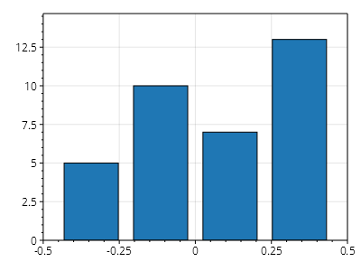
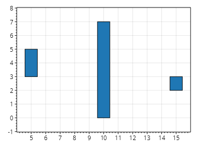
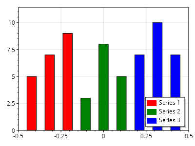

This page is part of the [ScottPlot 5.0 Cookbook](../)


<div class='alert alert-warning' role='alert'><h4 class='alert-heading py-0 my-0'>⚠️ ScottPlot 5.0.10-beta is a preview package</h4><hr /><p class='mb-0'><span class='fw-semibold'>This page describes a beta release of ScottPlot.</span> It is available on NuGet as a preview package, but its API is not stable and it is not recommended for production use. See the <a href='https://scottplot.net/versions/'>ScottPlot Versions</a> page for more information. </p></div>


## Bar Plot Quickstart

Bar plots can be added from a series of values.

[](bar-plot-quickstart.png)

```cs
ScottPlot.Plot myPlot = new();

double[] values = { 5, 10, 7, 13 };
myPlot.Add.Bar(values);
myPlot.AutoScale();
myPlot.SetAxisLimits(bottom: 0);

myPlot.SavePng("bar-plot-quickstart.png");
```


## Bar Positioning

The exact position and size of each bar may be customized.

[](bar-positioning.png)

```cs
ScottPlot.Plot myPlot = new();

List<ScottPlot.Plottables.Bar> bars = new()
{
    new() { Position = 5, Value = 5, ValueBase = 3, },
    new() { Position = 10, Value = 7, ValueBase = 0, },
    new() { Position = 15, Value = 3, ValueBase = 2, },
};

myPlot.Add.Bar(bars);

myPlot.SavePng("bar-positioning.png");
```


## Bar Series

Bar plots can be grouped into bar series and plotted together.

[](bar-series.png)

```cs
ScottPlot.Plot myPlot = new();

// TODO: the bars API needs to be greatly simplified
List<ScottPlot.Plottables.Bar> bars1 = new() { new(1, 5), new(2, 7), new(3, 9) };
List<ScottPlot.Plottables.Bar> bars2 = new() { new(1, 3), new(2, 8), new(3, 5) };
List<ScottPlot.Plottables.Bar> bars3 = new() { new(1, 7), new(2, 10), new(3, 7) };

ScottPlot.Plottables.BarSeries series1 = new()
{
    Bars = bars1,
    Label = "Series 1",
    Color = Colors.Red
};

ScottPlot.Plottables.BarSeries series2 = new()
{
    Bars = bars2,
    Label = "Series 2",
    Color = Colors.Green
};

ScottPlot.Plottables.BarSeries series3 = new()
{
    Bars = bars3,
    Label = "Series 3",
    Color = Colors.Blue
};

List<ScottPlot.Plottables.BarSeries> seriesList = new() { series1, series2, series3 };

myPlot.Add.Bar(seriesList);

myPlot.Legend.IsVisible = true;

myPlot.AutoScale();
myPlot.SetAxisLimits(bottom: 0);

myPlot.SavePng("bar-series.png");
```

