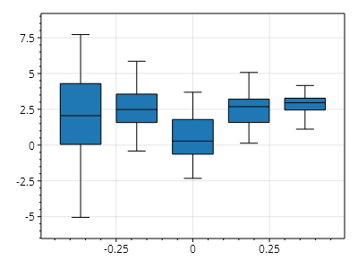
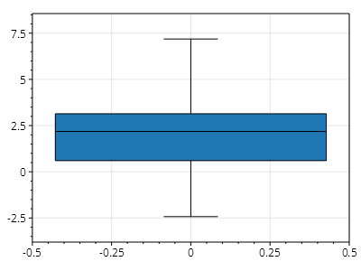
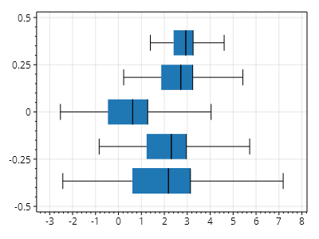
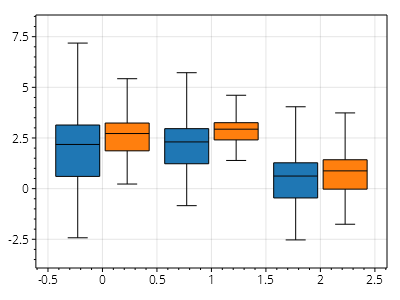

This page is part of the [ScottPlot 5.0 Cookbook](../)


<div class='alert alert-warning' role='alert'><h4 class='alert-heading py-0 my-0'>⚠️ ScottPlot 5.0.9-beta is a preview package</h4><hr /><p class='mb-0'><span class='fw-semibold'>This page describes a beta release of ScottPlot.</span> It is available on NuGet as a preview package, but its API is not stable and it is not recommended for production use. See the <a href='https://scottplot.net/versions/'>ScottPlot Versions</a> page for more information. </p></div>


## Box Plot Quickstart

Box plots can be added from a series of values.

[](box-plot-quickstart.png)

```cs
ScottPlot.Plot myPlot = new();

// TODO: move this functionality to the RandomDataGenerator class
Random rand = new(0);
ScottPlot.Plottables.Box CreateRandomBox()
{
    int N = 50;
    double mean = rand.NextDouble() * 3;
    double stdDev = rand.NextDouble() * 3;

    double[] values = Generate.RandomNormal(N, mean, stdDev);
    Array.Sort(values);
    double min = values[0];
    double q1 = values[N / 4];
    double median = values[N / 2];
    double q3 = values[3 * N / 4];
    double max = values[N - 1];

    return new ScottPlot.Plottables.Box
    {
        WhiskerMin = min,
        BoxMin = q1,
        BoxMiddle = median,
        BoxMax = q3,
        WhiskerMax = max,
    };
}

// TODO: construct 3 boxes manually with hard-coded numerical values for simplicity
List<ScottPlot.Plottables.Box> boxes = Enumerable.Range(0, 5)
    .Select(x => CreateRandomBox())
    .ToList();

myPlot.Add.Box(boxes);

myPlot.SavePng("box-plot-quickstart.png");
```


## Individual Box Plots

One can easily create a box plot with only a single box.

[](individual-box-plots.png)

```cs
ScottPlot.Plot myPlot = new();

Random rand = new(0);

ScottPlot.Plottables.Box CreateRandomBox()
{
    int N = 50;
    double mean = rand.NextDouble() * 3;
    double stdDev = rand.NextDouble() * 3;

    double[] values = Generate.RandomNormal(N, mean, stdDev);
    Array.Sort(values);
    double min = values[0];
    double q1 = values[N / 4];
    double median = values[N / 2];
    double q3 = values[3 * N / 4];
    double max = values[N - 1];

    return new ScottPlot.Plottables.Box
    {
        WhiskerMin = min,
        BoxMin = q1,
        BoxMiddle = median,
        BoxMax = q3,
        WhiskerMax = max,
    };
}

// TODO: construct 3 boxes manually with hard-coded numerical values for simplicity
List<ScottPlot.Plottables.Box> boxes = new() { CreateRandomBox() };

myPlot.Add.Box(boxes);

myPlot.SavePng("individual-box-plots.png");
```


## Horizontal Box Plots

Box plots can be oriented horizontally, similarly to bar plots.

[](horizontal-box-plots.png)

```cs
ScottPlot.Plot myPlot = new();

Random rand = new(0);

ScottPlot.Plottables.Box CreateRandomBox()
{
    int N = 50;
    double mean = rand.NextDouble() * 3;
    double stdDev = rand.NextDouble() * 3;

    double[] values = Generate.RandomNormal(N, mean, stdDev);
    Array.Sort(values);
    double min = values[0];
    double q1 = values[N / 4];
    double median = values[N / 2];
    double q3 = values[3 * N / 4];
    double max = values[N - 1];

    return new ScottPlot.Plottables.Box
    {
        WhiskerMin = min,
        BoxMin = q1,
        BoxMiddle = median,
        BoxMax = q3,
        WhiskerMax = max,
    };
}

// TODO: construct 3 boxes manually with hard-coded numerical values for simplicity
List<ScottPlot.Plottables.Box> boxes = Enumerable.Range(0, 5)
    .Select(x => CreateRandomBox())
    .ToList();

var boxPlot = myPlot.Add.Box(boxes);

boxPlot.Groups.Orientation = Orientation.Horizontal;

myPlot.SavePng("horizontal-box-plots.png");
```


## Box Plot Series

Similarly to bar charts, box plots can be compared across multiple categories.

[](box-plot-series.png)

```cs
ScottPlot.Plot myPlot = new();

Random rand = new(0);

ScottPlot.Plottables.Box CreateBox()
{
    int N = 50;
    double mean = rand.NextDouble() * 3;
    double stdDev = rand.NextDouble() * 3;

    double[] values = Generate.RandomNormal(N, mean, stdDev);
    Array.Sort(values);
    double min = values[0];
    double q1 = values[N / 4];
    double median = values[N / 2];
    double q3 = values[3 * N / 4];
    double max = values[N - 1];

    return new ScottPlot.Plottables.Box
    {
        WhiskerMin = min,
        BoxMin = q1,
        BoxMiddle = median,
        BoxMax = q3,
        WhiskerMax = max,
    };
}

int numBoxesPerSeries = 3;
int numSeries = 2;
ScottPlot.Plottables.BoxGroup[] series = new ScottPlot.Plottables.BoxGroup[numSeries];
var colorPalette = new ScottPlot.Palettes.Category10();
for (int i = 0; i < series.Length; i++)
{
    series[i] = new ScottPlot.Plottables.BoxGroup
    {
        Fill = new FillStyle
        {
            Color = colorPalette.Colors[i % colorPalette.Colors.Length]
        },
        Boxes = new ScottPlot.Plottables.Box[numBoxesPerSeries],
    };

    for (int j = 0; j < series[i].Boxes.Count; j++)
    {
        var box = CreateBox();
        box.Position = j;
        series[i].Boxes[j] = box;
    }
}

var boxPlot = myPlot.Add.Box(series);

myPlot.SavePng("box-plot-series.png");
```

