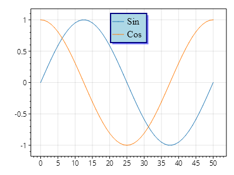
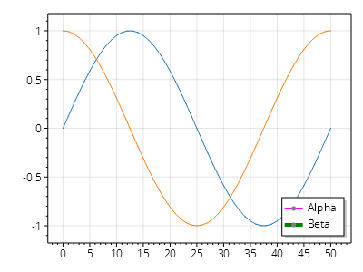
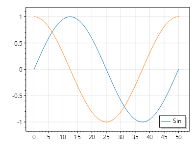

This page is part of the [ScottPlot 5.0 Cookbook](../)


<div class='alert alert-warning' role='alert'><h4 class='alert-heading py-0 my-0'>⚠️ ScottPlot 5.0.0-beta is a preview package</h4><hr /><p class='mb-0'><span class='fw-semibold'>This page describes a beta release of ScottPlot.</span> It is available on NuGet as a preview package, but its API is not stable and it is not recommended for production use. See the <a href='https://scottplot.net/versions/'>ScottPlot Versions</a> page for more information. </p></div>


## Legend Customization

The default legend can be easily accessed and customized. It is possible to add multiple legends, including custom ones implementing ILegend.

[](legend-customization.png)

```cs
ScottPlot.Plot myPlot = new();

var sig1 = myPlot.Add.Signal(Generate.Sin(51));
sig1.Label = "Sin";

var sig2 = myPlot.Add.Signal(Generate.Cos(51));
sig2.Label = "Cos";

var legend = myPlot.GetLegend();
legend.OutlineStyle.Color = Colors.Navy;
legend.OutlineStyle.Width = 2;
legend.BackgroundFill.Color = Colors.LightBlue;
legend.ShadowFill.Color = Colors.Blue.WithOpacity(.5);
legend.Font.Size = 16;
legend.Font.Name = FontService.SerifFontName;
legend.Alignment = Alignment.UpperCenter;

myPlot.SavePng("legend-customization.png");
```


## Manual Legend

Legends may be constructed manually.

[](manual-legend.png)

```cs
ScottPlot.Plot myPlot = new();

myPlot.Add.Signal(Generate.Sin(51));
myPlot.Add.Signal(Generate.Cos(51));

LegendItem item1 = new();
item1.Line.Color = Colors.Magenta;
item1.Line.Width = 2;
item1.Label = "Alpha";

LegendItem item2 = new();
item2.Line.Color = Colors.Green;
item2.Line.Width = 4;
item2.Label = "Beta";

var legend = myPlot.GetLegend();
legend.ManualLegendItems = new[] { item1, item2 };

myPlot.SavePng("manual-legend.png");
```


## Limit Plottables in Legend

Legends typically show all plot items with populated Label fields. However, users can use the manual legend property to only show legend items from specific plottables.

[](limit-plottables-in-legend.png)

```cs
ScottPlot.Plot myPlot = new();

var sig1 = myPlot.Add.Signal(Generate.Sin(51));
sig1.Label = "Sin";

var sig2 = myPlot.Add.Signal(Generate.Cos(51));
sig2.Label = "Cos";

var legend = myPlot.GetLegend();
legend.ManualLegendItems = sig1.LegendItems;

myPlot.SavePng("limit-plottables-in-legend.png");
```

