
<h4 class='alert-heading py-0 my-0'>⚠️ ScottPlot 5.0.2-beta is a preview package</h4>

This page describes a beta release of ScottPlot. It is available on NuGet as a preview package, but its API is not stable and it is not recommended for production use. See the <a href='https://scottplot.net/versions/'>ScottPlot Versions</a> page for more information. 

## Introduction

ScottPlot 5 Quickstart

A survey of basic functionality in ScottPlot 5

<a href='scottplot-5-quickstart/#scatter-plot'>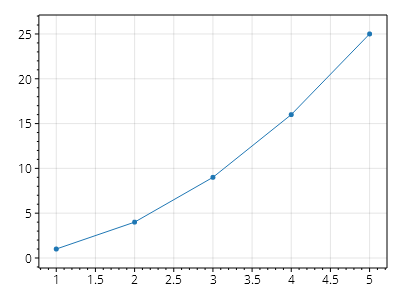</a>

<a href='scottplot-5-quickstart/#scatter-plot'><b>Scatter Plot</b></a>

Display paired X/Y data as a scatter plot.

<a href='scottplot-5-quickstart/#customizing-plottables'>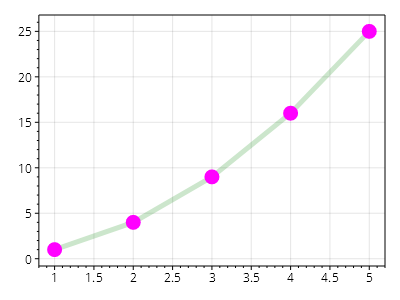</a>

<a href='scottplot-5-quickstart/#customizing-plottables'><b>Customizing Plottables</b></a>

Functions that add things to plots return the plottables they create. Interact with the properties of plottables to customize their styling and behavior.

<a href='scottplot-5-quickstart/#signal-plot'><b>Signal Plot</b></a>

Signal plots are optimized for displaying evenly spaced data.

<a href='scottplot-5-quickstart/#signal-plot-performance'>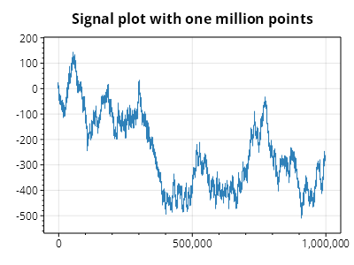</a>

<a href='scottplot-5-quickstart/#signal-plot-performance'><b>Signal Plot Performance</b></a>

Signal plots can interactively display millions of data points in real time. Double-click the plot to display performance benchmarks.

<a href='scottplot-5-quickstart/#axis-labels'>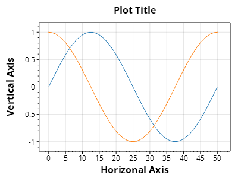</a>

<a href='scottplot-5-quickstart/#axis-labels'><b>Axis Labels</b></a>

Axis labels can be extensively customized.

<a href='scottplot-5-quickstart/#legend'>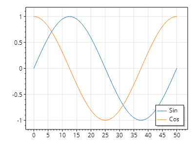</a>

<a href='scottplot-5-quickstart/#legend'><b>Legend</b></a>

A legend displays plottables in a key along the edge of a plot. Most plottables have a Label property which configures what text appears in the legend.

Styling Plots

How to customize plots

<a href='styling-plots/#style-helper-functions'><b>Style Helper Functions</b></a>

Plots contain many objects which can be customized individually by assigining to their public properties, but helper methods exist in the Plot's Style object that make it easier to customzie many items at once using a simpler API.

<a href='styling-plots/#axis-customization'><b>Axis Customization</b></a>

Axis labels, tick marks, and frame can all be customized.

<a href='styling-plots/#grid-customization'><b>Grid Customization</b></a>

Grid lines can be customized. Custom grid systems can be created to give developers full control of grid rendering, but the default grid can be interacted with to customize its appearance.

<a href='styling-plots/#grid-above-data'><b>Grid Above Data</b></a>

Grid lines are typically drawn beneath data, but grids can be configured to render on top of plottables too.

<a href='styling-plots/#palettes'><b>Palettes</b></a>

A palette is a set of colors, and the Plot's palette defines the default colors to use when adding new plottables. ScottPlot comes with many standard palettes, but users may also create their own.

<a href='styling-plots/#markers'><b>Markers</b></a>

Many plot types have a MarkerStyle which can be customized.

<a href='styling-plots/#line-styles'><b>Line Styles</b></a>

Many plot types have a LineStyle which can be customized.

## Customization

Axis and Ticks

Examples of common customizations for axis labels and ticks

<a href='axis-and-ticks/#axis-labels'>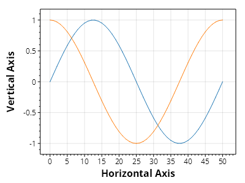</a>

<a href='axis-and-ticks/#axis-labels'><b>Axis Labels</b></a>

Axis labels are the text labels centered on each axis. The text inside these labels can be changed, and the style of the text can be extensively customized.

<a href='axis-and-ticks/#manually-set-axis-limits'>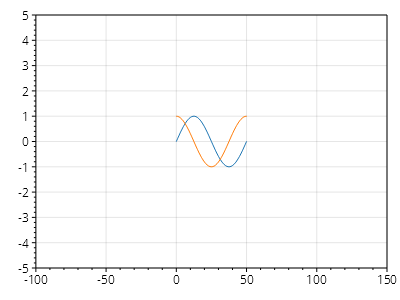</a>

<a href='axis-and-ticks/#manually-set-axis-limits'><b>Manually Set Axis Limits</b></a>

Axis Limits can be set manually in different ways.

<a href='axis-and-ticks/#read-axis-limits'>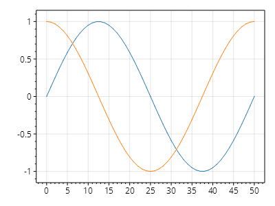</a>

<a href='axis-and-ticks/#read-axis-limits'><b>Read Axis Limits</b></a>

The current axis limits can be read in multiple ways.

<a href='axis-and-ticks/#zoom-to-fit-data'>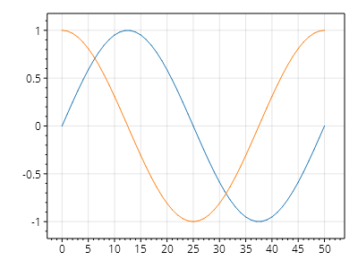</a>

<a href='axis-and-ticks/#zoom-to-fit-data'><b>Zoom to Fit Data</b></a>

The axis limits can be automatically adjusted to fit the data. Optional arguments allow users to define the amount of whitespace around the edges of the data.

<a href='axis-and-ticks/#frameless-plot'>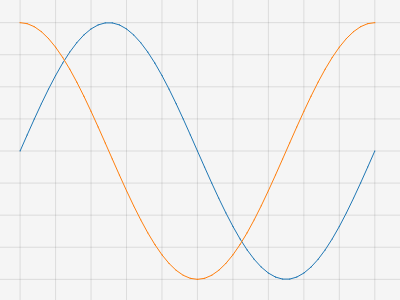</a>

<a href='axis-and-ticks/#frameless-plot'><b>Frameless Plot</b></a>

How to create a plot containig only the data area and no axes.

Configuring Legends

A legend is a key typically displayed in the corner of a plot

<a href='configuring-legends/#legend-customization'><b>Legend Customization</b></a>

The default legend can be easily accessed and customized. It is possible to add multiple legends, including custom ones implementing ILegend.

<a href='configuring-legends/#manual-legend'><b>Manual Legend</b></a>

Legends may be constructed manually.

<a href='configuring-legends/#limit-plottables-in-legend'><b>Limit Plottables in Legend</b></a>

Legends typically show all plot items with populated Label fields. However, users can use the manual legend property to only show legend items from specific plottables.

Customizing Ticks

Advanced customization of tick marks and tick labels

<a href='customizing-ticks/#custom-tick-generators'><b>Custom Tick Generators</b></a>

Alternative tick generators can be created and assigned to axes. Some common tick generators are provided with ScottPlot, and users also have the option create their own.

DateTime Axes

Plot data values on a DataTime axes

<a href='datetime-axes/#datetime-axis-quickstart'>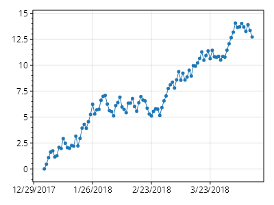</a>

<a href='datetime-axes/#datetime-axis-quickstart'><b>DateTime Axis Quickstart</b></a>

.

Advanced Axis Features

Tick mark customization and creation of multi-Axis plots

<a href='advanced-axis-features/#multi-axis'>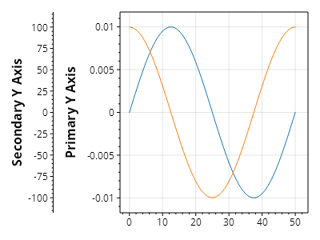</a>

<a href='advanced-axis-features/#multi-axis'><b>Multi-Axis</b></a>

Additional axes may be added to plots. Plottables are displayed using the coordinate system of the primary axes by default, but any plottable can be displayed using any X and Y axis.

## PlotTypes

Bar Plot

Bar plots represent values as horizontal or vertical rectangles

<a href='bar-plot/#bar-plot-quickstart'><b>Bar Plot Quickstart</b></a>

Bar plots can be added from a series of values.

<a href='bar-plot/#bar-positioning'><b>Bar Positioning</b></a>

The exact position and size of each bar may be customized.

<a href='bar-plot/#bar-series'><b>Bar Series</b></a>

Bar plots can be grouped into bar series and plotted together.

Error Bars

Error Bars communicate the range of possible values for a measurement

<a href='error-bars/#error-bar-quickstart'><b>Error Bar Quickstart</b></a>

Error Bars go well with scatter plots.

<a href='error-bars/#multidimensional-errorbars'><b>MultiDimensional ErrorBars</b></a>

You can mix and match x and y error bars.

Financial Plot

Finance plots display price data binned into time ranges

<a href='financial-plot/#ohlc-chart'>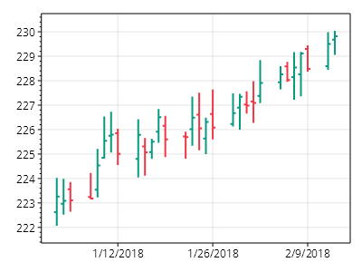</a>

<a href='financial-plot/#ohlc-chart'><b>OHLC Chart</b></a>

OHLC charts use symbols to display price data (open, high, low, and close) for specific time ranges.

<a href='financial-plot/#candlestick-chart'>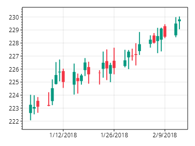</a>

<a href='financial-plot/#candlestick-chart'><b>Candlestick Chart</b></a>

Candlestick charts use symbols to display price data. The rectangle indicates open and close prices, and the center line indicates minimum and maximum price for the given time period. Color indicates whether the price increased or decreased between open and close.

Signal Plot

Signal plots display evenly-spaced data

<a href='signal-plot/#offset'><b>Offset</b></a>

Signal plots can be offset by a given X and Y value.

