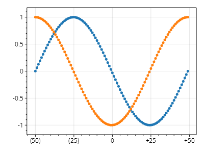
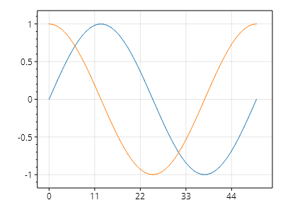

This page is part of the [ScottPlot 5.0 Cookbook](../)


<div class='alert alert-warning' role='alert'><h4 class='alert-heading py-0 my-0'>⚠️ ScottPlot 5.0.3-beta is a preview package</h4><hr /><p class='mb-0'><span class='fw-semibold'>This page describes a beta release of ScottPlot.</span> It is available on NuGet as a preview package, but its API is not stable and it is not recommended for production use. See the <a href='https://scottplot.net/versions/'>ScottPlot Versions</a> page for more information. </p></div>


## Custom Tick Formatters

Users can customize the logic used to create tick labels from tick positions.

[](custom-tick-formatters.png)

```cs
ScottPlot.Plot myPlot = new();

double[] xs = Generate.Consecutive(100, 1, -50);
myPlot.Add.Scatter(xs, Generate.Sin(100));
myPlot.Add.Scatter(xs, Generate.Cos(100));

// create a static function containing the string formatting logic
static string CustomFormatter(double position)
{
    if (position == 0)
        return "0";
    else if (position > 0)
        return $"+{position}";
    else
        return $"({-position})";
}

// create a custom tick generator using your custom label formatter
ScottPlot.TickGenerators.NumericAutomatic myTickGenerator = new()
{
    LabelFormatter = CustomFormatter
};

// tell an axis to use the custom tick generator
myPlot.XAxis.TickGenerator = myTickGenerator;

myPlot.SavePng("custom-tick-formatters.png");
```


## Custom Tick Generators

Tick generators determine where ticks are to be placed and also contain logic for generating tick labels from tick positions. Alternative tick generators can be created and assigned to axes. Some common tick generators are provided with ScottPlot, and users also have the option create their own.

[](custom-tick-generators.png)

```cs
ScottPlot.Plot myPlot = new();

myPlot.Add.Signal(Generate.Sin(51));
myPlot.Add.Signal(Generate.Cos(51));

myPlot.XAxis.TickGenerator = new ScottPlot.TickGenerators.NumericFixedInterval(11);

myPlot.SavePng("custom-tick-generators.png");
```

