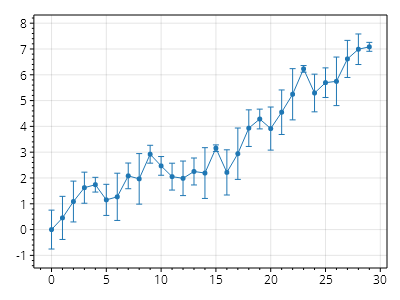

This page is part of the [ScottPlot 5.0 Cookbook](../)


<div class='alert alert-warning' role='alert'><h4 class='alert-heading py-0 my-0'>⚠️ ScottPlot 5.0.2-beta is a preview package</h4><hr /><p class='mb-0'><span class='fw-semibold'>This page describes a beta release of ScottPlot.</span> It is available on NuGet as a preview package, but its API is not stable and it is not recommended for production use. See the <a href='https://scottplot.net/versions/'>ScottPlot Versions</a> page for more information. </p></div>


## Error Bar Quickstart

Error Bars go well with scatter plots.

[](error-bar-quickstart.png)

```cs
ScottPlot.Plot myPlot = new();

int N = 50;

double[] xs = Generate.Consecutive(N);
double[] ys = Generate.RandomWalk(N);

double[] yErrPositive = Generate.Random(N, 0.1, 0.25);
double[] yErrNegative = Generate.Random(N, 0.1, 0.25);

var scatter = myPlot.Add.Scatter(xs, ys);
var errorBars = myPlot.Add.ErrorBar(xs, ys, yErrorPositive: yErrPositive, yErrorNegative: yErrNegative, color: scatter.LineStyle.Color);

myPlot.SavePng("error-bar-quickstart.png");
```


## MultiDimensional ErrorBars

You can mix and match x and y error bars.

[](multidimensional-errorbars.png)

```cs
ScottPlot.Plot myPlot = new();

int N = 50;

double[] xs = Generate.Consecutive(N);
double[] ys = Generate.RandomWalk(N);

double[] xErrPositive = Generate.Random(N, 0.1, 0.25);
double[] xErrNegative = Generate.Random(N, 0.1, 0.25);
double[] yErrPositive = Generate.Random(N, 0.1, 0.25);
double[] yErrNegative = Generate.Random(N, 0.1, 0.25);

var scatter = myPlot.Add.Scatter(xs, ys);
var errorBars = myPlot.Add.ErrorBar(xs, ys, xErrPositive, xErrNegative, yErrPositive, yErrNegative, scatter.LineStyle.Color);

myPlot.SavePng("multidimensional-errorbars.png");
```

