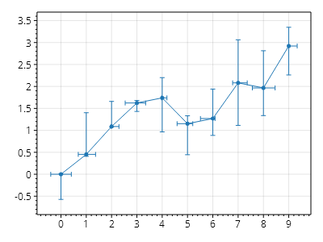

This page is part of the [ScottPlot 5.0 Cookbook](../)


<div class='alert alert-warning' role='alert'><h4 class='alert-heading py-0 my-0'>⚠️ ScottPlot 5.0.9-beta is a preview package</h4><hr /><p class='mb-0'><span class='fw-semibold'>This page describes a beta release of ScottPlot.</span> It is available on NuGet as a preview package, but its API is not stable and it is not recommended for production use. See the <a href='https://scottplot.net/versions/'>ScottPlot Versions</a> page for more information. </p></div>


## Error Bar Quickstart

Error Bars go well with scatter plots.

[](error-bar-quickstart.png)

```cs
ScottPlot.Plot myPlot = new();

int points = 30;

double[] xs = Generate.Consecutive(points);
double[] ys = Generate.RandomWalk(points);
double[] err = Generate.Random(points, 0.1, 1);

var scatter = myPlot.Add.Scatter(xs, ys);
var errorbars = myPlot.Add.ErrorBar(xs, ys, err);
errorbars.Color = scatter.Color;

myPlot.SavePng("error-bar-quickstart.png");
```


## ErrorBar Values

Error size can be set for all dimensions.

[](errorbar-values.png)

```cs
ScottPlot.Plot myPlot = new();

int points = 10;

ScottPlot.RandomDataGenerator gen = new();

double[] xs = Generate.Consecutive(points);
double[] ys = Generate.RandomWalk(points);
var scatter = myPlot.Add.Scatter(xs, ys);
scatter.LineStyle.Width = 0;

ScottPlot.Plottables.ErrorBar eb = new(
    xs: xs,
    ys: ys,
    xErrorsNegative: gen.RandomSample(points, .5),
    xErrorsPositive: gen.RandomSample(points, .5),
    yErrorsNegative: gen.RandomSample(points),
    yErrorsPositive: gen.RandomSample(points));

eb.Color = scatter.Color;

myPlot.Add.Plottable(eb);

myPlot.SavePng("errorbar-values.png");
```

