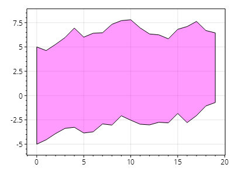
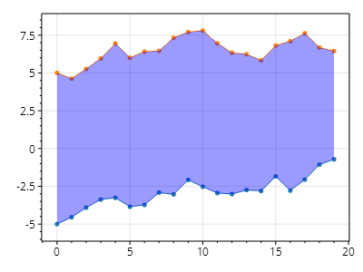
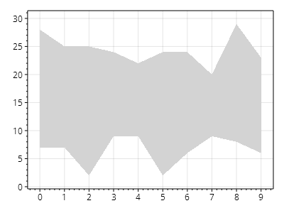
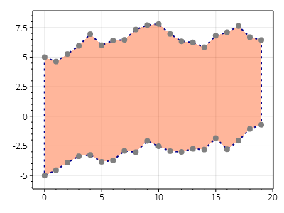

This page is part of the [ScottPlot 5.0 Cookbook](../)


<div class='alert alert-warning' role='alert'><h4 class='alert-heading py-0 my-0'>⚠️ ScottPlot 5.0.7-beta is a preview package</h4><hr /><p class='mb-0'><span class='fw-semibold'>This page describes a beta release of ScottPlot.</span> It is available on NuGet as a preview package, but its API is not stable and it is not recommended for production use. See the <a href='https://scottplot.net/versions/'>ScottPlot Versions</a> page for more information. </p></div>


## FillY From Array Data

FillY plots can be created from X, Y1, and Y2 arrays.

[](filly-from-array-data.png)

```cs
ScottPlot.Plot myPlot = new();

RandomDataGenerator dataGen = new(0);

int count = 20;
double[] xs = Generate.Consecutive(count);
double[] ys1 = dataGen.RandomWalk(count, offset: -5);
double[] ys2 = dataGen.RandomWalk(count, offset: 5);

var xyy = myPlot.Add.FillY(xs, ys1, ys2);
xyy.FillStyle.Color = Colors.Magenta.WithAlpha(100);

myPlot.SavePng("filly-from-array-data.png");
```


## FillY From Scatter Plots

FillY plots can be created from two scatter plots that share the same X values.

[](filly-from-scatter-plots.png)

```cs
ScottPlot.Plot myPlot = new();

RandomDataGenerator dataGen = new(0);

int count = 20;
double[] xs = Generate.Consecutive(count);
double[] ys1 = dataGen.RandomWalk(count, offset: -5);
double[] ys2 = dataGen.RandomWalk(count, offset: 5);

var scatter1 = myPlot.Add.Scatter(xs, ys1);
var scatter2 = myPlot.Add.Scatter(xs, ys2);

var xyy = myPlot.Add.FillY(scatter1, scatter2);
xyy.FillStyle.Color = Colors.Blue.WithAlpha(100);

myPlot.SavePng("filly-from-scatter-plots.png");
```


## FillY with Custom Type

FillY plots can be created from data of any type if a conversion function is supplied.

[](filly-with-custom-type.png)

```cs
ScottPlot.Plot myPlot = new();

// create source data in a nonstandard data type
List<(int, int, int)> data = new();
Random rand = new(0);
for (int i = 0; i < 10; i++)
{
    int x = i;
    int y1 = rand.Next(0, 10);
    int y2 = rand.Next(20, 30);
    data.Add((x, y1, y2));
}

// create a custom converter for the source data type
static (double, double, double) MyConverter((int, int, int) s) => (s.Item1, s.Item2, s.Item3);

// create a filled plot from source data using the custom converter
myPlot.Add.FillY(data, MyConverter);

myPlot.SavePng("filly-with-custom-type.png");
```


## FillY Plot Styling

FillY plots can be customized using public properties.

[](filly-plot-styling.png)

```cs
ScottPlot.Plot myPlot = new();

RandomDataGenerator dataGen = new(0);

int count = 20;
double[] xs = Generate.Consecutive(count);
double[] ys1 = dataGen.RandomWalk(count, offset: -5);
double[] ys2 = dataGen.RandomWalk(count, offset: 5);

var xyy = myPlot.Add.FillY(xs, ys1, ys2);
xyy.FillStyle.Color = Colors.OrangeRed.WithAlpha(100);

xyy.MarkerStyle.IsVisible = true;
xyy.MarkerStyle.Shape = MarkerShape.OpenSquare;
xyy.MarkerStyle.Size = 8;

xyy.LineStyle.AntiAlias = true;
xyy.LineStyle.Color = Colors.DarkBlue;
xyy.LineStyle.Pattern = LinePattern.Dot;
xyy.LineStyle.Width = 2;

myPlot.SavePng("filly-plot-styling.png");
```

