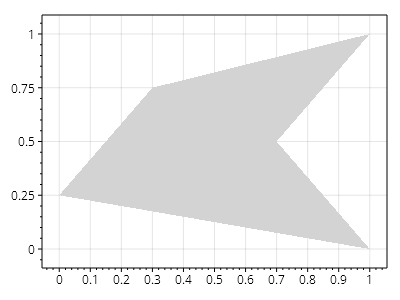
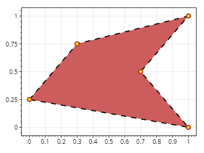

This page is part of the [ScottPlot 5.0 Cookbook](../)


<div class='alert alert-warning' role='alert'><h4 class='alert-heading py-0 my-0'>⚠️ ScottPlot 5.0.6-beta is a preview package</h4><hr /><p class='mb-0'><span class='fw-semibold'>This page describes a beta release of ScottPlot.</span> It is available on NuGet as a preview package, but its API is not stable and it is not recommended for production use. See the <a href='https://scottplot.net/versions/'>ScottPlot Versions</a> page for more information. </p></div>


## Polygon Plot Quickstart

Polygon plots can be added from a series of vertices, and must be in clockwise order.

[](polygon-plot-quickstart.png)

```cs
ScottPlot.Plot myPlot = new();

Coordinates[] vertices = new Coordinates[]
{
    new Coordinates(0,   0.25),
    new Coordinates(0.3, 0.75),
    new Coordinates(1,   1),
    new Coordinates(0.7, 0.5),
    new Coordinates(1,   0)
};
myPlot.Add.Polygon(vertices);
myPlot.AutoScale();

myPlot.SavePng("polygon-plot-quickstart.png");
```


## Polygon Plot Styling

Polygon plots can be fully customized.

[](polygon-plot-styling.png)

```cs
ScottPlot.Plot myPlot = new();

Coordinates[] vertices = new Coordinates[]
{
    new Coordinates(0,   0.25),
    new Coordinates(0.3, 0.75),
    new Coordinates(1,   1),
    new Coordinates(0.7, 0.5),
    new Coordinates(1,   0)
};
var poly = myPlot.Add.Polygon(vertices);
poly.FillStyle = new FillStyle
{
    Color = Colors.IndianRed
};
poly.LineStyle = new LineStyle
{
    AntiAlias = true,
    Color = Colors.Black,
    Pattern = LinePattern.Dash,
    Width = 2
};
poly.MarkerStyle = new MarkerStyle(MarkerShape.OpenCircle, 8);
poly.MarkerStyle.Fill.Color = Colors.Gold;
poly.MarkerStyle.Outline.Color = Colors.Brown;
myPlot.AutoScale();

myPlot.SavePng("polygon-plot-styling.png");
```

