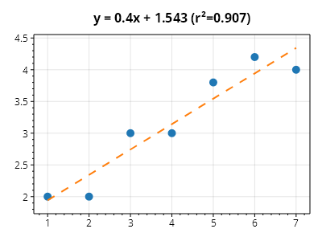

This page is part of the [ScottPlot 5.0 Cookbook](../)


<div class='alert alert-warning' role='alert'><h4 class='alert-heading py-0 my-0'>⚠️ ScottPlot 5.0.9-beta is a preview package</h4><hr /><p class='mb-0'><span class='fw-semibold'>This page describes a beta release of ScottPlot.</span> It is available on NuGet as a preview package, but its API is not stable and it is not recommended for production use. See the <a href='https://scottplot.net/versions/'>ScottPlot Versions</a> page for more information. </p></div>


## LinearRegression

Fit a line to a collection of X/Y data points.

[](linearregression.png)

```cs
ScottPlot.Plot myPlot = new();

double[] xs = new double[] { 1, 2, 3, 4, 5, 6, 7 };
double[] ys = new double[] { 2, 2, 3, 3, 3.8, 4.2, 4 };

// plot original data as a scatter plot
var sp = myPlot.Add.Scatter(xs, ys);
sp.LineStyle = LineStyle.None;
sp.MarkerStyle.Size = 10;

// calculate the regression line
ScottPlot.Statistics.LinearRegression reg = new(xs, ys);

// plot the regression line
Coordinates pt1 = new(xs.First(), reg.GetValue(xs.First()));
Coordinates pt2 = new(xs.Last(), reg.GetValue(xs.Last()));
var line = myPlot.Add.Line(pt1, pt2);
line.MarkerStyle = MarkerStyle.None;
line.LineStyle.Pattern = LinePattern.Dash;
line.LineStyle.Width = 2;

// note the formula at the top of the plot
myPlot.Title($"y = {reg.Slope:0.###}x + {reg.Offset:0.###} (r²={reg.Rsquared:0.###})");

myPlot.SavePng("linearregression.png");
```

