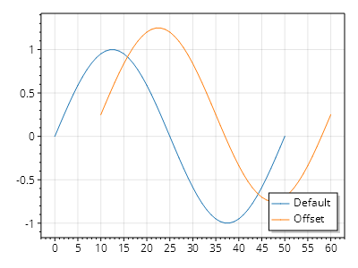

This page is part of the [ScottPlot 5.0 Cookbook](../)


<div class='alert alert-warning' role='alert'><h4 class='alert-heading py-0 my-0'>⚠️ ScottPlot 5.0.9-beta is a preview package</h4><hr /><p class='mb-0'><span class='fw-semibold'>This page describes a beta release of ScottPlot.</span> It is available on NuGet as a preview package, but its API is not stable and it is not recommended for production use. See the <a href='https://scottplot.net/versions/'>ScottPlot Versions</a> page for more information. </p></div>


## Offset

Signal plots can be offset by a given X and Y value.

[](offset.png)

```cs
ScottPlot.Plot myPlot = new();

double[] values = Generate.Sin(51);

var sig1 = myPlot.Add.Signal(values);
sig1.Label = "Default";

var sig2 = myPlot.Add.Signal(values);
sig2.Data.XOffset = 10;
sig2.Data.YOffset = .25;
sig2.Label = "Offset";

myPlot.Legend();

myPlot.SavePng("offset.png");
```

