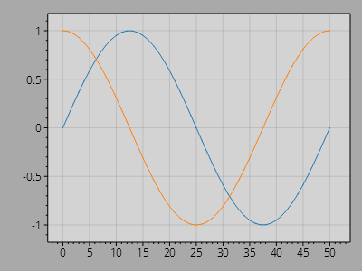

This page is part of the [ScottPlot 5.0 Cookbook](../)

<div class="alert alert-warning" role="alert">
<strong>⚠️ WARNING:</strong> This page describes <code>ScottPlot 5.0.0-beta</code>, a preview version of ScottPlot available on NuGet. This package is not recommended for production use, and the API may change in future releases. Visit the <a href='/cookbook/4.1/'>ScottPlot 4.1 Cookbook</a> for information about the current stable version of ScottPlot.
</div>


## Background Colors

Figure and data area background colors can be customized.

[](background-colors.png)

```cs
ScottPlot.Plot myPlot = new();

myPlot.Add.Signal(Generate.Sin(51));
myPlot.Add.Signal(Generate.Cos(51));

myPlot.FigureBackground = Colors.DarkGray;
myPlot.DataBackground = Colors.LightGray;

myPlot.SavePng("background-colors.png");
```


## Axis Customization

Axis labels, tick marks, and frame can all be customized.

[](axis-customization.png)

```cs
ScottPlot.Plot myPlot = new();

myPlot.Add.Signal(Generate.Sin(51));
myPlot.Add.Signal(Generate.Cos(51));

myPlot.Title.Label.Text = "Plot Title";
myPlot.Title.Label.Font.Color = Colors.RebeccaPurple;
myPlot.Title.Label.Font.Size = 32;
myPlot.Title.Label.Font.Name = FontService.SerifFontName;
myPlot.Title.Label.Rotation = -5;
myPlot.Title.Label.Font.Bold = false;

myPlot.YAxis.Label.Text = "Vertical Axis";
myPlot.YAxis.Label.Font.Color = Colors.Magenta;
myPlot.YAxis.Label.Font.Italic = true;

myPlot.XAxis.Label.Text = "Horizontal Axis";
myPlot.XAxis.Label.Font.Bold = false;
myPlot.XAxis.Label.Font.Name = FontService.MonospaceFontName;

myPlot.XAxis.MajorTickLength = 10;
myPlot.XAxis.MajorTickWidth = 3;
myPlot.XAxis.MajorTickColor = Colors.Magenta;
myPlot.XAxis.MinorTickLength = 5;
myPlot.XAxis.MinorTickWidth = 0.5f;
myPlot.XAxis.MinorTickColor = Colors.Green;
myPlot.XAxis.FrameLineStyle.Color = Colors.LightBlue;

myPlot.SavePng("axis-customization.png");
```


## Grid Customization

Grid lines can be customized. Custom grid systems can be created to give developers full control of grid rendering, but the default grid can be interacted with to customize its appearance.

[](grid-customization.png)

```cs
ScottPlot.Plot myPlot = new();

myPlot.Add.Signal(Generate.Sin(51));
myPlot.Add.Signal(Generate.Cos(51));

ScottPlot.Grids.DefaultGrid grid = myPlot.GetDefaultGrid();

grid.MajorLineStyle.Color = Colors.Green.WithOpacity(.5);
grid.MinorLineStyle.Color = Colors.Green.WithOpacity(.1);
grid.MinorLineStyle.Width = 1;

myPlot.SavePng("grid-customization.png");
```


## Grid Above Data

Grid lines are typically drawn beneath data, but grids can be configured to render on top of plottables too.

[](grid-above-data.png)

```cs
ScottPlot.Plot myPlot = new();

var sig = myPlot.Add.Signal(Generate.Sin(51));
sig.LineStyle.Width = 10;

ScottPlot.Grids.DefaultGrid grid = myPlot.GetDefaultGrid();
grid.MajorLineStyle.Width = 3;
grid.MajorLineStyle.Color = Colors.WhiteSmoke;
grid.IsBeneathPlottables = false;

myPlot.SavePng("grid-above-data.png");
```


## Palettes

A palette is a set of colors, and the Plot's palette defines the default colors to use when adding new plottables. ScottPlot comes with many standard palettes, but users may also create their own.

[](palettes.png)

```cs
ScottPlot.Plot myPlot = new();

IPalette palette = new ScottPlot.Palettes.Nord();
myPlot.Palette = palette;

for (int i = 0; i < 5; i++)
{
    double[] data = Generate.Sin(100, phase: -i / 20.0f);
    var sig = myPlot.Add.Signal(data);
    sig.LineStyle.Width = 3;
}

myPlot.SavePng("palettes.png");
```


## Markers

Many plot types have a MarkerStyle which can be customized.

[](markers.png)

```cs
ScottPlot.Plot myPlot = new();

int count = 21;
double[] xs = Generate.Consecutive(count);
double[] ys = Generate.Sin(count);

MarkerShape[] markerShapes = Enum.GetValues<MarkerShape>().ToArray();

for (int i = 0; i < markerShapes.Length; i++)
{
    double[] data = ys.Select(y => markerShapes.Length - y + i).ToArray();

    var scatter = myPlot.Add.Scatter(xs, data);

    scatter.Label = markerShapes[i].ToString();

    scatter.MarkerStyle = new MarkerStyle(
        shape: markerShapes[i],
        size: 10,
        color: scatter.LineStyle.Color);
}

myPlot.SavePng("markers.png");
```

