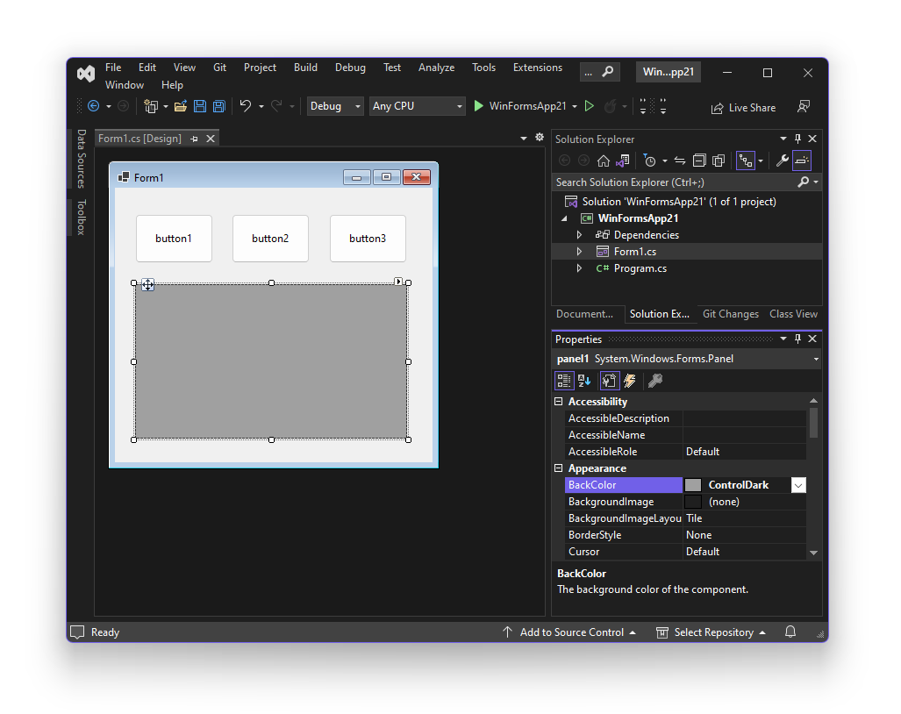

# Add ScottPlot WinForms Control Programmatically

**ScottPlot controls are typically added to forms by drag/dropping the control from the Visual Studio Toolbox, but this can also be achieved in code.** Adding a ScottPlot control programmatically may be desired if developers experience Visual Studio designer view errors. These errors are commonly caused by old versions of Visual Studio, x86 vs. x64 mismatches, or issues locating DLLs or fonts.

## Steps

These steps create a new WinForms App and add a ScottPlot control without using the Visual Studio designer:

**Step 1:** Open Visual Studio and create a new Windows Forms App

**Step 2:** Right-click the project, select "Manage NuGet Packages", search for "ScottPlot", and install the "ScottPlot.WinForms" package

**Step 3:** Edit your Form's .cs file to create a FormsPlot instance and add it to the Form at startup as demonstrated in the code below.

### ScottPlot 4

```cs
public partial class Form1 : Form
{
    readonly ScottPlot.FormsPlot formsPlot1;

    public Form1()
    {
        InitializeComponent();

        // Add the FormsPlot
        formsPlot1 = new() { Dock = DockStyle.Fill };
        Controls.Add(formsPlot1);

        // Add sample data to the plot
        double[] data = ScottPlot.Generate.Sin();
        formsPlot1.Plot.AddSignal(data);
        formsPlot1.Refresh();
    }
}
```

### ScottPlot 5
```cs
public partial class Form1 : Form
{
    readonly ScottPlot.WinForms.FormsPlot formsPlot1;

    public Form1()
    {
        InitializeComponent();

        // Add the FormsPlot
        formsPlot1 = new() { Dock = DockStyle.Fill };
        this.Controls.Add(formsPlot1);

        // Add sample data to the plot
        double[] data = ScottPlot.Generate.Sin();
        formsPlot1.Plot.Add.Signal(data);
        formsPlot1.Refresh();
    }
}
```

## Add a ScottPlot inside a Panel

If you're developing a complex WinForms app, it makes sense to place a `Panel` where you want the interactive plot to go, then add the plot inside the panel programmatically as part of the application's startup procedure.

After adding a `Panel` I recommend setting its `BackColor` to `ControlDark` to make it obvious where the plot will go



Then in your application's startup sequence you can add:

```cs
panel1.Add(formsPlot1);
```

When you run the application, an interactive plot will appear inside the panel:

